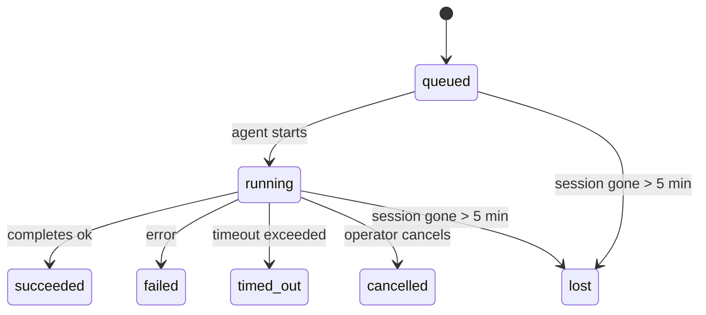

---
read_when:
    - Перегляд фонової роботи, яка виконується або нещодавно завершилася
    - Налагодження збоїв доставки для відокремлених запусків агентів
    - Розуміння того, як фонові запуски пов’язані із сеансами, Cron і Heartbeat
sidebarTitle: Background tasks
summary: Відстеження фонових завдань для запусків ACP, субагентів, ізольованих завдань Cron та операцій CLI
title: Фонові завдання
x-i18n:
    generated_at: "2026-05-05T00:49:29Z"
    model: gpt-5.5
    provider: openai
    source_hash: 60d6ea6178535b19b95d761b8e8b05a665234584ae69852fd21097988aa32991
    source_path: automation/tasks.md
    workflow: 16
---

<Note>
Шукаєте планування? Див. [Автоматизація та завдання](/uk/automation), щоб вибрати правильний механізм. Ця сторінка є журналом активності для фонової роботи, а не планувальником.
</Note>

Фонові завдання відстежують роботу, що виконується **поза вашим основним сеансом розмови**: запуски ACP, створення субагентів, ізольовані виконання cron-завдань і операції, ініційовані CLI.

Завдання **не** замінюють сеанси, cron-завдання чи Heartbeat — вони є **журналом активності**, який записує, яка від’єднана робота відбулася, коли саме та чи була вона успішною.

<Note>
Не кожен запуск агента створює завдання. Ходи Heartbeat і звичайний інтерактивний чат цього не роблять. Усі виконання cron, створення ACP, створення субагентів і команди агента CLI це роблять.
</Note>

## TL;DR

- Завдання — це **записи**, а не планувальники: cron і Heartbeat вирішують, _коли_ виконується робота, а завдання відстежують, _що сталося_.
- ACP, субагенти, усі cron-завдання й операції CLI створюють завдання. Ходи Heartbeat цього не роблять.
- Кожне завдання проходить через `queued → running → terminal` (succeeded, failed, timed_out, cancelled або lost).
- Cron-завдання залишаються активними, доки cron-середовище виконання все ще володіє завданням; якщо
  стан середовища виконання в пам’яті втрачено, обслуговування завдань спершу перевіряє збережену історію
  запусків cron, перш ніж позначити завдання як lost.
- Завершення керується push-механізмом: від’єднана робота може сповістити напряму або розбудити
  сеанс/Heartbeat запитувача після завершення, тому цикли опитування статусу
  зазвичай мають неправильну форму.
- Ізольовані cron-запуски та завершення субагентів у міру можливості очищають відстежувані вкладки браузера/процеси для свого дочірнього сеансу перед фінальним службовим очищенням.
- Ізольована доставка cron приглушує застарілі проміжні відповіді батьківського сеансу, доки робота нащадків-субагентів ще завершується, і надає перевагу фінальному виводу нащадка, якщо він надходить до доставки.
- Сповіщення про завершення доставляються напряму в канал або ставляться в чергу до наступного Heartbeat.
- `openclaw tasks list` показує всі завдання; `openclaw tasks audit` виявляє проблеми.
- Термінальні записи зберігаються 7 днів, а потім автоматично видаляються.

## Швидкий старт

<Tabs>
  <Tab title="List and filter">
    ```bash
    # List all tasks (newest first)
    openclaw tasks list

    # Filter by runtime or status
    openclaw tasks list --runtime acp
    openclaw tasks list --status running
    ```

  </Tab>
  <Tab title="Inspect">
    ```bash
    # Show details for a specific task (by ID, run ID, or session key)
    openclaw tasks show <lookup>
    ```
  </Tab>
  <Tab title="Cancel and notify">
    ```bash
    # Cancel a running task (kills the child session)
    openclaw tasks cancel <lookup>

    # Change notification policy for a task
    openclaw tasks notify <lookup> state_changes
    ```

  </Tab>
  <Tab title="Audit and maintenance">
    ```bash
    # Run a health audit
    openclaw tasks audit

    # Preview or apply maintenance
    openclaw tasks maintenance
    openclaw tasks maintenance --apply
    ```

  </Tab>
  <Tab title="Task flow">
    ```bash
    # Inspect TaskFlow state
    openclaw tasks flow list
    openclaw tasks flow show <lookup>
    openclaw tasks flow cancel <lookup>
    ```
  </Tab>
</Tabs>

## Що створює завдання

| Джерело                | Тип середовища виконання | Коли створюється запис завдання                         | Типова політика сповіщень |
| ---------------------- | ------------ | ------------------------------------------------------ | --------------------- |
| Фонові запуски ACP     | `acp`        | Створення дочірнього сеансу ACP                         | `done_only`           |
| Оркестрація субагентів | `subagent`   | Створення субагента через `sessions_spawn`              | `done_only`           |
| Cron-завдання (усі типи) | `cron`       | Кожне виконання cron (основний сеанс та ізольоване)     | `silent`              |
| Операції CLI           | `cli`        | Команди `openclaw agent`, що виконуються через Gateway  | `silent`              |
| Медіазавдання агента   | `cli`        | Запуски `music_generate`/`video_generate` на основі сеансу | `silent`              |

<AccordionGroup>
  <Accordion title="Notify defaults for cron and media">
    Cron-завдання основного сеансу типово використовують політику сповіщень `silent` — вони створюють записи для відстеження, але не генерують сповіщення. Ізольовані cron-завдання також типово мають `silent`, але вони помітніші, бо виконуються у власному сеансі.

    Запуски `music_generate` і `video_generate` на основі сеансу також використовують політику сповіщень `silent`. Вони все одно створюють записи завдань, але завершення повертається до початкового сеансу агента як внутрішнє пробудження, щоб агент міг написати подальше повідомлення й сам прикріпити готове медіа. Завершення в групах/каналах дотримуються звичайної політики видимої відповіді, тому агент використовує інструмент повідомлень, коли цього вимагає вихідна доставка.

  </Accordion>
  <Accordion title="Concurrent video_generate guardrail">
    Поки завдання `video_generate` на основі сеансу все ще активне, інструмент також працює як обмежувач: повторні виклики `video_generate` у тому самому сеансі повертають статус активного завдання замість запуску другого паралельного генерування. Використовуйте `action: "status"`, коли потрібен явний запит прогресу/статусу з боку агента.
  </Accordion>
  <Accordion title="What does not create tasks">
    - Ходи Heartbeat — основний сеанс; див. [Heartbeat](/uk/gateway/heartbeat)
    - Звичайні інтерактивні ходи чату
    - Прямі відповіді `/command`

  </Accordion>
</AccordionGroup>

## Життєвий цикл завдання



| Статус      | Що це означає                                                              |
| ----------- | -------------------------------------------------------------------------- |
| `queued`    | Створено, очікує запуску агента                                            |
| `running`   | Хід агента активно виконується                                             |
| `succeeded` | Успішно завершено                                                          |
| `failed`    | Завершено з помилкою                                                       |
| `timed_out` | Перевищено налаштований час очікування                                     |
| `cancelled` | Зупинено оператором через `openclaw tasks cancel`                          |
| `lost`      | Середовище виконання втратило авторитетний опорний стан після 5-хвилинного пільгового періоду |

Переходи відбуваються автоматично — коли пов’язаний запуск агента завершується, статус завдання оновлюється відповідно.

Завершення запуску агента є авторитетним для активних записів завдань. Успішний від’єднаний запуск фіналізується як `succeeded`, звичайні помилки запуску фіналізуються як `failed`, а результати тайм-ауту чи переривання фіналізуються як `timed_out`. Якщо оператор уже скасував завдання або середовище виконання вже записало сильніший термінальний стан, як-от `failed`, `timed_out` чи `lost`, пізніший сигнал успіху не понижує цей термінальний статус.

`lost` враховує середовище виконання:

- Завдання ACP: метадані опорного дочірнього сеансу ACP зникли.
- Завдання субагентів: опорний дочірній сеанс зник зі сховища цільового агента.
- Cron-завдання: cron-середовище виконання більше не відстежує завдання як активне, а збережена
  історія запусків cron не показує термінального результату для цього запуску. Офлайн-аудит CLI
  не вважає власний порожній внутрішньопроцесний стан cron-середовища виконання авторитетним.
- Завдання CLI: ізольовані завдання дочірніх сеансів використовують дочірній сеанс; CLI-завдання на основі чату
  натомість використовують живий контекст запуску, тому залишкові
  рядки сеансів каналу/групи/прямих повідомлень не підтримують їх активними. Запуски `openclaw agent`
  на основі Gateway також фіналізуються за результатом свого запуску, тому завершені запуски
  не залишаються активними, доки прибиральник не позначить їх як `lost`.

## Доставка та сповіщення

Коли завдання досягає термінального стану, OpenClaw сповіщає вас. Є два шляхи доставки:

**Пряма доставка** — якщо завдання має цільовий канал (`requesterOrigin`), повідомлення про завершення надходить прямо в цей канал (Telegram, Discord, Slack тощо). Для завершень субагентів OpenClaw також зберігає прив’язану маршрутизацію гілки/теми, коли вона доступна, і може заповнити відсутній `to` / обліковий запис зі збереженого маршруту сеансу запитувача (`lastChannel` / `lastTo` / `lastAccountId`), перш ніж відмовитися від прямої доставки.

**Доставка через чергу сеансу** — якщо пряма доставка не вдається або origin не задано, оновлення ставиться в чергу як системна подія в сеансі запитувача й з’являється під час наступного Heartbeat.

<Tip>
Завершення завдання запускає негайне пробудження Heartbeat, тож ви швидко бачите результат — не потрібно чекати наступного запланованого такту Heartbeat.
</Tip>

Це означає, що звичний робочий процес базується на push-механізмі: запустіть від’єднану роботу один раз, а потім дозвольте середовищу виконання розбудити вас або сповістити про завершення. Опитуйте стан завдання лише тоді, коли потрібне налагодження, втручання або явний аудит.

### Політики сповіщень

Керуйте тим, скільки повідомлень отримуєте щодо кожного завдання:

| Політика              | Що доставляється                                                       |
| --------------------- | ----------------------------------------------------------------------- |
| `done_only` (типово)  | Лише термінальний стан (succeeded, failed тощо) — **це типове значення** |
| `state_changes`       | Кожен перехід стану й оновлення прогресу                                |
| `silent`              | Узагалі нічого                                                          |

Змініть політику, поки завдання виконується:

```bash
openclaw tasks notify <lookup> state_changes
```

## Довідник CLI

<AccordionGroup>
  <Accordion title="tasks list">
    ```bash
    openclaw tasks list [--runtime <acp|subagent|cron|cli>] [--status <status>] [--json]
    ```

    Стовпці виводу: ID завдання, вид, статус, доставка, ID запуску, дочірній сеанс, підсумок.

  </Accordion>
  <Accordion title="tasks show">
    ```bash
    openclaw tasks show <lookup>
    ```

    Токен пошуку приймає ID завдання, ID запуску або ключ сеансу. Показує повний запис, включно з часом, станом доставки, помилкою та термінальним підсумком.

  </Accordion>
  <Accordion title="tasks cancel">
    ```bash
    openclaw tasks cancel <lookup>
    ```

    Для завдань ACP і субагентів це завершує дочірній сеанс. Для завдань, відстежуваних CLI, скасування записується в реєстрі завдань (окремого дочірнього дескриптора середовища виконання немає). Статус переходить у `cancelled`, і за потреби надсилається сповіщення доставки.

  </Accordion>
  <Accordion title="tasks notify">
    ```bash
    openclaw tasks notify <lookup> <done_only|state_changes|silent>
    ```
  </Accordion>
  <Accordion title="tasks audit">
    ```bash
    openclaw tasks audit [--json]
    ```

    Виявляє операційні проблеми. Знахідки також з’являються в `openclaw status`, коли виявлено проблеми.

    | Виявлення                 | Серйозність | Умова спрацювання                                                                                                                     |
    | ------------------------- | ---------- | ------------------------------------------------------------------------------------------------------------------------------------- |
    | `stale_queued`            | warn       | У черзі понад 10 хвилин                                                                                                               |
    | `stale_running`           | error      | Виконується понад 30 хвилин                                                                                                           |
    | `lost`                    | warn/error | Володіння завданням, підкріпленим середовищем виконання, зникло; збережені втрачені завдання попереджають до `cleanupAfter`, а потім стають помилками |
    | `delivery_failed`         | warn       | Доставка не вдалася, і політика сповіщень не є `silent`                                                                               |
    | `missing_cleanup`         | warn       | Завершальне завдання без часової мітки очищення                                                                                       |
    | `inconsistent_timestamps` | warn       | Порушення часової шкали (наприклад, завершилося до початку)                                                                           |

  </Accordion>
  <Accordion title="обслуговування завдань">
    ```bash
    openclaw tasks maintenance [--json]
    openclaw tasks maintenance --apply [--json]
    ```

    Використовуйте це для попереднього перегляду або застосування узгодження, проставлення міток очищення та обрізання для завдань і стану потоку завдань.

    Узгодження враховує середовище виконання:

    - Завдання ACP/subagent перевіряють свій резервний дочірній сеанс.
    - Завдання subagent, дочірній сеанс яких має tombstone відновлення після перезапуску, позначаються як втрачені замість того, щоб розглядатися як придатні до відновлення резервні сеанси.
    - Завдання Cron перевіряють, чи cron-середовище виконання все ще володіє job, а потім відновлюють завершальний статус зі збережених журналів cron-запусків/стану job, перш ніж повертатися до `lost`. Лише процес Gateway є авторитетним для набору активних cron-job у пам'яті; офлайн-аудит CLI використовує довговічну історію, але не позначає cron-завдання втраченим лише тому, що цей локальний Set порожній.
    - Завдання CLI, підкріплені чатом, перевіряють власний live run context, а не лише рядок chat session.

    Очищення після завершення також враховує середовище виконання:

    - Завершення subagent за можливості закриває відстежувані вкладки браузера/процеси для дочірнього сеансу, перш ніж триває очищення після оголошення.
    - Завершення ізольованого cron за можливості закриває відстежувані вкладки браузера/процеси для cron-сеансу, перш ніж запуск повністю розбирається.
    - Доставка ізольованого cron за потреби очікує подальшої роботи descendant subagent і пригнічує застарілий текст підтвердження батьківського завдання замість його оголошення.
    - Доставка завершення subagent надає перевагу найсвіжішому видимому тексту assistant; якщо він порожній, вона повертається до очищеного найсвіжішого тексту tool/toolResult, а запуски з викликами інструментів лише через тайм-аут можуть зводитися до короткого підсумку часткового прогресу. Завершальні невдалі запуски оголошують статус помилки без повторного відтворення захопленого тексту відповіді.
    - Помилки очищення не маскують реальний результат завдання.

  </Accordion>
  <Accordion title="список | показ | скасування потоку завдань">
    ```bash
    openclaw tasks flow list [--status <status>] [--json]
    openclaw tasks flow show <lookup> [--json]
    openclaw tasks flow cancel <lookup>
    ```

    Використовуйте це, коли вас цікавить оркеструвальний потік завдань, а не один окремий запис фонового завдання.

  </Accordion>
</AccordionGroup>

## Дошка чат-завдань (`/tasks`)

Використовуйте `/tasks` у будь-якому chat session, щоб переглянути фонові завдання, пов'язані з цим сеансом. Дошка показує активні та нещодавно завершені завдання із середовищем виконання, статусом, часом, а також деталями прогресу або помилки.

Коли поточний сеанс не має видимих пов'язаних завдань, `/tasks` повертається до локальних для агента лічильників завдань, щоб ви все одно отримали огляд без розкриття деталей інших сеансів.

Для повного операторського реєстру використовуйте CLI: `openclaw tasks list`.

## Інтеграція статусу (навантаження завдань)

`openclaw status` містить короткий підсумок завдань:

```
Tasks: 3 queued · 2 running · 1 issues
```

Підсумок повідомляє:

- **active** — кількість `queued` + `running`
- **failures** — кількість `failed` + `timed_out` + `lost`
- **byRuntime** — розбивка за `acp`, `subagent`, `cron`, `cli`

І `/status`, і інструмент `session_status` використовують знімок завдань з урахуванням очищення: активні завдання мають пріоритет, застарілі завершені рядки приховано, а нещодавні помилки показуються лише тоді, коли не лишається активної роботи. Це утримує картку статусу сфокусованою на тому, що важливо саме зараз.

## Зберігання та обслуговування

### Де зберігаються завдання

Записи завдань зберігаються в SQLite за адресою:

```
$OPENCLAW_STATE_DIR/tasks/runs.sqlite
```

Реєстр завантажується в пам'ять під час запуску Gateway і синхронізує записи в SQLite для довговічності між перезапусками.
Gateway утримує журнал попереднього запису SQLite в обмежених межах, використовуючи стандартний поріг autocheckpoint SQLite, а також періодичні та завершальні контрольні точки `TRUNCATE`.

### Автоматичне обслуговування

Sweeper запускається кожні **60 секунд** і виконує чотири дії:

<Steps>
  <Step title="Узгодження">
    Перевіряє, чи активні завдання все ще мають авторитетне резервне середовище виконання. Завдання ACP/subagent використовують стан дочірнього сеансу, завдання cron використовують володіння active-job, а завдання CLI, підкріплені чатом, використовують власний run context. Якщо цей резервний стан зник більш ніж на 5 хвилин, завдання позначається як `lost`.
  </Step>
  <Step title="Виправлення ACP-сеансів">
    Закриває завершальні або осиротілі одноразові ACP-сеанси, якими володіє батьківський елемент, і закриває застарілі завершальні або осиротілі постійні ACP-сеанси лише тоді, коли не лишається активного прив'язування розмови.
  </Step>
  <Step title="Проставлення міток очищення">
    Установлює часову мітку `cleanupAfter` для завершальних завдань (endedAt + 7 днів). Протягом періоду зберігання втрачені завдання все ще відображаються в аудиті як попередження; після завершення строку `cleanupAfter` або коли метадані очищення відсутні, вони стають помилками.
  </Step>
  <Step title="Обрізання">
    Видаляє записи після їхньої дати `cleanupAfter`.
  </Step>
</Steps>

<Note>
**Зберігання:** записи завершальних завдань зберігаються **7 днів**, а потім автоматично обрізаються. Налаштування не потрібне.
</Note>

## Як завдання пов'язані з іншими системами

<AccordionGroup>
  <Accordion title="Завдання та потік завдань">
    [Потік завдань](/uk/automation/taskflow) — це шар оркестрації потоків над фоновими завданнями. Один потік може координувати кілька завдань протягом свого життєвого циклу, використовуючи керовані або віддзеркалені режими синхронізації. Використовуйте `openclaw tasks`, щоб переглядати окремі записи завдань, і `openclaw tasks flow`, щоб переглядати оркеструвальний потік.

    Докладніше див. [Потік завдань](/uk/automation/taskflow).

  </Accordion>
  <Accordion title="Завдання та cron">
    **Визначення** cron job зберігається в `~/.openclaw/cron/jobs.json`; стан виконання середовища зберігається поруч у `~/.openclaw/cron/jobs-state.json`. **Кожне** виконання cron створює запис завдання — як main-session, так і isolated. Cron-завдання main-session за замовчуванням мають політику сповіщень `silent`, тож вони відстежуються без створення сповіщень.

    Див. [Cron Jobs](/uk/automation/cron-jobs).

  </Accordion>
  <Accordion title="Завдання та heartbeat">
    Запуски Heartbeat є ходами main-session — вони не створюють записів завдань. Коли завдання завершується, воно може ініціювати пробудження Heartbeat, щоб ви швидко побачили результат.

    Див. [Heartbeat](/uk/gateway/heartbeat).

  </Accordion>
  <Accordion title="Завдання та сеанси">
    Завдання може посилатися на `childSessionKey` (де виконується робота) і `requesterSessionKey` (хто його запустив). Сеанси — це контекст розмови; завдання — це відстеження активності поверх нього.
  </Accordion>
  <Accordion title="Завдання та запуски агента">
    `runId` завдання пов'язує його із запуском агента, який виконує роботу. Події життєвого циклу агента (початок, завершення, помилка) автоматично оновлюють статус завдання — вам не потрібно керувати життєвим циклом вручну.
  </Accordion>
</AccordionGroup>

## Пов'язане

- [Автоматизація та завдання](/uk/automation) — усі механізми автоматизації з першого погляду
- [CLI: Завдання](/uk/cli/tasks) — довідник команд CLI
- [Heartbeat](/uk/gateway/heartbeat) — періодичні ходи main-session
- [Заплановані завдання](/uk/automation/cron-jobs) — планування фонової роботи
- [Потік завдань](/uk/automation/taskflow) — оркестрація потоків над завданнями
