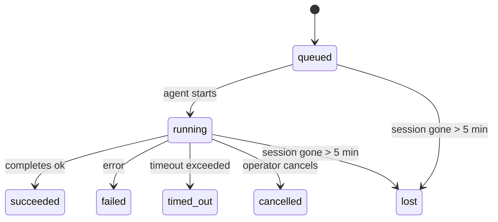

---
read_when:
    - Перегляд фонової роботи, що триває або була нещодавно завершена
    - Налагодження збоїв доставки для від’єднаних запусків агента
    - Розуміння того, як фонові запуски пов’язані із сеансами, Cron і Heartbeat
sidebarTitle: Background tasks
summary: Відстеження фонових завдань для запусків ACP, субагентів, ізольованих завдань Cron і операцій CLI
title: Фонові завдання
x-i18n:
    generated_at: "2026-05-05T05:18:28Z"
    model: gpt-5.5
    provider: openai
    source_hash: bafd959feaf2e220820ec56bf1ef144207d05757418e9971ebf427844cf30c46
    source_path: automation/tasks.md
    workflow: 16
---

<Note>
Шукаєте планування? Див. [Автоматизація та завдання](/uk/automation), щоб вибрати правильний механізм. Ця сторінка є журналом активності для фонової роботи, а не планувальником.
</Note>

Фонові завдання відстежують роботу, що виконується **поза вашим основним сеансом розмови**: запуски ACP, створення підагентів, ізольовані виконання Cron-завдань і операції, ініційовані з CLI.

Завдання **не** замінюють сеанси, Cron-завдання або Heartbeat — це **журнал активності**, який записує, яка відокремлена робота відбулася, коли саме та чи була вона успішною.

<Note>
Не кожен запуск агента створює завдання. Цикли Heartbeat і звичайний інтерактивний чат цього не роблять. Усі виконання Cron, створення ACP, створення підагентів і команди агента з CLI це роблять.
</Note>

## Коротко

- Завдання — це **записи**, а не планувальники — Cron і Heartbeat визначають, _коли_ виконується робота, а завдання відстежують, _що сталося_.
- ACP, підагенти, усі Cron-завдання й операції CLI створюють завдання. Цикли Heartbeat цього не роблять.
- Кожне завдання проходить шлях `queued → running → terminal` (succeeded, failed, timed_out, cancelled або lost).
- Cron-завдання залишаються активними, доки середовище виконання Cron усе ще володіє завданням; якщо
  стан середовища виконання в памʼяті зник, обслуговування завдань спершу перевіряє довговічну історію запусків Cron,
  перш ніж позначати завдання як lost.
- Завершення керується push-механізмом: відокремлена робота може повідомити напряму або пробудити
  сеанс/Heartbeat запитувача після завершення, тому цикли опитування статусу
  зазвичай мають неправильну форму.
- Ізольовані запуски Cron і завершення підагентів за найкращої можливості очищають відстежувані вкладки браузера/процеси для свого дочірнього сеансу перед фінальним службовим очищенням.
- Доставка ізольованого Cron приглушує застарілі проміжні відповіді батьківського сеансу, доки робота нащадків-підагентів ще завершується, і віддає перевагу фінальному виводу нащадка, якщо він надходить до доставки.
- Сповіщення про завершення доставляються напряму в канал або ставляться в чергу для наступного Heartbeat.
- `openclaw tasks list` показує всі завдання; `openclaw tasks audit` виявляє проблеми.
- Термінальні записи зберігаються 7 днів, а потім автоматично видаляються.

## Швидкий старт

<Tabs>
  <Tab title="Список і фільтрування">
    ```bash
    # List all tasks (newest first)
    openclaw tasks list

    # Filter by runtime or status
    openclaw tasks list --runtime acp
    openclaw tasks list --status running
    ```

  </Tab>
  <Tab title="Перевірка">
    ```bash
    # Show details for a specific task (by ID, run ID, or session key)
    openclaw tasks show <lookup>
    ```
  </Tab>
  <Tab title="Скасування та сповіщення">
    ```bash
    # Cancel a running task (kills the child session)
    openclaw tasks cancel <lookup>

    # Change notification policy for a task
    openclaw tasks notify <lookup> state_changes
    ```

  </Tab>
  <Tab title="Аудит і обслуговування">
    ```bash
    # Run a health audit
    openclaw tasks audit

    # Preview or apply maintenance
    openclaw tasks maintenance
    openclaw tasks maintenance --apply
    ```

  </Tab>
  <Tab title="Потік завдань">
    ```bash
    # Inspect TaskFlow state
    openclaw tasks flow list
    openclaw tasks flow show <lookup>
    openclaw tasks flow cancel <lookup>
    ```
  </Tab>
</Tabs>

## Що створює завдання

| Джерело               | Тип середовища виконання | Коли створюється запис завдання                         | Стандартна політика сповіщень |
| --------------------- | ------------------------ | ------------------------------------------------------- | ----------------------------- |
| Фонові запуски ACP    | `acp`                    | Створення дочірнього сеансу ACP                         | `done_only`                   |
| Оркестрація підагентів | `subagent`              | Створення підагента через `sessions_spawn`              | `done_only`                   |
| Cron-завдання (усіх типів) | `cron`              | Кожне виконання Cron (основний сеанс та ізольоване)     | `silent`                      |
| Операції CLI          | `cli`                    | Команди `openclaw agent`, які виконуються через Gateway | `silent`                      |
| Медіазавдання агента  | `cli`                    | Запуски `music_generate`/`video_generate` на основі сеансу | `silent`                    |

<AccordionGroup>
  <Accordion title="Стандартні сповіщення для Cron і медіа">
    Cron-завдання основного сеансу за замовчуванням використовують політику сповіщень `silent` — вони створюють записи для відстеження, але не генерують сповіщень. Ізольовані Cron-завдання також за замовчуванням мають `silent`, але вони помітніші, бо виконуються у власному сеансі.

    Запуски `music_generate` і `video_generate` на основі сеансу також використовують політику сповіщень `silent`. Вони все одно створюють записи завдань, але завершення повертається до початкового сеансу агента як внутрішнє пробудження, щоб агент міг сам написати подальше повідомлення й прикріпити готовий медіафайл. Завершення в групах/каналах дотримуються звичайної політики видимої відповіді, тому агент використовує інструмент повідомлень, коли цього вимагає вихідна доставка. Якщо агент завершення не створює доказ доставки через інструмент повідомлень у маршруті лише з інструментами, OpenClaw надсилає резервне повідомлення про завершення напряму до початкового каналу, замість залишати медіа приватним.

  </Accordion>
  <Accordion title="Запобіжник для одночасного video_generate">
    Поки завдання `video_generate` на основі сеансу все ще активне, інструмент також працює як запобіжник: повторні виклики `video_generate` у тому самому сеансі повертають статус активного завдання, а не запускають друге одночасне генерування. Використовуйте `action: "status"`, коли потрібен явний запит прогресу/статусу з боку агента.
  </Accordion>
  <Accordion title="Що не створює завдання">
    - Цикли Heartbeat — основний сеанс; див. [Heartbeat](/uk/gateway/heartbeat)
    - Звичайні інтерактивні цикли чату
    - Прямі відповіді `/command`

  </Accordion>
</AccordionGroup>

## Життєвий цикл завдання



| Статус      | Що це означає                                                            |
| ----------- | ------------------------------------------------------------------------ |
| `queued`    | Створено, очікує запуску агента                                          |
| `running`   | Цикл агента активно виконується                                          |
| `succeeded` | Успішно завершено                                                        |
| `failed`    | Завершено з помилкою                                                     |
| `timed_out` | Перевищено налаштований тайм-аут                                         |
| `cancelled` | Зупинено оператором через `openclaw tasks cancel`                        |
| `lost`      | Середовище виконання втратило авторитетний базовий стан після 5-хвилинного пільгового періоду |

Переходи відбуваються автоматично — коли повʼязаний запуск агента завершується, статус завдання оновлюється відповідно.

Завершення запуску агента є авторитетним для активних записів завдань. Успішний відокремлений запуск фіналізується як `succeeded`, звичайні помилки запуску фіналізуються як `failed`, а результати тайм-ауту або переривання фіналізуються як `timed_out`. Якщо оператор уже скасував завдання або середовище виконання вже записало сильніший термінальний стан, як-от `failed`, `timed_out` або `lost`, пізніший сигнал успіху не знижує цей термінальний статус.

`lost` враховує середовище виконання:

- Завдання ACP: зникли базові метадані дочірнього сеансу ACP.
- Завдання підагентів: базовий дочірній сеанс зник зі сховища цільового агента.
- Cron-завдання: середовище виконання Cron більше не відстежує завдання як активне, а довговічна
  історія запусків Cron не показує термінального результату для цього запуску. Офлайн-аудит CLI
  не вважає власний порожній стан Cron-середовища виконання в процесі авторитетним.
- CLI-завдання: ізольовані завдання дочірнього сеансу використовують дочірній сеанс; CLI-завдання
  на основі чату натомість використовують живий контекст запуску, тому залишкові
  рядки сеансів каналу/групи/директу не підтримують їх активними. Запуски
  `openclaw agent` на основі Gateway також фіналізуються за результатом свого запуску, тому завершені запуски
  не лишаються активними, доки прибиральник не позначить їх як `lost`.

## Доставка та сповіщення

Коли завдання досягає термінального стану, OpenClaw сповіщає вас. Є два шляхи доставки:

**Пряма доставка** — якщо завдання має цільовий канал (`requesterOrigin`), повідомлення про завершення надсилається прямо до цього каналу (Telegram, Discord, Slack тощо). Для завершень підагентів OpenClaw також зберігає привʼязану маршрутизацію гілки/теми, коли вона доступна, і може заповнити відсутні `to` / обліковий запис зі збереженого маршруту сеансу запитувача (`lastChannel` / `lastTo` / `lastAccountId`), перш ніж відмовитися від прямої доставки.

**Доставка через чергу сеансу** — якщо пряма доставка не вдається або джерело не задано, оновлення ставиться в чергу як системна подія в сеансі запитувача та зʼявляється під час наступного Heartbeat.

<Tip>
Завершення завдання запускає негайне пробудження Heartbeat, щоб ви швидко побачили результат — не потрібно чекати наступного запланованого такту Heartbeat.
</Tip>

Це означає, що звичайний робочий процес є push-орієнтованим: запустіть відокремлену роботу один раз, а потім дозвольте середовищу виконання пробудити або сповістити вас після завершення. Опитуйте стан завдання лише тоді, коли потрібні налагодження, втручання або явний аудит.

### Політики сповіщень

Керуйте тим, скільки повідомлень отримуєте про кожне завдання:

| Політика              | Що доставляється                                                       |
| --------------------- | --------------------------------------------------------------------- |
| `done_only` (стандартно) | Лише термінальний стан (succeeded, failed тощо) — **це стандартне значення** |
| `state_changes`       | Кожен перехід стану й оновлення прогресу                              |
| `silent`              | Нічого                                                                |

Змініть політику, доки завдання виконується:

```bash
openclaw tasks notify <lookup> state_changes
```

## Довідник CLI

<AccordionGroup>
  <Accordion title="tasks list">
    ```bash
    openclaw tasks list [--runtime <acp|subagent|cron|cli>] [--status <status>] [--json]
    ```

    Вивідні стовпці: ID завдання, тип, статус, доставка, ID запуску, дочірній сеанс, підсумок.

  </Accordion>
  <Accordion title="tasks show">
    ```bash
    openclaw tasks show <lookup>
    ```

    Маркер пошуку приймає ID завдання, ID запуску або ключ сеансу. Показує повний запис, зокрема час, стан доставки, помилку й термінальний підсумок.

  </Accordion>
  <Accordion title="tasks cancel">
    ```bash
    openclaw tasks cancel <lookup>
    ```

    Для завдань ACP і підагентів це завершує дочірній сеанс. Для завдань, які відстежуються CLI, скасування записується в реєстр завдань (окремого дескриптора дочірнього середовища виконання немає). Статус переходить у `cancelled`, а сповіщення про доставку надсилається, коли це застосовно.

  </Accordion>
  <Accordion title="tasks notify">
    ```bash
    openclaw tasks notify <lookup> <done_only|state_changes|silent>
    ```
  </Accordion>
  <Accordion title="tasks audit">
    ```bash
    openclaw tasks audit [--json]
    ```

    Виявляє операційні проблеми. Знахідки також зʼявляються в `openclaw status`, коли виявлено проблеми.

    | Виявлення                 | Серйозність          | Умова спрацювання                                                                                              |
    | ------------------------- | -------------------- | -------------------------------------------------------------------------------------------------------------- |
    | `stale_queued`            | попередження         | У черзі понад 10 хвилин                                                                                        |
    | `stale_running`           | помилка              | Виконується понад 30 хвилин                                                                                    |
    | `lost`                    | попередження/помилка | Зникло володіння завданням, підкріплене середовищем виконання; збережені втрачені завдання видають попередження до `cleanupAfter`, а потім стають помилками |
    | `delivery_failed`         | попередження         | Доставка не вдалася, а політика сповіщення не має значення `silent`                                            |
    | `missing_cleanup`         | попередження         | Завдання в кінцевому стані без часової позначки очищення                                                       |
    | `inconsistent_timestamps` | попередження         | Порушення часової шкали (наприклад, завершено до початку)                                                      |

  </Accordion>
  <Accordion title="tasks maintenance">
    ```bash
    openclaw tasks maintenance [--json]
    openclaw tasks maintenance --apply [--json]
    ```

    Використовуйте це для попереднього перегляду або застосування узгодження, проставлення позначок очищення та видалення застарілих записів для завдань і стану Task Flow.

    Узгодження враховує середовище виконання:

    - Завдання ACP/субагента перевіряють дочірню сесію, що їх підтримує.
    - Завдання субагента, у дочірньої сесії яких є tombstone-маркер відновлення після перезапуску, позначаються як втрачені, а не розглядаються як відновлювані опорні сесії.
    - Завдання Cron перевіряють, чи середовище виконання Cron досі володіє завданням, потім відновлюють кінцевий статус із збережених журналів запусків Cron/стану завдання, перш ніж відступити до `lost`. Лише процес Gateway є авторитетним для наявного в пам’яті набору активних завдань Cron; офлайновий аудит CLI використовує сталу історію, але не позначає завдання Cron втраченим лише тому, що цей локальний Set порожній.
    - Підкріплені чатом завдання CLI перевіряють контекст активного запуску, якому вони належать, а не лише рядок чат-сесії.

    Очищення після завершення також враховує середовище виконання:

    - Під час завершення субагента система докладає найкращих зусиль, щоб закрити відстежувані вкладки браузера/процеси для дочірньої сесії, перш ніж продовжиться очищення після оголошення.
    - Під час завершення ізольованого запуску Cron система докладає найкращих зусиль, щоб закрити відстежувані вкладки браузера/процеси для Cron-сесії, перш ніж запуск повністю завершить демонтаж.
    - Доставка ізольованого Cron за потреби дочікується подальших дій нащадкового субагента та приглушує застарілий текст підтвердження батьківської сесії замість оголошувати його.
    - Доставка завершення субагента надає перевагу найновішому видимому тексту асистента; якщо він порожній, вона відступає до очищеного найновішого тексту tool/toolResult, а запуски з викликами інструментів, що завершилися лише через тайм-аут, можуть згортатися до короткого підсумку часткового прогресу. Кінцеві невдалі запуски оголошують статус невдачі без повторного відтворення зафіксованого тексту відповіді.
    - Збої очищення не маскують реальний результат завдання.

  </Accordion>
  <Accordion title="tasks flow list | show | cancel">
    ```bash
    openclaw tasks flow list [--status <status>] [--json]
    openclaw tasks flow show <lookup> [--json]
    openclaw tasks flow cancel <lookup>
    ```

    Використовуйте їх, коли вас цікавить саме Task Flow, який координує роботу, а не один окремий запис фонового завдання.

  </Accordion>
</AccordionGroup>

## Дошка завдань чату (`/tasks`)

Використовуйте `/tasks` у будь-якій чат-сесії, щоб побачити фонові завдання, пов’язані з цією сесією. Дошка показує активні й нещодавно завершені завдання із середовищем виконання, статусом, часовими даними, а також деталями прогресу або помилки.

Коли поточна сесія не має видимих пов’язаних завдань, `/tasks` відступає до локальних для агента лічильників завдань, щоб ви все одно отримали огляд без витоку деталей інших сесій.

Для повного операторського журналу використовуйте CLI: `openclaw tasks list`.

## Інтеграція статусу (навантаження завдань)

`openclaw status` містить короткий підсумок завдань:

```
Tasks: 3 queued · 2 running · 1 issues
```

Підсумок повідомляє:

- **active** — кількість `queued` + `running`
- **failures** — кількість `failed` + `timed_out` + `lost`
- **byRuntime** — розподіл за `acp`, `subagent`, `cron`, `cli`

І `/status`, і інструмент `session_status` використовують знімок завдань з урахуванням очищення: активним завданням надається перевага, застарілі завершені рядки приховуються, а нещодавні збої з’являються лише тоді, коли активної роботи не лишається. Це тримає картку статусу зосередженою на тому, що важливо зараз.

## Зберігання та обслуговування

### Де зберігаються завдання

Записи завдань зберігаються в SQLite тут:

```
$OPENCLAW_STATE_DIR/tasks/runs.sqlite
```

Реєстр завантажується в пам’ять під час старту Gateway і синхронізує записи до SQLite для надійності між перезапусками.
Gateway утримує журнал випереджувального запису SQLite в обмеженому розмірі, використовуючи стандартний поріг autocheckpoint SQLite, а також періодичні контрольні точки `TRUNCATE` і контрольні точки під час завершення роботи.

### Автоматичне обслуговування

Фоновий очищувач запускається кожні **60 секунд** і виконує чотири дії:

<Steps>
  <Step title="Узгодження">
    Перевіряє, чи активні завдання все ще мають авторитетну підтримку середовища виконання. Завдання ACP/субагента використовують стан дочірньої сесії, завдання Cron — володіння активним завданням, а підкріплені чатом завдання CLI — контекст запуску-власника. Якщо цей стан підтримки зник більш ніж на 5 хвилин, завдання позначається як `lost`.
  </Step>
  <Step title="Відновлення сесій ACP">
    Закриває кінцеві або осиротілі одноразові сесії ACP, якими володіє батьківська сесія, і закриває застарілі кінцеві або осиротілі постійні сесії ACP лише тоді, коли не залишається активної прив’язки розмови.
  </Step>
  <Step title="Проставлення позначок очищення">
    Установлює часову позначку `cleanupAfter` для завдань у кінцевому стані (endedAt + 7 днів). Протягом періоду зберігання втрачені завдання все ще з’являються в аудиті як попередження; після завершення `cleanupAfter` або коли метадані очищення відсутні, вони стають помилками.
  </Step>
  <Step title="Видалення застарілих записів">
    Видаляє записи після їхньої дати `cleanupAfter`.
  </Step>
</Steps>

<Note>
**Зберігання:** записи завдань у кінцевому стані зберігаються **7 днів**, а потім автоматично видаляються. Налаштування не потрібне.
</Note>

## Як завдання пов’язані з іншими системами

<AccordionGroup>
  <Accordion title="Завдання і Task Flow">
    [Task Flow](/uk/automation/taskflow) — це шар оркестрації потоків над фоновими завданнями. Один потік може координувати кілька завдань протягом свого життєвого циклу, використовуючи керовані або дзеркальні режими синхронізації. Використовуйте `openclaw tasks`, щоб переглядати окремі записи завдань, і `openclaw tasks flow`, щоб переглядати потік-оркестратор.

    Докладніше див. у [Task Flow](/uk/automation/taskflow).

  </Accordion>
  <Accordion title="Завдання і Cron">
    **Визначення** Cron-завдання зберігається в `~/.openclaw/cron/jobs.json`; стан виконання середовища зберігається поруч із ним у `~/.openclaw/cron/jobs-state.json`. **Кожне** виконання Cron створює запис завдання — як основної сесії, так і ізольований. Завдання Cron основної сесії за замовчуванням мають політику сповіщення `silent`, тому вони відстежуються без створення сповіщень.

    Див. [Cron-завдання](/uk/automation/cron-jobs).

  </Accordion>
  <Accordion title="Завдання і Heartbeat">
    Запуски Heartbeat є ходами основної сесії — вони не створюють записів завдань. Коли завдання завершується, воно може ініціювати пробудження Heartbeat, щоб ви швидко побачили результат.

    Див. [Heartbeat](/uk/gateway/heartbeat).

  </Accordion>
  <Accordion title="Завдання і сесії">
    Завдання може посилатися на `childSessionKey` (де виконується робота) і `requesterSessionKey` (хто його запустив). Сесії — це контекст розмови; завдання — відстеження активності поверх нього.
  </Accordion>
  <Accordion title="Завдання і запуски агента">
    `runId` завдання пов’язує його із запуском агента, який виконує роботу. Події життєвого циклу агента (початок, завершення, помилка) автоматично оновлюють статус завдання — вам не потрібно керувати життєвим циклом вручну.
  </Accordion>
</AccordionGroup>

## Пов’язане

- [Автоматизація й завдання](/uk/automation) — усі механізми автоматизації одним поглядом
- [CLI: завдання](/uk/cli/tasks) — довідник команд CLI
- [Heartbeat](/uk/gateway/heartbeat) — періодичні ходи основної сесії
- [Заплановані завдання](/uk/automation/cron-jobs) — планування фонової роботи
- [Task Flow](/uk/automation/taskflow) — оркестрація потоків над завданнями
