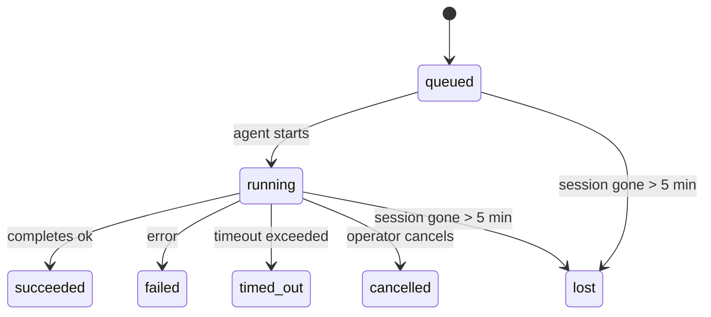

---
read_when:
    - Перегляд фонової роботи, що триває або нещодавно завершилася
    - Налагодження збоїв доставки для від’єднаних запусків агента
    - Розуміння того, як фонові запуски пов’язані із сеансами, Cron і Heartbeat
sidebarTitle: Background tasks
summary: Фонове відстеження завдань для запусків ACP, субагентів, ізольованих завдань Cron і операцій CLI
title: Фонові завдання
x-i18n:
    generated_at: "2026-05-12T00:56:18Z"
    model: gpt-5.5
    provider: openai
    source_hash: 31cbf09df48bab0686a1350f91aefffffef899c86704bb97b68320fc47e78021
    source_path: automation/tasks.md
    workflow: 16
---

<Note>
Шукаєте планування? Див. [Automation](/uk/automation), щоб вибрати правильний механізм. Ця сторінка є журналом активності для фонової роботи, а не планувальником.
</Note>

Фонові завдання відстежують роботу, яка виконується **поза вашим основним сеансом розмови**: запуски ACP, породження субагентів, ізольовані виконання завдань Cron і операції, ініційовані з CLI.

Завдання **не** замінюють сеанси, завдання Cron або Heartbeat - вони є **журналом активності**, який записує, яка відокремлена робота відбулася, коли саме та чи була вона успішною.

<Note>
Не кожен запуск агента створює завдання. Цикли Heartbeat і звичайний інтерактивний чат цього не роблять. Усі виконання Cron, породження ACP, породження субагентів і команди агента CLI створюють завдання.
</Note>

## TL;DR

- Завдання - це **записи**, а не планувальники - Cron і Heartbeat вирішують, _коли_ виконується робота, а завдання відстежують, _що сталося_.
- ACP, субагенти, усі завдання Cron і операції CLI створюють завдання. Цикли Heartbeat цього не роблять.
- Кожне завдання проходить через `queued → running → terminal` (succeeded, failed, timed_out, cancelled або lost).
- Завдання Cron залишаються активними, доки середовище виконання Cron усе ще володіє завданням; якщо
  стан середовища виконання в пам’яті зник, супровід завдань спочатку перевіряє стійку історію
  запусків Cron, перш ніж позначити завдання як втрачене.
- Завершення керується push-механізмом: відокремлена робота може сповіщати напряму або будити
  сеанс запитувача/Heartbeat після завершення, тому цикли опитування статусу
  зазвичай є неправильною формою.
- Ізольовані запуски Cron і завершення субагентів у режимі best-effort прибирають відстежувані вкладки браузера/процеси для свого дочірнього сеансу перед остаточним службовим обліком очищення.
- Ізольована доставка Cron пригнічує застарілі проміжні відповіді батьківського сеансу, доки робота нащадкового субагента ще завершується, і надає перевагу фінальному виводу нащадка, якщо він надходить до доставки.
- Сповіщення про завершення доставляються напряму в канал або ставляться в чергу для наступного Heartbeat.
- `openclaw tasks list` показує всі завдання; `openclaw tasks audit` виявляє проблеми.
- Термінальні записи зберігаються 7 днів, після чого автоматично очищаються.

## Швидкий старт

<Tabs>
  <Tab title="Список і фільтрація">
    ```bash
    # List all tasks (newest first)
    openclaw tasks list

    # Filter by runtime or status
    openclaw tasks list --runtime acp
    openclaw tasks list --status running
    ```

  </Tab>
  <Tab title="Перегляд">
    ```bash
    # Show details for a specific task (by ID, run ID, or session key)
    openclaw tasks show <lookup>
    ```
  </Tab>
  <Tab title="Скасування та сповіщення">
    ```bash
    # Cancel a running task (kills the child session)
    openclaw tasks cancel <lookup>

    # Change notification policy for a task
    openclaw tasks notify <lookup> state_changes
    ```

  </Tab>
  <Tab title="Аудит і супровід">
    ```bash
    # Run a health audit
    openclaw tasks audit

    # Preview or apply maintenance
    openclaw tasks maintenance
    openclaw tasks maintenance --apply
    ```

  </Tab>
  <Tab title="Потік завдання">
    ```bash
    # Inspect TaskFlow state
    openclaw tasks flow list
    openclaw tasks flow show <lookup>
    openclaw tasks flow cancel <lookup>
    ```
  </Tab>
</Tabs>

## Що створює завдання

| Джерело               | Тип середовища виконання | Коли створюється запис завдання                         | Типова політика сповіщень |
| ---------------------- | ------------ | ------------------------------------------------------ | --------------------- |
| Фонові запуски ACP    | `acp`        | Породження дочірнього сеансу ACP                       | `done_only`           |
| Оркестрація субагентів | `subagent`   | Породження субагента через `sessions_spawn`             | `done_only`           |
| Завдання Cron (усіх типів) | `cron`       | Кожне виконання Cron (в основному сеансі та ізольоване) | `silent`              |
| Операції CLI         | `cli`        | Команди `openclaw agent`, що виконуються через Gateway | `silent`              |
| Медіазавдання агента       | `cli`        | Запуски `music_generate`/`video_generate` на основі сеансу | `silent`              |

<AccordionGroup>
  <Accordion title="Типові сповіщення для Cron і медіа">
    Завдання Cron в основному сеансі типово використовують політику сповіщень `silent` - вони створюють записи для відстеження, але не генерують сповіщення. Ізольовані завдання Cron також типово мають `silent`, але вони помітніші, бо виконуються у власному сеансі.

    Запуски `music_generate` і `video_generate` на основі сеансу також використовують політику сповіщень `silent`. Вони все одно створюють записи завдань, але завершення передається назад до початкового сеансу агента як внутрішнє пробудження, щоб агент міг сам написати наступне повідомлення та прикріпити готове медіа. Завершення в групах/каналах дотримуються звичайної політики видимої відповіді, тож агент використовує інструмент повідомлень, коли цього вимагає доставка з джерела. Якщо агент завершення не надає доказ доставки через інструмент повідомлень у маршруті лише з інструментами, OpenClaw надсилає резервне повідомлення про завершення напряму в початковий канал замість того, щоб залишити медіа приватним.

  </Accordion>
  <Accordion title="Запобіжник для одночасного video_generate">
    Поки завдання `video_generate` на основі сеансу ще активне, інструмент також працює як запобіжник: повторні виклики `video_generate` у тому самому сеансі повертають статус активного завдання замість запуску другого одночасного генерування. Використовуйте `action: "status"`, коли потрібен явний перегляд прогресу/статусу з боку агента.
  </Accordion>
  <Accordion title="Що не створює завдань">
    - Цикли Heartbeat - основний сеанс; див. [Heartbeat](/uk/gateway/heartbeat)
    - Звичайні інтерактивні цикли чату
    - Прямі відповіді `/command`

  </Accordion>
</AccordionGroup>

## Життєвий цикл завдання



| Статус      | Що це означає                                                              |
| ----------- | -------------------------------------------------------------------------- |
| `queued`    | Створено, очікує запуску агента                                    |
| `running`   | Цикл агента активно виконується                                           |
| `succeeded` | Успішно завершено                                                     |
| `failed`    | Завершено з помилкою                                                    |
| `timed_out` | Перевищено налаштований тайм-аут                                            |
| `cancelled` | Зупинено оператором через `openclaw tasks cancel`                        |
| `lost`      | Середовище виконання втратило авторитетний базовий стан після 5-хвилинного пільгового періоду |

Переходи відбуваються автоматично - коли пов’язаний запуск агента завершується, статус завдання оновлюється відповідно.

Завершення запуску агента є авторитетним для активних записів завдань. Успішний відокремлений запуск фіналізується як `succeeded`, звичайні помилки запуску фіналізуються як `failed`, а результати тайм-ауту або переривання фіналізуються як `timed_out`. Якщо оператор уже скасував завдання або середовище виконання вже записало сильніший термінальний стан, як-от `failed`, `timed_out` або `lost`, пізніший сигнал успіху не понижує цей термінальний статус.

`lost` враховує середовище виконання:

- Завдання ACP: зникли базові метадані дочірнього сеансу ACP.
- Завдання субагентів: базовий дочірній сеанс зник зі сховища цільового агента.
- Завдання Cron: середовище виконання Cron більше не відстежує завдання як активне, а стійка
  історія запусків Cron не показує термінального результату для цього запуску. Офлайн-аудит CLI
  не вважає власний порожній стан середовища виконання Cron у процесі авторитетним.
- Завдання CLI: завдання з run id/source id використовують живий контекст запуску, тому
  залишкові рядки дочірніх сеансів або сеансів чату не підтримують їх активними після того, як
  запуск, яким володіє Gateway, зникає. Застарілі завдання CLI без ідентичності запуску все ще
  повертаються до дочірнього сеансу. Запуски `openclaw agent` на основі Gateway також фіналізуються
  за результатом свого запуску, тому завершені запуски не залишаються активними, доки прибиральник
  позначить їх як `lost`.

## Доставка та сповіщення

Коли завдання досягає термінального стану, OpenClaw сповіщає вас. Є два шляхи доставки:

**Пряма доставка** - якщо завдання має цільовий канал (`requesterOrigin`), повідомлення про завершення надходить прямо в цей канал (Telegram, Discord, Slack тощо). Завершення групових і канальних завдань натомість маршрутизуються через сеанс запитувача, щоб батьківський агент міг написати видиму відповідь. Для завершень субагентів OpenClaw також зберігає прив’язану маршрутизацію гілки/теми, коли вона доступна, і може заповнити відсутній `to` / обліковий запис зі збереженого маршруту сеансу запитувача (`lastChannel` / `lastTo` / `lastAccountId`) перед тим, як відмовитися від прямої доставки.

**Доставка через чергу сеансу** - якщо пряма доставка не вдається або origin не задано, оновлення ставиться в чергу як системна подія в сеансі запитувача й з’являється під час наступного Heartbeat.

<Tip>
Завершення завдання запускає негайне пробудження Heartbeat, тож ви швидко бачите результат - вам не потрібно чекати наступного запланованого такту Heartbeat.
</Tip>

Це означає, що звичайний робочий процес є push-орієнтованим: один раз запустіть відокремлену роботу, а потім дозвольте середовищу виконання розбудити вас або сповістити про завершення. Опитуйте стан завдання лише тоді, коли потрібні налагодження, втручання або явний аудит.

### Політики сповіщень

Керуйте тим, скільки повідомлень ви отримуєте про кожне завдання:

| Політика                | Що доставляється                                                       |
| --------------------- | ----------------------------------------------------------------------- |
| `done_only` (типово) | Лише термінальний стан (succeeded, failed тощо) - **це типове значення** |
| `state_changes`       | Кожен перехід стану та оновлення прогресу                              |
| `silent`              | Нічого                                                          |

Змініть політику, поки завдання виконується:

```bash
openclaw tasks notify <lookup> state_changes
```

## Довідник CLI

<AccordionGroup>
  <Accordion title="tasks list">
    ```bash
    openclaw tasks list [--runtime <acp|subagent|cron|cli>] [--status <status>] [--json]
    ```

    Стовпці виводу: Task ID, Kind, Status, Delivery, Run ID, Child Session, Summary.

  </Accordion>
  <Accordion title="tasks show">
    ```bash
    openclaw tasks show <lookup>
    ```

    Токен пошуку приймає ID завдання, ID запуску або ключ сеансу. Показує повний запис, зокрема час, стан доставки, помилку та термінальний підсумок.

  </Accordion>
  <Accordion title="tasks cancel">
    ```bash
    openclaw tasks cancel <lookup>
    ```

    Для завдань ACP і субагентів це завершує дочірній сеанс. Для завдань, відстежуваних CLI, скасування записується в реєстрі завдань (окремого дочірнього дескриптора середовища виконання немає). Статус переходить у `cancelled`, і за потреби надсилається сповіщення доставки.

  </Accordion>
  <Accordion title="tasks notify">
    ```bash
    openclaw tasks notify <lookup> <done_only|state_changes|silent>
    ```
  </Accordion>
  <Accordion title="tasks audit">
    ```bash
    openclaw tasks audit [--json]
    ```

    Виявляє операційні проблеми. Знахідки також з’являються в `openclaw status`, коли виявлено проблеми.

    | Виявлення                 | Серйозність | Тригер                                                                                                                          |
    | ------------------------- | ----------- | -------------------------------------------------------------------------------------------------------------------------------- |
    | `stale_queued`            | warn        | У черзі понад 10 хвилин                                                                                                         |
    | `stale_running`           | error       | Виконується понад 30 хвилин                                                                                                     |
    | `lost`                    | warn/error  | Власність над завданням із runtime-підтримкою зникла; збережені втрачені завдання попереджають до `cleanupAfter`, а потім стають помилками |
    | `delivery_failed`         | warn        | Доставлення не вдалося, а політика сповіщень не є `silent`                                                                      |
    | `missing_cleanup`         | warn        | Термінальне завдання без часової позначки очищення                                                                              |
    | `inconsistent_timestamps` | warn        | Порушення часової шкали (наприклад, завершено до початку)                                                                       |

  </Accordion>
  <Accordion title="обслуговування завдань">
    ```bash
    openclaw tasks maintenance [--json]
    openclaw tasks maintenance --apply [--json]
    ```

    Використовуйте це для попереднього перегляду або застосування узгодження, проставлення позначок очищення та видалення застарілих записів для завдань, стану Task Flow і застарілих рядків реєстру сеансів запусків cron.

    Узгодження враховує runtime:

    - Завдання ACP/subagent перевіряють свій базовий дочірній сеанс.
    - Завдання subagent, дочірній сеанс яких має tombstone відновлення після перезапуску, позначаються як втрачені замість того, щоб оброблятися як відновлювані базові сеанси.
    - Завдання Cron перевіряють, чи cron runtime все ще володіє job, а потім відновлюють термінальний статус із збережених журналів запусків cron/стану job, перш ніж переходити до `lost`. Лише процес Gateway є авторитетним для набору активних job cron у пам’яті; офлайн-аудит CLI використовує довговічну історію, але не позначає завдання cron як втрачене лише тому, що цей локальний Set порожній.
    - Завдання CLI з ідентичністю запуску перевіряють live-контекст запуску власника, а не лише рядки дочірнього сеансу чи chat-session.

    Очищення після завершення також враховує runtime:

    - Завершення subagent на основі best-effort закриває відстежувані вкладки браузера/процеси для дочірнього сеансу до того, як очищення оголошення продовжиться.
    - Завершення ізольованого cron на основі best-effort закриває відстежувані вкладки браузера/процеси для сеансу cron до повного завершення запуску.
    - Доставлення ізольованого cron за потреби очікує на подальші дії нащадка subagent і пригнічує застарілий текст підтвердження батьківського завдання замість оголошення його.
    - Доставлення завершення subagent надає перевагу найновішому видимому тексту асистента; якщо він порожній, воно переходить до очищеного найновішого тексту tool/toolResult, а запуски лише з тайм-аутом виклику інструмента можуть згортатися до короткого підсумку часткового прогресу. Термінальні невдалі запуски оголошують статус помилки без повторного відтворення захопленого тексту відповіді.
    - Збої очищення не маскують справжній результат завдання.

    Під час застосування обслуговування OpenClaw також видаляє застарілі рядки реєстру сеансів `cron:<jobId>:run:<uuid>`, старші за 7 днів, зберігаючи рядки для поточних запущених cron jobs і не змінюючи рядки сеансів, не пов’язані з cron.

  </Accordion>
  <Accordion title="tasks flow list | show | cancel">
    ```bash
    openclaw tasks flow list [--status <status>] [--json]
    openclaw tasks flow show <lookup> [--json]
    openclaw tasks flow cancel <lookup>
    ```

    Використовуйте ці команди, коли вас цікавить оркеструвальний Task Flow, а не один окремий запис фонового завдання.

  </Accordion>
</AccordionGroup>

## Дошка завдань чату (`/tasks`)

Використовуйте `/tasks` у будь-якому сеансі чату, щоб побачити фонові завдання, пов’язані з цим сеансом. Дошка показує активні та нещодавно завершені завдання з runtime, статусом, часом і деталями прогресу або помилки.

Коли поточний сеанс не має видимих пов’язаних завдань, `/tasks` переходить до локальних для агента лічильників завдань, щоб ви все одно отримали огляд без розкриття деталей інших сеансів.

Для повного операційного журналу використовуйте CLI: `openclaw tasks list`.

## Інтеграція статусу (навантаження завдань)

`openclaw status` містить короткий підсумок завдань:

```
Tasks: 3 queued · 2 running · 1 issues
```

Підсумок повідомляє:

- **active** - кількість `queued` + `running`
- **failures** - кількість `failed` + `timed_out` + `lost`
- **byRuntime** - розподіл за `acp`, `subagent`, `cron`, `cli`

І `/status`, і інструмент `session_status` використовують snapshot завдань, що враховує очищення: активним завданням надається перевага, застарілі завершені рядки приховуються, а нещодавні збої показуються лише тоді, коли активної роботи не залишилося. Це тримає картку статусу зосередженою на тому, що має значення зараз.

## Зберігання та обслуговування

### Де зберігаються завдання

Записи завдань зберігаються в SQLite за шляхом:

```
$OPENCLAW_STATE_DIR/tasks/runs.sqlite
```

Реєстр завантажується в пам’ять під час запуску gateway і синхронізує записи в SQLite для довговічності між перезапусками.
Gateway утримує журнал попереднього запису SQLite у межах, використовуючи стандартний поріг
autocheckpoint SQLite, а також періодичні та завершальні checkpoints `TRUNCATE`.

### Автоматичне обслуговування

Sweeper запускається кожні **60 секунд** і виконує чотири дії:

<Steps>
  <Step title="Узгодження">
    Перевіряє, чи активні завдання все ще мають авторитетну runtime-підтримку. Завдання ACP/subagent використовують стан дочірнього сеансу, завдання cron використовують володіння active-job, а завдання CLI з ідентичністю запуску використовують контекст запуску власника. Якщо цей базовий стан відсутній понад 5 хвилин, завдання позначається як `lost`.
  </Step>
  <Step title="Відновлення сеансів ACP">
    Закриває термінальні або осиротілі одноразові сеанси ACP, якими володіє батьківський елемент, і закриває застарілі термінальні або осиротілі постійні сеанси ACP лише тоді, коли не залишається активної прив’язки розмови.
  </Step>
  <Step title="Проставлення позначок очищення">
    Встановлює часову позначку `cleanupAfter` для термінальних завдань (endedAt + 7 днів). Протягом періоду зберігання втрачені завдання все ще відображаються в аудиті як попередження; після завершення `cleanupAfter` або коли метадані очищення відсутні, вони є помилками.
  </Step>
  <Step title="Видалення застарілих записів">
    Видаляє записи після їхньої дати `cleanupAfter`.
  </Step>
</Steps>

<Note>
**Зберігання:** записи термінальних завдань зберігаються **7 днів**, а потім автоматично видаляються. Налаштування не потрібне.
</Note>

## Як завдання пов’язані з іншими системами

<AccordionGroup>
  <Accordion title="Завдання і Task Flow">
    [Task Flow](/uk/automation/taskflow) — це шар оркестрації потоків над фоновими завданнями. Один flow може координувати кілька завдань протягом свого життєвого циклу за допомогою керованих або дзеркальних режимів синхронізації. Використовуйте `openclaw tasks`, щоб перевіряти окремі записи завдань, і `openclaw tasks flow`, щоб перевіряти оркеструвальний flow.

    Див. [Task Flow](/uk/automation/taskflow) для подробиць.

  </Accordion>
  <Accordion title="Завдання і cron">
    **Визначення** cron job зберігається в `~/.openclaw/cron/jobs.json`; стан виконання runtime зберігається поруч у `~/.openclaw/cron/jobs-state.json`. **Кожне** виконання cron створює запис завдання — як main-session, так і ізольований. Завдання cron main-session за замовчуванням використовують політику сповіщень `silent`, тому вони відстежуються без створення сповіщень.

    Див. [Cron Jobs](/uk/automation/cron-jobs).

  </Accordion>
  <Accordion title="Завдання і heartbeat">
    Запуски Heartbeat є ходами main-session — вони не створюють записів завдань. Коли завдання завершується, воно може ініціювати пробудження heartbeat, щоб ви швидко побачили результат.

    Див. [Heartbeat](/uk/gateway/heartbeat).

  </Accordion>
  <Accordion title="Завдання і сеанси">
    Завдання може посилатися на `childSessionKey` (де виконується робота) і `requesterSessionKey` (хто його запустив). Сеанси — це контекст розмови; завдання — це відстеження активності поверх нього.
  </Accordion>
  <Accordion title="Завдання і запуски агента">
    `runId` завдання пов’язує його із запуском агента, який виконує роботу. Події життєвого циклу агента (start, end, error) автоматично оновлюють статус завдання — вам не потрібно керувати життєвим циклом вручну.
  </Accordion>
</AccordionGroup>

## Пов’язане

- [Автоматизація](/uk/automation) - усі механізми автоматизації одним поглядом
- [CLI: Завдання](/uk/cli/tasks) - довідник команд CLI
- [Heartbeat](/uk/gateway/heartbeat) - періодичні ходи main-session
- [Заплановані завдання](/uk/automation/cron-jobs) - планування фонової роботи
- [Task Flow](/uk/automation/taskflow) - оркестрація flow над завданнями
