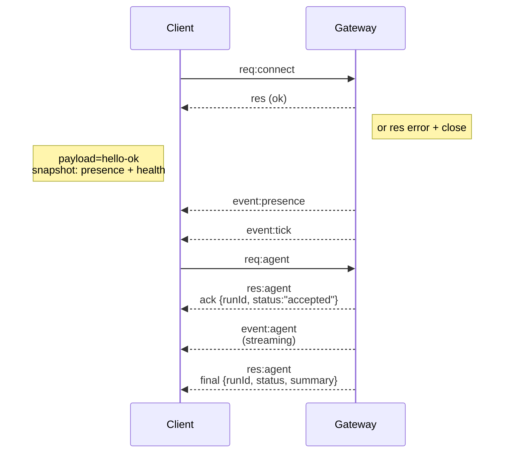

---
read_when:
    - Робота над протоколом gateway, клієнтами або транспортами
summary: Архітектура Gateway WebSocket, компоненти та клієнтські потоки
title: Архітектура Gateway
x-i18n:
    generated_at: "2026-04-23T20:49:18Z"
    model: gpt-5.4
    provider: openai
    source_hash: 91c553489da18b6ad83fc860014f5bfb758334e9789cb7893d4d00f81c650f02
    source_path: concepts/architecture.md
    workflow: 15
---

## Огляд

- Єдиний довготривалий **Gateway** володіє всіма поверхнями обміну повідомленнями (WhatsApp через
  Baileys, Telegram через grammY, Slack, Discord, Signal, iMessage, WebChat).
- Клієнти control-plane (застосунок macOS, CLI, web UI, автоматизації) підключаються до
  Gateway через **WebSocket** на налаштованому bind host (за замовчуванням
  `127.0.0.1:18789`).
- **Node** (macOS/iOS/Android/headless) також підключаються через **WebSocket**, але
  оголошують `role: node` з явними caps/commands.
- Один Gateway на хост; це єдине місце, яке відкриває сесію WhatsApp.
- **Хост canvas** обслуговується HTTP-сервером Gateway за адресами:
  - `/__openclaw__/canvas/` (HTML/CSS/JS, які може редагувати агент)
  - `/__openclaw__/a2ui/` (хост A2UI)
    Він використовує той самий порт, що й Gateway (за замовчуванням `18789`).

## Компоненти та потоки

### Gateway (daemon)

- Підтримує з’єднання з provider-ами.
- Надає типізований WS API (запити, відповіді, server-push події).
- Перевіряє вхідні frame-и за JSON Schema.
- Генерує події на кшталт `agent`, `chat`, `presence`, `health`, `heartbeat`, `cron`.

### Клієнти (mac app / CLI / web admin)

- Одне WS-з’єднання на клієнта.
- Надсилають запити (`health`, `status`, `send`, `agent`, `system-presence`).
- Підписуються на події (`tick`, `agent`, `presence`, `shutdown`).

### Node (macOS / iOS / Android / headless)

- Підключаються до **того самого WS-сервера** з `role: node`.
- Надають ідентичність пристрою в `connect`; pairing є **прив’язаним до пристрою** (role `node`), і
  схвалення зберігається у сховищі pairing пристроїв.
- Надають команди, такі як `canvas.*`, `camera.*`, `screen.record`, `location.get`.

Докладно про протокол:

- [Протокол Gateway](/uk/gateway/protocol)

### WebChat

- Статичний UI, який використовує WS API Gateway для історії чату та надсилань.
- У віддалених конфігураціях підключається через той самий тунель SSH/Tailscale, що й інші
  клієнти.

## Життєвий цикл з’єднання (один клієнт)



## Протокол на дроті (коротко)

- Транспорт: WebSocket, текстові frame-и з JSON payload.
- Перший frame **обов’язково** має бути `connect`.
- Після handshake:
  - Запити: `{type:"req", id, method, params}` → `{type:"res", id, ok, payload|error}`
  - Події: `{type:"event", event, payload, seq?, stateVersion?}`
- `hello-ok.features.methods` / `events` — це metadata для discovery, а не
  згенерований дамп кожного маршруту допоміжного виклику.
- Автентифікація через shared secret використовує `connect.params.auth.token` або
  `connect.params.auth.password`, залежно від налаштованого режиму auth gateway.
- Режими з ідентичністю, такі як Tailscale Serve
  (`gateway.auth.allowTailscale: true`) або не-loopback
  `gateway.auth.mode: "trusted-proxy"`, задовольняють auth із заголовків запиту
  замість `connect.params.auth.*`.
- Приватний вхід `gateway.auth.mode: "none"` повністю вимикає автентифікацію через shared secret; не використовуйте цей режим для публічного/недовіреного входу.
- Ключі ідемпотентності обов’язкові для методів із побічними ефектами (`send`, `agent`), щоб
  безпечно повторювати спроби; сервер зберігає короткоживучий кеш дедуплікації.
- Node мають включати `role: "node"` плюс caps/commands/permissions у `connect`.

## Pairing + локальна довіра

- Усі WS-клієнти (оператори + Node) включають **ідентичність пристрою** в `connect`.
- Нові ID пристроїв потребують схвалення pairing; Gateway видає **token пристрою**
  для наступних підключень.
- Прямі локальні loopback-підключення можуть автоматично схвалюватися, щоб зберегти плавний UX на тому самому хості.
- OpenClaw також має вузький шлях self-connect, локальний для backend/контейнера, для
  довірених потоків допоміжних засобів зі shared secret.
- Підключення через tailnet і LAN, зокрема й прив’язки tailnet на тому самому хості, усе одно потребують явного схвалення pairing.
- Усі підключення мають підписувати nonce `connect.challenge`.
- Payload підпису `v3` також прив’язує `platform` + `deviceFamily`; gateway фіксує metadata paired пристрою під час повторного підключення і вимагає repair pairing у разі змін metadata.
- **Нелокальні** підключення все одно потребують явного схвалення.
- Автентифікація Gateway (`gateway.auth.*`) усе ще застосовується до **всіх** з’єднань, локальних і
  віддалених.

Докладніше: [Протокол Gateway](/uk/gateway/protocol), [Pairing](/uk/channels/pairing),
[Безпека](/uk/gateway/security).

## Типізація протоколу та codegen

- Схеми TypeBox визначають протокол.
- JSON Schema генерується з цих схем.
- Моделі Swift генеруються з JSON Schema.

## Віддалений доступ

- Рекомендовано: Tailscale або VPN.
- Альтернатива: SSH tunnel

  ```bash
  ssh -N -L 18789:127.0.0.1:18789 user@host
  ```

- Через tunnel застосовуються той самий handshake і auth token.
- Для WS у віддалених конфігураціях можна ввімкнути TLS + необов’язковий pinning.

## Операційний знімок

- Запуск: `openclaw gateway` (у foreground, журнали в stdout).
- Health: `health` через WS (також входить до `hello-ok`).
- Нагляд: launchd/systemd для автоматичного перезапуску.

## Інваріанти

- Рівно один Gateway керує однією сесією Baileys на хост.
- Handshake є обов’язковим; будь-який не-JSON або не-`connect` перший frame призводить до жорсткого закриття.
- Події не відтворюються повторно; клієнти мають оновлювати стан у разі пропусків.

## Пов’язане

- [Цикл агента](/uk/concepts/agent-loop) — докладний цикл виконання агента
- [Протокол Gateway](/uk/gateway/protocol) — контракт протоколу WebSocket
- [Черга](/uk/concepts/queue) — черга команд і конкуренція
- [Безпека](/uk/gateway/security) — модель довіри та зміцнення захисту
