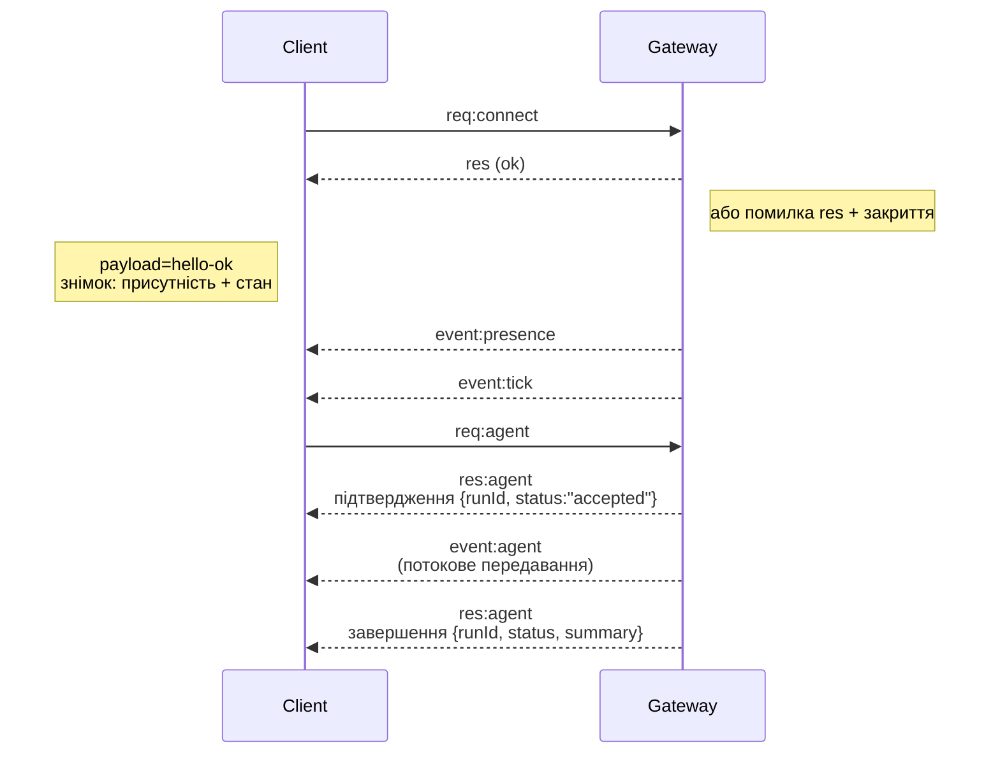

---
read_when:
    - Робота з протоколом Gateway, клієнтами або транспортами
summary: Архітектура шлюзу WebSocket, компоненти та потоки клієнтів
title: Архітектура Gateway
x-i18n:
    generated_at: "2026-07-12T13:08:07Z"
    model: gpt-5.6
    postprocess_version: locale-links-v1
    provider: openai
    source_hash: f8054bd87f738b957c24f8d6965d55365de2293d44902530a9ba778afa597cc7
    source_path: concepts/architecture.md
    workflow: 16
---

## Огляд

- Один довготривалий **Gateway** керує всіма каналами обміну повідомленнями (WhatsApp через
  Baileys, Telegram через grammY, Slack, Discord, Signal, iMessage, WebChat).
- Клієнти площини керування (застосунок macOS, CLI, вебінтерфейс, автоматизації) підключаються до
  Gateway через **WebSocket** на налаштованому хості прив’язки (типово
  `127.0.0.1:18789`).
- **Вузли** (macOS/iOS/Android/без інтерфейсу) також підключаються через **WebSocket**, але
  оголошують `role: node` із явними можливостями й командами.
- Один Gateway на хост; лише він відкриває сеанс WhatsApp.
- **Хост полотна** обслуговується HTTP-сервером Gateway за такими шляхами:
  - `/__openclaw__/canvas/` (HTML/CSS/JS, доступні для редагування агентом)
  - `/__openclaw__/a2ui/` (хост A2UI)

  Він використовує той самий порт, що й Gateway (типово `18789`).

## Компоненти та потоки

### Gateway (фоновий процес)

- Підтримує з’єднання з провайдерами.
- Надає типізований API WS (запити, відповіді, події, ініційовані сервером).
- Перевіряє вхідні кадри за схемою JSON.
- Генерує такі події, як `agent`, `chat`, `presence`, `health`, `heartbeat`, `cron`.

### Клієнти (застосунок для Mac / CLI / вебадміністрування)

- Одне з’єднання WS на клієнта.
- Надсилають запити (`health`, `status`, `send`, `agent`, `system-presence`).
- Підписуються на події (`tick`, `agent`, `presence`, `shutdown`).

### Вузли (macOS / iOS / Android / без інтерфейсу)

- Підключаються до **того самого сервера WS** із `role: node`.
- Надають ідентифікатор пристрою в `connect`; сполучення виконується **на основі пристрою** (роль `node`), а
  схвалення зберігається у сховищі сполучень пристроїв.
- Надають такі команди, як `canvas.*`, `camera.*`, `screen.record`, `location.get`.

Докладніше про протокол: [Протокол Gateway](/uk/gateway/protocol)

### WebChat

- Статичний інтерфейс, що використовує API WS Gateway для історії чату та надсилання повідомлень.
- У віддалених конфігураціях підключається через той самий тунель SSH/Tailscale, що й інші
  клієнти.

## Життєвий цикл з’єднання (один клієнт)



## Мережевий протокол (стисло)

- Транспорт: WebSocket, текстові кадри з корисним навантаженням JSON.
- Першим кадром **обов’язково** має бути `connect`.
- Після встановлення з’єднання:
  - Запити: `{type:"req", id, method, params}` → `{type:"res", id, ok, payload|error}`
  - Події: `{type:"event", event, payload, seq?, stateVersion?}`
- `hello-ok.features.methods` / `events` — це метадані виявлення, а не
  згенерований перелік усіх доступних для виклику допоміжних маршрутів.
- Автентифікація за спільним секретом використовує `connect.params.auth.token` або
  `connect.params.auth.password` залежно від налаштованого режиму автентифікації Gateway.
- Режими з ідентифікацією, як-от Tailscale Serve
  (`gateway.auth.allowTailscale: true`) або `gateway.auth.mode: "trusted-proxy"`
  для з’єднань не через local loopback, виконують автентифікацію за заголовками запиту
  замість `connect.params.auth.*`.
- `gateway.auth.mode: "none"` для приватного вхідного трафіку повністю вимикає
  автентифікацію за спільним секретом; не використовуйте цей режим для загальнодоступного або ненадійного вхідного трафіку.
- Ключі ідемпотентності обов’язкові для методів із побічними ефектами (`send`, `agent`), щоб
  безпечно виконувати повторні спроби; сервер зберігає короткочасний кеш дедуплікації.
- Вузли мають включати `role: "node"`, а також можливості, команди й дозволи в `connect`.

## Сполучення та локальна довіра

- Усі клієнти WS (оператори й вузли) включають **ідентифікатор пристрою** в `connect`.
- Нові ідентифікатори пристроїв потребують схвалення сполучення; Gateway видає **токен пристрою**
  для наступних підключень.
- Прямі локальні підключення через local loopback можуть схвалюватися автоматично для зручної
  роботи на тому самому хості.
- OpenClaw також має вузькоспеціалізований шлях самопідключення, локальний для серверної частини або контейнера,
  для довірених допоміжних потоків зі спільним секретом.
- Підключення через tailnet і локальну мережу, зокрема прив’язки tailnet на тому самому хості, усе одно потребують
  явного схвалення сполучення.
- Усі підключення мають підписувати одноразове значення `connect.challenge`. Корисне навантаження підпису `v3`
  також пов’язує `platform` і `deviceFamily`; Gateway закріплює сполучені метадані під час
  повторного підключення та вимагає повторного сполучення в разі зміни метаданих.
- **Нелокальні** підключення все одно потребують явного схвалення.
- Автентифікація Gateway (`gateway.auth.*`) і надалі застосовується до **всіх** з’єднань — локальних і
  віддалених.

Докладніше: [Протокол Gateway](/uk/gateway/protocol), [Сполучення](/uk/channels/pairing),
[Безпека](/uk/gateway/security).

## Типізація протоколу та генерування коду

- Схеми TypeBox визначають протокол.
- Схема JSON генерується з цих схем.
- Моделі Swift генеруються зі схеми JSON.

## Віддалений доступ

- Рекомендовано: Tailscale або VPN.
- Альтернатива: тунель SSH

  ```bash
  ssh -N -L 18789:127.0.0.1:18789 user@gateway-host
  ```

- Через тунель застосовуються те саме встановлення з’єднання й той самий токен автентифікації.
- Для WS у віддалених конфігураціях можна ввімкнути TLS і необов’язкове закріплення сертифіката.

## Огляд операційного стану

- Запуск: `openclaw gateway` (на передньому плані, журнали виводяться до stdout).
- Стан: `health` через WS (також включено до `hello-ok`).
- Нагляд: launchd/systemd для автоматичного перезапуску.

## Інваріанти

- Рівно один Gateway керує одним сеансом Baileys на кожному хості.
- Встановлення з’єднання обов’язкове; будь-який перший кадр, що не є JSON або `connect`, спричиняє негайне закриття.
- Події не відтворюються повторно; у разі пропусків клієнти мають оновити стан.

## Пов’язані матеріали

- [Цикл агента](/uk/concepts/agent-loop) — докладний цикл виконання агента
- [Протокол Gateway](/uk/gateway/protocol) — контракт протоколу WebSocket
- [Черга](/uk/concepts/queue) — черга команд і паралельність
- [Безпека](/uk/gateway/security) — модель довіри та посилення захисту
