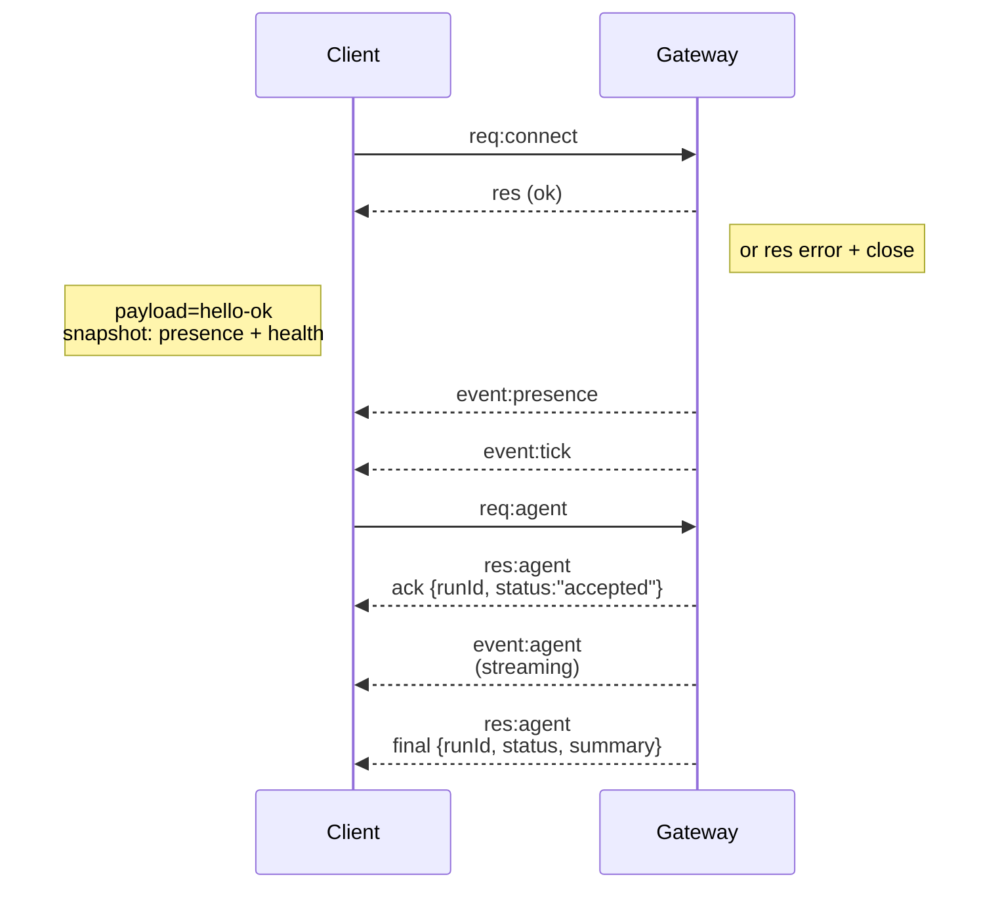

---
read_when:
    - Робота над протоколом Gateway, клієнтами або транспортами
summary: Архітектура WebSocket Gateway, компоненти та клієнтські потоки
title: Архітектура Gateway
x-i18n:
    generated_at: "2026-05-06T01:19:27Z"
    model: gpt-5.5
    provider: openai
    source_hash: 433489081bfe07691b211f5076ec45ce0ed3fd043eb86128f73121f2cab71cd3
    source_path: concepts/architecture.md
    workflow: 16
    postprocess_version: locale-links-v1
---

## Огляд

- Єдиний довготривалий **Gateway** володіє всіма поверхнями обміну повідомленнями (WhatsApp через
  Baileys, Telegram через grammY, Slack, Discord, Signal, iMessage, WebChat).
- Клієнти площини керування (застосунок macOS, CLI, веб-інтерфейс, автоматизації) підключаються до
  Gateway через **WebSocket** на налаштованому хості прив’язки (типово
  `127.0.0.1:18789`).
- **Node-и** (macOS/iOS/Android/headless) також підключаються через **WebSocket**, але
  оголошують `role: node` з явними можливостями/командами.
- Один Gateway на хост; це єдине місце, яке відкриває сеанс WhatsApp.
- **Canvas host** обслуговується HTTP-сервером Gateway за адресами:
  - `/__openclaw__/canvas/` (HTML/CSS/JS, які може редагувати агент)
  - `/__openclaw__/a2ui/` (хост A2UI)
    Він використовує той самий порт, що й Gateway (типово `18789`).

## Компоненти та потоки

### Gateway (демон)

- Підтримує з’єднання з провайдерами.
- Надає типізований WS API (запити, відповіді, події server-push).
- Перевіряє вхідні фрейми за JSON Schema.
- Випускає події на кшталт `agent`, `chat`, `presence`, `health`, `heartbeat`, `cron`.

### Клієнти (застосунок Mac / CLI / веб-адміністрування)

- Одне WS-з’єднання на клієнта.
- Надсилають запити (`health`, `status`, `send`, `agent`, `system-presence`).
- Підписуються на події (`tick`, `agent`, `presence`, `shutdown`).

### Node-и (macOS / iOS / Android / headless)

- Підключаються до **того самого WS-сервера** з `role: node`.
- Надають ідентичність пристрою в `connect`; сполучення є **пристроєвим** (роль `node`), а
  схвалення зберігається у сховищі сполучення пристроїв.
- Надають команди на кшталт `canvas.*`, `camera.*`, `screen.record`, `location.get`.

Деталі протоколу:

- [Протокол Gateway](/uk/gateway/protocol)

### WebChat

- Статичний UI, що використовує Gateway WS API для історії чату та надсилання.
- У віддалених налаштуваннях підключається через той самий тунель SSH/Tailscale, що й інші
  клієнти.

## Життєвий цикл з’єднання (один клієнт)



## Дротовий протокол (зведення)

- Транспорт: WebSocket, текстові фрейми з JSON-навантаженнями.
- Перший фрейм **обов’язково** має бути `connect`.
- Після рукостискання:
  - Запити: `{type:"req", id, method, params}` → `{type:"res", id, ok, payload|error}`
  - Події: `{type:"event", event, payload, seq?, stateVersion?}`
- `hello-ok.features.methods` / `events` — це метадані виявлення, а не
  згенерований дамп кожного доступного helper-маршруту.
- Автентифікація за спільним секретом використовує `connect.params.auth.token` або
  `connect.params.auth.password`, залежно від налаштованого режиму автентифікації Gateway.
- Режими з ідентичністю, як-от Tailscale Serve
  (`gateway.auth.allowTailscale: true`) або нелокальний
  `gateway.auth.mode: "trusted-proxy"`, задовольняють автентифікацію через заголовки запиту
  замість `connect.params.auth.*`.
- Private-ingress `gateway.auth.mode: "none"` повністю вимикає автентифікацію за спільним секретом;
  не вмикайте цей режим для публічного/недовіреного ingress.
- Ключі ідемпотентності потрібні для методів із побічними ефектами (`send`, `agent`), щоб
  безпечно повторювати спроби; сервер тримає короткочасний кеш дедуплікації.
- Node-и мають включати `role: "node"` плюс можливості/команди/дозволи в `connect`.

## Сполучення + локальна довіра

- Усі WS-клієнти (оператори + Node-и) включають **ідентичність пристрою** в `connect`.
- Нові ID пристроїв потребують схвалення сполучення; Gateway видає **токен пристрою**
  для подальших підключень.
- Прямі підключення через local loopback можуть автоматично схвалюватися, щоб зберегти плавний UX
  на тому самому хості.
- OpenClaw також має вузький шлях backend/container-local самопідключення для
  довірених helper-потоків зі спільним секретом.
- Підключення через tailnet і LAN, включно з прив’язками tailnet на тому самому хості, усе одно потребують
  явного схвалення сполучення.
- Усі підключення мають підписувати nonce `connect.challenge`.
- Навантаження підпису `v3` також прив’язує `platform` + `deviceFamily`; gateway
  закріплює сполучені метадані під час повторного підключення та вимагає repair pairing для змін метаданих.
- **Нелокальні** підключення все одно потребують явного схвалення.
- Автентифікація Gateway (`gateway.auth.*`) усе одно застосовується до **всіх** з’єднань, локальних або
  віддалених.

Деталі: [Протокол Gateway](/uk/gateway/protocol), [Сполучення](/uk/channels/pairing),
[Безпека](/uk/gateway/security).

## Типізація протоколу та codegen

- Схеми TypeBox визначають протокол.
- JSON Schema генерується з цих схем.
- Моделі Swift генеруються з JSON Schema.

## Віддалений доступ

- Бажано: Tailscale або VPN.
- Альтернатива: тунель SSH

  ```bash
  ssh -N -L 18789:127.0.0.1:18789 user@host
  ```

- Те саме рукостискання + токен автентифікації застосовуються через тунель.
- TLS + необов’язковий pinning можна ввімкнути для WS у віддалених налаштуваннях.

## Операційний зріз

- Запуск: `openclaw gateway` (на передньому плані, логи в stdout).
- Стан: `health` через WS (також включено в `hello-ok`).
- Нагляд: launchd/systemd для автоматичного перезапуску.

## Інваріанти

- Рівно один Gateway керує одним сеансом Baileys на хост.
- Рукостискання обов’язкове; будь-який перший фрейм, що не є JSON або не є connect, призводить до примусового закриття.
- Події не відтворюються повторно; клієнти мають оновлюватися за наявності розривів.

## Пов’язане

- [Цикл агента](/uk/concepts/agent-loop) — докладний цикл виконання агента
- [Протокол Gateway](/uk/gateway/protocol) — контракт протоколу WebSocket
- [Черга](/uk/concepts/queue) — черга команд і паралельність
- [Безпека](/uk/gateway/security) — модель довіри та посилення захисту
