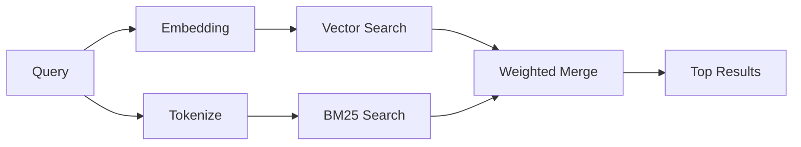

---
read_when:
    - Ви хочете зрозуміти, як працює `memory_search`
    - Ви хочете вибрати provider embeddings
    - Ви хочете налаштувати якість пошуку
summary: Як Memory Search знаходить релевантні нотатки за допомогою embeddings і гібридного пошуку
title: Memory Search
x-i18n:
    generated_at: "2026-04-23T20:50:25Z"
    model: gpt-5.4
    provider: openai
    source_hash: 7e3db2426abe631191d810a753504122b3b7daf7992f56c030a2823b1835ddca
    source_path: concepts/memory-search.md
    workflow: 15
---

`memory_search` знаходить релевантні нотатки з ваших файлів пам’яті, навіть коли
формулювання відрізняється від оригінального тексту. Він працює, індексуючи пам’ять у невеликі
фрагменти й шукаючи по них за допомогою embeddings, ключових слів або обох підходів.

## Швидкий старт

Якщо у вас налаштовано підписку GitHub Copilot, ключ API OpenAI, Gemini, Voyage або Mistral,
memory search працює автоматично. Щоб явно задати provider-а:

```json5
{
  agents: {
    defaults: {
      memorySearch: {
        provider: "openai", // або "gemini", "local", "ollama" тощо
      },
    },
  },
}
```

Для локальних embeddings без ключа API використовуйте `provider: "local"` (потрібен
node-llama-cpp).

## Підтримувані providers

| Provider       | ID               | Потрібен ключ API | Примітки                                              |
| -------------- | ---------------- | ----------------- | ----------------------------------------------------- |
| Bedrock        | `bedrock`        | Ні                | Автовизначається, коли розв’язується ланцюжок облікових даних AWS |
| Gemini         | `gemini`         | Так               | Підтримує індексування зображень/аудіо                |
| GitHub Copilot | `github-copilot` | Ні                | Автовизначається, використовує підписку Copilot       |
| Local          | `local`          | Ні                | Модель GGUF, завантаження ~0.6 GB                     |
| Mistral        | `mistral`        | Так               | Автовизначається                                      |
| Ollama         | `ollama`         | Ні                | Локальний, потрібно вказати явно                      |
| OpenAI         | `openai`         | Так               | Автовизначається, швидкий                             |
| Voyage         | `voyage`         | Так               | Автовизначається                                      |

## Як працює пошук

OpenClaw запускає два шляхи пошуку паралельно й об’єднує результати:



- **Векторний пошук** знаходить нотатки зі схожим значенням ("gateway host" збігається з
  "the machine running OpenClaw").
- **Пошук за ключовими словами BM25** знаходить точні збіги (ID, рядки помилок, ключі
  конфігурації).

Якщо доступний лише один шлях (немає embeddings або немає FTS), працює лише він.

Коли embeddings недоступні, OpenClaw усе одно використовує лексичне ранжування над результатами FTS замість того, щоб повертатися лише до сирого впорядкування за точним збігом. У цьому деградованому режимі підвищується вага фрагментів із кращим покриттям термінів запиту та релевантними шляхами файлів, що зберігає корисність recall навіть без `sqlite-vec` або provider-а embeddings.

## Покращення якості пошуку

Дві необов’язкові функції допомагають, коли у вас велика історія нотаток:

### Temporal decay

Старі нотатки поступово втрачають вагу в ранжуванні, щоб новіша інформація з’являлася першою.
За типовим періодом напіврозпаду 30 днів нотатка з минулого місяця отримує 50% від
своєї початкової ваги. Постійно актуальні файли, як-от `MEMORY.md`, ніколи не піддаються decay.

<Tip>
Увімкніть temporal decay, якщо агент має щоденні нотатки за багато місяців і застаріла
інформація постійно випереджає новіший контекст.
</Tip>

### MMR (різноманітність)

Зменшує кількість дубльованих результатів. Якщо п’ять нотаток згадують ту саму конфігурацію роутера, MMR
забезпечує, щоб верхні результати охоплювали різні теми, а не повторювалися.

<Tip>
Увімкніть MMR, якщо `memory_search` постійно повертає майже однакові фрагменти з
різних щоденних нотаток.
</Tip>

### Увімкнути обидва

```json5
{
  agents: {
    defaults: {
      memorySearch: {
        query: {
          hybrid: {
            mmr: { enabled: true },
            temporalDecay: { enabled: true },
          },
        },
      },
    },
  },
}
```

## Мультимодальна пам’ять

З Gemini Embedding 2 ви можете індексувати зображення й аудіофайли разом із
Markdown. Пошукові запити лишаються текстовими, але вони зіставляються з візуальним і аудіовмістом. Див. [довідку з конфігурації пам’яті](/uk/reference/memory-config) для
налаштування.

## Пошук у пам’яті сесії

За бажанням ви можете індексувати transcripts сесій, щоб `memory_search` міг відновлювати
попередні розмови. Це вмикається через
`memorySearch.experimental.sessionMemory`. Докладніше див. у
[довідці з конфігурації](/uk/reference/memory-config).

## Усунення несправностей

**Немає результатів?** Виконайте `openclaw memory status`, щоб перевірити індекс. Якщо він порожній, запустіть
`openclaw memory index --force`.

**Лише збіги за ключовими словами?** Можливо, provider embeddings не налаштовано. Перевірте
`openclaw memory status --deep`.

**Не знаходиться текст CJK?** Перебудуйте індекс FTS за допомогою
`openclaw memory index --force`.

## Додаткове читання

- [Active Memory](/uk/concepts/active-memory) -- пам’ять субагента для інтерактивних сесій чату
- [Memory](/uk/concepts/memory) -- розміщення файлів, backends, tools
- [Довідка з конфігурації пам’яті](/uk/reference/memory-config) -- усі параметри конфігурації
