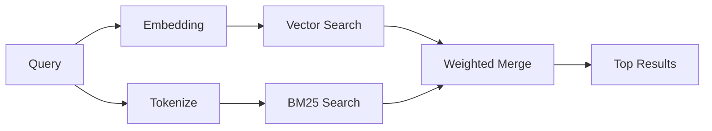

---
read_when:
    - Ви хочете зрозуміти, як працює memory_search
    - Ви хочете вибрати постачальника ембедингів
    - Ви хочете налаштувати якість пошуку
summary: Як пошук у памʼяті знаходить релевантні нотатки за допомогою ембедингів і гібридного пошуку
title: Пошук у пам’яті
x-i18n:
    generated_at: "2026-06-28T22:33:43Z"
    model: gpt-5.5
    postprocess_version: locale-links-v1
    provider: openai
    source_hash: 32ffb9d996851566eb92b7812c5425f545ecbb5387a0a445686df35a6c8ae143
    source_path: concepts/memory-search.md
    workflow: 16
---

`memory_search` знаходить релевантні нотатки у ваших файлах пам’яті, навіть коли
формулювання відрізняється від оригінального тексту. Він працює, індексуючи
пам’ять на невеликі фрагменти та шукаючи в них за допомогою ембедингів,
ключових слів або обох способів.

## Швидкий старт

Пошук у пам’яті типово використовує ембединги OpenAI. Щоб використати інший
бекенд ембедингів, явно задайте постачальника:

```json5
{
  agents: {
    defaults: {
      memorySearch: {
        provider: "openai", // or "gemini", "local", "ollama", "openai-compatible", etc.
      },
    },
  },
}
```

Для налаштувань із кількома кінцевими точками та окремими постачальниками для
пам’яті `provider` також може бути власним записом `models.providers.<id>`,
наприклад `ollama-5080`, коли цей постачальник задає `api: "ollama"` або іншого
власника адаптера ембедингів пам’яті.

Для локальних ембедингів без ключа API встановіть
`@openclaw/llama-cpp-provider` і задайте `provider: "local"`. Вихідні checkout-и
можуть усе ще вимагати схвалення нативної збірки: `pnpm approve-builds`, потім
`pnpm rebuild node-llama-cpp`.

Деякі OpenAI-сумісні кінцеві точки ембедингів вимагають асиметричних міток,
наприклад `input_type: "query"` для пошуку та `input_type: "document"` або
`"passage"` для індексованих фрагментів. Налаштуйте їх через
`memorySearch.queryInputType` і `memorySearch.documentInputType`; дивіться
[довідник із налаштування пам’яті](/uk/reference/memory-config#provider-specific-config).

## Підтримувані постачальники

| Постачальник      | ID                  | Потрібен ключ API | Примітки                            |
| ----------------- | ------------------- | ----------------- | ----------------------------------- |
| Bedrock           | `bedrock`           | Ні                | Використовує ланцюжок облікових даних AWS |
| DeepInfra         | `deepinfra`         | Так               | Типово: `BAAI/bge-m3`               |
| Gemini            | `gemini`            | Так               | Підтримує індексування зображень/аудіо |
| GitHub Copilot    | `github-copilot`    | Ні                | Використовує підписку Copilot       |
| Локальний         | `local`             | Ні                | Модель GGUF, завантаження ~0,6 ГБ   |
| Mistral           | `mistral`           | Так               |                                     |
| Ollama            | `ollama`            | Ні                | Локальний/самостійно розгорнутий    |
| OpenAI            | `openai`            | Так               | Типовий                             |
| OpenAI-сумісний   | `openai-compatible` | Зазвичай          | Універсальний `/v1/embeddings`      |
| Voyage            | `voyage`            | Так               |                                     |

## Як працює пошук

OpenClaw запускає два шляхи отримання даних паралельно й об’єднує результати:



- **Векторний пошук** знаходить нотатки зі схожим значенням (`"gateway host"`
  відповідає `"the machine running OpenClaw"`).
- **Пошук за ключовими словами BM25** знаходить точні збіги (ID, рядки помилок,
  ключі конфігурації).

Якщо доступний лише один шлях, інший працює самостійно. Навмисний режим лише
FTS (`provider: "none"`) і автоматичний/типовий вибір постачальника все ще
можуть використовувати лексичне ранжування, коли ембединги недоступні.

Явні нелокальні постачальники ембедингів поводяться інакше. Якщо ви задаєте
`memorySearch.provider` як конкретного постачальника з віддаленим бекендом, і
цей постачальник недоступний під час виконання, `memory_search` повідомляє, що
пам’ять недоступна, замість того щоб мовчки використовувати лише результати FTS.
Це робить поламаного налаштованого семантичного постачальника видимим. Задайте
`provider: "none"` для навмисного відтворення лише через FTS або виправте
конфігурацію постачальника/автентифікації, щоб відновити семантичне ранжування.

## Покращення якості пошуку

Дві необов’язкові функції допомагають, коли у вас велика історія нотаток:

### Часове згасання

Старі нотатки поступово втрачають вагу ранжування, щоб нова інформація
з’являлася першою. За типового періоду напіврозпаду 30 днів нотатка з минулого
місяця отримує 50% своєї початкової ваги. Вічнозелені файли, як-от `MEMORY.md`,
ніколи не згасають.

<Tip>
Увімкніть часове згасання, якщо ваш агент має місяці щоденних нотаток, а застаріла
інформація й далі випереджає новіший контекст.
</Tip>

### MMR (різноманітність)

Зменшує кількість надлишкових результатів. Якщо п’ять нотаток згадують ту саму
конфігурацію маршрутизатора, MMR гарантує, що найкращі результати охоплюють
різні теми, а не повторюються.

<Tip>
Увімкніть MMR, якщо `memory_search` постійно повертає майже дублікати фрагментів
із різних щоденних нотаток.
</Tip>

### Увімкнути обидві функції

```json5
{
  agents: {
    defaults: {
      memorySearch: {
        query: {
          hybrid: {
            mmr: { enabled: true },
            temporalDecay: { enabled: true },
          },
        },
      },
    },
  },
}
```

## Мультимодальна пам’ять

З Gemini Embedding 2 ви можете індексувати зображення й аудіофайли разом із
Markdown. Пошукові запити залишаються текстовими, але вони зіставляються з
візуальним і аудіоконтентом. Дивіться
[довідник із налаштування пам’яті](/uk/reference/memory-config) для налаштування.

## Пошук у пам’яті сеансу

Ви можете за бажанням індексувати стенограми сеансів, щоб `memory_search` міг
згадувати попередні розмови. Це вмикається явно через
`memorySearch.experimental.sessionMemory` і `sources: ["sessions"]`; типовий
список джерел містить лише пам’ять. Експериментальний прапорець вмикає
індексування стенограм сеансів, а `sources` контролює, чи виконуватиметься пошук
у фрагментах сеансів.

Збіги сеансів підпорядковуються `tools.sessions.visibility`: типове значення
`tree` відкриває лише поточний сеанс і сеанси, які він породив. Щоб згадати
непов’язаний сеанс того самого агента, надісланий через Gateway з окремого DM-сеансу,
навмисно розширте видимість до `agent`.

Під час використання QMD також задайте `memory.qmd.sessions.enabled: true`, щоб
стенограми експортувалися в колекцію QMD. Дивіться
[довідник із конфігурації](/uk/reference/memory-config) для подробиць.

## Усунення несправностей

**Немає результатів?** Запустіть `openclaw memory status`, щоб перевірити індекс.
Якщо він порожній, запустіть `openclaw memory index --force`.

**Лише збіги за ключовими словами?** Ваш постачальник ембедингів може бути не
налаштований. Перевірте `openclaw memory status --deep`.

**Час очікування локальних ембедингів вичерпано?** `ollama`, `lmstudio` і `local`
типово використовують довший тайм-аут inline-пакета. Якщо хост просто повільний,
задайте `agents.defaults.memorySearch.sync.embeddingBatchTimeoutSeconds` і
повторно запустіть `openclaw memory index --force`.

**Текст CJK не знайдено?** Перебудуйте індекс FTS за допомогою
`openclaw memory index --force`.

## Додаткові матеріали

- [Active Memory](/uk/concepts/active-memory) -- пам’ять субагента для інтерактивних чат-сеансів
- [Пам’ять](/uk/concepts/memory) -- структура файлів, бекенди, інструменти
- [Довідник із налаштування пам’яті](/uk/reference/memory-config) -- усі параметри конфігурації

## Пов’язане

- [Огляд пам’яті](/uk/concepts/memory)
- [Active Memory](/uk/concepts/active-memory)
- [Вбудований рушій пам’яті](/uk/concepts/memory-builtin)
