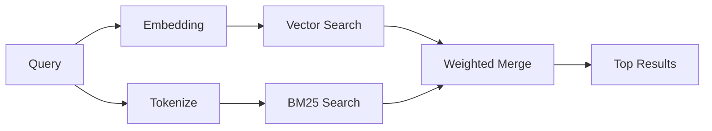

---
read_when:
    - Ви хочете зрозуміти, як працює memory_search
    - Ви хочете вибрати провайдера ембедингів
    - Ви хочете налаштувати якість пошуку
summary: Як пошук у пам’яті знаходить релевантні нотатки за допомогою ембедингів і гібридного пошуку
title: Пошук у пам’яті
x-i18n:
    generated_at: "2026-05-01T20:37:44Z"
    model: gpt-5.5
    provider: openai
    source_hash: 2a71fb0809d5c70689e8046f854e4b4b4e79f45769ac2964e40a762ebb4e91a8
    source_path: concepts/memory-search.md
    workflow: 16
---

`memory_search` знаходить релевантні нотатки у ваших файлах пам'яті, навіть коли
формулювання відрізняється від оригінального тексту. Він працює, індексуючи пам'ять у невеликі
фрагменти й шукаючи в них за допомогою embeddings, ключових слів або обох підходів.

## Швидкий старт

Якщо у вас налаштовано підписку GitHub Copilot, API-ключ OpenAI, Gemini, Voyage або Mistral,
пошук у пам'яті працює автоматично. Щоб явно задати постачальника:

```json5
{
  agents: {
    defaults: {
      memorySearch: {
        provider: "openai", // or "gemini", "local", "ollama", etc.
      },
    },
  },
}
```

Для налаштувань із кількома кінцевими точками `provider` також може бути користувацьким
записом `models.providers.<id>`, наприклад `ollama-5080`, коли цей постачальник задає
`api: "ollama"` або іншого власника адаптера embeddings.

Для локальних embeddings без API-ключа задайте `provider: "local"`. Вихідні checkout-и
все одно можуть потребувати схвалення нативного збирання: `pnpm approve-builds`, а потім
`pnpm rebuild node-llama-cpp`.

Деякі OpenAI-сумісні кінцеві точки embeddings потребують асиметричних міток, як-от
`input_type: "query"` для пошуку та `input_type: "document"` або `"passage"`
для проіндексованих фрагментів. Налаштуйте їх за допомогою `memorySearch.queryInputType` і
`memorySearch.documentInputType`; див. [довідник конфігурації пам'яті](/uk/reference/memory-config#provider-specific-config).

## Підтримувані постачальники

| Постачальник   | ID               | Потрібен API-ключ | Примітки                                                  |
| -------------- | ---------------- | ----------------- | --------------------------------------------------------- |
| Bedrock        | `bedrock`        | Ні                | Виявляється автоматично, коли ланцюг облікових даних AWS спрацьовує |
| Gemini         | `gemini`         | Так               | Підтримує індексацію зображень і аудіо                    |
| GitHub Copilot | `github-copilot` | Ні                | Виявляється автоматично, використовує підписку Copilot    |
| Local          | `local`          | Ні                | Модель GGUF, завантаження близько 0,6 ГБ                  |
| Mistral        | `mistral`        | Так               | Виявляється автоматично                                   |
| Ollama         | `ollama`         | Ні                | Локальний, потрібно задати явно                           |
| OpenAI         | `openai`         | Так               | Виявляється автоматично, швидкий                          |
| Voyage         | `voyage`         | Так               | Виявляється автоматично                                   |

## Як працює пошук

OpenClaw запускає два шляхи отримання даних паралельно й об'єднує результати:



- **Векторний пошук** знаходить нотатки зі схожим значенням ("gateway host" відповідає
  "машині, на якій працює OpenClaw").
- **Пошук за ключовими словами BM25** знаходить точні збіги (ID, рядки помилок, ключі
  конфігурації).

Якщо доступний лише один шлях (немає embeddings або немає FTS), інший працює самостійно.

Коли embeddings недоступні, OpenClaw усе одно використовує лексичне ранжування результатів FTS замість повернення лише до сирого впорядкування за точними збігами. Цей обмежений режим підсилює фрагменти з кращим покриттям термінів запиту та релевантними шляхами файлів, що зберігає корисну повноту навіть без `sqlite-vec` або постачальника embeddings.

## Покращення якості пошуку

Дві необов'язкові функції допомагають, коли у вас велика історія нотаток:

### Часове згасання

Старі нотатки поступово втрачають вагу ранжування, щоб новіша інформація з'являлася першою.
За стандартного періоду напіврозпаду 30 днів нотатка з минулого місяця отримує 50% від
своєї початкової ваги. Вічнозелені файли, як-от `MEMORY.md`, ніколи не згасають.

<Tip>
Увімкніть часове згасання, якщо ваш агент має місяці щоденних нотаток, а застаріла
інформація постійно випереджає новий контекст.
</Tip>

### MMR (різноманітність)

Зменшує дублювання результатів. Якщо п'ять нотаток згадують ту саму конфігурацію маршрутизатора, MMR
гарантує, що верхні результати охоплюють різні теми, а не повторюються.

<Tip>
Увімкніть MMR, якщо `memory_search` постійно повертає майже дублікати фрагментів із
різних щоденних нотаток.
</Tip>

### Увімкнути обидві функції

```json5
{
  agents: {
    defaults: {
      memorySearch: {
        query: {
          hybrid: {
            mmr: { enabled: true },
            temporalDecay: { enabled: true },
          },
        },
      },
    },
  },
}
```

## Мультимодальна пам'ять

З Gemini Embedding 2 ви можете індексувати зображення й аудіофайли разом із
Markdown. Пошукові запити залишаються текстовими, але вони зіставляються з візуальним і аудіо
вмістом. Див. [довідник конфігурації пам'яті](/uk/reference/memory-config) для
налаштування.

## Пошук у пам'яті сеансів

Ви можете за бажанням індексувати транскрипти сеансів, щоб `memory_search` міг пригадувати
попередні розмови. Це вмикається окремо через
`memorySearch.experimental.sessionMemory`. Див.
[довідник конфігурації](/uk/reference/memory-config) для подробиць.

## Усунення несправностей

**Немає результатів?** Запустіть `openclaw memory status`, щоб перевірити індекс. Якщо він порожній, запустіть
`openclaw memory index --force`.

**Лише збіги за ключовими словами?** Ваш постачальник embeddings може бути не налаштований. Перевірте
`openclaw memory status --deep`.

**Локальні embeddings перевищують час очікування?** `ollama`, `lmstudio` і `local` за замовчуванням використовують довший
час очікування вбудованого пакетного оброблення. Якщо хост просто повільний, задайте
`agents.defaults.memorySearch.sync.embeddingBatchTimeoutSeconds` і повторно запустіть
`openclaw memory index --force`.

**Текст CJK не знайдено?** Перебудуйте індекс FTS за допомогою
`openclaw memory index --force`.

## Додаткове читання

- [Active Memory](/uk/concepts/active-memory) -- пам'ять субагента для інтерактивних чат-сеансів
- [Пам'ять](/uk/concepts/memory) -- структура файлів, бекенди, інструменти
- [Довідник конфігурації пам'яті](/uk/reference/memory-config) -- усі параметри конфігурації

## Пов'язане

- [Огляд пам'яті](/uk/concepts/memory)
- [Active Memory](/uk/concepts/active-memory)
- [Вбудований рушій пам'яті](/uk/concepts/memory-builtin)
