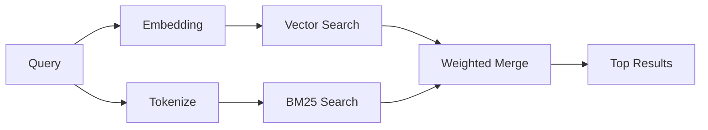

---
read_when:
    - Ви хочете зрозуміти, як працює memory_search
    - Ви хочете вибрати провайдера ембедингів
    - Ви хочете налаштувати якість пошуку
summary: Як пошук у пам’яті знаходить релевантні нотатки за допомогою ембедингів і гібридного пошуку
title: Пошук у пам’яті
x-i18n:
    generated_at: "2026-04-27T10:58:31Z"
    model: gpt-5.4
    provider: openai
    source_hash: 7c6dbc694a6ac6b9ab8773ebee245bb18d92a226c56f4ebb5df4dfa255ad940a
    source_path: concepts/memory-search.md
    workflow: 15
---

`memory_search` знаходить релевантні нотатки з ваших файлів пам’яті, навіть коли
формулювання відрізняється від оригінального тексту. Він працює, індексуючи пам’ять на невеликі
фрагменти та виконуючи пошук по них за допомогою ембедингів, ключових слів або обох підходів.

## Швидкий старт

Якщо у вас налаштовано підписку GitHub Copilot, ключ API OpenAI, Gemini, Voyage або Mistral,
пошук у пам’яті працює автоматично. Щоб явно вказати провайдера:

```json5
{
  agents: {
    defaults: {
      memorySearch: {
        provider: "openai", // or "gemini", "local", "ollama", etc.
      },
    },
  },
}
```

Для локальних ембедингів без ключа API встановіть необов’язковий пакет рантайму `node-llama-cpp`
поруч з OpenClaw і використовуйте `provider: "local"`.

Деякі OpenAI-сумісні кінцеві точки ембедингів потребують асиметричних міток, таких як
`input_type: "query"` для пошуків і `input_type: "document"` або `"passage"`
для проіндексованих фрагментів. Налаштуйте це через `memorySearch.queryInputType` і
`memorySearch.documentInputType`; див. [довідник з конфігурації пам’яті](/uk/reference/memory-config#provider-specific-config).

## Підтримувані провайдери

| Провайдер      | ID               | Потрібен ключ API | Примітки                                             |
| -------------- | ---------------- | ----------------- | ---------------------------------------------------- |
| Bedrock        | `bedrock`        | Ні                | Визначається автоматично, коли розв’язується ланцюжок облікових даних AWS |
| Gemini         | `gemini`         | Так               | Підтримує індексацію зображень/аудіо                 |
| GitHub Copilot | `github-copilot` | Ні                | Визначається автоматично, використовує підписку Copilot |
| Local          | `local`          | Ні                | Модель GGUF, завантаження ~0.6 ГБ                    |
| Mistral        | `mistral`        | Так               | Визначається автоматично                             |
| Ollama         | `ollama`         | Ні                | Локальний, потрібно вказувати явно                   |
| OpenAI         | `openai`         | Так               | Визначається автоматично, швидкий                    |
| Voyage         | `voyage`         | Так               | Визначається автоматично                             |

## Як працює пошук

OpenClaw запускає два шляхи отримання результатів паралельно й об’єднує їх:



- **Векторний пошук** знаходить нотатки зі схожим змістом ("gateway host" відповідає
  "the machine running OpenClaw").
- **Пошук за ключовими словами BM25** знаходить точні збіги (ID, рядки помилок, ключі
  конфігурації).

Якщо доступний лише один шлях (немає ембедингів або немає FTS), інший працює окремо.

Коли ембединги недоступні, OpenClaw усе одно використовує лексичне ранжування поверх результатів FTS, а не повертається лише до сирого впорядкування за точним збігом. Цей деградований режим підсилює фрагменти з кращим покриттям термінів запиту та релевантними шляхами до файлів, що допомагає зберігати корисну повноту пошуку навіть без `sqlite-vec` або провайдера ембедингів.

## Поліпшення якості пошуку

Дві необов’язкові можливості допомагають, якщо у вас велика історія нотаток:

### Темпоральне згасання

Старі нотатки поступово втрачають вагу в ранжуванні, тому новіша інформація
з’являється першою. За замовчуванням, із періодом напіврозпаду 30 днів, нотатка за минулий місяць отримує 50% від
своєї початкової ваги. Evergreen-файли, як-от `MEMORY.md`, ніколи не згасають.

<Tip>
Увімкніть темпоральне згасання, якщо ваш агент має щоденні нотатки за кілька місяців і застаріла
інформація постійно випереджає свіжий контекст.
</Tip>

### MMR (різноманітність)

Зменшує кількість надлишкових результатів. Якщо п’ять нотаток усі згадують ту саму конфігурацію роутера, MMR
забезпечує, щоб верхні результати охоплювали різні теми, а не повторювалися.

<Tip>
Увімкніть MMR, якщо `memory_search` постійно повертає майже дубльовані фрагменти з
різних щоденних нотаток.
</Tip>

### Увімкнути обидва

```json5
{
  agents: {
    defaults: {
      memorySearch: {
        query: {
          hybrid: {
            mmr: { enabled: true },
            temporalDecay: { enabled: true },
          },
        },
      },
    },
  },
}
```

## Мультимодальна пам’ять

З Gemini Embedding 2 ви можете індексувати зображення й аудіофайли разом із
Markdown. Пошукові запити залишаються текстовими, але вони зіставляються з візуальним та аудіовмістом. Див. [довідник з конфігурації пам’яті](/uk/reference/memory-config) для
налаштування.

## Пошук у пам’яті сесій

За бажанням можна індексувати транскрипти сесій, щоб `memory_search` міг пригадувати
попередні розмови. Це вмикається вручну через
`memorySearch.experimental.sessionMemory`. Подробиці див. у
[довіднику з конфігурації](/uk/reference/memory-config).

## Усунення несправностей

**Немає результатів?** Виконайте `openclaw memory status`, щоб перевірити індекс. Якщо він порожній, виконайте
`openclaw memory index --force`.

**Лише збіги за ключовими словами?** Можливо, ваш провайдер ембедингів не налаштований. Перевірте
`openclaw memory status --deep`.

**Локальні ембединги завершуються за тайм-аутом?** `ollama`, `lmstudio` і `local` за замовчуванням використовують довший
тайм-аут для вбудованих пакетних запитів. Якщо хост просто працює повільно, встановіть
`agents.defaults.memorySearch.sync.embeddingBatchTimeoutSeconds` і повторно виконайте
`openclaw memory index --force`.

**Текст CJK не знаходиться?** Перебудуйте індекс FTS за допомогою
`openclaw memory index --force`.

## Додаткове читання

- [Active Memory](/uk/concepts/active-memory) -- пам’ять субагента для інтерактивних чат-сесій
- [Пам’ять](/uk/concepts/memory) -- структура файлів, бекенди, інструменти
- [Довідник з конфігурації пам’яті](/uk/reference/memory-config) -- усі параметри конфігурації

## Пов’язане

- [Огляд пам’яті](/uk/concepts/memory)
- [Active Memory](/uk/concepts/active-memory)
- [Вбудований рушій пам’яті](/uk/concepts/memory-builtin)
