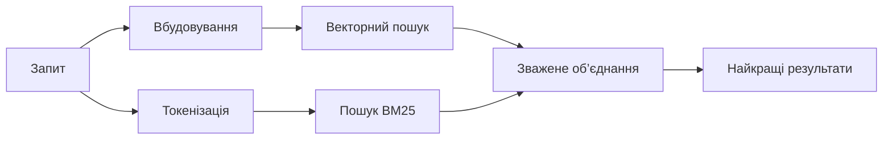

---
read_when:
    - Ви хочете зрозуміти, як працює memory_search
    - Ви хочете вибрати постачальника векторних представлень
    - Ви хочете налаштувати якість пошуку
summary: Як пошук у пам’яті знаходить релевантні нотатки за допомогою вбудовувань і гібридного пошуку
title: Пошук у пам’яті
x-i18n:
    generated_at: "2026-07-16T17:57:52Z"
    model: gpt-5.6
    postprocess_version: locale-links-v1
    prompt_version: 32
    provider: openai
    source_hash: 2ae0830843fba28c24159d85425240051fb8caf086cd0563d3091890045dcfad
    source_path: concepts/memory-search.md
    workflow: 16
---

`memory_search` знаходить релевантні нотатки у ваших файлах пам’яті, навіть якщо
формулювання відрізняється від оригінального тексту. Він розбиває пам’ять на невеликі фрагменти та
шукає в них за допомогою вбудовувань, ключових слів або обох методів.

## Швидкий початок

OpenClaw за замовчуванням використовує вбудовування OpenAI. Щоб скористатися іншим провайдером, задайте його
явно:

```json5
{
  agents: {
    defaults: {
      memorySearch: {
        provider: "openai", // або "gemini", "voyage", "mistral", "bedrock", "local", "ollama", "lmstudio", "github-copilot", "openai-compatible"
      },
    },
  },
}
```

`provider` також може посилатися на власний запис `models.providers.<id>` (наприклад,
`ollama-5080`), якщо в цьому записі для `api` задано `"ollama"` або
ідентифікатор іншого провайдера з адаптером вбудовувань пам’яті.

Для локальних вбудовувань без ключа API встановіть офіційний plugin провайдера llama.cpp
і задайте `provider: "local"`:

```bash
openclaw plugins install @openclaw/llama-cpp-provider
```

Для збірок із вихідного коду все одно потрібне схвалення нативної збірки: `pnpm approve-builds`, а потім
`pnpm rebuild node-llama-cpp`.

Деякі сумісні з OpenAI кінцеві точки вбудовувань потребують асиметричних міток `input_type`,
як-от `"query"` для пошуку та `"document"`/`"passage"` для індексованих
фрагментів. Задайте їх за допомогою `queryInputType` і `documentInputType`; див.
[Довідник із налаштування пам’яті](/uk/reference/memory-config#provider-specific-config).

## Підтримувані провайдери

| Провайдер         | ID                  | Потрібен ключ API | Примітки                                  |
| ----------------- | ------------------- | ----------------- | ----------------------------------------- |
| Bedrock           | `bedrock`           | Ні                | Використовує ланцюжок облікових даних AWS |
| DeepInfra         | `deepinfra`         | Так               | Модель за замовчуванням `BAAI/bge-m3`     |
| Gemini            | `gemini`            | Так               | Підтримує індексування зображень і аудіо  |
| GitHub Copilot    | `github-copilot`    | Ні                | Використовує вашу передплату Copilot      |
| Локальний         | `local`             | Ні                | Модель GGUF, автоматичне завантаження ~0.6 GB |
| LM Studio         | `lmstudio`          | Ні                | Локальний/самостійно розміщений сервер    |
| Mistral           | `mistral`           | Так               |                                           |
| Ollama            | `ollama`            | Ні                | Локальний/самостійно розміщений сервер    |
| OpenAI            | `openai`            | Так               | За замовчуванням                          |
| Сумісний з OpenAI | `openai-compatible` | Зазвичай          | Універсальна кінцева точка `/v1/embeddings` |
| Voyage            | `voyage`            | Так               |                                           |

## Як працює пошук

OpenClaw паралельно виконує два способи пошуку та об’єднує результати:



- **Векторний пошук** зіставляє подібні значення («хост gateway» відповідає «комп’ютеру,
  на якому працює OpenClaw»).
- **Пошук за ключовими словами BM25** зіставляє точні терміни (ID, рядки помилок, ключі
  конфігурації).
- **Пошук за іменами файлів** індексує шляхи окремо від вмісту нотаток. Точні повні
  шляхи, базові імена та основи імен файлів мають вищий рейтинг за часткові збіги шляхів,
  водночас уривки та оцінки ключових слів у вмісті й надалі визначаються за вмістом нотаток.

Якщо доступний лише один спосіб, він працює самостійно.

**Режим лише FTS.** Задайте `provider: "none"`, щоб навмисно вимкнути вбудовування
та шукати лише за ключовими словами. Якщо залишити `provider` незаданим або задати `"auto"`,
система також переходить до ранжування лише за ключовими словами без помилки, якщо автентифікацію для вбудовувань не налаштовано;
так само поводиться `provider: "local"` (провайдер GGUF/llama.cpp)
у разі збою.

**Явно заданий провайдер недоступний.** Якщо явно вказати будь-якого іншого провайдера
(наприклад, `openai`, `ollama`, `gemini`) і він стане недоступним під час
запиту (неправильна автентифікація, збій мережі), `memory_search` повідомить, що пам’ять
недоступна, замість непомітного переходу до результатів лише FTS. Завдяки цьому
несправність налаштованого провайдера залишається помітною. Задайте `provider: "none"` для навмисного
пошуку лише FTS або виправте конфігурацію провайдера/автентифікації, щоб відновити семантичне
ранжування.

## Поліпшення якості пошуку

Дві необов’язкові функції допомагають працювати з великою історією нотаток.

### Часове згасання

Вага старих нотаток у рейтингу поступово зменшується, тому свіжа інформація відображається першою.
За стандартного періоду напіврозпаду 30 днів оцінка нотатки з минулого місяця становить 50% її
початкової ваги. `MEMORY.md` та інші файли без дат у `memory/`
залишаються актуальними й ніколи не зазнають згасання; згасають лише датовані файли `memory/YYYY-MM-DD.md`.

<Tip>
Увімкніть цю функцію, якщо агент має щоденні нотатки за кілька місяців, а застаріла інформація
постійно випереджає в рейтингу свіжий контекст.
</Tip>

### MMR (різноманітність)

Зменшує кількість надлишкових результатів. Якщо в п’яти нотатках згадується однакова конфігурація маршрутизатора,
MMR забезпечує охоплення різних тем у найкращих результатах замість повторень.

<Tip>
Увімкніть цю функцію, якщо `memory_search` постійно повертає майже однакові уривки з
різних щоденних нотаток.
</Tip>

### Увімкнення обох функцій

```json5
{
  agents: {
    defaults: {
      memorySearch: {
        query: {
          hybrid: {
            mmr: { enabled: true },
            temporalDecay: { enabled: true },
          },
        },
      },
    },
  },
}
```

## Мультимодальна пам’ять

За допомогою `gemini-embedding-2-preview` можна індексувати зображення й аудіо разом із
Markdown. Це стосується лише файлів у `memorySearch.extraPaths`; стандартні
корені пам’яті (`MEMORY.md`, `memory/*.md`) підтримують лише Markdown. Пошукові запити
залишаються текстовими, але зіставляються з візуальним та аудіовмістом. Інструкції з налаштування див. у
[довіднику з налаштування пам’яті](/uk/reference/memory-config#multimodal-memory-gemini).

## Пошук у пам’яті сеансів

Для точного повнотекстового пошуку у стенограмах сеансів використовуйте [`sessions_search`](/concepts/session-search),
а потім відкрийте результат за допомогою `sessions_history`. Пошук у пам’яті сеансів залишається семантичним
експериментальним доповненням.

За бажанням індексуйте стенограми сеансів, щоб `memory_search` міг знаходити попередні
розмови. Цю функцію потрібно ввімкнути: задайте `experimental.sessionMemory: true` і додайте
`"sessions"` до `sources` (стандартне значення `sources` — `["memory"]`).

Збіги сеансів підпорядковуються `tools.sessions.visibility`: стандартне значення `"tree"`
надає доступ лише до поточного сеансу та породжених ним сеансів. Щоб із одного сеансу знаходити
непов’язаний сеанс того самого агента (наприклад, сеанс, запущений через gateway
із приватного повідомлення), розширте видимість до `"agent"`.

Під час використання бекенду QMD також задайте `memory.qmd.sessions.enabled: true`, щоб
стенограми експортувалися до колекції QMD; самі лише `experimental.sessionMemory`
і `sources` не експортують стенограми до QMD. Див.
[довідник із налаштування](/uk/reference/memory-config#session-memory-search-experimental).

## Усунення несправностей

**Немає результатів?** Запустіть `openclaw memory status`, щоб перевірити індекс. Якщо він порожній, запустіть
`openclaw memory index --force`.

**Збіги лише за ключовими словами?** Можливо, провайдер вбудовувань не налаштований. Перевірте
`openclaw memory status --deep`.

**Час очікування локальних вбудовувань спливає?** `ollama`, `lmstudio` і `local` за замовчуванням використовують довший
час очікування вбудованого пакетного оброблення. Якщо хост просто повільний, задайте
`agents.defaults.memorySearch.sync.embeddingBatchTimeoutSeconds` і повторно запустіть
`openclaw memory index --force`.

**Текст CJK не знайдено?** Перебудуйте індекс FTS за допомогою
`openclaw memory index --force`.

## Пов’язані матеріали

- [Огляд пам’яті](/uk/concepts/memory)
- [Active Memory](/uk/concepts/active-memory)
- [Вбудований рушій пам’яті](/uk/concepts/memory-builtin)
- [Довідник із налаштування пам’яті](/uk/reference/memory-config)
