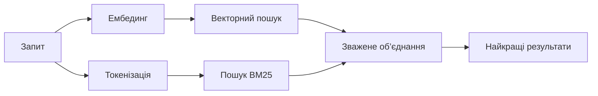

---
read_when:
    - Ви хочете зрозуміти, як працює memory_search
    - Ви хочете вибрати постачальника ембедингів
    - Ви хочете налаштувати якість пошуку
summary: Як пошук у пам’яті знаходить релевантні нотатки за допомогою ембедингів і гібридного пошуку
title: Пошук у пам’яті
x-i18n:
    generated_at: "2026-04-09T16:29:07Z"
    model: gpt-5.4
    provider: openai
    source_hash: ca0237f4f1ee69dcbfb12e6e9527a53e368c0bf9b429e506831d4af2f3a3ac6f
    source_path: concepts/memory-search.md
    workflow: 15
---

# Пошук у пам’яті

`memory_search` знаходить релевантні нотатки з ваших файлів пам’яті, навіть коли
формулювання відрізняється від початкового тексту. Це працює шляхом індексації
пам’яті на невеликі фрагменти та їх пошуку за допомогою ембедингів, ключових
слів або обох підходів.

## Швидкий старт

Якщо у вас налаштовано API-ключ OpenAI, Gemini, Voyage або Mistral, пошук у
пам’яті працює автоматично. Щоб явно вказати постачальника:

```json5
{
  agents: {
    defaults: {
      memorySearch: {
        provider: "openai", // або "gemini", "local", "ollama" тощо
      },
    },
  },
}
```

Для локальних ембедингів без API-ключа використовуйте `provider: "local"` (потрібен
node-llama-cpp).

## Підтримувані постачальники

| Постачальник | ID        | Потрібен API-ключ | Примітки                                             |
| ------------ | --------- | ----------------- | ---------------------------------------------------- |
| OpenAI       | `openai`  | Так               | Визначається автоматично, швидко                     |
| Gemini       | `gemini`  | Так               | Підтримує індексацію зображень/аудіо                 |
| Voyage       | `voyage`  | Так               | Визначається автоматично                             |
| Mistral      | `mistral` | Так               | Визначається автоматично                             |
| Bedrock      | `bedrock` | Ні                | Визначається автоматично, коли доступний ланцюжок облікових даних AWS |
| Ollama       | `ollama`  | Ні                | Локально, потрібно вказати явно                      |
| Local        | `local`   | Ні                | Модель GGUF, завантаження ~0,6 ГБ                    |

## Як працює пошук

OpenClaw запускає два шляхи пошуку паралельно та об’єднує результати:



- **Векторний пошук** знаходить нотатки зі схожим змістом ("gateway host" відповідає
  "машина, на якій працює OpenClaw").
- **Пошук за ключовими словами BM25** знаходить точні збіги (ID, рядки помилок, ключі
  конфігурації).

Якщо доступний лише один шлях (немає ембедингів або немає FTS), окремо
працює лише він.

## Поліпшення якості пошуку

Дві необов’язкові функції допомагають, коли у вас велика історія нотаток:

### Часове згасання

Старі нотатки поступово втрачають вагу в ранжуванні, тож новіша інформація
показується першою. Із типовим періодом напіврозпаду 30 днів нотатка з
минулого місяця матиме 50% своєї початкової ваги. Для постійно актуальних
файлів, таких як `MEMORY.md`, згасання ніколи не застосовується.

<Tip>
Увімкніть часове згасання, якщо ваш агент має щоденні нотатки за багато місяців
і застаріла інформація постійно випереджає свіжий контекст.
</Tip>

### MMR (різноманітність)

Зменшує кількість дубльованих результатів. Якщо п’ять нотаток згадують ту саму
конфігурацію роутера, MMR гарантує, що найкращі результати охоплюватимуть різні
теми замість повторів.

<Tip>
Увімкніть MMR, якщо `memory_search` постійно повертає майже дубльовані фрагменти
з різних щоденних нотаток.
</Tip>

### Увімкнути обидва

```json5
{
  agents: {
    defaults: {
      memorySearch: {
        query: {
          hybrid: {
            mmr: { enabled: true },
            temporalDecay: { enabled: true },
          },
        },
      },
    },
  },
}
```

## Мультимодальна пам’ять

З Gemini Embedding 2 ви можете індексувати зображення й аудіофайли разом із
Markdown. Пошукові запити залишаються текстовими, але вони зіставляються з
візуальним і аудіовмістом. Див. [довідник із конфігурації пам’яті](/uk/reference/memory-config)
для налаштування.

## Пошук у пам’яті сеансів

За бажанням ви можете індексувати стенограми сеансів, щоб `memory_search` міг
згадувати попередні розмови. Це вмикається вручну через
`memorySearch.experimental.sessionMemory`. Докладніше див. у
[довіднику з конфігурації](/uk/reference/memory-config).

## Усунення неполадок

**Немає результатів?** Виконайте `openclaw memory status`, щоб перевірити індекс. Якщо він порожній, виконайте
`openclaw memory index --force`.

**Лише збіги за ключовими словами?** Можливо, ваш постачальник ембедингів не налаштований. Перевірте
`openclaw memory status --deep`.

**Текст CJK не знаходиться?** Перебудуйте FTS-індекс за допомогою
`openclaw memory index --force`.

## Додаткові матеріали

- [Активна пам’ять](/uk/concepts/active-memory) -- пам’ять субагента для інтерактивних сеансів чату
- [Пам’ять](/uk/concepts/memory) -- структура файлів, бекенди, інструменти
- [Довідник із конфігурації пам’яті](/uk/reference/memory-config) -- усі параметри конфігурації
