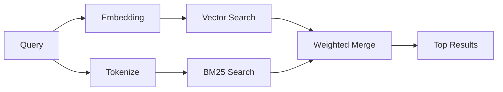

---
read_when:
    - Ви хочете зрозуміти, як працює memory_search
    - Ви хочете вибрати постачальника ембедингів
    - Ви хочете налаштувати якість пошуку
summary: Як пошук у пам’яті знаходить релевантні нотатки за допомогою ембедингів і гібридного пошуку
title: Пошук у пам’яті
x-i18n:
    generated_at: "2026-04-30T14:26:59Z"
    model: gpt-5.5
    provider: openai
    source_hash: 7f40bbe32453a28070ffc67f19a4c06e2fe59a24237a2aef353f4b9b8260bcf2
    source_path: concepts/memory-search.md
    workflow: 16
---

`memory_search` знаходить релевантні нотатки з ваших файлів пам’яті, навіть коли
формулювання відрізняється від оригінального тексту. Він працює, індексуючи пам’ять у невеликі
фрагменти й шукаючи їх за допомогою embedding-векторів, ключових слів або обох способів.

## Швидкий старт

Якщо у вас налаштовано підписку GitHub Copilot, API-ключ OpenAI, Gemini, Voyage або Mistral,
пошук у пам’яті працює автоматично. Щоб явно задати провайдера:

```json5
{
  agents: {
    defaults: {
      memorySearch: {
        provider: "openai", // or "gemini", "local", "ollama", etc.
      },
    },
  },
}
```

Для конфігурацій із кількома endpoint `provider` також може бути власним
записом `models.providers.<id>`, наприклад `ollama-5080`, якщо цей провайдер задає
`api: "ollama"` або іншого власника embedding-адаптера.

Для локальних embedding-векторів без API-ключа задайте `provider: "local"`. Пакетні
встановлення зберігають нативний runtime `node-llama-cpp` у керованому OpenClaw дереві runtime-deps Plugin;
запустіть `openclaw doctor --fix`, якщо це дерево потребує відновлення.

Деякі OpenAI-сумісні embedding endpoint потребують асиметричних міток, як-от
`input_type: "query"` для пошуків і `input_type: "document"` або `"passage"`
для індексованих фрагментів. Налаштуйте їх через `memorySearch.queryInputType` і
`memorySearch.documentInputType`; див. [довідник із конфігурації пам’яті](/uk/reference/memory-config#provider-specific-config).

## Підтримувані провайдери

| Провайдер      | ID               | Потребує API-ключа | Примітки                                             |
| -------------- | ---------------- | ------------------ | ---------------------------------------------------- |
| Bedrock        | `bedrock`        | Ні                 | Автоматично виявляється, коли спрацьовує ланцюжок облікових даних AWS |
| Gemini         | `gemini`         | Так                | Підтримує індексацію зображень і аудіо               |
| GitHub Copilot | `github-copilot` | Ні                 | Автоматично виявляється, використовує підписку Copilot |
| Локальний      | `local`          | Ні                 | Модель GGUF, завантаження приблизно 0,6 ГБ           |
| Mistral        | `mistral`        | Так                | Автоматично виявляється                              |
| Ollama         | `ollama`         | Ні                 | Локальний, потрібно задати явно                      |
| OpenAI         | `openai`         | Так                | Автоматично виявляється, швидкий                     |
| Voyage         | `voyage`         | Так                | Автоматично виявляється                              |

## Як працює пошук

OpenClaw запускає два шляхи отримання результатів паралельно та об’єднує результати:



- **Векторний пошук** знаходить нотатки зі схожим значенням ("gateway host" відповідає
  "the machine running OpenClaw").
- **Пошук за ключовими словами BM25** знаходить точні збіги (ID, рядки помилок, ключі
  конфігурації).

Якщо доступний лише один шлях (немає embedding-векторів або немає FTS), інший працює самостійно.

Коли embedding-вектори недоступні, OpenClaw все одно використовує лексичне ранжування результатів FTS замість повернення лише до необробленого впорядкування за точними збігами. Цей деградований режим підсилює фрагменти з кращим покриттям термінів запиту та релевантними шляхами файлів, що зберігає корисну повноту навіть без `sqlite-vec` або embedding-провайдера.

## Покращення якості пошуку

Дві необов’язкові функції допомагають, коли у вас велика історія нотаток:

### Часове згасання

Старі нотатки поступово втрачають вагу ранжування, щоб свіжа інформація з’являлася першою.
За стандартного періоду напіврозпаду 30 днів нотатка з минулого місяця отримує 50%
своєї початкової ваги. Вічнозелені файли, як-от `MEMORY.md`, ніколи не згасають.

<Tip>
Увімкніть часове згасання, якщо ваш агент має місяці щоденних нотаток і застаріла
інформація постійно випереджає свіжий контекст.
</Tip>

### MMR (різноманітність)

Зменшує дублювання результатів. Якщо п’ять нотаток згадують ту саму конфігурацію маршрутизатора, MMR
гарантує, що найкращі результати охоплюють різні теми, а не повторюються.

<Tip>
Увімкніть MMR, якщо `memory_search` постійно повертає майже дублікати фрагментів із
різних щоденних нотаток.
</Tip>

### Увімкнути обидві функції

```json5
{
  agents: {
    defaults: {
      memorySearch: {
        query: {
          hybrid: {
            mmr: { enabled: true },
            temporalDecay: { enabled: true },
          },
        },
      },
    },
  },
}
```

## Мультимодальна пам’ять

З Gemini Embedding 2 ви можете індексувати зображення й аудіофайли поряд із
Markdown. Пошукові запити залишаються текстовими, але вони зіставляються з візуальним і аудіо
вмістом. Налаштування див. у [довіднику з конфігурації пам’яті](/uk/reference/memory-config).

## Пошук у пам’яті сесій

Ви можете додатково індексувати стенограми сесій, щоб `memory_search` міг пригадувати
попередні розмови. Це вмикається явно через
`memorySearch.experimental.sessionMemory`. Подробиці див. у
[довіднику з конфігурації](/uk/reference/memory-config).

## Усунення несправностей

**Немає результатів?** Запустіть `openclaw memory status`, щоб перевірити індекс. Якщо він порожній, запустіть
`openclaw memory index --force`.

**Лише збіги за ключовими словами?** Ваш embedding-провайдер може бути не налаштований. Перевірте
`openclaw memory status --deep`.

**Локальні embedding-вектори перевищують час очікування?** `ollama`, `lmstudio` і `local` за замовчуванням використовують довший
час очікування вбудованого пакета. Якщо хост просто повільний, задайте
`agents.defaults.memorySearch.sync.embeddingBatchTimeoutSeconds` і повторно запустіть
`openclaw memory index --force`.

**Текст CJK не знайдено?** Перебудуйте індекс FTS за допомогою
`openclaw memory index --force`.

## Додаткові матеріали

- [Active Memory](/uk/concepts/active-memory) -- пам’ять субагента для інтерактивних чат-сесій
- [Пам’ять](/uk/concepts/memory) -- структура файлів, backend, інструменти
- [Довідник із конфігурації пам’яті](/uk/reference/memory-config) -- усі параметри конфігурації

## Пов’язане

- [Огляд пам’яті](/uk/concepts/memory)
- [Active Memory](/uk/concepts/active-memory)
- [Вбудований рушій пам’яті](/uk/concepts/memory-builtin)
