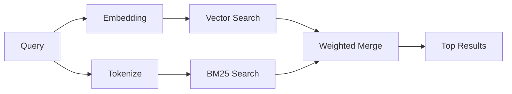

---
read_when:
    - Ви хочете зрозуміти, як працює memory_search
    - Ви хочете вибрати постачальника ембедингів
    - Ви хочете налаштувати якість пошуку
summary: Як пошук у пам’яті знаходить релевантні нотатки за допомогою ембедингів і гібридного пошуку
title: Пошук у пам’яті
x-i18n:
    generated_at: "2026-06-27T17:26:21Z"
    model: gpt-5.5
    postprocess_version: locale-links-v1
    provider: openai
    source_hash: b0bcb8cf400100ba8b6ddbb46bdf8b2a89a8bc32a550ee6df47c874e7e9e0879
    source_path: concepts/memory-search.md
    workflow: 16
---

`memory_search` знаходить релевантні нотатки у ваших файлах пам’яті, навіть коли
формулювання відрізняється від оригінального тексту. Він працює, індексуючи пам’ять на невеликі
фрагменти й шукаючи в них за допомогою ембедингів, ключових слів або обох підходів.

## Швидкий старт

Пошук у пам’яті за замовчуванням використовує ембединги OpenAI. Щоб використати інший бекенд
ембедингів, явно задайте провайдера:

```json5
{
  agents: {
    defaults: {
      memorySearch: {
        provider: "openai", // or "gemini", "local", "ollama", "openai-compatible", etc.
      },
    },
  },
}
```

Для конфігурацій із кількома ендпойнтами та провайдерами, специфічними для пам’яті, `provider` також може
бути власним записом `models.providers.<id>`, наприклад `ollama-5080`, коли цей
провайдер задає `api: "ollama"` або іншого власника адаптера ембедингів пам’яті.

Для локальних ембедингів без API-ключа встановіть
`@openclaw/llama-cpp-provider` і задайте `provider: "local"`. Вихідні checkout-и
можуть усе ще вимагати схвалення нативного складання: `pnpm approve-builds`, потім
`pnpm rebuild node-llama-cpp`.

Деякі OpenAI-сумісні ендпойнти ембедингів потребують асиметричних міток, як-от
`input_type: "query"` для пошуків і `input_type: "document"` або `"passage"`
для індексованих фрагментів. Налаштуйте їх через `memorySearch.queryInputType` і
`memorySearch.documentInputType`; див. [довідник із конфігурації пам’яті](/uk/reference/memory-config#provider-specific-config).

## Підтримувані провайдери

| Провайдер         | ID                  | Потрібен API-ключ | Примітки                         |
| ----------------- | ------------------- | ----------------- | -------------------------------- |
| Bedrock           | `bedrock`           | Ні                | Використовує ланцюжок облікових даних AWS |
| DeepInfra         | `deepinfra`         | Так               | За замовчуванням: `BAAI/bge-m3`  |
| Gemini            | `gemini`            | Так               | Підтримує індексацію зображень/аудіо |
| GitHub Copilot    | `github-copilot`    | Ні                | Використовує підписку Copilot    |
| Локальний         | `local`             | Ні                | Модель GGUF, завантаження ~0,6 ГБ |
| Mistral           | `mistral`           | Так               |                                  |
| Ollama            | `ollama`            | Ні                | Локальний/самостійно розгорнутий |
| OpenAI            | `openai`            | Так               | За замовчуванням                 |
| OpenAI-сумісний   | `openai-compatible` | Зазвичай          | Універсальний `/v1/embeddings`   |
| Voyage            | `voyage`            | Так               |                                  |

## Як працює пошук

OpenClaw запускає два шляхи отримання даних паралельно й об’єднує результати:



- **Векторний пошук** знаходить нотатки зі схожим змістом ("gateway host" відповідає
  "the machine running OpenClaw").
- **Пошук за ключовими словами BM25** знаходить точні збіги (ID, рядки помилок, ключі
  конфігурації).

Якщо доступний лише один шлях, інший працює самостійно. Навмисний режим лише FTS
(`provider: "none"`) і автоматичний/типовий вибір провайдера все ще можуть використовувати
лексичне ранжування, коли ембединги недоступні.

Явні нелокальні провайдери ембедингів відрізняються. Якщо ви задаєте
`memorySearch.provider` як конкретного провайдера з віддаленим бекендом і цей провайдер
недоступний під час виконання, `memory_search` повідомляє, що пам’ять недоступна, замість
того щоб непомітно використовувати лише FTS-результати. Це робить несправного налаштованого семантичного
провайдера видимим. Задайте `provider: "none"` для навмисного пригадування лише через FTS або виправте
конфігурацію провайдера/автентифікації, щоб відновити семантичне ранжування.

## Покращення якості пошуку

Дві необов’язкові функції допомагають, коли у вас велика історія нотаток:

### Часове згасання

Старі нотатки поступово втрачають вагу ранжування, щоб нова інформація з’являлася першою.
За типового періоду напіврозпаду 30 днів нотатка з минулого місяця отримує 50% від
своєї початкової ваги. Вічнозелені файли на кшталт `MEMORY.md` ніколи не згасають.

<Tip>
Увімкніть часове згасання, якщо ваш агент має місяці щоденних нотаток, а застаріла
інформація постійно ранжується вище за свіжий контекст.
</Tip>

### MMR (різноманітність)

Зменшує надлишковість результатів. Якщо п’ять нотаток згадують ту саму конфігурацію роутера, MMR
гарантує, що верхні результати охоплюють різні теми, а не повторюються.

<Tip>
Увімкніть MMR, якщо `memory_search` постійно повертає майже дублікати фрагментів із
різних щоденних нотаток.
</Tip>

### Увімкнути обидві функції

```json5
{
  agents: {
    defaults: {
      memorySearch: {
        query: {
          hybrid: {
            mmr: { enabled: true },
            temporalDecay: { enabled: true },
          },
        },
      },
    },
  },
}
```

## Мультимодальна пам’ять

З Gemini Embedding 2 ви можете індексувати зображення й аудіофайли разом із
Markdown. Пошукові запити залишаються текстовими, але вони зіставляються з візуальним та аудіо
вмістом. Див. [довідник із конфігурації пам’яті](/uk/reference/memory-config) для
налаштування.

## Пошук у пам’яті сеансу

За бажанням ви можете індексувати стенограми сеансів, щоб `memory_search` міг пригадувати
попередні розмови. Це вмикається окремо через
`memorySearch.experimental.sessionMemory`. Див.
[довідник із конфігурації](/uk/reference/memory-config) для подробиць.

## Усунення несправностей

**Немає результатів?** Запустіть `openclaw memory status`, щоб перевірити індекс. Якщо він порожній, запустіть
`openclaw memory index --force`.

**Лише збіги за ключовими словами?** Можливо, ваш провайдер ембедингів не налаштований. Перевірте
`openclaw memory status --deep`.

**Локальні ембединги перевищують час очікування?** `ollama`, `lmstudio` і `local` за замовчуванням використовують довший
час очікування вбудованої пакетної обробки. Якщо хост просто повільний, задайте
`agents.defaults.memorySearch.sync.embeddingBatchTimeoutSeconds` і повторно запустіть
`openclaw memory index --force`.

**Текст CJK не знайдено?** Перебудуйте індекс FTS за допомогою
`openclaw memory index --force`.

## Додаткові матеріали

- [Active Memory](/uk/concepts/active-memory) -- пам’ять субагента для інтерактивних чат-сеансів
- [Пам’ять](/uk/concepts/memory) -- структура файлів, бекенди, інструменти
- [Довідник із конфігурації пам’яті](/uk/reference/memory-config) -- усі параметри конфігурації

## Пов’язане

- [Огляд пам’яті](/uk/concepts/memory)
- [Active Memory](/uk/concepts/active-memory)
- [Вбудований рушій пам’яті](/uk/concepts/memory-builtin)
