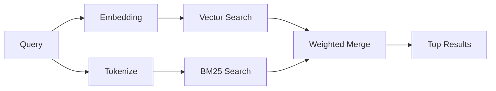

---
read_when:
    - Ви хочете зрозуміти, як працює memory_search
    - Ви хочете вибрати постачальника ембедингів
    - Ви хочете налаштувати якість пошуку
summary: Як пошук у пам’яті знаходить релевантні нотатки за допомогою ембедингів і гібридного пошуку
title: Пошук у пам’яті
x-i18n:
    generated_at: "2026-04-28T02:18:08Z"
    model: gpt-5.4
    provider: openai
    source_hash: 3e6c44d90f49a797bda01b9a575928c128a334f89ae14fc3620e65562a866aa9
    source_path: concepts/memory-search.md
    workflow: 15
---

`memory_search` знаходить релевантні нотатки з ваших файлів пам’яті, навіть коли
формулювання відрізняється від оригінального тексту. Це працює шляхом індексації пам’яті на малі
фрагменти та їх пошуку за допомогою ембедингів, ключових слів або обох підходів.

## Швидкий початок

Якщо у вас налаштовано підписку GitHub Copilot, ключ API OpenAI, Gemini, Voyage або Mistral,
пошук у пам’яті працює автоматично. Щоб явно вказати постачальника:

```json5
{
  agents: {
    defaults: {
      memorySearch: {
        provider: "openai", // or "gemini", "local", "ollama", etc.
      },
    },
  },
}
```

Для конфігурацій із кількома кінцевими точками `provider` також може бути власним записом
`models.providers.<id>`, наприклад `ollama-5080`, якщо цей постачальник задає
`api: "ollama"` або іншого власника адаптера ембедингів.

Для локальних ембедингів без ключа API встановіть додатковий пакет середовища виконання `node-llama-cpp`
поруч з OpenClaw і використовуйте `provider: "local"`.

Деякі сумісні з OpenAI кінцеві точки ембедингів вимагають асиметричних міток, таких як
`input_type: "query"` для пошуку та `input_type: "document"` або `"passage"`
для проіндексованих фрагментів. Налаштуйте це через `memorySearch.queryInputType` і
`memorySearch.documentInputType`; див. [довідник з конфігурації пам’яті](/uk/reference/memory-config#provider-specific-config).

## Підтримувані постачальники

| Постачальник   | ID               | Потрібен ключ API | Примітки                                              |
| -------------- | ---------------- | ----------------- | ----------------------------------------------------- |
| Bedrock        | `bedrock`        | Ні                | Автоматично виявляється, коли ланцюжок облікових даних AWS доступний |
| Gemini         | `gemini`         | Так               | Підтримує індексацію зображень/аудіо                  |
| GitHub Copilot | `github-copilot` | Ні                | Автоматично виявляється, використовує підписку Copilot |
| Local          | `local`          | Ні                | Модель GGUF, завантаження ~0.6 ГБ                     |
| Mistral        | `mistral`        | Так               | Автоматично виявляється                               |
| Ollama         | `ollama`         | Ні                | Локальний, потрібно вказати явно                      |
| OpenAI         | `openai`         | Так               | Автоматично виявляється, швидкий                      |
| Voyage         | `voyage`         | Так               | Автоматично виявляється                               |

## Як працює пошук

OpenClaw паралельно запускає два шляхи отримання даних і об’єднує результати:



- **Векторний пошук** знаходить нотатки зі схожим змістом ("gateway host" відповідає
  "машині, на якій працює OpenClaw").
- **Пошук за ключовими словами BM25** знаходить точні збіги (ID, рядки помилок, ключі
  конфігурації).

Якщо доступний лише один шлях (немає ембедингів або немає FTS), інший не використовується, і працює лише доступний шлях.

Коли ембединги недоступні, OpenClaw усе одно використовує лексичне ранжування для результатів FTS, а не повертається лише до сирого впорядкування за точним збігом. У цьому деградованому режимі підвищується вага фрагментів із кращим покриттям термінів запиту та релевантними шляхами файлів, що зберігає корисну повноту навіть без `sqlite-vec` або постачальника ембедингів.

## Покращення якості пошуку

Дві додаткові функції допомагають, коли у вас велика історія нотаток:

### Часове згасання

Старі нотатки поступово втрачають вагу в ранжуванні, щоб новіша інформація з’являлася першою.
За типовим періодом напіврозпаду в 30 днів нотатка з минулого місяця отримує 50% від
своєї початкової ваги. Для постійно актуальних файлів, як-от `MEMORY.md`, згасання ніколи не застосовується.

<Tip>
Увімкніть часове згасання, якщо ваш агент має щоденні нотатки за багато місяців і застаріла
інформація постійно випереджає свіжий контекст.
</Tip>

### MMR (різноманітність)

Зменшує надлишковість результатів. Якщо п’ять нотаток згадують ту саму конфігурацію маршрутизатора, MMR
гарантує, що верхні результати охоплюють різні теми, а не повторюються.

<Tip>
Увімкніть MMR, якщо `memory_search` постійно повертає майже дубльовані фрагменти з
різних щоденних нотаток.
</Tip>

### Увімкнути обидві функції

```json5
{
  agents: {
    defaults: {
      memorySearch: {
        query: {
          hybrid: {
            mmr: { enabled: true },
            temporalDecay: { enabled: true },
          },
        },
      },
    },
  },
}
```

## Мультимодальна пам’ять

З Gemini Embedding 2 ви можете індексувати зображення та аудіофайли разом із
Markdown. Пошукові запити залишаються текстовими, але вони зіставляються з візуальним і аудіовмістом. Див. [довідник з конфігурації пам’яті](/uk/reference/memory-config) для
налаштування.

## Пошук у пам’яті сесій

Ви можете додатково індексувати транскрипти сесій, щоб `memory_search` міг пригадувати
попередні розмови. Це вмикається явно через
`memorySearch.experimental.sessionMemory`. Докладніше див. у
[довіднику з конфігурації](/uk/reference/memory-config).

## Усунення несправностей

**Немає результатів?** Виконайте `openclaw memory status`, щоб перевірити індекс. Якщо він порожній, виконайте
`openclaw memory index --force`.

**Лише збіги за ключовими словами?** Можливо, ваш постачальник ембедингів не налаштований. Перевірте
`openclaw memory status --deep`.

**Локальні ембединги завершуються за тайм-аутом?** `ollama`, `lmstudio` і `local` за замовчуванням використовують
довший тайм-аут для вбудованої пакетної обробки. Якщо хост просто працює повільно, задайте
`agents.defaults.memorySearch.sync.embeddingBatchTimeoutSeconds` і знову виконайте
`openclaw memory index --force`.

**Текст CJK не знаходиться?** Перебудуйте індекс FTS за допомогою
`openclaw memory index --force`.

## Додаткові матеріали

- [Active Memory](/uk/concepts/active-memory) -- пам’ять субагента для інтерактивних сеансів чату
- [Пам’ять](/uk/concepts/memory) -- структура файлів, бекенди, інструменти
- [Довідник з конфігурації пам’яті](/uk/reference/memory-config) -- усі параметри конфігурації

## Пов’язане

- [Огляд пам’яті](/uk/concepts/memory)
- [Active memory](/uk/concepts/active-memory)
- [Вбудований рушій пам’яті](/uk/concepts/memory-builtin)
