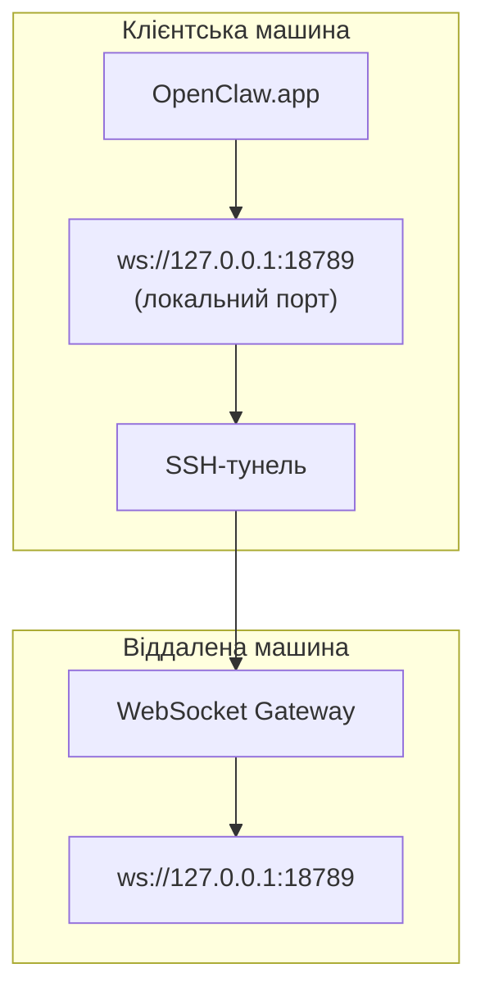

> Цей вміст було об’єднано в [Віддалений доступ](/uk/gateway/remote#macos-persistent-ssh-tunnel-via-launchagent). Актуальні інструкції дивіться на цій сторінці.

# Запуск OpenClaw.app із віддаленим Gateway

OpenClaw.app використовує SSH-тунелювання для підключення до віддаленого Gateway. У цьому посібнику показано, як це налаштувати.

## Огляд



## Швидке налаштування

### Крок 1: Додайте конфігурацію SSH

Відредагуйте `~/.ssh/config` і додайте:

```ssh
Host remote-gateway
    HostName <REMOTE_IP>          # наприклад, 172.27.187.184
    User <REMOTE_USER>            # наприклад, jefferson
    LocalForward 18789 127.0.0.1:18789
    IdentityFile ~/.ssh/id_rsa
```

Замініть `<REMOTE_IP>` і `<REMOTE_USER>` на ваші значення.

### Крок 2: Скопіюйте SSH-ключ

Скопіюйте ваш відкритий ключ на віддалену машину (введіть пароль один раз):

```bash
ssh-copy-id -i ~/.ssh/id_rsa <REMOTE_USER>@<REMOTE_IP>
```

### Крок 3: Налаштуйте автентифікацію віддаленого Gateway

```bash
openclaw config set gateway.remote.token "<your-token>"
```

Використовуйте `gateway.remote.password` замість цього, якщо ваш віддалений Gateway використовує автентифікацію за паролем.
`OPENCLAW_GATEWAY_TOKEN` усе ще дійсний як перевизначення на рівні оболонки, але
стале налаштування віддаленого клієнта — це `gateway.remote.token` / `gateway.remote.password`.

### Крок 4: Запустіть SSH-тунель

```bash
ssh -N remote-gateway &
```

### Крок 5: Перезапустіть OpenClaw.app

```bash
# Закрийте OpenClaw.app (⌘Q), потім відкрийте знову:
open /path/to/OpenClaw.app
```

Тепер застосунок підключатиметься до віддаленого Gateway через SSH-тунель.

---

## Автозапуск тунелю під час входу в систему

Щоб SSH-тунель запускався автоматично, коли ви входите в систему, створіть агент Launch Agent.

### Створіть файл PLIST

Збережіть це як `~/Library/LaunchAgents/ai.openclaw.ssh-tunnel.plist`:

```xml
<?xml version="1.0" encoding="UTF-8"?>
<!DOCTYPE plist PUBLIC "-//Apple//DTD PLIST 1.0//EN" "http://www.apple.com/DTDs/PropertyList-1.0.dtd">
<plist version="1.0">
<dict>
    <key>Label</key>
    <string>ai.openclaw.ssh-tunnel</string>
    <key>ProgramArguments</key>
    <array>
        <string>/usr/bin/ssh</string>
        <string>-N</string>
        <string>remote-gateway</string>
    </array>
    <key>KeepAlive</key>
    <true/>
    <key>RunAtLoad</key>
    <true/>
</dict>
</plist>
```

### Завантажте агент Launch Agent

```bash
launchctl bootstrap gui/$UID ~/Library/LaunchAgents/ai.openclaw.ssh-tunnel.plist
```

Тепер тунель буде:

- Запускатися автоматично, коли ви входите в систему
- Перезапускатися, якщо аварійно завершиться
- Працювати у фоновому режимі

Примітка щодо застарілих налаштувань: видаліть будь-який залишковий LaunchAgent `com.openclaw.ssh-tunnel`, якщо він є.

---

## Усунення несправностей

**Перевірте, чи працює тунель:**

```bash
ps aux | grep "ssh -N remote-gateway" | grep -v grep
lsof -i :18789
```

**Перезапустіть тунель:**

```bash
launchctl kickstart -k gui/$UID/ai.openclaw.ssh-tunnel
```

**Зупиніть тунель:**

```bash
launchctl bootout gui/$UID/ai.openclaw.ssh-tunnel
```

---

## Як це працює

| Компонент                            | Що він робить                                                 |
| ------------------------------------ | ------------------------------------------------------------- |
| `LocalForward 18789 127.0.0.1:18789` | Перенаправляє локальний порт 18789 на віддалений порт 18789   |
| `ssh -N`                             | SSH без виконання віддалених команд (лише перенаправлення портів) |
| `KeepAlive`                          | Автоматично перезапускає тунель, якщо він аварійно завершується |
| `RunAtLoad`                          | Запускає тунель, коли агент завантажується                    |

OpenClaw.app підключається до `ws://127.0.0.1:18789` на вашій клієнтській машині. SSH-тунель перенаправляє це з’єднання на порт 18789 віддаленої машини, де запущено Gateway.

## Пов’язане

- [Віддалений доступ](/uk/gateway/remote)
- [Tailscale](/uk/gateway/tailscale)
