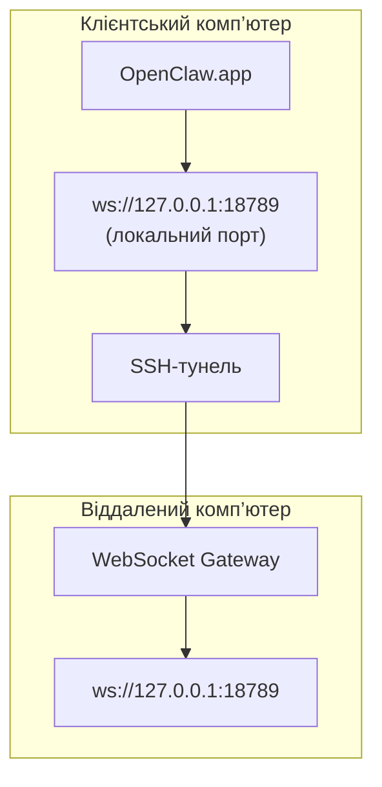

<Note>
Цей матеріал тепер розміщено в розділі [Віддалений доступ](/uk/gateway/remote#macos-persistent-ssh-tunnel-via-launchagent). Актуальний посібник дивіться на тій сторінці; ця сторінка залишається ціллю переспрямування.
</Note>

# Запуск OpenClaw.app із віддаленим Gateway

OpenClaw.app підключається до віддаленого Gateway через SSH-тунель: SSH-параметр `LocalForward` зіставляє локальний порт із портом WebSocket Gateway на віддаленому хості.

## Налаштування

1. Додайте запис до конфігурації SSH із `LocalForward 18789 127.0.0.1:18789` (повний блок конфігурації дивіться в розділі [Віддалений доступ](/uk/gateway/remote#macos-persistent-ssh-tunnel-via-launchagent)).
2. Скопіюйте свій SSH-ключ на віддалений хост за допомогою `ssh-copy-id`.
3. Установіть `gateway.remote.token` (або `gateway.remote.password`) за допомогою `openclaw config set gateway.remote.token "<your-token>"`.
4. Запустіть тунель: `ssh -N remote-gateway &`.
5. Закрийте й знову відкрийте OpenClaw.app.

Щоб тунель зберігався після перезавантажень і автоматично відновлював підключення, замість ручного запуску `ssh -N` скористайтеся налаштуванням LaunchAgent зі сторінки [Віддалений доступ](/uk/gateway/remote#macos-persistent-ssh-tunnel-via-launchagent).

## Як це працює

| Компонент                            | Призначення                                                                  |
| ------------------------------------ | ----------------------------------------------------------------------------- |
| `LocalForward 18789 127.0.0.1:18789` | Переспрямовує локальний порт 18789 на віддалений порт 18789                   |
| `ssh -N`                             | Запускає SSH без виконання віддалених команд (лише переспрямування портів)    |
| `KeepAlive`                          | Автоматично перезапускає тунель у разі аварійного завершення (LaunchAgent)    |
| `RunAtLoad`                          | Запускає тунель під час завантаження LaunchAgent (LaunchAgent)                |

OpenClaw.app підключається до `ws://127.0.0.1:18789` на клієнті. Тунель переспрямовує це з’єднання на порт 18789 віддаленого хоста, на якому працює Gateway.

## Пов’язані матеріали

- [Віддалений доступ](/uk/gateway/remote)
- [Tailscale](/uk/gateway/tailscale)
