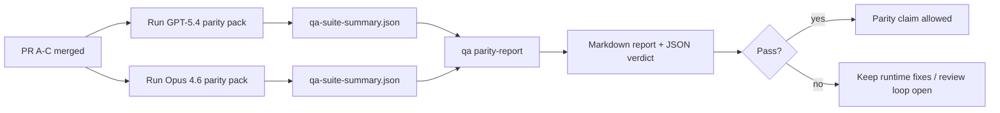

---
read_when:
    - Перегляд серії PR для паритету GPT-5.4 / Codex
    - Підтримка шести-контрактної агентної архітектури, що лежить в основі програми паритету
summary: Як переглянути програму паритету GPT-5.4 / Codex як чотири одиниці злиття
title: Примітки для мейнтейнерів щодо паритету GPT-5.4 / Codex
x-i18n:
    generated_at: "2026-04-21T21:37:37Z"
    model: gpt-5.4
    provider: openai
    source_hash: b872d6a33b269c01b44537bfa8646329063298fdfcd3671a17d0eadbc9da5427
    source_path: help/gpt54-codex-agentic-parity-maintainers.md
    workflow: 15
---

# Примітки для мейнтейнерів щодо паритету GPT-5.4 / Codex

У цій примітці пояснюється, як переглядати програму паритету GPT-5.4 / Codex як чотири одиниці злиття, не втрачаючи початкову архітектуру з шістьма контрактами.

## Одиниці злиття

### PR A: суворо агентне виконання

Охоплює:

- `executionContract`
- GPT-5-first доведення в межах того самого ходу
- `update_plan` як невихідне відстеження прогресу
- явні заблоковані стани замість тихих зупинок лише на плані

Не охоплює:

- класифікацію збоїв auth/runtime
- правдивість дозволів
- переробку replay/continuation
- бенчмаркінг паритету

### PR B: правдивість runtime

Охоплює:

- коректність області дії Codex OAuth
- типізовану класифікацію збоїв provider/runtime
- правдиву доступність `/elevated full` і причини блокування

Не охоплює:

- нормалізацію схеми інструментів
- стан replay/liveness
- керування бенчмарками

### PR C: коректність виконання

Охоплює:

- сумісність інструментів OpenAI/Codex, якою володіє provider
- обробку суворої схеми без параметрів
- відображення replay-invalid
- видимість станів paused, blocked і abandoned для довгих завдань

Не охоплює:

- continuation, самостійно обрану системою
- загальну поведінку діалекту Codex поза хуками provider
- керування бенчмарками

### PR D: каркас паритету

Охоплює:

- першу хвилю набору сценаріїв GPT-5.4 vs Opus 4.6
- документацію паритету
- механіку звіту про паритет і gate для релізу

Не охоплює:

- зміни поведінки runtime поза QA-lab
- симуляцію auth/proxy/DNS усередині каркаса

## Відображення назад на початкові шість контрактів

| Початковий контракт                     | Одиниця злиття |
| --------------------------------------- | -------------- |
| Коректність transport/auth provider     | PR B           |
| Сумісність контракту/схеми інструментів | PR C           |
| Виконання в межах того самого ходу      | PR A           |
| Правдивість дозволів                    | PR B           |
| Коректність replay/continuation/liveness | PR C          |
| Бенчмарк/gate релізу                    | PR D           |

## Порядок перегляду

1. PR A
2. PR B
3. PR C
4. PR D

PR D — це рівень доказів. Він не повинен бути причиною затримки PR-ів із коректністю runtime.

## На що звертати увагу

### PR A

- запуски GPT-5 або виконують дію, або завершуються в закритий спосіб, замість зупинки на коментарі
- `update_plan` більше не виглядає як прогрес сам по собі
- поведінка лишається GPT-5-first і обмеженою сферою embedded-Pi

### PR B

- збої auth/proxy/runtime більше не згортаються до загальної обробки “model failed”
- `/elevated full` описується як доступний лише тоді, коли він справді доступний
- причини блокування видимі і для моделі, і для user-facing runtime

### PR C

- сувора реєстрація інструментів OpenAI/Codex поводиться передбачувано
- інструменти без параметрів не провалюють перевірки суворої схеми
- результати replay і Compaction зберігають правдивий стан liveness

### PR D

- набір сценаріїв зрозумілий і відтворюваний
- набір містить смугу mutating replay-safety, а не лише read-only потоки
- звіти читабельні для людей і автоматизації
- твердження про паритет підкріплені доказами, а не анекдотичні

Очікувані артефакти від PR D:

- `qa-suite-report.md` / `qa-suite-summary.json` для кожного запуску моделі
- `qa-agentic-parity-report.md` з агрегованим порівнянням і порівнянням на рівні сценаріїв
- `qa-agentic-parity-summary.json` із машиночитаним вердиктом

## Gate релізу

Не стверджуйте паритет або перевагу GPT-5.4 над Opus 4.6, доки:

- PR A, PR B і PR C не злиті
- PR D не запускає чисто набір паритету першої хвилі
- набори регресійних тестів правдивості runtime залишаються зеленими
- звіт про паритет не показує випадків fake-success і регресій у поведінці зупинки

Каркас паритету — не єдине джерело доказів. Під час перегляду явно зберігайте цей поділ:

- PR D відповідає за порівняння GPT-5.4 vs Opus 4.6 на основі сценаріїв
- детерміновані набори PR B як і раніше відповідають за докази щодо auth/proxy/DNS і правдивості повного доступу

## Відображення цілей на докази

| Пункт gate завершення                    | Основний власник | Артефакт перегляду                                                  |
| ---------------------------------------- | ---------------- | ------------------------------------------------------------------- |
| Немає зависань лише на плані             | PR A             | тести runtime strict-agentic і `approval-turn-tool-followthrough`   |
| Немає фальшивого прогресу чи фальшивого завершення інструменту | PR A + PR D | кількість fake-success у паритеті плюс деталі звіту на рівні сценаріїв |
| Немає хибних підказок `/elevated full`   | PR B             | детерміновані набори правдивості runtime                            |
| Збої replay/liveness залишаються явними  | PR C + PR D      | набори lifecycle/replay плюс `compaction-retry-mutating-tool`       |
| GPT-5.4 відповідає Opus 4.6 або перевершує його | PR D      | `qa-agentic-parity-report.md` і `qa-agentic-parity-summary.json`    |

## Коротка пам’ятка для рев’юера: до vs після

| Видима для користувача проблема до                          | Сигнал під час перегляду після                                                        |
| ----------------------------------------------------------- | ------------------------------------------------------------------------------------- |
| GPT-5.4 зупинявся після планування                          | PR A показує поведінку act-or-block замість завершення лише на коментарі              |
| Використання інструментів здавалося крихким із суворими схемами OpenAI/Codex | PR C зберігає передбачуваність реєстрації інструментів і виклику без параметрів |
| Підказки `/elevated full` інколи вводили в оману            | PR B прив’язує підказки до фактичної можливості runtime і причин блокування           |
| Довгі завдання могли зникати в неоднозначності replay/Compaction | PR C видає явний стан paused, blocked, abandoned і replay-invalid                |
| Твердження про паритет були анекдотичними                   | PR D формує звіт плюс JSON-вердикт з однаковим покриттям сценаріїв на обох моделях |
