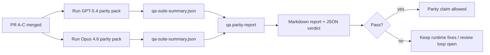

---
read_when:
    - Перегляд серії PR для паритету GPT-5.4 / Codex
    - Підтримка шести-контрактної агентної архітектури, що лежить в основі програми паритету
summary: Як переглянути програму паритету GPT-5.4 / Codex як чотири одиниці злиття
title: Нотатки супровідника щодо паритету GPT-5.4 / Codex
x-i18n:
    generated_at: "2026-04-23T20:55:34Z"
    model: gpt-5.4
    provider: openai
    source_hash: be9b5d6d0d4700355c476f04405c470ab3d44511cdae00c45b97a10a68491be7
    source_path: help/gpt54-codex-agentic-parity-maintainers.md
    workflow: 15
---

Ця примітка пояснює, як переглядати програму паритету GPT-5.4 / Codex як чотири одиниці злиття, не втрачаючи початкову шести-контрактну архітектуру.

## Одиниці злиття

### PR A: суворе агентне виконання

Відповідає за:

- `executionContract`
- виконання в тому самому ході з пріоритетом GPT-5
- `update_plan` як нетермінальне відстеження прогресу
- явні стани блокування замість тихих зупинок лише на рівні plan

Не відповідає за:

- класифікацію помилок auth/runtime
- правдивість щодо дозволів
- переробку replay/continuation
- бенчмаркінг паритету

### PR B: правдивість runtime

Відповідає за:

- коректність OAuth scope у Codex
- типізовану класифікацію збоїв provider/runtime
- правдиве відображення доступності `/elevated full` і причин блокування

Не відповідає за:

- нормалізацію схем інструментів
- стан replay/liveness
- benchmark gating

### PR C: коректність виконання

Відповідає за:

- сумісність інструментів OpenAI/Codex, якою володіє provider
- суворе опрацювання схем без параметрів
- відображення replay-invalid
- видимість станів paused, blocked і abandoned для довгих завдань

Не відповідає за:

- continuation, самостійно обрану агентом
- загальну поведінку діалекту Codex поза hooks provider
- benchmark gating

### PR D: parity harness

Відповідає за:

- першу хвилю пакета сценаріїв GPT-5.4 vs Opus 4.6
- документацію з паритету
- механіку звіту про паритет і release-gate

Не відповідає за:

- зміни поведінки runtime поза QA-lab
- симуляцію auth/proxy/DNS всередині harness

## Відображення назад до початкових шести контрактів

| Початковий контракт                      | Одиниця злиття |
| ---------------------------------------- | -------------- |
| Коректність транспорту/автентифікації provider | PR B      |
| Сумісність контракту/схеми інструментів  | PR C           |
| Виконання в тому самому ході             | PR A           |
| Правдивість щодо дозволів                | PR B           |
| Коректність replay/continuation/liveness | PR C           |
| Benchmark/release gate                   | PR D           |

## Порядок перегляду

1. PR A
2. PR B
3. PR C
4. PR D

PR D — це рівень доказів. Він не має бути причиною затримки PR з коректністю runtime.

## На що звертати увагу

### PR A

- запуски GPT-5 виконують дію або завершуються в fail-closed режимі, а не зупиняються на коментарях
- `update_plan` більше не виглядає як прогрес сам по собі
- поведінка залишається з пріоритетом GPT-5 і обмеженою embedded-Pi

### PR B

- збої auth/proxy/runtime перестають зливатися в загальну обробку «model failed»
- `/elevated full` описується як доступний лише тоді, коли він справді доступний
- причини блокування видимі як для моделі, так і для runtime, орієнтованого на користувача

### PR C

- сувора реєстрація інструментів OpenAI/Codex поводиться передбачувано
- інструменти без параметрів не провалюють перевірки суворої схеми
- результати replay і Compaction зберігають правдивий стан liveness

### PR D

- пакет сценаріїв є зрозумілим і відтворюваним
- пакет включає lane безпеки mutating replay, а не лише read-only потоки
- звіти читабельні як для людей, так і для автоматизації
- твердження про паритет підкріплені доказами, а не анекдотичні

Очікувані артефакти від PR D:

- `qa-suite-report.md` / `qa-suite-summary.json` для кожного запуску моделі
- `qa-agentic-parity-report.md` з агрегованим порівнянням і порівнянням на рівні сценаріїв
- `qa-agentic-parity-summary.json` із вердиктом у форматі для машинного читання

## Release gate

Не заявляйте про паритет GPT-5.4 або перевагу над Opus 4.6, доки:

- не злиті PR A, PR B і PR C
- PR D не запускає чисто пакет паритету першої хвилі
- набори регресійних тестів правдивості runtime залишаються зеленими
- звіт про паритет не показує випадків фальшивого успіху та регресії в поведінці зупинки

Parity harness — не єдине джерело доказів. Під час перегляду чітко зберігайте цей поділ:

- PR D відповідає за порівняння GPT-5.4 vs Opus 4.6 на основі сценаріїв
- детерміновані набори PR B і далі відповідають за докази щодо auth/proxy/DNS і правдивості повного доступу

## Відображення від цілі до доказу

| Елемент completion gate                  | Основний власник | Артефакт перегляду                                                   |
| ---------------------------------------- | ---------------- | -------------------------------------------------------------------- |
| Немає зависань лише на plan              | PR A             | тести суворого агентного runtime і `approval-turn-tool-followthrough` |
| Немає фальшивого прогресу чи фальшивого завершення інструмента | PR A + PR D | лічильник фальшивого успіху паритету плюс деталі звіту на рівні сценаріїв |
| Немає хибних підказок `/elevated full`   | PR B             | детерміновані набори тестів правдивості runtime                      |
| Збої replay/liveness лишаються явними    | PR C + PR D      | набори lifecycle/replay плюс `compaction-retry-mutating-tool`        |
| GPT-5.4 відповідає або перевершує Opus 4.6 | PR D           | `qa-agentic-parity-report.md` і `qa-agentic-parity-summary.json`     |

## Скорочений огляд для рецензента: до vs після

| Видима для користувача проблема раніше                    | Сигнал під час перегляду після                                                               |
| --------------------------------------------------------- | -------------------------------------------------------------------------------------------- |
| GPT-5.4 зупинявся після планування                        | PR A показує поведінку «виконання або блокування» замість завершення лише на коментарях      |
| Використання інструментів здавалося крихким із суворими схемами OpenAI/Codex | PR C зберігає передбачуваність реєстрації інструментів і викликів без параметрів |
| Підказки `/elevated full` іноді були оманливими           | PR B прив’язує підказки до реальної можливості runtime і причин блокування                   |
| Довгі завдання могли зникати в неоднозначності replay/Compaction | PR C генерує явні стани paused, blocked, abandoned і replay-invalid                    |
| Твердження про паритет були анекдотичними                 | PR D створює звіт і JSON-вердикт з однаковим покриттям сценаріїв для обох моделей           |
