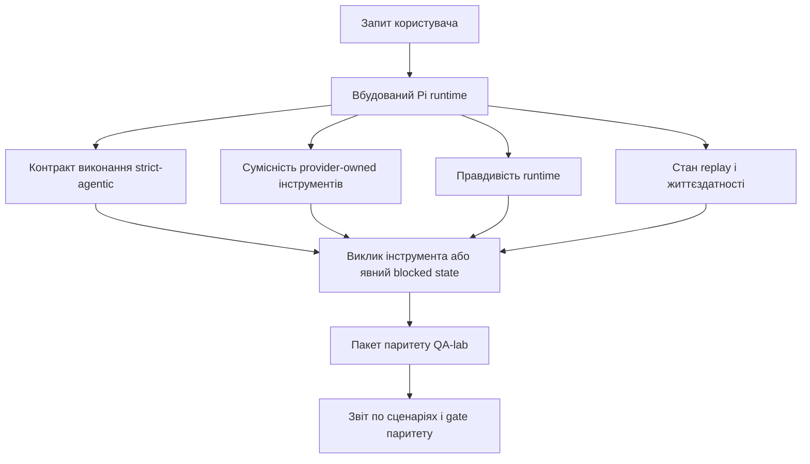
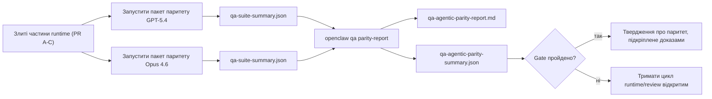

---
read_when:
    - Налагодження поведінки агента GPT-5.4 або Codex
    - Порівняння агентної поведінки OpenClaw у різних frontier-моделях
    - Перевірка виправлень strict-agentic, tool schema, elevation і replay
summary: Як OpenClaw закриває прогалини в агентному виконанні для GPT-5.4 і моделей у стилі Codex
title: Агентний паритет GPT-5.4 / Codex
x-i18n:
    generated_at: "2026-04-23T20:55:51Z"
    model: gpt-5.4
    provider: openai
    source_hash: cafd8aaffec102e1cedcbcdeb25a87e3433f411b3df1c3232d65ce1a1f4d067e
    source_path: help/gpt54-codex-agentic-parity.md
    workflow: 15
---

# Агентний паритет GPT-5.4 / Codex в OpenClaw

OpenClaw уже добре працював із frontier-моделями, що використовують інструменти, але GPT-5.4 і моделі у стилі Codex усе ще недопрацьовували в кількох практичних аспектах:

- вони могли зупинятися після планування замість виконання роботи
- вони могли неправильно використовувати strict OpenAI/Codex tool schema
- вони могли просити `/elevated full`, навіть коли повний доступ був неможливий
- вони могли втрачати стан довготривалих завдань під час replay або Compaction
- твердження про паритет із Claude Opus 4.6 ґрунтувалися на анекдотах, а не на відтворюваних сценаріях

Ця програма паритету закриває ці прогалини чотирма придатними до review частинами.

## Що змінилося

### PR A: strict-agentic виконання

Ця частина додає контракт виконання `strict-agentic` з режимом opt-in для вбудованих запусків Pi GPT-5.

Коли його ввімкнено, OpenClaw перестає приймати ходи лише з планом як «достатньо хороше» завершення. Якщо модель лише каже, що вона збирається зробити, і фактично не використовує інструменти та не просувається вперед, OpenClaw повторює спробу зі steer «дій зараз», а потім завершується fail-closed з явним станом blocked замість тихого завершення завдання.

Це найбільше покращує досвід GPT-5.4 у таких випадках:

- короткі follow-up на кшталт «ok do it»
- кодові завдання, де перший крок очевидний
- потоки, де `update_plan` має бути відстеженням прогресу, а не заповнювальним текстом

### PR B: правдивість runtime

Ця частина змушує OpenClaw говорити правду про дві речі:

- чому виклик provider/runtime не вдався
- чи справді доступний `/elevated full`

Це означає, що GPT-5.4 отримує кращі сигнали runtime про відсутню область доступу, збої оновлення auth, збої auth з HTML 403, проблеми proxy, збої DNS або timeout і заблоковані режими повного доступу. Модель рідше галюцинує неправильний спосіб виправлення або продовжує просити режим дозволів, який runtime не може надати.

### PR C: коректність виконання

Ця частина покращує два види коректності:

- сумісність provider-owned OpenAI/Codex tool schema
- відображення replay і життєздатності довготривалих завдань

Робота над сумісністю інструментів зменшує тертя schema для strict OpenAI/Codex-реєстрації інструментів, особливо навколо інструментів без параметрів і strict-очікувань щодо кореня object. Робота над replay/життєздатністю робить довготривалі завдання більш спостережуваними, щоб стани paused, blocked і abandoned були видимими замість зникання в загальному тексті помилки.

### PR D: harness паритету

Ця частина додає перший пакет паритету QA-lab, щоб GPT-5.4 і Opus 4.6 можна було проганяти через ті самі сценарії та порівнювати за спільними доказами.

Пакет паритету — це шар доказу. Сам по собі він не змінює поведінку runtime.

Після того як у вас є два артефакти `qa-suite-summary.json`, згенеруйте порівняння release-gate так:

```bash
pnpm openclaw qa parity-report \
  --repo-root . \
  --candidate-summary .artifacts/qa-e2e/gpt54/qa-suite-summary.json \
  --baseline-summary .artifacts/qa-e2e/opus46/qa-suite-summary.json \
  --output-dir .artifacts/qa-e2e/parity
```

Ця команда записує:

- читабельний Markdown-звіт
- машинозчитуваний JSON-verdict
- явний результат gate `pass` / `fail`

## Чому це практично покращує GPT-5.4

До цієї роботи GPT-5.4 в OpenClaw міг здаватися менш агентним, ніж Opus, у реальних coding sessions, тому що runtime допускав поведінку, яка особливо шкідлива для моделей у стилі GPT-5:

- ходи лише з коментарями
- тертя schema навколо інструментів
- нечіткий зворотний зв’язок про дозволи
- тихі злами replay або Compaction

Мета не в тому, щоб змусити GPT-5.4 імітувати Opus. Мета — дати GPT-5.4 контракт runtime, який винагороджує реальний прогрес, надає чистішу семантику інструментів і дозволів та перетворює режими відмови на явні машинозчитувані й людиночитані стани.

Це змінює користувацький досвід із:

- «модель мала хороший план, але зупинилася»

на:

- «модель або діяла, або OpenClaw показав точну причину, чому вона не змогла»

## До і після для користувачів GPT-5.4

| До цієї програми                                                                            | Після PR A-D                                                                             |
| ------------------------------------------------------------------------------------------- | ---------------------------------------------------------------------------------------- |
| GPT-5.4 міг зупинитися після розумного плану, не переходячи до наступного кроку з інструментом | PR A перетворює «лише план» на «дій зараз або покажи blocked state»                      |
| Strict tool schema могли відхиляти інструменти без параметрів або інструменти у формі OpenAI/Codex заплутаним чином | PR C робить реєстрацію й виклик provider-owned інструментів передбачуванішими            |
| Підказки `/elevated full` могли бути нечіткими або неправильними в заблокованих runtime     | PR B дає GPT-5.4 і користувачу правдиві підказки runtime і дозволів                      |
| Збої replay або Compaction могли виглядати так, ніби завдання тихо зникло                   | PR C явно показує paused, blocked, abandoned і replay-invalid outcomes                   |
| «GPT-5.4 відчувається гіршим за Opus» було здебільшого анекдотичним                         | PR D перетворює це на той самий пакет сценаріїв, ті самі метрики та жорсткий gate pass/fail |

## Архітектура



## Потік релізу



## Пакет сценаріїв

Поточний пакет паритету першої хвилі охоплює п’ять сценаріїв:

### `approval-turn-tool-followthrough`

Перевіряє, що модель не зупиняється на «Я це зроблю» після короткого схвалення. Вона має виконати першу конкретну дію в тому самому ході.

### `model-switch-tool-continuity`

Перевіряє, що робота з інструментами залишається цілісною через межі перемикання моделі/runtime замість скидання до коментарів або втрати контексту виконання.

### `source-docs-discovery-report`

Перевіряє, що модель може читати source і docs, синтезувати висновки та продовжувати завдання агентно, а не видавати тонке summary і зупинятися зарано.

### `image-understanding-attachment`

Перевіряє, що завдання змішаного режиму з вкладеннями залишаються придатними до дії й не зводяться до нечіткого переказу.

### `compaction-retry-mutating-tool`

Перевіряє, що завдання з реальним mutating write зберігає явну replay-unsafety замість тихого вигляду replay-safe, якщо запуск переживає Compaction, retry або втрачає стан reply під тиском.

## Матриця сценаріїв

| Сценарій                           | Що він перевіряє                         | Хороша поведінка GPT-5.4                                                     | Сигнал збою                                                                    |
| ---------------------------------- | ---------------------------------------- | ---------------------------------------------------------------------------- | ------------------------------------------------------------------------------ |
| `approval-turn-tool-followthrough` | Короткі ходи схвалення після плану       | Одразу запускає першу конкретну дію інструмента замість повторення наміру    | follow-up лише з планом, без активності інструментів або blocked turn без реального блокера |
| `model-switch-tool-continuity`     | Перемикання runtime/моделі під час використання інструментів | Зберігає контекст завдання й продовжує діяти послідовно                      | скидання до коментарів, втрата контексту інструментів або зупинка після перемикання |
| `source-docs-discovery-report`     | Читання source + синтез + дія            | Знаходить джерела, використовує інструменти й створює корисний звіт без зависання | тонке summary, відсутня робота інструментів або неповний хід із зупинкою      |
| `image-understanding-attachment`   | Агентна робота, керована вкладенням      | Інтерпретує вкладення, пов’язує його з інструментами й продовжує завдання    | нечіткий переказ, вкладення проігнороване або немає конкретної наступної дії   |
| `compaction-retry-mutating-tool`   | Mutating-робота під тиском Compaction    | Виконує реальний write і зберігає явну replay-unsafety після side effect     | mutating write відбувається, але безпека replay мається на увазі, відсутня або суперечлива |

## Release gate

GPT-5.4 можна вважати на паритеті або кращим лише тоді, коли злитий runtime проходить пакет паритету та регресії правдивості runtime одночасно.

Потрібні результати:

- жодного зависання лише на плані, коли наступна дія інструмента очевидна
- жодного фальшивого завершення без реального виконання
- жодних неправильних підказок `/elevated full`
- жодного тихого abandon у replay або Compaction
- метрики пакета паритету не слабші за погоджену baseline Opus 4.6

Для harness першої хвилі gate порівнює:

- рівень завершення
- рівень ненавмисних зупинок
- рівень коректних викликів інструментів
- кількість fake-success

Докази паритету навмисно розділені на два шари:

- PR D доводить поведінку GPT-5.4 vs Opus 4.6 у тих самих сценаріях через QA-lab
- детерміновані набори PR B доводять правдивість auth, proxy, DNS і `/elevated full` поза harness

## Матриця ціль-доказ

| Елемент gate завершення                                  | PR-власник  | Джерело доказу                                                     | Сигнал проходження                                                                    |
| -------------------------------------------------------- | ----------- | ------------------------------------------------------------------ | ------------------------------------------------------------------------------------- |
| GPT-5.4 більше не зависає після планування               | PR A        | `approval-turn-tool-followthrough` плюс набори runtime PR A        | ходи схвалення запускають реальну роботу або явний blocked state                      |
| GPT-5.4 більше не підробляє прогрес або fake tool completion | PR A + PR D | результати сценаріїв у parity report і кількість fake-success      | немає підозрілих pass-результатів і немає завершення лише коментарем                  |
| GPT-5.4 більше не дає хибних підказок `/elevated full`   | PR B        | детерміновані набори правдивості                                   | причини blocked і підказки щодо повного доступу залишаються точними для runtime       |
| Збої replay/життєздатності залишаються явними            | PR C + PR D | набори lifecycle/replay PR C плюс `compaction-retry-mutating-tool` | mutating-робота зберігає явну replay-unsafety замість тихого зникнення               |
| GPT-5.4 відповідає або перевершує Opus 4.6 за погодженими метриками | PR D        | `qa-agentic-parity-report.md` і `qa-agentic-parity-summary.json`   | однакове покриття сценаріїв і відсутність регресії за завершенням, зупинками або коректним використанням інструментів |

## Як читати parity verdict

Використовуйте verdict у `qa-agentic-parity-summary.json` як фінальне машинозчитуване рішення для пакета паритету першої хвилі.

- `pass` означає, що GPT-5.4 покрив ті самі сценарії, що й Opus 4.6, і не показав регресії на погоджених агрегованих метриках.
- `fail` означає, що спрацював принаймні один жорсткий gate: слабше завершення, гірші ненавмисні зупинки, слабше коректне використання інструментів, будь-який випадок fake-success або невідповідне покриття сценаріїв.
- «shared/base CI issue» саме по собі не є результатом паритету. Якщо шум CI поза PR D блокує запуск, verdict має чекати на чисте виконання merged-runtime, а не виводитися з логів епохи branch.
- Правдивість auth, proxy, DNS і `/elevated full` і далі надходить із детермінованих наборів PR B, тож фінальне твердження для релізу потребує обох речей: passing parity verdict із PR D і зелене покриття правдивості з PR B.

## Кому слід увімкнути `strict-agentic`

Використовуйте `strict-agentic`, коли:

- від агента очікується негайна дія, якщо наступний крок очевидний
- моделі сімейства GPT-5.4 або Codex є основним runtime
- ви надаєте перевагу явним blocked state замість «корисних» відповідей лише з підсумком

Залишайте типовий контракт, коли:

- ви хочете поточну більш вільну поведінку
- ви не використовуєте моделі сімейства GPT-5
- ви тестуєте prompt-и, а не примусове забезпечення на рівні runtime
