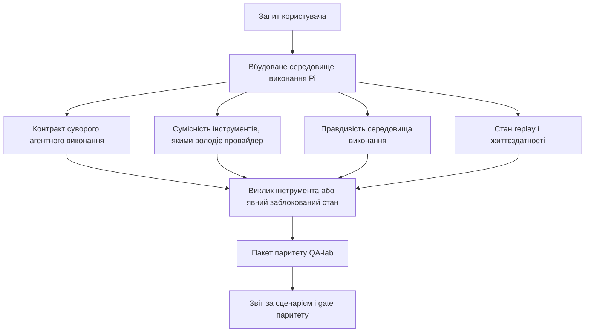
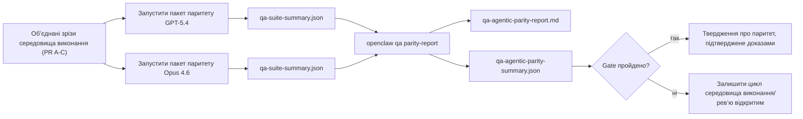

---
read_when:
    - Налагодження поведінки агента GPT-5.4 або Codex
    - Порівняння агентної поведінки OpenClaw у різних передових моделях
    - Огляд виправлень strict-agentic, tool-schema, elevation і replay
summary: Як OpenClaw усуває прогалини в агентному виконанні для GPT-5.4 і моделей у стилі Codex
title: GPT-5.4 / Агентний паритет Codex
x-i18n:
    generated_at: "2026-04-21T21:37:37Z"
    model: gpt-5.4
    provider: openai
    source_hash: 77bc9b8fab289bd35185fa246113503b3f5c94a22bd44739be07d39ae6779056
    source_path: help/gpt54-codex-agentic-parity.md
    workflow: 15
---

# Агентний паритет GPT-5.4 / Codex в OpenClaw

OpenClaw уже добре працював із передовими моделями, що використовують інструменти, але GPT-5.4 і моделі у стилі Codex усе ще недопрацьовували в кількох практичних аспектах:

- вони могли зупинятися після планування замість виконання роботи
- вони могли неправильно використовувати суворі схеми інструментів OpenAI/Codex
- вони могли запитувати `/elevated full`, навіть коли повний доступ був неможливий
- вони могли втрачати стан довготривалого завдання під час replay або Compaction
- твердження про паритет із Claude Opus 4.6 ґрунтувалися на анекдотичних випадках, а не на відтворюваних сценаріях

Ця програма паритету усуває ці прогалини в чотирьох придатних для рев’ю зрізах.

## Що змінилося

### PR A: суворе агентне виконання

Цей зріз додає контракт виконання `strict-agentic` з увімкненням за вибором для вбудованих запусків Pi GPT-5.

Коли його ввімкнено, OpenClaw перестає вважати ходи лише з планом «достатньо хорошим» завершенням. Якщо модель лише каже, що вона збирається зробити, але фактично не використовує інструменти і не просувається вперед, OpenClaw повторює спробу зі спрямуванням діяти негайно, а потім завершує з явним заблокованим станом замість того, щоб мовчки завершити завдання.

Це найбільше покращує досвід із GPT-5.4 у таких випадках:

- короткі уточнення на кшталт «гаразд, зроби це»
- завдання з кодом, де перший крок очевидний
- потоки, де `update_plan` має відстежувати прогрес, а не бути заповнювальним текстом

### PR B: правдивість середовища виконання

Цей зріз змушує OpenClaw говорити правду про дві речі:

- чому виклик провайдера/середовища виконання завершився помилкою
- чи справді доступний `/elevated full`

Це означає, що GPT-5.4 отримує кращі сигнали від середовища виконання щодо відсутньої області доступу, збоїв оновлення автентифікації, помилок автентифікації HTML 403, проблем із проксі, помилок DNS або тайм-аутів, а також заблокованих режимів повного доступу. Модель менш схильна вигадувати неправильний спосіб усунення проблеми або й надалі запитувати режим дозволів, який середовище виконання не може надати.

### PR C: коректність виконання

Цей зріз покращує два види коректності:

- сумісність схем інструментів OpenAI/Codex, якими володіє провайдер
- відображення replay і життєздатності довгих завдань

Робота над сумісністю інструментів зменшує тертя зі схемами для суворої реєстрації інструментів OpenAI/Codex, особливо навколо інструментів без параметрів і суворих очікувань щодо кореня-об’єкта. Робота над replay/життєздатністю робить довготривалі завдання більш спостережуваними, тож призупинені, заблоковані та покинуті стани видно, а не приховано за загальним текстом про помилку.

### PR D: обв’язка паритету

Цей зріз додає перший пакет паритету QA-lab, щоб GPT-5.4 і Opus 4.6 можна було проганяти через однакові сценарії та порівнювати за спільними доказами.

Пакет паритету — це рівень доказів. Сам по собі він не змінює поведінку середовища виконання.

Після того як у вас є два артефакти `qa-suite-summary.json`, згенеруйте порівняння для релізного gate за допомогою:

```bash
pnpm openclaw qa parity-report \
  --repo-root . \
  --candidate-summary .artifacts/qa-e2e/gpt54/qa-suite-summary.json \
  --baseline-summary .artifacts/qa-e2e/opus46/qa-suite-summary.json \
  --output-dir .artifacts/qa-e2e/parity
```

Ця команда записує:

- Markdown-звіт, придатний для читання людиною
- JSON-вердикт, придатний для читання машиною
- явний результат gate `pass` / `fail`

## Чому це практично покращує GPT-5.4

До цієї роботи GPT-5.4 в OpenClaw міг здаватися менш агентним, ніж Opus, у реальних сесіях кодування, тому що середовище виконання допускало поведінку, яка особливо шкідлива для моделей у стилі GPT-5:

- ходи лише з коментарями
- тертя схем навколо інструментів
- нечіткий зворотний зв’язок щодо дозволів
- тихі збої replay або Compaction

Мета не в тому, щоб змусити GPT-5.4 імітувати Opus. Мета в тому, щоб дати GPT-5.4 контракт середовища виконання, який винагороджує реальний прогрес, надає чистішу семантику інструментів і дозволів та перетворює режими збоїв на явні машино- і людиночитані стани.

Це змінює користувацький досвід із:

- «модель мала хороший план, але зупинилася»

на:

- «модель або виконала дію, або OpenClaw показав точну причину, чому вона не змогла цього зробити»

## До і після для користувачів GPT-5.4

| До цієї програми                                                                           | Після PR A-D                                                                              |
| ------------------------------------------------------------------------------------------ | ----------------------------------------------------------------------------------------- |
| GPT-5.4 міг зупинитися після розумного плану, не переходячи до наступного кроку з інструментом | PR A перетворює «лише план» на «дій зараз або покажи заблокований стан»                  |
| Суворі схеми інструментів могли заплутано відхиляти інструменти без параметрів або інструменти у форматі OpenAI/Codex | PR C робить реєстрацію та виклик інструментів, якими володіє провайдер, більш передбачуваними |
| Підказки щодо `/elevated full` могли бути нечіткими або неправильними в заблокованих середовищах виконання | PR B дає GPT-5.4 і користувачу правдиві підказки від середовища виконання та щодо дозволів |
| Збої replay або Compaction могли виглядати так, ніби завдання просто тихо зникло          | PR C явно показує результати paused, blocked, abandoned і replay-invalid                  |
| «GPT-5.4 відчувається гіршим за Opus» було здебільшого анекдотичним твердженням            | PR D перетворює це на той самий пакет сценаріїв, ті самі метрики та жорсткий gate pass/fail |

## Архітектура



## Потік релізу



## Пакет сценаріїв

Наразі пакет паритету першої хвилі охоплює п’ять сценаріїв:

### `approval-turn-tool-followthrough`

Перевіряє, що модель не зупиняється на «Я це зроблю» після короткого схвалення. Вона має виконати першу конкретну дію в тому ж ході.

### `model-switch-tool-continuity`

Перевіряє, що робота з використанням інструментів залишається зв’язною через межі перемикання моделі/середовища виконання, а не скидається до коментарів або не втрачає контекст виконання.

### `source-docs-discovery-report`

Перевіряє, що модель може читати вихідний код і документацію, синтезувати висновки та продовжувати завдання агентно, а не видавати поверхневий підсумок і зупинятися надто рано.

### `image-understanding-attachment`

Перевіряє, що задачі змішаного режиму з вкладеннями залишаються придатними до виконання та не зводяться до нечіткої оповіді.

### `compaction-retry-mutating-tool`

Перевіряє, що завдання з реальною мутаційною операцією запису зберігає явну небезпеку replay, замість того щоб тихо виглядати replay-safe, якщо запуск зазнає Compaction, повторної спроби або втрати стану відповіді під тиском.

## Матриця сценаріїв

| Сценарій                           | Що він перевіряє                          | Хороша поведінка GPT-5.4                                                          | Сигнал збою                                                                      |
| ---------------------------------- | ----------------------------------------- | ---------------------------------------------------------------------------------- | --------------------------------------------------------------------------------- |
| `approval-turn-tool-followthrough` | Короткі ходи схвалення після плану        | Одразу починає першу конкретну дію з інструментом замість повторення наміру       | подальший хід лише з планом, відсутність активності інструментів або заблокований хід без реального блокера |
| `model-switch-tool-continuity`     | Перемикання середовища виконання/моделі під час використання інструментів | Зберігає контекст завдання і продовжує діяти зв’язно                               | скидається до коментарів, втрачає контекст інструментів або зупиняється після перемикання |
| `source-docs-discovery-report`     | Читання джерел + синтез + дія             | Знаходить джерела, використовує інструменти та створює корисний звіт без зависання | поверхневий підсумок, відсутня робота з інструментами або зупинка на незавершеному ході |
| `image-understanding-attachment`   | Агентна робота на основі вкладення        | Інтерпретує вкладення, пов’язує його з інструментами й продовжує завдання          | нечітка оповідь, вкладення проігноровано або відсутня конкретна наступна дія     |
| `compaction-retry-mutating-tool`   | Мутаційна робота під тиском Compaction    | Виконує реальний запис і зберігає явну небезпеку replay після побічного ефекту     | відбувається мутаційний запис, але безпечність replay мається на увазі, відсутня або суперечлива |

## Release gate

GPT-5.4 можна вважати таким, що досяг паритету або перевершив його, лише тоді, коли об’єднане середовище виконання одночасно проходить пакет паритету та регресії правдивості середовища виконання.

Необхідні результати:

- жодного зависання на рівні лише плану, коли наступна дія з інструментом очевидна
- жодного фальшивого завершення без реального виконання
- жодних неправильних підказок щодо `/elevated full`
- жодного тихого покидання через replay або Compaction
- метрики пакета паритету не слабші за погоджений базовий рівень Opus 4.6

Для обв’язки першої хвилі gate порівнює:

- рівень завершення
- рівень ненавмисних зупинок
- рівень коректних викликів інструментів
- кількість фальшивих успіхів

Докази паритету навмисно розділено на два рівні:

- PR D доводить поведінку GPT-5.4 проти Opus 4.6 в однакових сценаріях через QA-lab
- детерміновані набори PR B доводять правдивість auth, proxy, DNS і `/elevated full` поза межами обв’язки

## Матриця «ціль → доказ»

| Пункт gate завершення                                   | Відповідальний PR | Джерело доказу                                                     | Сигнал проходження                                                                      |
| ------------------------------------------------------- | ----------------- | ------------------------------------------------------------------ | --------------------------------------------------------------------------------------- |
| GPT-5.4 більше не зависає після планування              | PR A              | `approval-turn-tool-followthrough` плюс набори середовища виконання PR A | ходи схвалення запускають реальну роботу або явний заблокований стан                    |
| GPT-5.4 більше не імітує прогрес або фальшиве завершення інструмента | PR A + PR D       | результати сценаріїв у звіті паритету та кількість фальшивих успіхів | немає підозрілих результатів проходження і немає завершення лише коментарями            |
| GPT-5.4 більше не дає хибних підказок щодо `/elevated full` | PR B              | детерміновані набори правдивості                                   | причини блокування та підказки щодо повного доступу залишаються точними відносно середовища виконання |
| Збої replay/життєздатності залишаються явними           | PR C + PR D       | набори життєвого циклу/replay PR C плюс `compaction-retry-mutating-tool` | мутаційна робота зберігає явну небезпеку replay замість того, щоб тихо зникати         |
| GPT-5.4 відповідає або перевершує Opus 4.6 за погодженими метриками | PR D              | `qa-agentic-parity-report.md` і `qa-agentic-parity-summary.json`   | однакове покриття сценаріїв і відсутність регресії в завершенні, поведінці зупинки або коректному використанні інструментів |

## Як читати вердикт паритету

Використовуйте вердикт у `qa-agentic-parity-summary.json` як остаточне машиночитане рішення для пакета паритету першої хвилі.

- `pass` означає, що GPT-5.4 охопив ті самі сценарії, що й Opus 4.6, і не дав регресії за погодженими агрегованими метриками.
- `fail` означає, що спрацював принаймні один жорсткий gate: слабше завершення, гірші ненавмисні зупинки, слабше коректне використання інструментів, будь-який випадок фальшивого успіху або невідповідне покриття сценаріїв.
- «shared/base CI issue» сам по собі не є результатом паритету. Якщо шум CI поза межами PR D блокує прогін, вердикт має чекати на чисте виконання в об’єднаному середовищі виконання, а не виводитися з логів епохи гілки.
- Правдивість auth, proxy, DNS і `/elevated full` як і раніше походить із детермінованих наборів PR B, тому для фінального твердження про реліз потрібні обидва пункти: успішний вердикт паритету PR D і зелена правдивісна перевірка PR B.

## Кому слід вмикати `strict-agentic`

Використовуйте `strict-agentic`, коли:

- очікується, що агент діятиме негайно, коли наступний крок очевидний
- GPT-5.4 або моделі сімейства Codex є основним середовищем виконання
- ви надаєте перевагу явним заблокованим станам замість «корисних» відповідей лише з підсумком

Залишайте контракт за замовчуванням, коли:

- вам потрібна наявна м’якша поведінка
- ви не використовуєте моделі сімейства GPT-5
- ви тестуєте prompts, а не примусове дотримання на рівні середовища виконання
