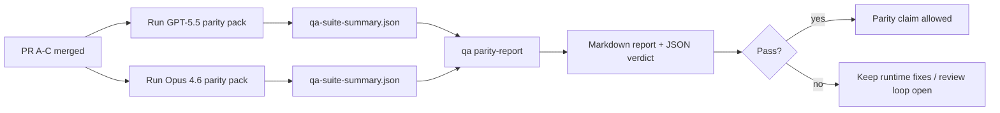

---
read_when:
    - Огляд серії PR щодо паритету GPT-5.5 / Codex
    - Підтримка агентної архітектури з шістьма контрактами, що лежить в основі програми паритету
summary: Як рецензувати програму паритету GPT-5.5 / Codex як чотири блоки злиття
title: Нотатки мейнтейнера щодо паритету GPT-5.5 / Codex
x-i18n:
    generated_at: "2026-05-06T04:33:36Z"
    model: gpt-5.5
    provider: openai
    source_hash: 5752b4610f8b0d70b80d880ea10df75478b5f85ca431cdb73d3b61d745b23356
    source_path: help/gpt55-codex-agentic-parity-maintainers.md
    workflow: 16
---

Ця нотатка пояснює, як переглядати програму паритету GPT-5.5 / Codex як чотири одиниці злиття, не втрачаючи початкову архітектуру з шести контрактів.

## Одиниці злиття

### PR A: суворе агентне виконання

Відповідає за:

- `executionContract`
- продовження виконання в тому самому ході з пріоритетом GPT-5
- `update_plan` як нетермінальне відстеження прогресу
- явні заблоковані стани замість тихих зупинок лише з планом

Не відповідає за:

- класифікацію збоїв auth/runtime
- правдивість дозволів
- перепроєктування replay/continuation
- бенчмаркінг паритету

### PR B: правдивість runtime

Відповідає за:

- коректність області дії Codex OAuth
- типізовану класифікацію збоїв provider/runtime
- правдиву доступність `/elevated full` і причини блокування

Не відповідає за:

- нормалізацію схем інструментів
- стан replay/liveness
- блокування за результатами бенчмарків

### PR C: коректність виконання

Відповідає за:

- сумісність інструментів OpenAI/Codex, якою володіє provider
- обробку строгих схем без параметрів
- відображення replay-invalid
- видимість стану призупинених, заблокованих і покинутих довгих завдань

Не відповідає за:

- самостійно обране продовження
- загальну поведінку діалекту Codex поза хуками provider
- блокування за результатами бенчмарків

### PR D: обв’язка паритету

Відповідає за:

- перший набір сценаріїв GPT-5.5 проти Opus 4.6
- документацію паритету
- звіт про паритет і механіку релізного gate

Не відповідає за:

- зміни поведінки runtime поза QA-lab
- симуляцію auth/proxy/DNS всередині обв’язки

## Відповідність початковим шести контрактам

| Початковий контракт                      | Одиниця злиття |
| ---------------------------------------- | -------------- |
| Коректність provider transport/auth      | PR B           |
| Сумісність контракту/схеми інструментів  | PR C           |
| Виконання в тому самому ході             | PR A           |
| Правдивість дозволів                     | PR B           |
| Коректність replay/continuation/liveness | PR C           |
| Benchmark/release gate                   | PR D           |

## Порядок перегляду

1. PR A
2. PR B
3. PR C
4. PR D

PR D є шаром доказів. Він не має бути причиною затримки PR із коректністю runtime.

## На що звертати увагу

### PR A

- Запуски GPT-5 діють або завершуються закрито, замість зупинки на commentary
- `update_plan` більше не виглядає як прогрес сам по собі
- поведінка залишається з пріоритетом GPT-5 і в межах embedded-Pi

### PR B

- збої auth/proxy/runtime перестають згортатися в загальну обробку "model failed"
- `/elevated full` описується як доступний лише тоді, коли він справді доступний
- причини блокування видимі і для моделі, і для runtime, зверненого до користувача

### PR C

- строга реєстрація інструментів OpenAI/Codex поводиться передбачувано
- інструменти без параметрів не провалюють перевірки строгих схем
- результати replay і compaction зберігають правдивий стан liveness

### PR D

- набір сценаріїв зрозумілий і відтворюваний
- набір містить mutating replay-safety lane, а не лише read-only потоки
- звіти читабельні для людей і автоматизації
- твердження про паритет підкріплені доказами, а не випадковими спостереженнями

Очікувані артефакти з PR D:

- `qa-suite-report.md` / `qa-suite-summary.json` для кожного запуску моделі
- `qa-agentic-parity-report.md` з агрегованим і сценарним порівнянням
- `qa-agentic-parity-summary.json` з машиночитаним вердиктом

## Release gate

Не заявляйте про паритет або перевагу GPT-5.5 над Opus 4.6, доки:

- PR A, PR B і PR C не буде злито
- PR D не запустить перший набір паритету чисто
- regression suites для правдивості runtime залишаються зеленими
- звіт про паритет не показує випадків fake-success і регресій у поведінці зупинки

Обв’язка паритету не є єдиним джерелом доказів. Зберігайте цей поділ явним під час перегляду:

- PR D відповідає за сценарне порівняння GPT-5.5 проти Opus 4.6
- детерміновані набори PR B і далі відповідають за докази auth/proxy/DNS і правдивості full-access

## Швидкий робочий процес злиття для maintainer

Використовуйте це, коли ви готові злити PR паритету й хочете повторювану послідовність із низьким ризиком.

1. Підтвердьте, що планку доказів виконано до злиття:
   - відтворюваний симптом або failing test
   - перевірена першопричина в зачепленому коді
   - виправлення в причетному шляху
   - regression test або явна нотатка про ручну перевірку
2. Проведіть triage/label до злиття:
   - застосуйте будь-які labels автоматичного закриття `r:*`, коли PR не має потрапити в main
   - тримайте кандидатів на злиття без нерозв’язаних блокувальних обговорень
3. Перевірте локально на зачепленій поверхні:
   - `pnpm check:changed`
   - `pnpm test:changed`, коли тести змінено або впевненість у bug fix залежить від тестового покриття
4. Злийте стандартним maintainer flow (процес `/landpr`), потім перевірте:
   - поведінку автоматичного закриття пов’язаних issues
   - CI і статус після злиття на `main`
5. Після злиття запустіть пошук дублікатів для пов’язаних відкритих PR/issues і закривайте лише з канонічним посиланням.

Якщо будь-який пункт із планки доказів відсутній, запросіть зміни замість злиття.

## Мапа цілей до доказів

| Елемент completion gate                   | Основний власник | Артефакт перегляду                                                 |
| ----------------------------------------- | ---------------- | ------------------------------------------------------------------ |
| Немає зупинок лише на плані               | PR A             | тести strict-agentic runtime і `approval-turn-tool-followthrough`  |
| Немає фальшивого прогресу або фальшивого завершення інструмента | PR A + PR D      | кількість fake-success у паритеті плюс деталі сценарного звіту     |
| Немає хибних підказок `/elevated full`    | PR B             | детерміновані набори runtime-truthfulness                          |
| Збої replay/liveness залишаються явними   | PR C + PR D      | набори lifecycle/replay плюс `compaction-retry-mutating-tool`      |
| GPT-5.5 відповідає Opus 4.6 або перевершує його | PR D             | `qa-agentic-parity-report.md` і `qa-agentic-parity-summary.json`   |

## Скорочення для reviewer: до і після

| Видима користувачу проблема до                              | Сигнал перегляду після                                                                 |
| ----------------------------------------------------------- | -------------------------------------------------------------------------------------- |
| GPT-5.5 зупинявся після планування                          | PR A показує поведінку act-or-block замість завершення лише commentary                 |
| Використання інструментів було крихким зі строгими схемами OpenAI/Codex | PR C зберігає передбачуваними реєстрацію інструментів і виклик без параметрів          |
| Підказки `/elevated full` інколи вводили в оману             | PR B прив’язує рекомендації до фактичної runtime capability і причин блокування        |
| Довгі завдання могли зникати в неоднозначності replay/compaction | PR C виводить явні стани paused, blocked, abandoned і replay-invalid                   |
| Твердження про паритет були випадковими                      | PR D створює звіт плюс JSON-вердикт з однаковим покриттям сценаріїв на обох моделях    |

## Пов’язане

- [Агентний паритет GPT-5.5 / Codex](/uk/help/gpt55-codex-agentic-parity)
