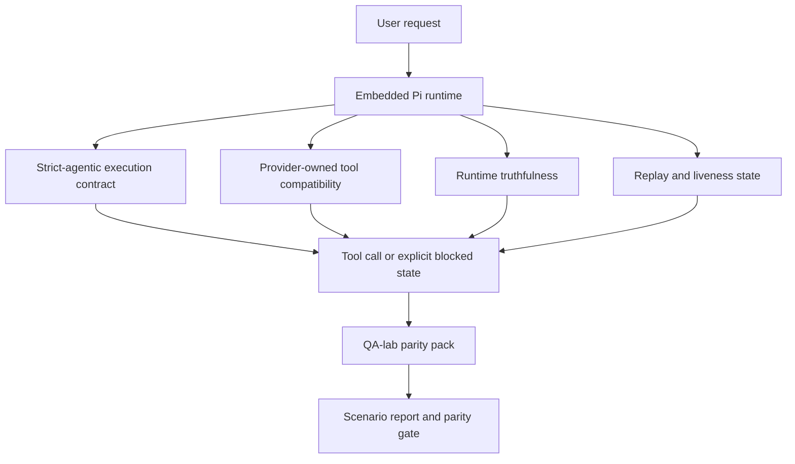
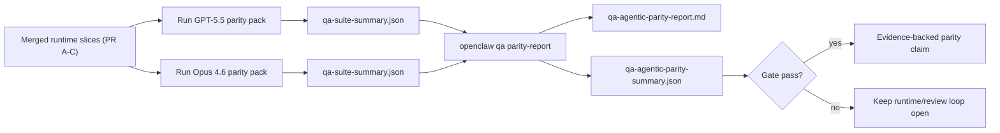

---
read_when:
    - Налагодження поведінки агента GPT-5.5 або Codex
    - Порівняння агентної поведінки OpenClaw у різних передових моделях
    - Перегляд виправлень для строгої агентності, схеми інструментів, підвищення привілеїв і повторного відтворення
summary: Як OpenClaw усуває прогалини агентного виконання для GPT-5.5 і моделей у стилі Codex
title: GPT-5.5 / агентний паритет Codex
x-i18n:
    generated_at: "2026-05-06T02:40:21Z"
    model: gpt-5.5
    provider: openai
    source_hash: bbc32f418dfffe2786093fa6b42b19f92a2d382c9408dfc55dd0154d67959390
    source_path: help/gpt55-codex-agentic-parity.md
    workflow: 16
---

OpenClaw уже добре працював із передовими моделями, що використовують інструменти, але GPT-5.5 і моделі у стилі Codex усе ще поступалися в кількох практичних аспектах:

- вони могли зупинятися після планування замість виконання роботи
- вони могли неправильно використовувати строгі схеми інструментів OpenAI/Codex
- вони могли просити `/elevated full`, навіть коли повний доступ був неможливий
- вони могли втрачати стан довготривалого завдання під час replay або compaction
- твердження про паритет із Claude Opus 4.6 ґрунтувалися на окремих прикладах, а не на повторюваних сценаріях

Ця програма паритету усуває ці прогалини в чотирьох придатних для перегляду частинах.

## Що змінилося

### PR A: виконання strict-agentic

Ця частина додає опціональний контракт виконання `strict-agentic` для вбудованих запусків Pi GPT-5.

Коли його ввімкнено, OpenClaw перестає приймати ходи лише з планом як достатньо добрі для завершення. Якщо модель лише каже, що має намір зробити, але фактично не використовує інструменти й не робить поступу, OpenClaw повторює спробу з підказкою діяти негайно, а потім завершує закрито з явним заблокованим станом замість того, щоб тихо завершити завдання.

Це найбільше покращує досвід GPT-5.5 у:

- коротких подальших відповідях на кшталт "ок, зроби це"
- кодових завданнях, де перший крок очевидний
- потоках, де `update_plan` має бути відстеженням поступу, а не текстом-заповнювачем

### PR B: правдивість runtime

Ця частина змушує OpenClaw правдиво повідомляти про дві речі:

- чому виклик provider/runtime зазнав невдачі
- чи `/elevated full` справді доступний

Це означає, що GPT-5.5 отримує кращі runtime-сигнали для відсутнього scope, збоїв оновлення auth, HTML 403 auth-помилок, проблем із proxy, DNS або timeout-збоїв і заблокованих режимів повного доступу. Модель із меншою ймовірністю вигадує неправильне виправлення або продовжує просити режим дозволів, який runtime не може надати.

### PR C: коректність виконання

Ця частина покращує два типи коректності:

- сумісність схем інструментів OpenAI/Codex, якими володіє provider
- відображення replay і живучості довгих завдань

Робота над сумісністю інструментів зменшує тертя схем для строгій реєстрації інструментів OpenAI/Codex, особливо навколо інструментів без параметрів і строгих очікувань щодо кореневого об’єкта. Робота над replay/живучістю робить довготривалі завдання помітнішими, тому призупинені, заблоковані й покинуті стани видимі замість того, щоб зникати в узагальненому тексті помилки.

### PR D: parity harness

Ця частина додає parity pack першої хвилі для QA-lab, щоб GPT-5.5 і Opus 4.6 можна було проганяти через ті самі сценарії та порівнювати за спільними доказами.

Parity pack є шаром доказів. Сам по собі він не змінює поведінку runtime.

Після того як у вас є два артефакти `qa-suite-summary.json`, згенеруйте порівняння для release gate за допомогою:

```bash
pnpm openclaw qa parity-report \
  --repo-root . \
  --candidate-summary .artifacts/qa-e2e/gpt55/qa-suite-summary.json \
  --baseline-summary .artifacts/qa-e2e/opus46/qa-suite-summary.json \
  --output-dir .artifacts/qa-e2e/parity
```

Ця команда записує:

- зручний для читання Markdown-звіт
- машиночитний JSON-вердикт
- явний результат gate `pass` / `fail`

## Чому це покращує GPT-5.5 на практиці

До цієї роботи GPT-5.5 в OpenClaw міг здаватися менш агентним, ніж Opus, у реальних сеансах кодування, бо runtime допускав поведінку, особливо шкідливу для моделей у стилі GPT-5:

- ходи лише з коментарями
- тертя схем навколо інструментів
- нечіткий зворотний зв’язок щодо дозволів
- непомітні збої replay або compaction

Мета не в тому, щоб змусити GPT-5.5 імітувати Opus. Мета — дати GPT-5.5 runtime-контракт, який винагороджує реальний поступ, надає чистішу семантику інструментів і дозволів та перетворює режими відмови на явні машино- й людиночитні стани.

Це змінює досвід користувача з:

- "модель мала добрий план, але зупинилася"

на:

- "модель або діяла, або OpenClaw показав точну причину, чому вона не могла"

## До й після для користувачів GPT-5.5

| До цієї програми                                                                                 | Після PR A-D                                                                                 |
| ------------------------------------------------------------------------------------------------ | -------------------------------------------------------------------------------------------- |
| GPT-5.5 міг зупинятися після розумного плану, не виконуючи наступний крок інструментом           | PR A перетворює "лише план" на "дій зараз або покажи заблокований стан"                      |
| Строгі схеми інструментів могли відхиляти інструменти без параметрів або форми OpenAI/Codex у заплутаний спосіб | PR C робить реєстрацію та виклик інструментів, якими володіє provider, передбачуванішими     |
| Підказки щодо `/elevated full` могли бути нечіткими або неправильними в заблокованих runtime      | PR B дає GPT-5.5 і користувачу правдиві runtime-підказки та підказки щодо дозволів           |
| Збої replay або compaction могли виглядати так, ніби завдання тихо зникло                         | PR C явно показує призупинені, заблоковані, покинуті та replay-invalid результати            |
| "GPT-5.5 здається гіршим за Opus" було переважно анекдотичним твердженням                         | PR D перетворює це на той самий набір сценаріїв, ті самі метрики й жорсткий gate pass/fail   |

## Архітектура



## Процес release



## Набір сценаріїв

Parity pack першої хвилі наразі охоплює п’ять сценаріїв:

### `approval-turn-tool-followthrough`

Перевіряє, що модель не зупиняється на "я це зроблю" після короткого схвалення. Вона має виконати першу конкретну дію в тому самому ході.

### `model-switch-tool-continuity`

Перевіряє, що робота з використанням інструментів залишається узгодженою на межах перемикання model/runtime замість того, щоб скидатися до коментарів або втрачати контекст виконання.

### `source-docs-discovery-report`

Перевіряє, що модель може читати source і docs, синтезувати висновки та продовжувати завдання агентно, а не створювати поверховий підсумок і передчасно зупинятися.

### `image-understanding-attachment`

Перевіряє, що змішанорежимні завдання з вкладеннями залишаються придатними до дії й не зводяться до нечіткої оповіді.

### `compaction-retry-mutating-tool`

Перевіряє, що завдання з реальною мутуючою операцією запису зберігає явну replay-небезпечність замість того, щоб тихо виглядати replay-безпечним, якщо запуск зазнає compaction, retry або втратить стан відповіді під тиском.

## Матриця сценаріїв

| Сценарій                           | Що він тестує                          | Добра поведінка GPT-5.5                                                         | Сигнал невдачі                                                                  |
| ---------------------------------- | -------------------------------------- | ------------------------------------------------------------------------------- | ------------------------------------------------------------------------------- |
| `approval-turn-tool-followthrough` | Короткі ходи схвалення після плану     | Негайно починає першу конкретну дію інструментом замість повторення наміру      | подальший хід лише з планом, відсутність активності інструментів або заблокований хід без реальної перешкоди |
| `model-switch-tool-continuity`     | Перемикання runtime/model під час використання інструментів | Зберігає контекст завдання й продовжує діяти узгоджено                          | скидання до коментарів, втрата контексту інструментів або зупинка після перемикання |
| `source-docs-discovery-report`     | Читання source + синтез + дія          | Знаходить джерела, використовує інструменти й створює корисний звіт без зависання | поверховий підсумок, відсутня робота інструментами або зупинка на незавершеному ході |
| `image-understanding-attachment`   | Агентна робота, керована вкладенням    | Інтерпретує вкладення, пов’язує його з інструментами й продовжує завдання       | нечітка оповідь, вкладення проігноровано або немає конкретної наступної дії     |
| `compaction-retry-mutating-tool`   | Мутуюча робота під тиском compaction   | Виконує реальний запис і зберігає явну replay-небезпечність після побічного ефекту | мутуючий запис відбувається, але replay-безпечність натякається, відсутня або суперечлива |

## Release gate

GPT-5.5 можна вважати на рівні паритету або кращим лише тоді, коли об’єднаний runtime одночасно проходить parity pack і регресійні перевірки runtime-правдивості.

Обов’язкові результати:

- немає зависання лише на плані, коли наступна дія інструментом очевидна
- немає фальшивого завершення без реального виконання
- немає неправильних підказок щодо `/elevated full`
- немає тихого покидання replay або compaction
- метрики parity pack щонайменше такі самі сильні, як узгоджений baseline Opus 4.6

Для harness першої хвилі gate порівнює:

- completion rate
- unintended-stop rate
- valid-tool-call rate
- fake-success count

Докази паритету навмисно розділені на два шари:

- PR D доводить поведінку GPT-5.5 проти Opus 4.6 у тих самих сценаріях за допомогою QA-lab
- детерміновані набори PR B доводять правдивість auth, proxy, DNS і `/elevated full` поза harness

## Матриця цілей і доказів

| Елемент completion gate                                  | Відповідальний PR | Джерело доказів                                                    | Сигнал проходження                                                                       |
| -------------------------------------------------------- | ----------------- | ------------------------------------------------------------------ | ---------------------------------------------------------------------------------------- |
| GPT-5.5 більше не зависає після планування               | PR A              | `approval-turn-tool-followthrough` плюс runtime-набори PR A        | ходи схвалення запускають реальну роботу або явний заблокований стан                     |
| GPT-5.5 більше не імітує поступ або фальшиве завершення інструменту | PR A + PR D       | результати сценаріїв parity report і fake-success count            | немає підозрілих pass-результатів і немає завершення лише з коментарями                  |
| GPT-5.5 більше не дає хибних підказок щодо `/elevated full` | PR B              | детерміновані набори правдивості                                   | причини блокування й підказки full-access залишаються точними щодо runtime               |
| Збої replay/живучості залишаються явними                 | PR C + PR D       | lifecycle/replay-набори PR C плюс `compaction-retry-mutating-tool` | мутуюча робота зберігає явну replay-небезпечність замість тихого зникнення               |
| GPT-5.5 дорівнює або перевершує Opus 4.6 за узгодженими метриками | PR D              | `qa-agentic-parity-report.md` і `qa-agentic-parity-summary.json`   | те саме покриття сценаріїв і відсутність регресії щодо completion, поведінки зупинок або валідного використання інструментів |

## Як читати parity verdict

Використовуйте verdict у `qa-agentic-parity-summary.json` як фінальне машиночитне рішення для parity pack першої хвилі.

- `pass` означає, що GPT-5.5 охопив ті самі сценарії, що й Opus 4.6, і не мав регресій за узгодженими агрегованими метриками.
- `fail` означає, що спрацював принаймні один жорсткий шлюз: слабше завершення, гірші ненавмисні зупинки, слабше коректне використання інструментів, будь-який випадок фальшивого успіху або невідповідне покриття сценаріїв.
- "спільна/базова проблема CI" сама по собі не є результатом паритету. Якщо шум CI поза PR D блокує запуск, вердикт має чекати чистого виконання об’єднаного runtime, а не виводитися з журналів часів гілки.
- Автентифікація, проксі, DNS і правдивість `/elevated full` досі походять із детермінованих наборів PR B, тому фінальне твердження про реліз потребує обох умов: успішного вердикту паритету PR D і зеленого покриття правдивості PR B.

## Кому слід увімкнути `strict-agentic`

Використовуйте `strict-agentic`, коли:

- очікується, що агент діятиме негайно, коли наступний крок очевидний
- GPT-5.5 або моделі родини Codex є основним runtime
- ви віддаєте перевагу явним заблокованим станам замість "корисних" відповідей лише з підсумком

Залишайте типовий контракт, коли:

- вам потрібна наявна вільніша поведінка
- ви не використовуєте моделі родини GPT-5
- ви тестуєте промпти, а не примусове виконання на рівні runtime

## Пов’язане

- [Нотатки мейнтейнера щодо паритету GPT-5.5 / Codex](/uk/help/gpt55-codex-agentic-parity-maintainers)
