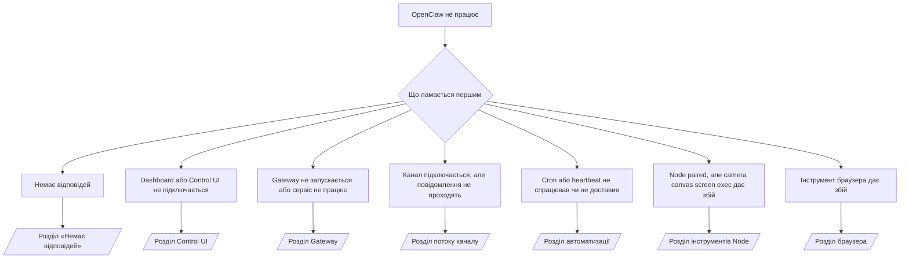

---
read_when:
    - OpenClaw не працює, і вам потрібен найшвидший шлях до виправлення
    - Вам потрібен процес тріажу, перш ніж заглиблюватися в докладні операційні інструкції.
summary: Центр усунення несправностей OpenClaw за симптомами
title: Загальне усунення неполадок
x-i18n:
    generated_at: "2026-05-06T03:48:23Z"
    model: gpt-5.5
    provider: openai
    source_hash: 624fa34cda3b440fa9cc636beb3fe6e3608a77a332933fa593097ebc556ac745
    source_path: help/troubleshooting.md
    workflow: 16
---

Якщо у вас є лише 2 хвилини, використовуйте цю сторінку як вхідну точку для triage.

## Перші 60 секунд

Виконайте цю точну послідовність по порядку:

```bash
openclaw status
openclaw status --all
openclaw gateway probe
openclaw gateway status
openclaw doctor
openclaw channels status --probe
openclaw logs --follow
```

Хороший вивід в один рядок:

- `openclaw status` → показує налаштовані канали й не містить очевидних помилок автентифікації.
- `openclaw status --all` → повний звіт наявний і придатний для поширення.
- `openclaw gateway probe` → очікувана ціль gateway доступна (`Reachable: yes`). `Capability: ...` повідомляє, який рівень автентифікації зміг підтвердити probe, а `Read probe: limited - missing scope: operator.read` означає погіршену діагностику, а не збій підключення.
- `openclaw gateway status` → `Runtime: running`, `Connectivity probe: ok` і правдоподібний рядок `Capability: ...`. Використовуйте `--require-rpc`, якщо вам також потрібне підтвердження RPC зі scope читання.
- `openclaw doctor` → немає блокувальних помилок конфігурації чи сервісу.
- `openclaw channels status --probe` → доступний gateway повертає живий стан транспорту для кожного облікового запису плюс результати probe/audit, як-от `works` або `audit ok`; якщо gateway недоступний, команда повертається до зведень лише за конфігурацією.
- `openclaw logs --follow` → стабільна активність, без повторюваних фатальних помилок.

## Довгий контекст Anthropic 429

Якщо ви бачите:
`HTTP 429: rate_limit_error: Extra usage is required for long context requests`,
перейдіть до [/gateway/troubleshooting#anthropic-429-extra-usage-required-for-long-context](/uk/gateway/troubleshooting#anthropic-429-extra-usage-required-for-long-context).

## Локальний OpenAI-сумісний бекенд працює напряму, але дає збій в OpenClaw

Якщо ваш локальний або self-hosted бекенд `/v1` відповідає на малі прямі probe
`/v1/chat/completions`, але дає збій на `openclaw infer model run` або звичайних
ходах агента:

1. Якщо помилка згадує, що `messages[].content` очікує рядок, задайте
   `models.providers.<provider>.models[].compat.requiresStringContent: true`.
2. Якщо бекенд усе ще дає збій лише на ходах агента OpenClaw, задайте
   `models.providers.<provider>.models[].compat.supportsTools: false` і повторіть спробу.
3. Якщо крихітні прямі виклики все ще працюють, але більші prompts OpenClaw призводять до збою
   бекенду, розглядайте решту проблеми як обмеження upstream-моделі/сервера й
   продовжуйте в докладному runbook:
   [/gateway/troubleshooting#local-openai-compatible-backend-passes-direct-probes-but-agent-runs-fail](/uk/gateway/troubleshooting#local-openai-compatible-backend-passes-direct-probes-but-agent-runs-fail)

## Інсталяція Plugin завершується помилкою через відсутні openclaw extensions

Якщо інсталяція завершується помилкою `package.json missing openclaw.extensions`, пакет plugin
використовує стару форму, яку OpenClaw більше не приймає.

Виправлення в пакеті plugin:

1. Додайте `openclaw.extensions` до `package.json`.
2. Спрямуйте записи на зібрані runtime-файли, зазвичай `./dist/index.js`.
3. Повторно опублікуйте plugin і знову запустіть `openclaw plugins install <package>`.

Приклад:

```json
{
  "name": "@openclaw/my-plugin",
  "version": "1.2.3",
  "openclaw": {
    "extensions": ["./dist/index.js"]
  }
}
```

Довідка: [Архітектура Plugin](/uk/plugins/architecture)

## Plugin наявний, але заблокований через підозріле володіння

Якщо `openclaw doctor`, налаштування або попередження під час запуску показують:

```text
blocked plugin candidate: suspicious ownership (... uid=1000, expected uid=0 or root)
plugin present but blocked
```

файли plugin належать іншому користувачу Unix, ніж процес, який їх завантажує.
Не видаляйте конфігурацію plugin. Виправте володіння файлами або запускайте OpenClaw
від того самого користувача, якому належить каталог стану.

Docker-інсталяції зазвичай працюють як `node` (uid `1000`). Для стандартного
налаштування Docker виправте bind mounts на хості:

```bash
sudo chown -R 1000:1000 /path/to/openclaw-config /path/to/openclaw-workspace
openclaw doctor --fix
```

Якщо ви навмисно запускаєте OpenClaw як root, натомість виправте керований корінь plugin
на володіння root:

```bash
sudo chown -R root:root /path/to/openclaw-config/npm
openclaw doctor --fix
```

Докладніша документація:

- [Володіння шляхом Plugin](/uk/tools/plugin#blocked-plugin-path-ownership)
- [Дозволи Docker](/uk/install/docker#permissions-and-eacces)

## Дерево рішень



<AccordionGroup>
  <Accordion title="No replies">
    ```bash
    openclaw status
    openclaw gateway status
    openclaw channels status --probe
    openclaw pairing list --channel <channel> [--account <id>]
    openclaw logs --follow
    ```

    Хороший вивід виглядає так:

    - `Runtime: running`
    - `Connectivity probe: ok`
    - `Capability: read-only`, `write-capable` або `admin-capable`
    - Ваш канал показує, що транспорт підключений, а де підтримується, `works` або `audit ok` у `channels status --probe`
    - Відправник виглядає схваленим або політика DM відкрита/allowlist

    Поширені сигнатури в логах:

    - `drop guild message (mention required` → mention gating заблокував повідомлення в Discord.
    - `pairing request` → відправник не схвалений і очікує схвалення pairing у DM.
    - `blocked` / `allowlist` у логах каналу → відправник, кімната або група відфільтровані.

    Докладні сторінки:

    - [/gateway/troubleshooting#no-replies](/uk/gateway/troubleshooting#no-replies)
    - [/channels/troubleshooting](/uk/channels/troubleshooting)
    - [/channels/pairing](/uk/channels/pairing)

  </Accordion>

  <Accordion title="Dashboard or Control UI will not connect">
    ```bash
    openclaw status
    openclaw gateway status
    openclaw logs --follow
    openclaw doctor
    openclaw channels status --probe
    ```

    Хороший вивід виглядає так:

    - `Dashboard: http://...` показано в `openclaw gateway status`
    - `Connectivity probe: ok`
    - `Capability: read-only`, `write-capable` або `admin-capable`
    - Немає циклу автентифікації в логах

    Поширені сигнатури в логах:

    - `device identity required` → HTTP/небезпечний контекст не може завершити автентифікацію пристрою.
    - `origin not allowed` → браузерний `Origin` не дозволений для цілі gateway Control UI.
    - `AUTH_TOKEN_MISMATCH` з підказками повторної спроби (`canRetryWithDeviceToken=true`) → одна довірена повторна спроба з device-token може відбутися автоматично.
    - Ця повторна спроба з кешованим токеном повторно використовує кешований набір scope, збережений із paired
      device token. Викликачі з явним `deviceToken` / явними `scopes` натомість зберігають
      запитаний ними набір scope.
    - На асинхронному шляху Tailscale Serve Control UI невдалі спроби для тієї самої
      пари `{scope, ip}` серіалізуються до того, як limiter зафіксує невдачу, тож
      друга одночасна невдала повторна спроба вже може показати `retry later`.
    - `too many failed authentication attempts (retry later)` з localhost
      browser origin → повторні збої з того самого `Origin` тимчасово
      заблоковані; інший localhost origin використовує окремий bucket.
    - повторні `unauthorized` після цієї повторної спроби → неправильний token/password, невідповідність режиму auth або застарілий paired device token.
    - `gateway connect failed:` → UI спрямований на неправильний URL/порт або недоступний gateway.

    Докладні сторінки:

    - [/gateway/troubleshooting#dashboard-control-ui-connectivity](/uk/gateway/troubleshooting#dashboard-control-ui-connectivity)
    - [/web/control-ui](/uk/web/control-ui)
    - [/gateway/authentication](/uk/gateway/authentication)

  </Accordion>

  <Accordion title="Gateway will not start or service installed but not running">
    ```bash
    openclaw status
    openclaw gateway status
    openclaw logs --follow
    openclaw doctor
    openclaw channels status --probe
    ```

    Хороший вивід виглядає так:

    - `Service: ... (loaded)`
    - `Runtime: running`
    - `Connectivity probe: ok`
    - `Capability: read-only`, `write-capable` або `admin-capable`

    Поширені сигнатури в логах:

    - `Gateway start blocked: set gateway.mode=local` або `existing config is missing gateway.mode` → режим gateway є remote, або у файлі конфігурації відсутній штамп local-mode і його треба виправити.
    - `refusing to bind gateway ... without auth` → прив’язка не до loopback без дійсного шляху автентифікації gateway (token/password або trusted-proxy, де налаштовано).
    - `another gateway instance is already listening` або `EADDRINUSE` → порт уже зайнятий.

    Докладні сторінки:

    - [/gateway/troubleshooting#gateway-service-not-running](/uk/gateway/troubleshooting#gateway-service-not-running)
    - [/gateway/background-process](/uk/gateway/background-process)
    - [/gateway/configuration](/uk/gateway/configuration)

  </Accordion>

  <Accordion title="Channel connects but messages do not flow">
    ```bash
    openclaw status
    openclaw gateway status
    openclaw logs --follow
    openclaw doctor
    openclaw channels status --probe
    ```

    Хороший вивід виглядає так:

    - Транспорт каналу підключений.
    - Перевірки pairing/allowlist проходять.
    - Mentions виявляються там, де це потрібно.

    Поширені сигнатури в логах:

    - `mention required` → group mention gating заблокував обробку.
    - `pairing` / `pending` → відправник DM ще не схвалений.
    - `not_in_channel`, `missing_scope`, `Forbidden`, `401/403` → проблема з permission token каналу.

    Докладні сторінки:

    - [/gateway/troubleshooting#channel-connected-messages-not-flowing](/uk/gateway/troubleshooting#channel-connected-messages-not-flowing)
    - [/channels/troubleshooting](/uk/channels/troubleshooting)

  </Accordion>

  <Accordion title="Cron or heartbeat did not fire or did not deliver">
    ```bash
    openclaw status
    openclaw gateway status
    openclaw cron status
    openclaw cron list
    openclaw cron runs --id <jobId> --limit 20
    openclaw logs --follow
    ```

    Хороший вивід виглядає так:

    - `cron.status` показує, що увімкнено, із наступним wake.
    - `cron runs` показує нещодавні записи `ok`.
    - Heartbeat увімкнений і не поза active hours.

    Поширені сигнатури в логах:

    - `cron: scheduler disabled; jobs will not run automatically` → cron вимкнений.
    - `heartbeat skipped` з `reason=quiet-hours` → поза налаштованими active hours.
    - `heartbeat skipped` з `reason=empty-heartbeat-file` → `HEARTBEAT.md` існує, але містить лише порожній/header-only scaffold.
    - `heartbeat skipped` з `reason=no-tasks-due` → task mode у `HEARTBEAT.md` активний, але жоден із task intervals ще не настав.
    - `heartbeat skipped` з `reason=alerts-disabled` → уся видимість heartbeat вимкнена (`showOk`, `showAlerts` і `useIndicator` усі вимкнені).
    - `requests-in-flight` → main lane зайнятий; wake heartbeat було відкладено.
    - `unknown accountId` → цільовий обліковий запис доставки heartbeat не існує.

    Докладні сторінки:

    - [/gateway/troubleshooting#cron-and-heartbeat-delivery](/uk/gateway/troubleshooting#cron-and-heartbeat-delivery)
    - [/automation/cron-jobs#troubleshooting](/uk/automation/cron-jobs#troubleshooting)
    - [/gateway/heartbeat](/uk/gateway/heartbeat)

  </Accordion>

  <Accordion title="Node is paired but tool fails camera canvas screen exec">
    ```bash
    openclaw status
    openclaw gateway status
    openclaw nodes status
    openclaw nodes describe --node <idOrNameOrIp>
    openclaw logs --follow
    ```

    Хороший вивід виглядає так:

    - Node зазначено як підключений і paired для ролі `node`.
    - Capability існує для команди, яку ви викликаєте.
    - Стан permission для інструмента надано.

    Поширені сигнатури в логах:

    - `NODE_BACKGROUND_UNAVAILABLE` → виведіть застосунок Node на передній план.
    - `*_PERMISSION_REQUIRED` → дозвіл ОС було відхилено або він відсутній.
    - `SYSTEM_RUN_DENIED: approval required` → очікується схвалення exec.
    - `SYSTEM_RUN_DENIED: allowlist miss` → команди немає в allowlist exec.

    Докладні сторінки:

    - [/gateway/troubleshooting#node-paired-tool-fails](/uk/gateway/troubleshooting#node-paired-tool-fails)
    - [/nodes/troubleshooting](/uk/nodes/troubleshooting)
    - [/tools/exec-approvals](/uk/tools/exec-approvals)

  </Accordion>

  <Accordion title="Exec раптово запитує схвалення">
    ```bash
    openclaw config get tools.exec.host
    openclaw config get tools.exec.security
    openclaw config get tools.exec.ask
    openclaw gateway restart
    ```

    Що змінилося:

    - Якщо `tools.exec.host` не задано, стандартне значення — `auto`.
    - `host=auto` розв’язується в `sandbox`, коли активне середовище виконання sandbox, і в `gateway` в інших випадках.
    - `host=auto` відповідає лише за маршрутизацію; поведінку без запитів "YOLO" забезпечує `security=full` разом із `ask=off` на Gateway/Node.
    - На `gateway` і `node` незаданий `tools.exec.security` за замовчуванням має значення `full`.
    - Незаданий `tools.exec.ask` за замовчуванням має значення `off`.
    - Результат: якщо ви бачите схвалення, певна локальна для хоста або посеансова політика зробила exec суворішим за поточні стандартні значення.

    Відновіть поточну стандартну поведінку без схвалень:

    ```bash
    openclaw config set tools.exec.host gateway
    openclaw config set tools.exec.security full
    openclaw config set tools.exec.ask off
    openclaw gateway restart
    ```

    Безпечніші альтернативи:

    - Задайте лише `tools.exec.host=gateway`, якщо вам потрібна тільки стабільна маршрутизація хоста.
    - Використовуйте `security=allowlist` з `ask=on-miss`, якщо вам потрібен host exec, але ви все одно хочете перевірку для промахів allowlist.
    - Увімкніть режим sandbox, якщо хочете, щоб `host=auto` знову розв’язувався в `sandbox`.

    Поширені сигнатури журналу:

    - `Approval required.` → команда очікує на `/approve ...`.
    - `SYSTEM_RUN_DENIED: approval required` → очікується схвалення exec на хості Node.
    - `exec host=sandbox requires a sandbox runtime for this session` → неявний або явний вибір sandbox, але режим sandbox вимкнено.

    Докладні сторінки:

    - [/tools/exec](/uk/tools/exec)
    - [/tools/exec-approvals](/uk/tools/exec-approvals)
    - [/gateway/security#what-the-audit-checks-high-level](/uk/gateway/security#what-the-audit-checks-high-level)

  </Accordion>

  <Accordion title="Інструмент браузера не працює">
    ```bash
    openclaw status
    openclaw gateway status
    openclaw browser status
    openclaw logs --follow
    openclaw doctor
    ```

    Коректний вивід виглядає так:

    - Стан браузера показує `running: true` і вибраний браузер/профіль.
    - `openclaw` запускається, або `user` може бачити локальні вкладки Chrome.

    Поширені сигнатури журналу:

    - `unknown command "browser"` або `unknown command 'browser'` → `plugins.allow` задано, і він не містить `browser`.
    - `Failed to start Chrome CDP on port` → не вдалося запустити локальний браузер.
    - `browser.executablePath not found` → налаштований шлях до бінарного файлу неправильний.
    - `browser.cdpUrl must be http(s) or ws(s)` → налаштована CDP URL-адреса використовує непідтримувану схему.
    - `browser.cdpUrl has invalid port` → налаштована CDP URL-адреса має неправильний порт або порт поза діапазоном.
    - `No Chrome tabs found for profile="user"` → профіль приєднання Chrome MCP не має відкритих локальних вкладок Chrome.
    - `Remote CDP for profile "<name>" is not reachable` → налаштована віддалена кінцева точка CDP недоступна з цього хоста.
    - `Browser attachOnly is enabled ... not reachable` або `Browser attachOnly is enabled and CDP websocket ... is not reachable` → профіль лише для приєднання не має активної цілі CDP.
    - застарілі перевизначення viewport / dark-mode / locale / offline у профілях лише для приєднання або віддалених профілях CDP → виконайте `openclaw browser stop --browser-profile <name>`, щоб закрити активний сеанс керування й звільнити стан емуляції без перезапуску gateway.

    Докладні сторінки:

    - [/gateway/troubleshooting#browser-tool-fails](/uk/gateway/troubleshooting#browser-tool-fails)
    - [/tools/browser#missing-browser-command-or-tool](/uk/tools/browser#missing-browser-command-or-tool)
    - [/tools/browser-linux-troubleshooting](/uk/tools/browser-linux-troubleshooting)
    - [/tools/browser-wsl2-windows-remote-cdp-troubleshooting](/uk/tools/browser-wsl2-windows-remote-cdp-troubleshooting)

  </Accordion>

</AccordionGroup>

## Пов’язане

- [Поширені запитання](/uk/help/faq) — поширені запитання
- [Усунення несправностей Gateway](/uk/gateway/troubleshooting) — проблеми, специфічні для gateway
- [Doctor](/uk/gateway/doctor) — автоматизовані перевірки справності та виправлення
- [Усунення несправностей каналів](/uk/channels/troubleshooting) — проблеми з підключенням каналів
- [Усунення несправностей автоматизації](/uk/automation/cron-jobs#troubleshooting) — проблеми Cron і Heartbeat
