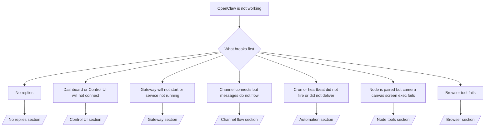

---
read_when:
    - OpenClaw не працює, і вам потрібен найшвидший шлях до виправлення
    - Вам потрібен процес тріажу, перш ніж заглиблюватися в докладні runbook-и
summary: Центр усунення несправностей OpenClaw, орієнтований передусім на симптоми
title: Загальне усунення несправностей
x-i18n:
    generated_at: "2026-06-27T17:39:52Z"
    model: gpt-5.5
    postprocess_version: locale-links-v1
    provider: openai
    source_hash: ae1236c73e3a5c9237bd81d603e8dca18c595a8bcbb71f5931bfbf2389b342cd
    source_path: help/troubleshooting.md
    workflow: 16
---

Якщо у вас є лише 2 хвилини, використовуйте цю сторінку як вхідну точку для тріажу.

## Перші 60 секунд

Виконайте цю точну послідовність по порядку:

```bash
openclaw status
openclaw status --all
openclaw gateway probe
openclaw gateway status
openclaw doctor
openclaw channels status --probe
openclaw logs --follow
```

Добрий результат в один рядок:

- `openclaw status` → показує налаштовані канали й не має очевидних помилок автентифікації.
- `openclaw status --all` → повний звіт присутній і ним можна поділитися.
- `openclaw gateway probe` → очікувана ціль Gateway доступна (`Reachable: yes`). `Capability: ...` показує, який рівень автентифікації зміг підтвердити пробний запит, а `Read probe: limited - missing scope: operator.read` означає погіршену діагностику, а не збій підключення.
- `openclaw gateway status` → `Runtime: running`, `Connectivity probe: ok` і правдоподібний рядок `Capability: ...`. Використовуйте `--require-rpc`, якщо вам також потрібне підтвердження RPC із read-scope.
- `openclaw doctor` → немає блокувальних помилок конфігурації або служби.
- `openclaw channels status --probe` → доступний Gateway повертає живий стан транспорту для кожного облікового запису плюс результати пробних запитів/аудиту, як-от `works` або `audit ok`; якщо Gateway недоступний, команда повертається до підсумків лише з конфігурації.
- `openclaw logs --follow` → стабільна активність, без повторюваних фатальних помилок.

## Асистент здається обмеженим або без потрібних інструментів

Якщо асистент не може переглядати файли, виконувати команди, використовувати автоматизацію браузера або бачити очікувані інструменти, спершу перевірте фактичний профіль інструментів:

```bash
openclaw status
openclaw status --all
openclaw doctor
```

Поширені причини:

- `tools.profile: "messaging"` навмисно вузький для агентів, що працюють лише з чатом.
- `tools.profile: "coding"` є звичайним профілем для репозиторіїв, файлів, shell і runtime-процесів.
- `tools.profile: "full"` відкриває найширший набір інструментів і має бути обмежений довіреними агентами під контролем оператора.
- Перевизначення `agents.list[].tools` для окремого агента можуть звужувати або розширювати кореневий профіль для одного агента.

Змініть кореневий або агентний профіль інструментів, потім перезапустіть або перезавантажте Gateway і знову виконайте `openclaw status --all`. Див. [Інструменти](/uk/tools) для моделі профілів і перевизначень allow/deny.

## Довгий контекст Anthropic 429

Якщо ви бачите:
`HTTP 429: rate_limit_error: Extra usage is required for long context requests`,
перейдіть до [/gateway/troubleshooting#anthropic-429-extra-usage-required-for-long-context](/uk/gateway/troubleshooting#anthropic-429-extra-usage-required-for-long-context).

## Локальний OpenAI-сумісний бекенд працює напряму, але не працює в OpenClaw

Якщо ваш локальний або самостійно розгорнутий бекенд `/v1` відповідає на невеликі прямі пробні запити `/v1/chat/completions`, але падає на `openclaw infer model run` або звичайних кроках агента:

1. Якщо помилка згадує, що `messages[].content` очікує рядок, задайте `models.providers.<provider>.models[].compat.requiresStringContent: true`.
2. Якщо бекенд усе ще падає лише на кроках агента OpenClaw, задайте `models.providers.<provider>.models[].compat.supportsTools: false` і повторіть спробу.
3. Якщо крихітні прямі виклики все ще працюють, але більші промпти OpenClaw аварійно завершують бекенд, розглядайте решту проблеми як обмеження upstream-моделі/сервера й продовжуйте в докладному runbook:
   [/gateway/troubleshooting#local-openai-compatible-backend-passes-direct-probes-but-agent-runs-fail](/uk/gateway/troubleshooting#local-openai-compatible-backend-passes-direct-probes-but-agent-runs-fail)

## Встановлення Plugin завершується збоєм через відсутні openclaw extensions

Якщо встановлення завершується збоєм із `package.json missing openclaw.extensions`, пакет Plugin використовує стару форму, яку OpenClaw більше не приймає.

Виправте в пакеті Plugin:

1. Додайте `openclaw.extensions` до `package.json`.
2. Спрямуйте записи на зібрані runtime-файли (зазвичай `./dist/index.js`).
3. Повторно опублікуйте Plugin і знову виконайте `openclaw plugins install <package>`.

Приклад:

```json
{
  "name": "@openclaw/my-plugin",
  "version": "1.2.3",
  "openclaw": {
    "extensions": ["./dist/index.js"]
  }
}
```

Довідка: [Архітектура Plugin](/uk/plugins/architecture)

## Політика встановлення блокує встановлення або оновлення Plugin

Якщо оновлення завершується, але Plugin застарілі, вимкнені або показують повідомлення на кшталт `blocked by install policy`, `install policy failed closed` чи `Disabled "<plugin>" after plugin update failure`, перевірте `security.installPolicy`.

Політика встановлення запускається під час встановлення й оновлення Plugin. Версії Plugin, що належать OpenClaw, зазвичай рухаються разом із релізом OpenClaw, тому оновлення OpenClaw також може потребувати відповідних оновлень Plugin `@openclaw/*` під час післяоновлювальної синхронізації.

Уникайте цих широких форм політик, якщо ви також не підтримуєте відповідне правило оновлення:

- Фіксація Plugin, що належать OpenClaw, на одній точній старій версії, наприклад дозвіл лише `@openclaw/*@2026.5.3`.
- Блокування лише за типом джерела, наприклад кожного npm, мережевого або `request.mode: "update"` запиту Plugin.
- Сприйняття команди політики як необов’язкової. Коли `security.installPolicy` увімкнено, відсутній, повільний, нечитабельний або заблокований правами виконуваний файл політики завершується fail-closed.
- Схвалення версій Plugin без урахування `openclawVersion` у запиті політики та метаданих кандидата Plugin.

Безпечніші правила політики дозволяють довірені оновлення Plugin, що належать OpenClaw, коли кандидат сумісний із поточним хостом OpenClaw, замість того щоб назавжди закріплювати один реліз. Якщо ви типово блокуєте npm, зробіть вузький виняток для довірених пакетів Plugin `@openclaw/*` або ідентифікаторів Plugin, які ви використовуєте. Якщо ви розрізняєте запити встановлення й оновлення, застосовуйте те саме правило довіри до `request.mode: "update"`.

Відновлення:

```bash
openclaw doctor --deep
openclaw plugins update --all
openclaw status --all
```

Якщо політика навмисно сувора, послабте її для довіреного вікна оновлення OpenClaw, повторно виконайте `openclaw plugins update --all`, а потім відновіть суворіше правило. Якщо Plugin було вимкнено після збою оновлення, перевірте його й увімкніть повторно лише після успішного оновлення:

```bash
openclaw plugins inspect <plugin-id> --runtime --json
openclaw plugins enable <plugin-id>
```

Довідка: [Політика встановлення оператора](/uk/tools/skills-config#operator-install-policy-securityinstallpolicy)

## Plugin присутній, але заблокований через підозріле володіння

Якщо `openclaw doctor`, налаштування або попередження запуску показують:

```text
blocked plugin candidate: suspicious ownership (... uid=1000, expected uid=0 or root)
plugin present but blocked
```

файли Plugin належать іншому Unix-користувачу, ніж процес, який їх завантажує. Не видаляйте конфігурацію Plugin. Виправте власника файлів або запускайте OpenClaw від того самого користувача, якому належить каталог стану.

Docker-встановлення зазвичай працюють як `node` (uid `1000`). Для стандартного налаштування Docker виправте bind mounts хоста:

```bash
sudo chown -R 1000:1000 /path/to/openclaw-config /path/to/openclaw-workspace
openclaw doctor --fix
```

Якщо ви навмисно запускаєте OpenClaw як root, натомість виправте керований корінь Plugin на власника root:

```bash
sudo chown -R root:root /path/to/openclaw-config/npm
openclaw doctor --fix
```

Докладніша документація:

- [Володіння шляхом Plugin](/uk/tools/plugin#blocked-plugin-path-ownership)
- [Права Docker](/uk/install/docker#permissions-and-eacces)

## Дерево рішень



<AccordionGroup>
  <Accordion title="Немає відповідей">
    ```bash
    openclaw status
    openclaw gateway status
    openclaw channels status --probe
    openclaw pairing list --channel <channel> [--account <id>]
    openclaw logs --follow
    ```

    Добрий результат виглядає так:

    - `Runtime: running`
    - `Connectivity probe: ok`
    - `Capability: read-only`, `write-capable` або `admin-capable`
    - Ваш канал показує, що транспорт підключено, і, де підтримується, `works` або `audit ok` у `channels status --probe`
    - Відправник виглядає схваленим (або політика DM відкрита/allowlist)

    Поширені сигнатури в журналах:

    - `drop guild message (mention required` → mention gating заблокував повідомлення в Discord.
    - `pairing request` → відправник не схвалений і очікує схвалення сполучення через DM.
    - `blocked` / `allowlist` у журналах каналу → відправник, кімната або група відфільтровані.

    Докладні сторінки:

    - [/gateway/troubleshooting#no-replies](/uk/gateway/troubleshooting#no-replies)
    - [/channels/troubleshooting](/uk/channels/troubleshooting)
    - [/channels/pairing](/uk/channels/pairing)

  </Accordion>

  <Accordion title="Dashboard або Control UI не підключається">
    ```bash
    openclaw status
    openclaw gateway status
    openclaw logs --follow
    openclaw doctor
    openclaw channels status --probe
    ```

    Добрий результат виглядає так:

    - `Dashboard: http://...` показано в `openclaw gateway status`
    - `Connectivity probe: ok`
    - `Capability: read-only`, `write-capable` або `admin-capable`
    - Немає циклу автентифікації в журналах

    Поширені сигнатури в журналах:

    - `device identity required` → HTTP/небезпечний контекст не може завершити автентифікацію пристрою.
    - `origin not allowed` → браузерний `Origin` не дозволений для цілі Gateway Control UI.
    - `AUTH_TOKEN_MISMATCH` із підказками повтору (`canRetryWithDeviceToken=true`) → одна довірена повторна спроба з device-token може відбутися автоматично.
    - Ця повторна спроба з кешованим токеном повторно використовує кешований набір scope, збережений разом зі спареним токеном пристрою. Викликачі з явним `deviceToken` / явними `scopes` натомість зберігають запитаний набір scope.
    - На асинхронному шляху Tailscale Serve Control UI невдалі спроби для тієї самої пари `{scope, ip}` серіалізуються до того, як обмежувач записує збій, тому друга конкурентна невдала повторна спроба вже може показати `retry later`.
    - `too many failed authentication attempts (retry later)` з браузерного localhost origin → повторні збої з того самого `Origin` тимчасово заблоковані; інший localhost origin використовує окремий bucket.
    - повторювані `unauthorized` після цієї повторної спроби → неправильний токен/пароль, невідповідність режиму автентифікації або застарілий спарений токен пристрою.
    - `gateway connect failed:` → UI націлений на неправильний URL/порт або недоступний Gateway.

    Докладні сторінки:

    - [/gateway/troubleshooting#dashboard-control-ui-connectivity](/uk/gateway/troubleshooting#dashboard-control-ui-connectivity)
    - [/web/control-ui](/uk/web/control-ui)
    - [/gateway/authentication](/uk/gateway/authentication)

  </Accordion>

  <Accordion title="Gateway не запускається або службу встановлено, але вона не працює">
    ```bash
    openclaw status
    openclaw gateway status
    openclaw logs --follow
    openclaw doctor
    openclaw channels status --probe
    ```

    Добрий результат виглядає так:

    - `Service: ... (loaded)`
    - `Runtime: running`
    - `Connectivity probe: ok`
    - `Capability: read-only`, `write-capable` або `admin-capable`

    Поширені сигнатури в журналах:

    - `Gateway start blocked: set gateway.mode=local` або `existing config is missing gateway.mode` → режим Gateway є віддаленим, або у файлі конфігурації відсутня позначка local-mode і його потрібно виправити.
    - `refusing to bind gateway ... without auth` → прив’язка не до loopback без дійсного шляху автентифікації Gateway (токен/пароль або trusted-proxy, де налаштовано).
    - `another gateway instance is already listening` або `EADDRINUSE` → порт уже зайнятий.

    Докладні сторінки:

    - [/gateway/troubleshooting#gateway-service-not-running](/uk/gateway/troubleshooting#gateway-service-not-running)
    - [/gateway/background-process](/uk/gateway/background-process)
    - [/gateway/configuration](/uk/gateway/configuration)

  </Accordion>

  <Accordion title="Канал підключається, але повідомлення не надходять">
    ```bash
    openclaw status
    openclaw gateway status
    openclaw logs --follow
    openclaw doctor
    openclaw channels status --probe
    ```

    Добрий результат виглядає так:

    - Транспорт каналу підключено.
    - Перевірки сполучення/списку дозволених проходять.
    - Згадки виявляються там, де це потрібно.

    Типові сигнатури журналів:

    - `mention required` → обмеження за згадкою в групі заблокувало обробку.
    - `pairing` / `pending` → відправника DM ще не схвалено.
    - `not_in_channel`, `missing_scope`, `Forbidden`, `401/403` → проблема з токеном дозволів каналу.

    Поглиблені сторінки:

    - [/gateway/troubleshooting#channel-connected-messages-not-flowing](/uk/gateway/troubleshooting#channel-connected-messages-not-flowing)
    - [/channels/troubleshooting](/uk/channels/troubleshooting)

  </Accordion>

  <Accordion title="Cron або Heartbeat не спрацювали чи не доставили повідомлення">
    ```bash
    openclaw status
    openclaw gateway status
    openclaw cron status
    openclaw cron list
    openclaw cron runs --id <jobId> --limit 20
    openclaw logs --follow
    ```

    Добрий результат виглядає так:

    - `cron.status` показує, що його ввімкнено, і має наступне пробудження.
    - `cron runs` показує нещодавні записи `ok`.
    - Heartbeat увімкнено, і він не поза активними годинами.

    Типові сигнатури журналів:

    - `cron: scheduler disabled; jobs will not run automatically` → cron вимкнено.
    - `heartbeat skipped` з `reason=quiet-hours` → поза налаштованими активними годинами.
    - `heartbeat skipped` з `reason=empty-heartbeat-file` → `HEARTBEAT.md` існує, але містить лише порожні рядки, коментар, заголовок, блок коду або порожній каркас контрольного списку.
    - `heartbeat skipped` з `reason=no-tasks-due` → режим завдань `HEARTBEAT.md` активний, але інтервал жодного із завдань ще не настав.
    - `heartbeat skipped` з `reason=alerts-disabled` → видимість heartbeat повністю вимкнено (`showOk`, `showAlerts` і `useIndicator` усі вимкнені).
    - `requests-in-flight` → основна лінія зайнята; пробудження heartbeat було відкладено.
    - `unknown accountId` → цільовий обліковий запис доставки heartbeat не існує.

    Поглиблені сторінки:

    - [/gateway/troubleshooting#cron-and-heartbeat-delivery](/uk/gateway/troubleshooting#cron-and-heartbeat-delivery)
    - [/automation/cron-jobs#troubleshooting](/uk/automation/cron-jobs#troubleshooting)
    - [/gateway/heartbeat](/uk/gateway/heartbeat)

  </Accordion>

  <Accordion title="Node сполучено, але інструмент camera canvas screen exec не працює">
    ```bash
    openclaw status
    openclaw gateway status
    openclaw nodes status
    openclaw nodes describe --node <idOrNameOrIp>
    openclaw logs --follow
    ```

    Добрий результат виглядає так:

    - Node вказано як підключений і сполучений для ролі `node`.
    - Для команди, яку ви викликаєте, існує можливість.
    - Стан дозволів для інструмента надано.

    Типові сигнатури журналів:

    - `NODE_BACKGROUND_UNAVAILABLE` → виведіть застосунок вузла на передній план.
    - `*_PERMISSION_REQUIRED` → дозвіл ОС було відхилено або він відсутній.
    - `SYSTEM_RUN_DENIED: approval required` → очікується схвалення exec.
    - `SYSTEM_RUN_DENIED: allowlist miss` → команди немає у списку дозволених для exec.

    Поглиблені сторінки:

    - [/gateway/troubleshooting#node-paired-tool-fails](/uk/gateway/troubleshooting#node-paired-tool-fails)
    - [/nodes/troubleshooting](/uk/nodes/troubleshooting)
    - [/tools/exec-approvals](/uk/tools/exec-approvals)

  </Accordion>

  <Accordion title="Exec раптово запитує схвалення">
    ```bash
    openclaw config get tools.exec.host
    openclaw config get tools.exec.security
    openclaw config get tools.exec.ask
    openclaw gateway restart
    ```

    Що змінилося:

    - Якщо `tools.exec.host` не задано, типовим значенням є `auto`.
    - `host=auto` перетворюється на `sandbox`, коли активне середовище виконання пісочниці, інакше на `gateway`.
    - `host=auto` відповідає лише за маршрутизацію; поведінка "YOLO" без запитів походить від `security=full` плюс `ask=off` на gateway/node.
    - На `gateway` і `node` незадане `tools.exec.security` типово має значення `full`.
    - Незадане `tools.exec.ask` типово має значення `off`.
    - Результат: якщо ви бачите запити на схвалення, якась локальна для хоста або посесійна політика посилила exec відносно поточних типових значень.

    Відновіть поточну типову поведінку без схвалень:

    ```bash
    openclaw config set tools.exec.host gateway
    openclaw config set tools.exec.security full
    openclaw config set tools.exec.ask off
    openclaw gateway restart
    ```

    Безпечніші альтернативи:

    - Встановіть лише `tools.exec.host=gateway`, якщо вам потрібна просто стабільна маршрутизація хоста.
    - Використовуйте `security=allowlist` з `ask=on-miss`, якщо хочете host exec, але все ще хочете перевірку при промахах списку дозволених.
    - Увімкніть режим пісочниці, якщо хочете, щоб `host=auto` знову перетворювався на `sandbox`.

    Типові сигнатури журналів:

    - `Approval required.` → команда очікує на `/approve ...`.
    - `SYSTEM_RUN_DENIED: approval required` → очікується схвалення exec на хості node.
    - `exec host=sandbox requires a sandbox runtime for this session` → неявний/явний вибір sandbox, але режим пісочниці вимкнено.

    Поглиблені сторінки:

    - [/tools/exec](/uk/tools/exec)
    - [/tools/exec-approvals](/uk/tools/exec-approvals)
    - [/gateway/security#what-the-audit-checks-high-level](/uk/gateway/security#what-the-audit-checks-high-level)

  </Accordion>

  <Accordion title="Інструмент браузера не працює">
    ```bash
    openclaw status
    openclaw gateway status
    openclaw browser status
    openclaw logs --follow
    openclaw doctor
    ```

    Добрий результат виглядає так:

    - Статус браузера показує `running: true` і вибраний браузер/профіль.
    - `openclaw` запускається, або `user` може бачити локальні вкладки Chrome.

    Типові сигнатури журналів:

    - `unknown command "browser"` або `unknown command 'browser'` → `plugins.allow` задано, і він не містить `browser`.
    - `Failed to start Chrome CDP on port` → запуск локального браузера не вдався.
    - `browser.executablePath not found` → налаштований шлях до бінарного файла неправильний.
    - `browser.cdpUrl must be http(s) or ws(s)` → налаштована URL-адреса CDP використовує непідтримувану схему.
    - `browser.cdpUrl has invalid port` → налаштована URL-адреса CDP має неправильний або позадіапазонний порт.
    - `No Chrome tabs found for profile="user"` → профіль приєднання Chrome MCP не має відкритих локальних вкладок Chrome.
    - `Remote CDP for profile "<name>" is not reachable` → налаштована віддалена кінцева точка CDP недоступна з цього хоста.
    - `Browser attachOnly is enabled ... not reachable` або `Browser attachOnly is enabled and CDP websocket ... is not reachable` → профіль лише для приєднання не має активної цілі CDP.
    - застарілі перевизначення viewport / темного режиму / локалі / offline у профілях лише для приєднання або віддаленого CDP → запустіть `openclaw browser stop --browser-profile <name>`, щоб закрити активний сеанс керування та звільнити стан емуляції без перезапуску gateway.

    Поглиблені сторінки:

    - [/gateway/troubleshooting#browser-tool-fails](/uk/gateway/troubleshooting#browser-tool-fails)
    - [/tools/browser#missing-browser-command-or-tool](/uk/tools/browser#missing-browser-command-or-tool)
    - [/tools/browser-linux-troubleshooting](/uk/tools/browser-linux-troubleshooting)
    - [/tools/browser-wsl2-windows-remote-cdp-troubleshooting](/uk/tools/browser-wsl2-windows-remote-cdp-troubleshooting)

  </Accordion>

</AccordionGroup>

## Пов’язане

- [Поширені запитання](/uk/help/faq) — поширені запитання
- [Усунення несправностей Gateway](/uk/gateway/troubleshooting) — проблеми, специфічні для gateway
- [Doctor](/uk/gateway/doctor) — автоматизовані перевірки стану та виправлення
- [Усунення несправностей каналу](/uk/channels/troubleshooting) — проблеми з підключенням каналу
- [Усунення несправностей автоматизації](/uk/automation/cron-jobs#troubleshooting) — проблеми з cron і heartbeat
