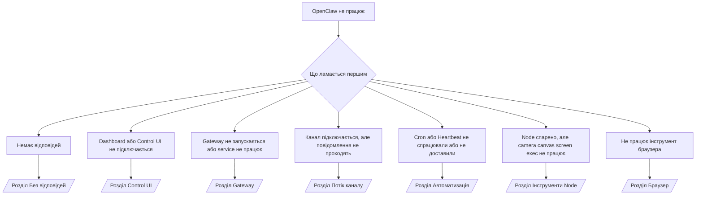

---
read_when:
    - OpenClaw не працює, і вам потрібен найшвидший шлях до виправлення
    - Ви хочете пройти етап тріажу перед зануренням у детальні runbook-и
summary: Центр усунення несправностей OpenClaw з підходом «від симптому»
title: Загальне усунення несправностей
x-i18n:
    generated_at: "2026-04-23T20:56:05Z"
    model: gpt-5.4
    provider: openai
    source_hash: ce06ddce9de9e5824b4c5e8c182df07b29ce3ff113eb8e29c62aef9a4682e8e9
    source_path: help/troubleshooting.md
    workflow: 15
---

# Усунення несправностей

Якщо у вас є лише 2 хвилини, використовуйте цю сторінку як вхідну точку для тріажу.

## Перші 60 секунд

Виконайте цей точний ланцюжок команд по порядку:

```bash
openclaw status
openclaw status --all
openclaw gateway probe
openclaw gateway status
openclaw doctor
openclaw channels status --probe
openclaw logs --follow
```

Хороший результат в одному рядку:

- `openclaw status` → показує налаштовані канали та не має очевидних помилок auth.
- `openclaw status --all` → повний звіт присутній і його можна поширити.
- `openclaw gateway probe` → очікувана ціль gateway доступна (`Reachable: yes`). `Capability: ...` показує, який рівень auth probe змогла підтвердити, а `Read probe: limited - missing scope: operator.read` означає деградовану діагностику, а не збій підключення.
- `openclaw gateway status` → `Runtime: running`, `Connectivity probe: ok` і правдоподібний рядок `Capability: ...`. Використовуйте `--require-rpc`, якщо вам також потрібне підтвердження RPC з областю доступу читання.
- `openclaw doctor` → немає блокуючих помилок config/service.
- `openclaw channels status --probe` → доступний gateway повертає live-стан транспорту для кожного облікового запису плюс результати probe/audit, як-от `works` або `audit ok`; якщо gateway недоступний, команда повертається до зведень лише з конфігурації.
- `openclaw logs --follow` → стабільна активність, без повторюваних фатальних помилок.

## Anthropic long context 429

Якщо ви бачите:
`HTTP 429: rate_limit_error: Extra usage is required for long context requests`,
перейдіть до [/gateway/troubleshooting#anthropic-429-extra-usage-required-for-long-context](/uk/gateway/troubleshooting#anthropic-429-extra-usage-required-for-long-context).

## Локальний backend, сумісний з OpenAI, працює напряму, але не працює в OpenClaw

Якщо ваш локальний або self-hosted backend `/v1` відповідає на малі прямі
probe `/v1/chat/completions`, але не працює з `openclaw infer model run` або на звичайних
ходах агента:

1. Якщо помилка згадує, що `messages[].content` очікує рядок, установіть
   `models.providers.<provider>.models[].compat.requiresStringContent: true`.
2. Якщо backend усе ще не працює лише на ходах агента OpenClaw, установіть
   `models.providers.<provider>.models[].compat.supportsTools: false` і повторіть спробу.
3. Якщо малі прямі виклики все ще працюють, а більші prompt OpenClaw аварійно
   завершують backend, розглядайте залишкову проблему як обмеження моделі/сервера на стороні upstream і
   переходьте до детального runbook:
   [/gateway/troubleshooting#local-openai-compatible-backend-passes-direct-probes-but-agent-runs-fail](/uk/gateway/troubleshooting#local-openai-compatible-backend-passes-direct-probes-but-agent-runs-fail)

## Встановлення Plugin завершується помилкою через відсутні openclaw extensions

Якщо встановлення завершується помилкою `package.json missing openclaw.extensions`, пакет Plugin
використовує стару форму, яку OpenClaw більше не приймає.

Виправлення в пакеті Plugin:

1. Додайте `openclaw.extensions` у `package.json`.
2. Спрямуйте записи на зібрані runtime-файли (зазвичай `./dist/index.js`).
3. Повторно опублікуйте Plugin і знову виконайте `openclaw plugins install <package>`.

Приклад:

```json
{
  "name": "@openclaw/my-plugin",
  "version": "1.2.3",
  "openclaw": {
    "extensions": ["./dist/index.js"]
  }
}
```

Довідка: [Plugin architecture](/uk/plugins/architecture)

## Дерево рішень



<AccordionGroup>
  <Accordion title="Немає відповідей">
    ```bash
    openclaw status
    openclaw gateway status
    openclaw channels status --probe
    openclaw pairing list --channel <channel> [--account <id>]
    openclaw logs --follow
    ```

    Хороший результат виглядає так:

    - `Runtime: running`
    - `Connectivity probe: ok`
    - `Capability: read-only`, `write-capable` або `admin-capable`
    - Ваш канал показує підключений транспорт і, де це підтримується, `works` або `audit ok` у `channels status --probe`
    - Відправник позначений як схвалений (або політика DM — open/allowlist)

    Поширені сигнатури в журналах:

    - `drop guild message (mention required` → перевірка згадки заблокувала повідомлення в Discord.
    - `pairing request` → відправника не схвалено, і він очікує погодження спарювання DM.
    - `blocked` / `allowlist` у журналах каналу → відправника, кімнату або групу відфільтровано.

    Детальні сторінки:

    - [/gateway/troubleshooting#no-replies](/uk/gateway/troubleshooting#no-replies)
    - [/channels/troubleshooting](/uk/channels/troubleshooting)
    - [/channels/pairing](/uk/channels/pairing)

  </Accordion>

  <Accordion title="Dashboard або Control UI не підключається">
    ```bash
    openclaw status
    openclaw gateway status
    openclaw logs --follow
    openclaw doctor
    openclaw channels status --probe
    ```

    Хороший результат виглядає так:

    - `Dashboard: http://...` показано в `openclaw gateway status`
    - `Connectivity probe: ok`
    - `Capability: read-only`, `write-capable` або `admin-capable`
    - У журналах немає циклу auth

    Поширені сигнатури в журналах:

    - `device identity required` → HTTP/незахищений контекст не може завершити автентифікацію пристрою.
    - `origin not allowed` → browser `Origin` не дозволений для
      цілі gateway Control UI.
    - `AUTH_TOKEN_MISMATCH` з підказками повторної спроби (`canRetryWithDeviceToken=true`) → одна повторна спроба з кешованим токеном пристрою може відбутися автоматично.
    - Ця повторна спроба з кешованим токеном повторно використовує набір scope, кешований разом із paired
      device token. Виклики з явним `deviceToken` / явними `scopes` зберігають
      власний запитаний набір scope.
    - На асинхронному шляху Tailscale Serve Control UI невдалі спроби для того самого
      `{scope, ip}` серіалізуються до того, як обмежувач зафіксує помилку, тож
      друга одночасна невдала повторна спроба вже може показати `retry later`.
    - `too many failed authentication attempts (retry later)` з localhost-origin браузера → повторні збої з того самого `Origin` тимчасово
      блокуються; інший localhost-origin використовує окремий bucket.
    - повторюване `unauthorized` після цієї повторної спроби → неправильний токен/пароль, невідповідність режиму auth або застарілий paired device token.
    - `gateway connect failed:` → UI націлений на неправильний URL/port або недоступний gateway.

    Детальні сторінки:

    - [/gateway/troubleshooting#dashboard-control-ui-connectivity](/uk/gateway/troubleshooting#dashboard-control-ui-connectivity)
    - [/web/control-ui](/uk/web/control-ui)
    - [/gateway/authentication](/uk/gateway/authentication)

  </Accordion>

  <Accordion title="Gateway не запускається або service встановлено, але він не працює">
    ```bash
    openclaw status
    openclaw gateway status
    openclaw logs --follow
    openclaw doctor
    openclaw channels status --probe
    ```

    Хороший результат виглядає так:

    - `Service: ... (loaded)`
    - `Runtime: running`
    - `Connectivity probe: ok`
    - `Capability: read-only`, `write-capable` або `admin-capable`

    Поширені сигнатури в журналах:

    - `Gateway start blocked: set gateway.mode=local` або `existing config is missing gateway.mode` → режим gateway — remote, або у файлі конфігурації немає позначки локального режиму, і його слід відновити.
    - `refusing to bind gateway ... without auth` → bind не в loopback без валідного шляху auth gateway (токен/пароль або trusted-proxy, якщо це налаштовано).
    - `another gateway instance is already listening` або `EADDRINUSE` → порт уже зайнято.

    Детальні сторінки:

    - [/gateway/troubleshooting#gateway-service-not-running](/uk/gateway/troubleshooting#gateway-service-not-running)
    - [/gateway/background-process](/uk/gateway/background-process)
    - [/gateway/configuration](/uk/gateway/configuration)

  </Accordion>

  <Accordion title="Канал підключається, але повідомлення не проходять">
    ```bash
    openclaw status
    openclaw gateway status
    openclaw logs --follow
    openclaw doctor
    openclaw channels status --probe
    ```

    Хороший результат виглядає так:

    - Транспорт каналу підключено.
    - Перевірки pairing/allowlist проходять.
    - Згадки визначаються там, де вони потрібні.

    Поширені сигнатури в журналах:

    - `mention required` → перевірка згадки в групі заблокувала обробку.
    - `pairing` / `pending` → відправника DM ще не схвалено.
    - `not_in_channel`, `missing_scope`, `Forbidden`, `401/403` → проблема з токеном дозволів каналу.

    Детальні сторінки:

    - [/gateway/troubleshooting#channel-connected-messages-not-flowing](/uk/gateway/troubleshooting#channel-connected-messages-not-flowing)
    - [/channels/troubleshooting](/uk/channels/troubleshooting)

  </Accordion>

  <Accordion title="Cron або Heartbeat не спрацювали або не доставили">
    ```bash
    openclaw status
    openclaw gateway status
    openclaw cron status
    openclaw cron list
    openclaw cron runs --id <jobId> --limit 20
    openclaw logs --follow
    ```

    Хороший результат виглядає так:

    - `cron.status` показує, що планувальник увімкнено й є наступне пробудження.
    - `cron runs` показує недавні записи `ok`.
    - Heartbeat увімкнено й він не поза активними годинами.

    Поширені сигнатури в журналах:

    - `cron: scheduler disabled; jobs will not run automatically` → cron вимкнено.
    - `heartbeat skipped` з `reason=quiet-hours` → поза налаштованими активними годинами.
    - `heartbeat skipped` з `reason=empty-heartbeat-file` → `HEARTBEAT.md` існує, але містить лише порожній вміст/каркас із заголовків.
    - `heartbeat skipped` з `reason=no-tasks-due` → у `HEARTBEAT.md` активний режим завдань, але для жодного інтервалу завдань ще не настав час.
    - `heartbeat skipped` з `reason=alerts-disabled` → усю видимість heartbeat вимкнено (`showOk`, `showAlerts` і `useIndicator` одночасно вимкнені).
    - `requests-in-flight` → основна доріжка зайнята; пробудження heartbeat відкладено.
    - `unknown accountId` → цільовий account для доставки heartbeat не існує.

    Детальні сторінки:

    - [/gateway/troubleshooting#cron-and-heartbeat-delivery](/uk/gateway/troubleshooting#cron-and-heartbeat-delivery)
    - [/automation/cron-jobs#troubleshooting](/uk/automation/cron-jobs#troubleshooting)
    - [/gateway/heartbeat](/uk/gateway/heartbeat)

  </Accordion>

  <Accordion title="Node спарено, але не працює інструмент camera canvas screen exec">
    ```bash
    openclaw status
    openclaw gateway status
    openclaw nodes status
    openclaw nodes describe --node <idOrNameOrIp>
    openclaw logs --follow
    ```

    Хороший результат виглядає так:

    - Node позначено як підключений і спарений для ролі `node`.
    - Для команди, яку ви викликаєте, існує відповідна можливість.
    - Для інструмента надано потрібний стан дозволу.

    Поширені сигнатури в журналах:

    - `NODE_BACKGROUND_UNAVAILABLE` → переведіть застосунок Node на передній план.
    - `*_PERMISSION_REQUIRED` → дозвіл ОС було відхилено або не надано.
    - `SYSTEM_RUN_DENIED: approval required` → погодження exec очікує.
    - `SYSTEM_RUN_DENIED: allowlist miss` → команда відсутня в allowlist exec.

    Детальні сторінки:

    - [/gateway/troubleshooting#node-paired-tool-fails](/uk/gateway/troubleshooting#node-paired-tool-fails)
    - [/nodes/troubleshooting](/uk/nodes/troubleshooting)
    - [/tools/exec-approvals](/uk/tools/exec-approvals)

  </Accordion>

  <Accordion title="Exec раптом почав запитувати погодження">
    ```bash
    openclaw config get tools.exec.host
    openclaw config get tools.exec.security
    openclaw config get tools.exec.ask
    openclaw gateway restart
    ```

    Що змінилося:

    - Якщо `tools.exec.host` не задано, типове значення — `auto`.
    - `host=auto` визначається як `sandbox`, коли активний runtime sandbox, і як `gateway` в іншому випадку.
    - `host=auto` відповідає лише за маршрутизацію; поведінка без запиту в стилі "YOLO" походить від `security=full` плюс `ask=off` на gateway/node.
    - Для `gateway` і `node` незадане `tools.exec.security` типово дорівнює `full`.
    - Незадане `tools.exec.ask` типово дорівнює `off`.
    - Результат: якщо ви бачите запити на погодження, значить якась локальна для хоста або для сесії policy зробила exec суворішим порівняно з поточними типовими значеннями.

    Відновіть поточну типову поведінку без погодження:

    ```bash
    openclaw config set tools.exec.host gateway
    openclaw config set tools.exec.security full
    openclaw config set tools.exec.ask off
    openclaw gateway restart
    ```

    Безпечніші альтернативи:

    - Установіть лише `tools.exec.host=gateway`, якщо вам просто потрібна стабільна маршрутизація через хост.
    - Використовуйте `security=allowlist` з `ask=on-miss`, якщо хочете host exec, але все ж хочете перевірку при пропусках allowlist.
    - Увімкніть режим sandbox, якщо хочете, щоб `host=auto` знову визначався як `sandbox`.

    Поширені сигнатури в журналах:

    - `Approval required.` → команда очікує на `/approve ...`.
    - `SYSTEM_RUN_DENIED: approval required` → очікує погодження exec на хості node.
    - `exec host=sandbox requires a sandbox runtime for this session` → неявно/явно вибрано sandbox, але режим sandbox вимкнено.

    Детальні сторінки:

    - [/tools/exec](/uk/tools/exec)
    - [/tools/exec-approvals](/uk/tools/exec-approvals)
    - [/gateway/security#what-the-audit-checks-high-level](/uk/gateway/security#what-the-audit-checks-high-level)

  </Accordion>

  <Accordion title="Не працює інструмент браузера">
    ```bash
    openclaw status
    openclaw gateway status
    openclaw browser status
    openclaw logs --follow
    openclaw doctor
    ```

    Хороший результат виглядає так:

    - У статусі браузера показано `running: true` і вибраний browser/profile.
    - `openclaw` запускається, або `user` бачить локальні вкладки Chrome.

    Поширені сигнатури в журналах:

    - `unknown command "browser"` або `unknown command 'browser'` → задано `plugins.allow`, і він не включає `browser`.
    - `Failed to start Chrome CDP on port` → не вдалося запустити локальний браузер.
    - `browser.executablePath not found` → налаштовано неправильний шлях до бінарного файла.
    - `browser.cdpUrl must be http(s) or ws(s)` → налаштований CDP URL використовує непідтримувану схему.
    - `browser.cdpUrl has invalid port` → налаштований CDP URL має некоректний або вихідний за межі діапазону port.
    - `No Chrome tabs found for profile="user"` → для profile підключення Chrome MCP немає відкритих локальних вкладок Chrome.
    - `Remote CDP for profile "<name>" is not reachable` → налаштований endpoint віддаленого CDP недоступний із цього хоста.
    - `Browser attachOnly is enabled ... not reachable` або `Browser attachOnly is enabled and CDP websocket ... is not reachable` → profile attach-only не має живої цілі CDP.
    - застарілі перевизначення viewport / dark-mode / locale / offline для attach-only або profile віддаленого CDP → виконайте `openclaw browser stop --browser-profile <name>`, щоб закрити активну керувальну сесію й звільнити стан емуляції без перезапуску gateway.

    Детальні сторінки:

    - [/gateway/troubleshooting#browser-tool-fails](/uk/gateway/troubleshooting#browser-tool-fails)
    - [/tools/browser#missing-browser-command-or-tool](/uk/tools/browser#missing-browser-command-or-tool)
    - [/tools/browser-linux-troubleshooting](/uk/tools/browser-linux-troubleshooting)
    - [/tools/browser-wsl2-windows-remote-cdp-troubleshooting](/uk/tools/browser-wsl2-windows-remote-cdp-troubleshooting)

  </Accordion>

</AccordionGroup>

## Пов’язане

- [FAQ](/uk/help/faq) — поширені запитання
- [Gateway Troubleshooting](/uk/gateway/troubleshooting) — проблеми, специфічні для gateway
- [Doctor](/uk/gateway/doctor) — автоматизовані перевірки стану й відновлення
- [Channel Troubleshooting](/uk/channels/troubleshooting) — проблеми з підключенням каналів
- [Automation Troubleshooting](/uk/automation/cron-jobs#troubleshooting) — проблеми з cron і Heartbeat
