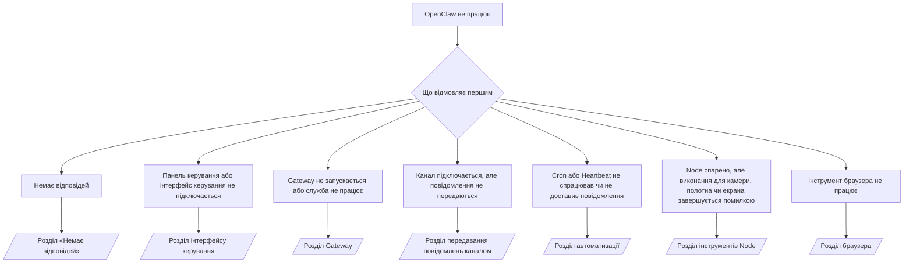

---
read_when:
    - OpenClaw не працює, і вам потрібен найшвидший шлях до виправлення
    - Вам потрібен процес сортування перед переходом до докладних інструкцій з усунення проблем
summary: Центр усунення несправностей OpenClaw за симптомами
title: Загальне усунення несправностей
x-i18n:
    generated_at: "2026-07-12T13:24:39Z"
    model: gpt-5.6
    postprocess_version: locale-links-v1
    provider: openai
    source_hash: db50e0cdf4d11f3aa6196be445358d904a2b9c40c89243f1b124c77167f6dd85
    source_path: help/troubleshooting.md
    workflow: 16
---

Основна точка входу для діагностики. 2 хвилини до встановлення причини, потім переходьте до докладної сторінки.

## Перші 60 секунд

Виконайте ці команди по черзі:

```bash
openclaw status
openclaw status --all
openclaw gateway probe
openclaw gateway status
openclaw doctor
openclaw channels status --probe
openclaw logs --follow
```

Ознаки справної роботи, по одному рядку для кожної команди:

- `openclaw status` показує налаштовані канали без помилок автентифікації.
- `openclaw status --all` створює повний звіт, яким можна поділитися.
- `openclaw gateway probe` показує `Reachable: yes`. `Capability: ...` — це
  рівень авторизації, підтверджений перевіркою; `Read probe: limited - missing scope:
operator.read` означає обмежену діагностику, а не помилку підключення.
- `openclaw gateway status` показує `Runtime: running`, `Connectivity probe:
ok` і правдоподібне значення `Capability: ...`. Додайте `--require-rpc`, щоб також вимагати
  підтвердження RPC із дозволом на читання.
- `openclaw doctor` не повідомляє про критичні помилки конфігурації або служби.
- `openclaw channels status --probe` повертає актуальний стан транспорту для кожного облікового запису
  (`works` / `audit ok`), коли Gateway доступний; інакше повертає
  лише зведення конфігурації.
- `openclaw logs --follow` показує стабільну активність без повторюваних критичних помилок.

## Можливості асистента здаються обмеженими або інструменти відсутні

Перевірте фактичний профіль інструментів:

```bash
openclaw status
openclaw status --all
openclaw doctor
```

Поширені причини:

- `tools.profile: "minimal"` дозволяє лише `session_status`.
- `tools.profile: "messaging"` має вузькі можливості й призначений для агентів, що працюють лише в чаті.
- `tools.profile: "coding"` — типовий профіль для нових локальних конфігурацій (робота з репозиторіями, файлами,
  оболонкою та середовищем виконання).
- `tools.profile: "full"` знімає обмеження профілю; використовуйте лише для довірених
  агентів під керуванням оператора.
- Значення `agents.list[].tools` для окремого агента звужує або розширює кореневий профіль
  для цього агента.

Змініть профіль, перезапустіть або перезавантажте Gateway, а потім повторно перевірте за допомогою
`openclaw status --all`. Повна таблиця профілів і груп: [Профілі інструментів](/uk/gateway/config-tools#tool-profiles).

## Помилка Anthropic 429 для довгого контексту

`HTTP 429: rate_limit_error: Extra usage is required for long context requests`
→ [Для довгого контексту Anthropic 429 потрібне додаткове використання](/uk/gateway/troubleshooting#anthropic-429-extra-usage-required-for-long-context).

## Локальний сервер, сумісний з OpenAI, працює напряму, але не працює в OpenClaw

Ваш локальний або самостійно розміщений сервер `/v1` відповідає на прямі перевірки
`/v1/chat/completions`, але дає збій під час `openclaw infer model run` або звичайних викликів агента:

1. Якщо в помилці зазначено, що `messages[].content` має бути рядком, установіть
   `models.providers.<provider>.models[].compat.requiresStringContent: true`.
2. Якщо збій усе ще виникає лише під час викликів агента OpenClaw, установіть
   `models.providers.<provider>.models[].compat.supportsTools: false` і повторіть спробу.
3. Якщо короткі прямі виклики працюють, але великі запити OpenClaw спричиняють аварійне завершення сервера,
   це обмеження моделі або сервера верхнього рівня, а не помилка OpenClaw. Продовжуйте в розділі
   [Локальний сервер, сумісний з OpenAI, проходить прямі перевірки, але виклики агента завершуються помилкою](/uk/gateway/troubleshooting#local-openai-compatible-backend-passes-direct-probes-but-agent-runs-fail).

## Установлення Plugin завершується помилкою через відсутність розширень openclaw

`package.json missing openclaw.extensions` означає, що пакет Plugin використовує
структуру, яку OpenClaw більше не приймає.

Виправлення в пакеті Plugin:

1. Додайте `openclaw.extensions` до `package.json`, указавши зібрані файли
   середовища виконання (зазвичай `./dist/index.js`).
2. Повторно опублікуйте пакет, а потім знову виконайте `openclaw plugins install <package>`.

```json
{
  "name": "@openclaw/my-plugin",
  "version": "1.2.3",
  "openclaw": {
    "extensions": ["./dist/index.js"]
  }
}
```

Довідка: [Архітектура Plugin](/uk/plugins/architecture)

## Політика встановлення блокує встановлення або оновлення Plugin

Оновлення завершується, але Plugin застарілі, вимкнені або показують `blocked by install
policy`, `install policy failed closed` чи `Disabled "<plugin>" after plugin
update failure`: перевірте `security.installPolicy`.

Політика встановлення застосовується під час установлення й оновлення Plugin. Версії Plugin
`@openclaw/*` зазвичай оновлюються разом із випуском OpenClaw, тому оновлення OpenClaw може
потребувати відповідного оновлення Plugin під час синхронізації після оновлення.

Уникайте таких варіантів політики, якщо ви також не підтримуєте відповідне правило оновлення:

- Фіксація Plugin, що належать OpenClaw, на одній конкретній старій версії (наприклад, лише
  `@openclaw/*@2026.5.3`).
- Блокування лише за типом джерела (усі запити npm, мережеві запити або запити `request.mode:
"update"`).
- Визнання команди політики необов’язковою: коли `security.installPolicy`
  увімкнено, відсутній, повільний, недоступний для читання або заблокований дозволами виконуваний файл політики
  призводить до блокування.
- Схвалення версій без перевірки `openclawVersion` із запиту щодо
  метаданих кандидата Plugin.

Віддавайте перевагу правилам, які дозволяють оновлення довірених Plugin `@openclaw/*`,
сумісних із поточним хостом, замість безстрокової фіксації одного випуску. Якщо ви типово
блокуєте npm, додайте вузький виняток для ідентифікаторів Plugin, які використовуєте, і застосуйте те саме
правило довіри до `request.mode: "update"`, що й до встановлень.

Відновлення:

```bash
openclaw doctor --deep
openclaw plugins update --all
openclaw status --all
```

Якщо політика навмисно сувора, тимчасово послабте її на період довіреного оновлення,
повторно виконайте `openclaw plugins update --all`, а потім відновіть суворіше правило.
Якщо невдале оновлення вимкнуло Plugin, перевірте його перед повторним увімкненням:

```bash
openclaw plugins inspect <plugin-id> --runtime --json
openclaw plugins enable <plugin-id>
```

Довідка: [Політика встановлення оператора](/uk/tools/skills-config#operator-install-policy-securityinstallpolicy)

## Plugin наявний, але заблокований через підозрілого власника

Попередження `openclaw doctor`, налаштування або запуску показують:

```text
blocked plugin candidate: suspicious ownership (... uid=1000, expected uid=0 or root)
plugin present but blocked
```

Файли Plugin належать іншому користувачеві Unix, ніж процес, який їх завантажує.
Не видаляйте конфігурацію Plugin; виправте власника файлів або запускайте
OpenClaw від імені користувача, якому належить каталог стану.

Установлення Docker запускаються від імені `node` (uid `1000`). Виправте прив’язані каталоги хоста:

```bash
sudo chown -R 1000:1000 /path/to/openclaw-config /path/to/openclaw-workspace
openclaw doctor --fix
```

Якщо ви навмисно запускаєте OpenClaw від імені root, натомість виправте власника
керованого кореневого каталогу Plugin:

```bash
sudo chown -R root:root /path/to/openclaw-config/npm
openclaw doctor --fix
```

Докладніше: [Заблокований власник шляху Plugin](/uk/tools/plugin#blocked-plugin-path-ownership), [Docker: дозволи та EACCES](/uk/install/docker#shell-helpers-optional)

## Дерево рішень



<AccordionGroup>
  <Accordion title="Немає відповідей">
    ```bash
    openclaw status
    openclaw gateway status
    openclaw channels status --probe
    openclaw pairing list --channel <channel> [--account <id>]
    openclaw logs --follow
    ```

    Ознаки справної роботи:

    - `Runtime: running`
    - `Connectivity probe: ok`
    - `Capability: read-only`, `write-capable` або `admin-capable`
    - Канал показує, що транспорт підключено, а де це підтримується — `works` або
      `audit ok` у `channels status --probe`
    - Відправника схвалено (або політика приватних повідомлень відкрита чи використовує список дозволених)

    Сигнатури журналу:

    - `drop guild message (mention required` → перевірка згадування в Discord заблокувала повідомлення.
    - `pairing request` → відправника не схвалено, очікується схвалення спарювання через приватне повідомлення.
    - `blocked` / `allowlist` у журналах каналу → відправника, кімнату або групу відфільтровано.

    Докладні сторінки: [Немає відповідей](/uk/gateway/troubleshooting#no-replies), [Усунення несправностей каналів](/uk/channels/troubleshooting), [Спарювання](/uk/channels/pairing)

  </Accordion>

  <Accordion title="Панель керування або інтерфейс керування не підключається">
    ```bash
    openclaw status
    openclaw gateway status
    openclaw logs --follow
    openclaw doctor
    openclaw channels status --probe
    ```

    Ознаки справної роботи:

    - `Dashboard: http://...` відображається у `openclaw gateway status`
    - `Connectivity probe: ok`
    - `Capability: read-only`, `write-capable` або `admin-capable`
    - У журналах немає циклу автентифікації

    Сигнатури журналу:

    - `device identity required` → контекст HTTP або незахищений контекст не може завершити автентифікацію пристрою.
    - `origin not allowed` → браузерний `Origin` не дозволено для цільового Gateway інтерфейсу керування.
    - `AUTH_TOKEN_MISMATCH` із `canRetryWithDeviceToken=true` → може автоматично відбутися одна повторна спроба з довіреним токеном пристрою з повторним використанням кешованих областей дії спареного токена.
    - повторюване `unauthorized` після цієї спроби → неправильний токен або пароль, невідповідність режиму автентифікації чи застарілий токен спареного пристрою.
    - `too many failed authentication attempts (retry later)` → повторні невдалі спроби з цього браузерного `Origin` тимчасово заблоковано; інші джерела localhost використовують окремі ліміти. Особливості одночасних повторних спроб Tailscale Serve див. у розділі [Підключення панелі керування та інтерфейсу керування](/uk/gateway/troubleshooting#dashboard-control-ui-connectivity).
    - `gateway connect failed:` → інтерфейс використовує неправильну URL-адресу або порт чи Gateway недоступний.

    Докладні сторінки: [Підключення панелі керування та інтерфейсу керування](/uk/gateway/troubleshooting#dashboard-control-ui-connectivity), [Інтерфейс керування](/uk/web/control-ui), [Автентифікація](/uk/gateway/authentication)

  </Accordion>

  <Accordion title="Gateway не запускається або встановлена служба не працює">
    ```bash
    openclaw status
    openclaw gateway status
    openclaw logs --follow
    openclaw doctor
    openclaw channels status --probe
    ```

    Ознаки справної роботи:

    - `Service: ... (loaded)`
    - `Runtime: running`
    - `Connectivity probe: ok`
    - `Capability: read-only`, `write-capable` або `admin-capable`

    Сигнатури журналу:

    - `Gateway start blocked: set gateway.mode=local` або `existing config is missing gateway.mode` → режим Gateway віддалений або в конфігурації немає позначки локального режиму й її потрібно виправити.
    - `refusing to bind gateway ... without auth` → прив’язка не до local loopback без дійсного способу автентифікації (токена/пароля або налаштованого довіреного проксі).
    - `another gateway instance is already listening` або `EADDRINUSE` → порт уже зайнятий.

    Докладні сторінки: [Служба Gateway не працює](/uk/gateway/troubleshooting#gateway-service-not-running), [Фоновий процес](/uk/gateway/background-process), [Конфігурація](/uk/gateway/configuration)

  </Accordion>

  <Accordion title="Канал підключається, але повідомлення не передаються">
    ```bash
    openclaw status
    openclaw gateway status
    openclaw logs --follow
    openclaw doctor
    openclaw channels status --probe
    ```

    Ознаки справної роботи:

    - Транспорт каналу підключено.
    - Перевірки спарювання та списку дозволених успішні.
    - Згадування виявляються там, де вони потрібні.

    Сигнатури журналу:

    - `mention required` → перевірка згадування в групі заблокувала обробку.
    - `pairing` / `pending` → відправника приватного повідомлення ще не схвалено.
    - `not_in_channel`, `missing_scope`, `Forbidden`, `401/403` → проблема з токеном дозволів каналу.

    Докладні сторінки: [Канал підключено, але повідомлення не передаються](/uk/gateway/troubleshooting#channel-connected-messages-not-flowing), [Усунення несправностей каналів](/uk/channels/troubleshooting)

  </Accordion>

  <Accordion title="Cron або Heartbeat не спрацював чи не доставив повідомлення">
    ```bash
    openclaw status
    openclaw gateway status
    openclaw cron status
    openclaw cron list
    openclaw cron runs --id <jobId> --limit 20
    openclaw logs --follow
    ```

    Ознаки справної роботи:

    - `cron status` показує, що планувальник увімкнено, і вказує час наступного пробудження.
    - `cron runs` показує нещодавні записи `ok`.
    - Heartbeat увімкнено та працює в межах активних годин.

    Сигнатури журналу:

    - `cron: scheduler disabled; jobs will not run automatically` → cron вимкнено.
    - `heartbeat skipped` із причиною `quiet-hours` → поза налаштованими годинами активності.
    - `heartbeat skipped` із причиною `empty-heartbeat-file` → файл `HEARTBEAT.md` існує, але містить лише порожні рядки, коментарі, заголовки, огорожі блоків коду або заготовки порожніх списків завдань.
    - `heartbeat skipped` із причиною `no-tasks-due` → режим завдань активний, але інтервал виконання жодного завдання ще не настав.
    - `heartbeat skipped` із причиною `alerts-disabled` → `showOk`, `showAlerts` і `useIndicator` вимкнено.
    - `requests-in-flight` → основний канал зайнятий; пробудження Heartbeat відкладено.
    - `unknown accountId` → обліковий запис призначення для доставки Heartbeat не існує.

    Докладні сторінки: [Доставка Cron і Heartbeat](/uk/gateway/troubleshooting#cron-and-heartbeat-delivery), [Заплановані завдання: усунення несправностей](/uk/automation/cron-jobs#troubleshooting), [Heartbeat](/uk/gateway/heartbeat)

  </Accordion>

  <Accordion title="Node спарено, але інструмент не може виконати camera canvas screen exec">
    ```bash
    openclaw status
    openclaw gateway status
    openclaw nodes status
    openclaw nodes describe --node <idOrNameOrIp>
    openclaw logs --follow
    ```

    Очікуваний результат:

    - Node відображається як підключений і спарений для ролі `node`.
    - Можливість, потрібна для викликаної команди, наявна.
    - Інструменту надано необхідний дозвіл.

    Сигнатури журналу:

    - `NODE_BACKGROUND_UNAVAILABLE` → переведіть застосунок Node на передній план.
    - `*_PERMISSION_REQUIRED` → дозвіл ОС відхилено або не надано.
    - `SYSTEM_RUN_DENIED: approval required` → очікується схвалення виконання.
    - `SYSTEM_RUN_DENIED: allowlist miss` → команди немає в списку дозволених для виконання.

    Докладні сторінки: [Node спарено, інструмент не працює](/uk/gateway/troubleshooting#node-paired-tool-fails), [Усунення несправностей Node](/uk/nodes/troubleshooting), [Схвалення виконання](/uk/tools/exec-approvals)

  </Accordion>

  <Accordion title="Exec раптово запитує схвалення">
    ```bash
    openclaw config get tools.exec.host
    openclaw config get tools.exec.security
    openclaw config get tools.exec.ask
    openclaw gateway restart
    ```

    Що змінилося:

    - Якщо `tools.exec.host` не задано, типовим значенням є `auto`, яке визначається як `sandbox`,
      коли середовище sandbox активне, і як `gateway` в інших випадках.
    - `host=auto` лише визначає маршрутизацію; виконання без запитів забезпечує
      поєднання `security=full` і `ask=off` на gateway/node.
    - Якщо `tools.exec.security` не задано, типовим значенням на `gateway`/`node` є `full`.
    - Якщо `tools.exec.ask` не задано, типовим значенням є `off`.
    - Якщо ви бачите запити на схвалення, певна локальна для хоста або сеансова політика
      зробила правила виконання суворішими за ці типові значення.

    Відновіть поточні типові налаштування без схвалення:

    ```bash
    openclaw config set tools.exec.host gateway
    openclaw config set tools.exec.security full
    openclaw config set tools.exec.ask off
    openclaw gateway restart
    ```

    Безпечніші альтернативи:

    - Установіть лише `tools.exec.host=gateway` для стабільної маршрутизації на хост.
    - Використовуйте `security=allowlist` разом з `ask=on-miss`, щоб виконання на хості потребувало перевірки,
      коли команди немає в списку дозволених.
    - Увімкніть режим sandbox, щоб `host=auto` знову визначався як `sandbox`.

    Сигнатури журналу:

    - `Approval required.` → команда очікує на `/approve ...`.
    - `SYSTEM_RUN_DENIED: approval required` → очікується схвалення виконання на хості Node.
    - `exec host=sandbox requires a sandbox runtime for this session` → sandbox вибрано явно або неявно, але режим sandbox вимкнено.

    Докладні сторінки: [Exec](/uk/tools/exec), [Схвалення виконання](/uk/tools/exec-approvals), [Безпека: що перевіряє аудит](/uk/gateway/security#what-the-audit-checks-high-level)

  </Accordion>

  <Accordion title="Інструмент браузера не працює">
    ```bash
    openclaw status
    openclaw gateway status
    openclaw browser status
    openclaw logs --follow
    openclaw doctor
    ```

    Очікуваний результат:

    - Стан браузера показує `running: true` і вибраний браузер/профіль.
    - Профіль `openclaw` запускається, або профіль `user` бачить локальні вкладки Chrome.

    Сигнатури журналу:

    - `unknown command "browser"` → параметр `plugins.allow` задано, але він не включає `browser`.
    - `Failed to start Chrome CDP on port` → не вдалося запустити локальний браузер.
    - `browser.executablePath not found` → шлях до налаштованого виконуваного файлу неправильний.
    - `browser.cdpUrl must be http(s) or ws(s)` → налаштована URL-адреса CDP використовує непідтримувану схему.
    - `browser.cdpUrl has invalid port` → налаштована URL-адреса CDP містить неправильний порт або порт поза допустимим діапазоном.
    - `No Chrome tabs found for profile="user"` → профіль підключення Chrome MCP не має відкритих локальних вкладок Chrome.
    - `Remote CDP for profile "<name>" is not reachable` → налаштована віддалена кінцева точка CDP недоступна з цього хоста.
    - `Browser attachOnly is enabled ... not reachable` → профіль лише для підключення не має активної цілі CDP.
    - Застарілі перевизначення області перегляду, темного режиму, локалі або автономного режиму в профілях лише для підключення чи віддаленого CDP → виконайте `openclaw browser stop --browser-profile <name>`, щоб закрити сеанс керування та звільнити стан емуляції без перезапуску Gateway.

    Докладні сторінки: [Інструмент браузера не працює](/uk/gateway/troubleshooting#browser-tool-fails), [Відсутня команда або інструмент браузера](/uk/tools/browser#missing-browser-command-or-tool), [Браузер: усунення несправностей у Linux](/uk/tools/browser-linux-troubleshooting), [Браузер: усунення несправностей віддаленого CDP у WSL2/Windows](/uk/tools/browser-wsl2-windows-remote-cdp-troubleshooting)

  </Accordion>

</AccordionGroup>

## Пов’язані матеріали

- [Поширені запитання](/uk/help/faq) — відповіді на поширені запитання
- [Усунення несправностей Gateway](/uk/gateway/troubleshooting) — проблеми, пов’язані з Gateway
- [Doctor](/uk/gateway/doctor) — автоматизовані перевірки працездатності та виправлення
- [Усунення несправностей каналів](/uk/channels/troubleshooting) — проблеми з підключенням каналів
- [Заплановані завдання: усунення несправностей](/uk/automation/cron-jobs#troubleshooting) — проблеми з Cron і Heartbeat
