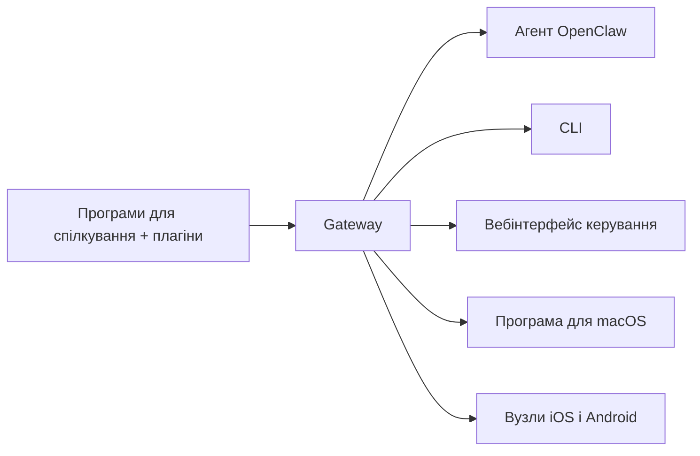

---
read_when:
    - Знайомство новачків з OpenClaw
summary: OpenClaw — це багатоканальний Gateway для агентів ШІ, який працює в будь-якій ОС.
title: OpenClaw
x-i18n:
    generated_at: "2026-07-16T18:00:20Z"
    model: gpt-5.6
    postprocess_version: locale-links-v1
    prompt_version: 32
    provider: openai
    source_hash: fe97e7299be4855fd9af21838e0626b5a5c8aafe46d982859e9033f0efec2443
    source_path: index.md
    workflow: 16
---

# OpenClaw 🦞

<p align="center">
    
    
</p>

> _«ВІДЛУЩУВАТИ! ВІДЛУЩУВАТИ!»_ — Мабуть, космічний омар

<p align="center">
  <strong>Gateway для будь-якої ОС, що дає ШІ-агентам змогу працювати через Discord, Google Chat, iMessage, Matrix, Microsoft Teams, Signal, Slack, Telegram, WhatsApp, Zalo та інші сервіси.</strong><br />
  Надішліть повідомлення й отримайте відповідь агента просто на телефоні. Запустіть один Gateway для плагінів каналів, WebChat і мобільних вузлів.
</p>

<Columns>
  <Card title="Початок роботи" href="/uk/start/getting-started" icon="rocket">
    Установіть OpenClaw і запустіть Gateway за лічені хвилини.
  </Card>
  <Card title="Запуск початкового налаштування" href="/uk/start/wizard" icon="list-checks">
    Покрокове налаштування з `openclaw onboard` і процедурами сполучення.
  </Card>
  <Card title="Підключення каналу" href="/uk/channels" icon="message-circle">
    Підключіть Discord, Signal, Telegram, WhatsApp та інші сервіси, щоб спілкуватися звідусіль.
  </Card>
  <Card title="Відкриття інтерфейсу керування" href="/uk/web/control-ui" icon="layout-dashboard">
    Запустіть панель керування в браузері для чату, конфігурації та сеансів.
  </Card>
</Columns>

## Перегляд документації

У мобільних браузерах меню розділів може відображатися без повної панелі вкладок для настільних пристроїв. Скористайтеся
цими посиланнями на центри, щоб із тексту сторінки перейти до тих самих основних розділів документації.

<Columns>
  <Card title="Початок роботи" href="/uk" icon="rocket">
    Огляд, демонстрація, перші кроки та посібники з налаштування.
  </Card>
  <Card title="Установлення" href="/uk/install" icon="download">
    Способи встановлення, оновлення, контейнери, хостинг і розширене налаштування.
  </Card>
  <Card title="Канали" href="/uk/channels" icon="messages-square">
    Канали обміну повідомленнями, сполучення, маршрутизація, групи доступу та перевірка якості каналів.
  </Card>
  <Card title="Агенти" href="/uk/concepts/architecture" icon="bot">
    Архітектура, сеанси, контекст, пам’ять і багатоагентна маршрутизація.
  </Card>
  <Card title="Можливості" href="/uk/tools" icon="wand-sparkles">
    Інструменти, навички, cron, вебхуки та можливості автоматизації.
  </Card>
  <Card title="ClawHub" href="/uk/clawhub" icon="store">
    Маркетплейс плагінів, публікація, добір і рекомендації щодо довіри.
  </Card>
  <Card title="Моделі" href="/uk/providers" icon="brain">
    Провайдери, налаштування моделей, відновлення після збоїв і локальні сервіси моделей.
  </Card>
  <Card title="Платформи" href="/uk/platforms" icon="monitor-smartphone">
    macOS, Windows, iOS, Android, вузли та вебінтерфейси.
  </Card>
  <Card title="Gateway і експлуатація" href="/uk/gateway" icon="server">
    Конфігурація Gateway, безпека, діагностика та експлуатація.
  </Card>
  <Card title="Довідник" href="/uk/cli" icon="terminal">
    Довідник CLI, схеми, RPC, примітки до випусків і шаблони.
  </Card>
  <Card title="Довідка" href="/uk/help" icon="life-buoy">
    Усунення несправностей, поширені запитання, тестування, діагностика та перевірки середовища.
  </Card>
</Columns>

## Що таке OpenClaw?

OpenClaw — це **самостійно розміщуваний шлюз**, який за допомогою плагінів каналів з’єднує ваші улюблені програми для спілкування — Discord, Google Chat, iMessage, Matrix, Microsoft Teams, Signal, Slack, Telegram, WhatsApp, Zalo та інші — з ШІ-агентами для програмування. Ви запускаєте один процес Gateway на власному комп’ютері (або сервері), і він стає мостом між вашими програмами обміну повідомленнями та завжди доступним ШІ-помічником.

**Для кого це?** Для розробників і досвідчених користувачів, яким потрібен персональний ШІ-помічник, якому можна писати звідусіль, не втрачаючи контролю над своїми даними й не покладаючись на розміщений сторонньою службою сервіс.

**Чим він відрізняється?**

- **Самостійне розміщення**: працює на вашому обладнанні за вашими правилами
- **Багатоканальність**: один Gateway одночасно обслуговує всі налаштовані плагіни каналів
- **Орієнтованість на агентів**: створено для агентів програмування з використанням інструментів, сеансами, пам’яттю та багатоагентною маршрутизацією
- **Відкритий код**: ліцензія MIT, розвиток силами спільноти

**Що потрібно?** Node 24.15+ (рекомендовано), Node 22 LTS (`22.22.3+`) для сумісності або Node 25.9+, ключ API вибраного провайдера та 5 хвилин. Для найкращої якості й безпеки використовуйте найпотужнішу доступну модель останнього покоління.

## Як це працює



Gateway — єдине джерело істини для сеансів, маршрутизації та підключень каналів.

## Основні можливості

<Columns>
  <Card title="Багатоканальний Gateway" icon="network" href="/uk/channels">
    Discord, iMessage, Signal, Slack, Telegram, WhatsApp, WebChat та інші сервіси за допомогою одного процесу Gateway.
  </Card>
  <Card title="Плагіни каналів" icon="plug" href="/uk/tools/plugin">
    Плагіни каналів додають Matrix, Nostr, Twitch, Zalo та інші сервіси; офіційні плагіни встановлюються за потреби.
  </Card>
  <Card title="Багатоагентна маршрутизація" icon="route" href="/uk/concepts/multi-agent">
    Ізольовані сеанси для кожного агента, робочого простору або відправника.
  </Card>
  <Card title="Підтримка медіафайлів" icon="image" href="/uk/nodes/images">
    Надсилання й отримання зображень, аудіо та документів.
  </Card>
  <Card title="Вебінтерфейс керування" icon="monitor" href="/uk/web/control-ui">
    Панель керування в браузері для чату, конфігурації, сеансів і вузлів.
  </Card>
  <Card title="Мобільні вузли" icon="smartphone" href="/uk/nodes">
    Сполучайте вузли iOS і Android для робочих процесів із Canvas, камерою та голосовим керуванням.
  </Card>
</Columns>

## Швидкий початок

<Steps>
  <Step title="Установіть OpenClaw">
    ```bash
    npm install -g openclaw@latest
    ```
  </Step>
  <Step title="Виконайте початкове налаштування та встановіть службу">
    ```bash
    openclaw onboard --install-daemon
    ```
  </Step>
  <Step title="Почніть спілкування">
    Відкрийте інтерфейс керування у браузері та надішліть повідомлення:

    ```bash
    openclaw dashboard
    ```

    Або підключіть канал ([Telegram](/uk/channels/telegram) — найшвидший варіант) і спілкуйтеся з телефона.

  </Step>
</Steps>

Потрібні повні інструкції зі встановлення та налаштування середовища розробки? Дивіться розділ [Початок роботи](/uk/start/getting-started).

## Панель керування

Після запуску Gateway відкрийте інтерфейс керування у браузері.

- Локальна адреса за замовчуванням: [http://127.0.0.1:18789/](http://127.0.0.1:18789/)
- Віддалений доступ: [Вебінтерфейси](/uk/web) і [Tailscale](/uk/gateway/tailscale)

<p align="center">
  
</p>

## Конфігурація (необов’язково)

Конфігурація зберігається в `~/.openclaw/openclaw.json`.

- Якщо **нічого не робити**, OpenClaw використовуватиме вбудоване середовище виконання агента OpenClaw; приватні повідомлення використовуватимуть спільний основний сеанс агента, а кожен груповий чат матиме власний сеанс.
- Щоб обмежити доступ, почніть із `channels.whatsapp.allowFrom` та правил згадування (для груп).

Приклад:

```json5
{
  channels: {
    whatsapp: {
      allowFrom: ["+15555550123"],
      groups: { "*": { requireMention: true } },
    },
  },
  messages: { groupChat: { mentionPatterns: ["@openclaw"] } },
}
```

## Почніть звідси

<Columns>
  <Card title="Центри документації" href="/uk/start/hubs" icon="book-open">
    Уся документація та посібники, упорядковані за сценаріями використання.
  </Card>
  <Card title="Конфігурація" href="/uk/gateway/configuration" icon="settings">
    Основні параметри Gateway, токени та конфігурація провайдера.
  </Card>
  <Card title="Віддалений доступ" href="/uk/gateway/remote" icon="globe">
    Схеми доступу через SSH і tailnet.
  </Card>
  <Card title="Канали" href="/uk/channels/telegram" icon="message-square">
    Налаштування для окремих каналів: Discord, Feishu, Microsoft Teams, Telegram, WhatsApp та інших.
  </Card>
  <Card title="Вузли" href="/uk/nodes" icon="smartphone">
    Вузли iOS і Android зі сполученням, Canvas, камерою та діями пристрою.
  </Card>
  <Card title="Довідка" href="/uk/help" icon="life-buoy">
    Типові виправлення та відправна точка для усунення несправностей.
  </Card>
</Columns>

## Дізнатися більше

<Columns>
  <Card title="Повний перелік функцій" href="/uk/concepts/features" icon="list">
    Повні можливості каналів, маршрутизації та роботи з медіафайлами.
  </Card>
  <Card title="Багатоагентна маршрутизація" href="/uk/concepts/multi-agent" icon="route">
    Ізоляція робочих просторів і окремі сеанси для кожного агента.
  </Card>
  <Card title="Безпека" href="/uk/gateway/security" icon="shield">
    Токени, списки дозволених значень і засоби контролю безпеки.
  </Card>
  <Card title="Усунення несправностей" href="/uk/gateway/troubleshooting" icon="wrench">
    Діагностика Gateway і типові помилки.
  </Card>
  <Card title="Про проєкт і подяки" href="/uk/reference/credits" icon="info">
    Походження проєкту, учасники та ліцензія.
  </Card>
</Columns>
