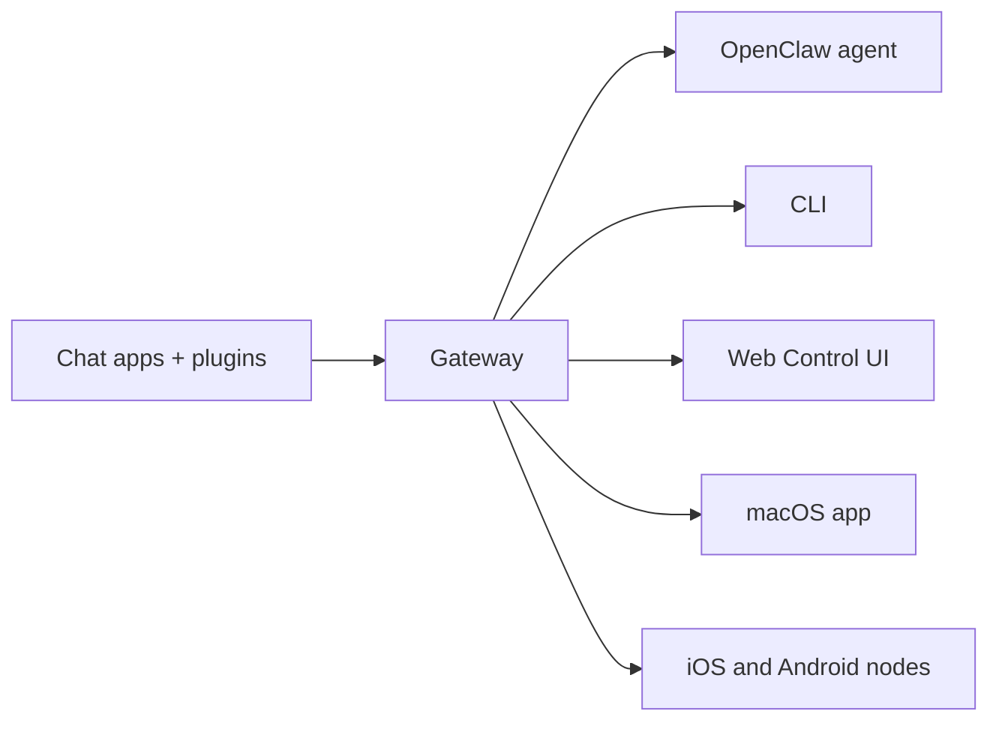

---
read_when:
    - Представлення OpenClaw новачкам
summary: OpenClaw — це багатоканальний Gateway для AI-агентів, який працює на будь-якій ОС.
title: OpenClaw
x-i18n:
    generated_at: "2026-06-27T17:39:47Z"
    model: gpt-5.5
    postprocess_version: locale-links-v1
    provider: openai
    source_hash: fcaa54a0a6d7aa62193fd9f03428bbcbfdcb2c00a184bcd6f49e4e093fefc473
    source_path: index.md
    workflow: 16
---

# OpenClaw 🦞

<p align="center">
    
    
</p>

> _"ВІДЛУЩУЙ! ВІДЛУЩУЙ!"_ — мабуть, космічний омар

<p align="center">
  <strong>Gateway для будь-якої ОС для AI-агентів у Discord, Google Chat, iMessage, Matrix, Microsoft Teams, Signal, Slack, Telegram, WhatsApp, Zalo та інших.</strong><br />
  Надішліть повідомлення й отримайте відповідь агента з кишені. Запускайте один Gateway для вбудованих каналів, комплектних канальних Plugin, WebChat і мобільних вузлів.
</p>

<Columns>
  <Card title="Почати" href="/uk/start/getting-started" icon="rocket">
    Установіть OpenClaw і запустіть Gateway за кілька хвилин.
  </Card>
  <Card title="Запустити онбординг" href="/uk/start/wizard" icon="sparkles">
    Покрокове налаштування з `openclaw onboard` і потоками сполучення.
  </Card>
  <Card title="Відкрити вебінтерфейс керування" href="/uk/web/control-ui" icon="layout-dashboard">
    Запустіть браузерну панель для чату, конфігурації та сеансів.
  </Card>
</Columns>

## Що таке OpenClaw?

OpenClaw — це **самостійно розміщуваний Gateway**, який підключає ваші улюблені чат-застосунки та канальні поверхні — вбудовані канали, а також комплектні або зовнішні канальні Plugin, як-от Discord, Google Chat, iMessage, Matrix, Microsoft Teams, Signal, Slack, Telegram, WhatsApp, Zalo та інші — до AI-агентів для програмування. Ви запускаєте один процес Gateway на власному комп’ютері (або сервері), і він стає мостом між вашими застосунками для обміну повідомленнями та завжди доступним AI-помічником.

**Для кого це?** Для розробників і досвідчених користувачів, яким потрібен персональний AI-помічник, якому можна писати з будь-де, не втрачаючи контролю над своїми даними й не покладаючись на розміщений сервіс.

**Що робить його іншим?**

- **Самостійне розміщення**: працює на вашому обладнанні за вашими правилами
- **Багатоканальність**: один Gateway одночасно обслуговує вбудовані канали та комплектні або зовнішні канальні Plugin
- **Орієнтація на агентів**: створено для агентів програмування з використанням інструментів, сеансами, пам’яттю та маршрутизацією між кількома агентами
- **Відкритий код**: ліцензія MIT, розвиток спільнотою

**Що потрібно?** Node 24 (рекомендовано) або Node 22 LTS (`22.19+`) для сумісності, API-ключ від вибраного провайдера та 5 хвилин. Для найкращої якості й безпеки використовуйте найпотужнішу доступну модель останнього покоління.

## Як це працює



Gateway є єдиним джерелом істини для сеансів, маршрутизації та підключень каналів.

## Ключові можливості

<Columns>
  <Card title="Багатоканальний Gateway" icon="network" href="/uk/channels">
    Discord, iMessage, Signal, Slack, Telegram, WhatsApp, WebChat та інші через один процес Gateway.
  </Card>
  <Card title="Канали Plugin" icon="plug" href="/uk/tools/plugin">
    Комплектні Plugin додають Matrix, Nostr, Twitch, Zalo та інші у звичайних поточних випусках.
  </Card>
  <Card title="Маршрутизація між кількома агентами" icon="route" href="/uk/concepts/multi-agent">
    Ізольовані сеанси для кожного агента, робочого простору або відправника.
  </Card>
  <Card title="Підтримка медіа" icon="image" href="/uk/nodes/images">
    Надсилайте й отримуйте зображення, аудіо та документи.
  </Card>
  <Card title="Вебінтерфейс керування" icon="monitor" href="/uk/web/control-ui">
    Браузерна панель для чату, конфігурації, сеансів і вузлів.
  </Card>
  <Card title="Мобільні вузли" icon="smartphone" href="/uk/nodes">
    Сполучайте вузли iOS і Android для Canvas, камери та робочих процесів із голосом.
  </Card>
</Columns>

## Швидкий старт

<Steps>
  <Step title="Установіть OpenClaw">
    ```bash
    npm install -g openclaw@latest
    ```
  </Step>
  <Step title="Пройдіть онбординг і встановіть сервіс">
    ```bash
    openclaw onboard --install-daemon
    ```
  </Step>
  <Step title="Чат">
    Відкрийте вебінтерфейс керування у браузері та надішліть повідомлення:

    ```bash
    openclaw dashboard
    ```

    Або підключіть канал ([Telegram](/uk/channels/telegram) — найшвидший варіант) і спілкуйтеся з телефона.

  </Step>
</Steps>

Потрібне повне встановлення та налаштування для розробки? Див. [Початок роботи](/uk/start/getting-started).

## Панель

Відкрийте браузерний вебінтерфейс керування після запуску Gateway.

- Локальне значення за замовчуванням: [http://127.0.0.1:18789/](http://127.0.0.1:18789/)
- Віддалений доступ: [Вебповерхні](/uk/web) і [Tailscale](/uk/gateway/tailscale)

<p align="center">
  
</p>

## Конфігурація (необов’язково)

Конфігурація зберігається в `~/.openclaw/openclaw.json`.

- Якщо ви **нічого не робите**, OpenClaw використовує комплектне середовище виконання агента OpenClaw із сеансами для кожного відправника.
- Якщо хочете обмежити доступ, почніть із `channels.whatsapp.allowFrom` і (для груп) правил згадування.

Приклад:

```json5
{
  channels: {
    whatsapp: {
      allowFrom: ["+15555550123"],
      groups: { "*": { requireMention: true } },
    },
  },
  messages: { groupChat: { mentionPatterns: ["@openclaw"] } },
}
```

## Почніть тут

<Columns>
  <Card title="Центри документації" href="/uk/start/hubs" icon="book-open">
    Уся документація та посібники, упорядковані за сценаріями використання.
  </Card>
  <Card title="Конфігурація" href="/uk/gateway/configuration" icon="settings">
    Основні налаштування Gateway, токени та конфігурація провайдера.
  </Card>
  <Card title="Віддалений доступ" href="/uk/gateway/remote" icon="globe">
    Шаблони доступу через SSH і tailnet.
  </Card>
  <Card title="Канали" href="/uk/channels/telegram" icon="message-square">
    Налаштування для окремих каналів: Feishu, Microsoft Teams, WhatsApp, Telegram, Discord та інших.
  </Card>
  <Card title="Вузли" href="/uk/nodes" icon="smartphone">
    Вузли iOS і Android зі сполученням, Canvas, камерою та діями пристрою.
  </Card>
  <Card title="Допомога" href="/uk/help" icon="life-buoy">
    Поширені виправлення та початкова точка для усунення несправностей.
  </Card>
</Columns>

## Дізнатися більше

<Columns>
  <Card title="Повний список функцій" href="/uk/concepts/features" icon="list">
    Повні можливості каналів, маршрутизації та медіа.
  </Card>
  <Card title="Маршрутизація між кількома агентами" href="/uk/concepts/multi-agent" icon="route">
    Ізоляція робочих просторів і сеанси для кожного агента.
  </Card>
  <Card title="Безпека" href="/uk/gateway/security" icon="shield">
    Токени, списки дозволених адрес і засоби безпеки.
  </Card>
  <Card title="Усунення несправностей" href="/uk/gateway/troubleshooting" icon="wrench">
    Діагностика Gateway і поширені помилки.
  </Card>
  <Card title="Про проєкт і подяки" href="/uk/reference/credits" icon="info">
    Походження проєкту, учасники та ліцензія.
  </Card>
</Columns>
