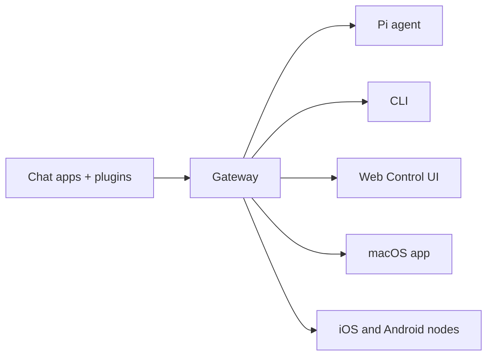

---
read_when:
    - Знайомство новачків з OpenClaw
summary: OpenClaw — це багатоканальний Gateway для AI-агентів, який працює на будь-якій ОС.
title: OpenClaw
x-i18n:
    generated_at: "2026-04-22T01:38:32Z"
    model: gpt-5.4
    provider: openai
    source_hash: 923d34fa604051d502e4bc902802d6921a4b89a9447f76123aa8d2ff085f0b99
    source_path: index.md
    workflow: 15
---

# OpenClaw 🦞

<p align="center">
    
    
</p>

> _"ВІДЛУЩУЙ! ВІДЛУЩУЙ!"_ — Космічний лобстер, імовірно

<p align="center">
  <strong>Gateway для AI-агентів на будь-якій ОС у Discord, Google Chat, iMessage, Matrix, Microsoft Teams, Signal, Slack, Telegram, WhatsApp, Zalo тощо.</strong><br />
  Надішліть повідомлення й отримайте відповідь агента просто зі своєї кишені. Запустіть один Gateway для вбудованих каналів, комплектних channel plugins, WebChat і mobile nodes.
</p>

<Columns>
  <Card title="Почати" href="/uk/start/getting-started" icon="rocket">
    Встановіть OpenClaw і запустіть Gateway за лічені хвилини.
  </Card>
  <Card title="Запустити онбординг" href="/uk/start/wizard" icon="sparkles">
    Покрокове налаштування за допомогою `openclaw onboard` і процесів сполучення.
  </Card>
  <Card title="Відкрити Control UI" href="/web/control-ui" icon="layout-dashboard">
    Запустіть панель керування в браузері для чату, конфігурації та сесій.
  </Card>
</Columns>

## Що таке OpenClaw?

OpenClaw — це **self-hosted Gateway**, який з’єднує ваші улюблені застосунки для чату та поверхні каналів — вбудовані канали, а також комплектні чи зовнішні channel plugins, як-от Discord, Google Chat, iMessage, Matrix, Microsoft Teams, Signal, Slack, Telegram, WhatsApp, Zalo та інші — з AI coding agents, такими як Pi. Ви запускаєте один процес Gateway на власному комп’ютері (або сервері), і він стає мостом між вашими застосунками для обміну повідомленнями та AI-помічником, який завжди доступний.

**Для кого це?** Для розробників і досвідчених користувачів, які хочуть мати персонального AI-помічника, якому можна написати звідусіль, — не втрачаючи контроль над своїми даними й не покладаючись на хостинговий сервіс.

**Що робить його особливим?**

- **Self-hosted**: працює на вашому обладнанні, за вашими правилами
- **Багатоканальність**: один Gateway одночасно обслуговує вбудовані канали, а також комплектні чи зовнішні channel plugins
- **Орієнтований на агентів**: створений для coding agents з використанням інструментів, сесіями, пам’яттю та маршрутизацією між кількома агентами
- **Відкритий код**: ліцензія MIT, розвиток спільнотою

**Що вам потрібно?** Node 24 (рекомендовано) або Node 22 LTS (`22.14+`) для сумісності, API-ключ від обраного провайдера та 5 хвилин. Для найкращої якості й безпеки використовуйте найпотужнішу доступну модель останнього покоління.

## Як це працює



Gateway — це єдине джерело істини для сесій, маршрутизації та підключень каналів.

## Ключові можливості

<Columns>
  <Card title="Багатоканальний Gateway" icon="network" href="/uk/channels">
    Discord, iMessage, Signal, Slack, Telegram, WhatsApp, WebChat та інші через один процес Gateway.
  </Card>
  <Card title="Канали Plugin" icon="plug" href="/uk/tools/plugin">
    Комплектні plugins додають Matrix, Nostr, Twitch, Zalo та інші в типових поточних релізах.
  </Card>
  <Card title="Маршрутизація між кількома агентами" icon="route" href="/uk/concepts/multi-agent">
    Ізольовані сесії для кожного агента, робочого простору або відправника.
  </Card>
  <Card title="Підтримка медіа" icon="image" href="/uk/nodes/images">
    Надсилайте й отримуйте зображення, аудіо та документи.
  </Card>
  <Card title="Web Control UI" icon="monitor" href="/web/control-ui">
    Панель у браузері для чату, конфігурації, сесій і nodes.
  </Card>
  <Card title="Mobile nodes" icon="smartphone" href="/uk/nodes">
    Підключайте iOS і Android nodes для Canvas, камери та сценаріїв із підтримкою голосу.
  </Card>
</Columns>

## Швидкий старт

<Steps>
  <Step title="Встановіть OpenClaw">
    ```bash
    npm install -g openclaw@latest
    ```
  </Step>
  <Step title="Пройдіть онбординг і встановіть службу">
    ```bash
    openclaw onboard --install-daemon
    ```
  </Step>
  <Step title="Спілкуйтеся">
    Відкрийте Control UI у браузері та надішліть повідомлення:

    ```bash
    openclaw dashboard
    ```

    Або підключіть канал ([Telegram](/uk/channels/telegram) — найшвидший варіант) і спілкуйтеся з телефона.

  </Step>
</Steps>

Потрібні повні інструкції зі встановлення та налаштування середовища розробки? Див. [Getting Started](/uk/start/getting-started).

## Панель керування

Відкрийте browser Control UI після запуску Gateway.

- Локальний варіант за замовчуванням: [http://127.0.0.1:18789/](http://127.0.0.1:18789/)
- Віддалений доступ: [Web surfaces](/web) і [Tailscale](/uk/gateway/tailscale)

<p align="center">
  
</p>

## Конфігурація (необов’язково)

Конфігурація зберігається в `~/.openclaw/openclaw.json`.

- Якщо ви **нічого не робите**, OpenClaw використовує комплектний двійковий файл Pi у режимі RPC із сесіями для кожного відправника.
- Якщо ви хочете обмежити доступ, почніть із `channels.whatsapp.allowFrom` і (для груп) правил згадування.

Приклад:

```json5
{
  channels: {
    whatsapp: {
      allowFrom: ["+15555550123"],
      groups: { "*": { requireMention: true } },
    },
  },
  messages: { groupChat: { mentionPatterns: ["@openclaw"] } },
}
```

## Почніть тут

<Columns>
  <Card title="Центри документації" href="/uk/start/hubs" icon="book-open">
    Уся документація й посібники, упорядковані за сценаріями використання.
  </Card>
  <Card title="Конфігурація" href="/uk/gateway/configuration" icon="settings">
    Основні параметри Gateway, токени та конфігурація провайдера.
  </Card>
  <Card title="Віддалений доступ" href="/uk/gateway/remote" icon="globe">
    Шаблони доступу через SSH і tailnet.
  </Card>
  <Card title="Канали" href="/uk/channels/telegram" icon="message-square">
    Налаштування каналів для Feishu, Microsoft Teams, WhatsApp, Telegram, Discord та інших.
  </Card>
  <Card title="Nodes" href="/uk/nodes" icon="smartphone">
    iOS і Android nodes із pairing, Canvas, камерою та діями на пристрої.
  </Card>
  <Card title="Довідка" href="/uk/help" icon="life-buoy">
    Типові виправлення та стартова точка для усунення несправностей.
  </Card>
</Columns>

## Дізнайтеся більше

<Columns>
  <Card title="Повний список можливостей" href="/uk/concepts/features" icon="list">
    Повний перелік можливостей каналів, маршрутизації та роботи з медіа.
  </Card>
  <Card title="Маршрутизація між кількома агентами" href="/uk/concepts/multi-agent" icon="route">
    Ізоляція робочих просторів і сесії для кожного агента.
  </Card>
  <Card title="Безпека" href="/uk/gateway/security" icon="shield">
    Токени, allowlists і засоби безпеки.
  </Card>
  <Card title="Усунення несправностей" href="/uk/gateway/troubleshooting" icon="wrench">
    Діагностика Gateway і типові помилки.
  </Card>
  <Card title="Про проєкт і подяки" href="/uk/reference/credits" icon="info">
    Походження проєкту, учасники та ліцензія.
  </Card>
</Columns>
