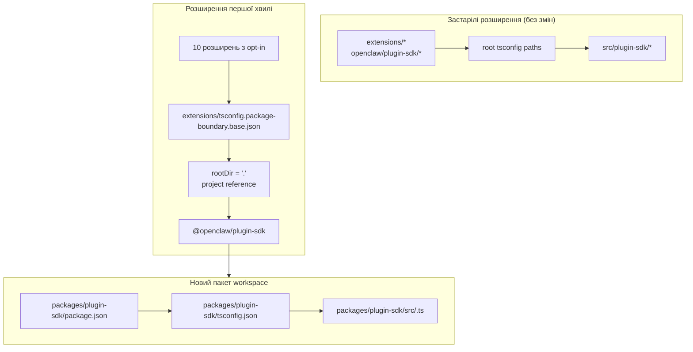

# рефакторинг: Поступово перетворити plugin-sdk на справжній пакет workspace

## Огляд

Цей план вводить справжній пакет workspace для plugin SDK у
`packages/plugin-sdk` і використовує його, щоб підключити невелику першу хвилю розширень до
меж пакетів, які примусово перевіряються компілятором. Мета — змусити заборонені відносні
імпорти падати під час звичайного `tsc` для вибраного набору вбудованих
розширень-постачальників, не змушуючи виконувати міграцію в межах усього репозиторію й не створюючи
величезну поверхню конфліктів злиття.

Ключовий інкрементальний крок — деякий час запускати паралельно два режими:

| Режим | Форма імпорту | Хто його використовує | Примусове застосування |
| ----------- | ------------------------ | ------------------------------------ | -------------------------------------------- |
| Застарілий режим | `openclaw/plugin-sdk/*`  | усі наявні розширення, які не підключені до нового режиму | поточна дозволена поведінка зберігається |
| Режим opt-in | `@openclaw/plugin-sdk/*` | лише розширення першої хвилі | локальний для пакета `rootDir` + посилання проєкту |

## Постановка проблеми

Поточний репозиторій експортує велику публічну поверхню plugin SDK, але це не справжній
пакет workspace. Натомість:

- кореневий `tsconfig.json` напряму зіставляє `openclaw/plugin-sdk/*` із
  `src/plugin-sdk/*.ts`
- розширення, які не були підключені до попереднього експерименту, усе ще поділяють цю
  глобальну поведінку source alias
- додавання `rootDir` працює лише тоді, коли дозволені імпорти SDK перестають розв’язуватися в сирий
  вихідний код репозиторію

Це означає, що репозиторій може описувати бажану політику меж, але TypeScript
не забезпечує її чистого примусового застосування для більшості розширень.

Потрібен інкрементальний шлях, який:

- робить `plugin-sdk` справжнім
- переміщує SDK до пакета workspace з назвою `@openclaw/plugin-sdk`
- змінює лише приблизно 10 розширень у першому PR
- залишає решту дерева розширень на старій схемі до подальшого очищення
- уникає використання процесу `tsconfig.plugin-sdk.dts.json` + генерації декларацій під час postinstall як основного механізму для розгортання першої хвилі

## Трасування вимог

- R1. Створити справжній пакет workspace для plugin SDK під `packages/`.
- R2. Назвати новий пакет `@openclaw/plugin-sdk`.
- R3. Надати новому пакету SDK власні `package.json` і `tsconfig.json`.
- R4. Під час вікна міграції зберегти працездатність застарілих імпортів `openclaw/plugin-sdk/*` для розширень, які не підключені до нового режиму.
- R5. У першому PR підключити лише невелику першу хвилю розширень.
- R6. Для розширень першої хвилі має діяти fail-closed для відносних імпортів, які виходять
  за межі кореня їхнього пакета.
- R7. Розширення першої хвилі мають споживати SDK через залежність пакета
  і TS project reference, а не через кореневі псевдоніми `paths`.
- R8. План має уникати обов’язкового кроку генерації postinstall у межах усього репозиторію для
  коректної роботи редактора.
- R9. Розгортання першої хвилі має бути придатним для рев’ю та злиття як PR помірного розміру,
  а не як рефакторинг на 300+ файлів у межах усього репозиторію.

## Межі охоплення

- Без повної міграції всіх вбудованих розширень у першому PR.
- Без вимоги видаляти `src/plugin-sdk` у першому PR.
- Без вимоги негайно переналаштовувати кожен кореневий шлях збірки чи тестування на використання нового пакета.
- Без спроби примусово забезпечити squiggles у VS Code для кожного розширення, яке не підключене до нового режиму.
- Без широкого очищення lint для решти дерева розширень.
- Без великих змін поведінки під час виконання, окрім розв’язання імпортів, належності пакетів
  і примусового застосування меж для розширень, підключених до нового режиму.

## Контекст і дослідження

### Відповідний код і шаблони

- `pnpm-workspace.yaml` уже включає `packages/*` і `extensions/*`, тож
  новий пакет workspace у `packages/plugin-sdk` вписується в наявну структуру
  репозиторію.
- Наявні пакети workspace, такі як `packages/memory-host-sdk/package.json`
  і `packages/plugin-package-contract/package.json`, уже використовують локальні для пакета
  карти `exports`, що базуються на `src/*.ts`.
- Кореневий `package.json` зараз публікує поверхню SDK через `./plugin-sdk`
  і `./plugin-sdk/*` exports, які спираються на `dist/plugin-sdk/*.js` і
  `dist/plugin-sdk/*.d.ts`.
- `src/plugin-sdk/entrypoints.ts` і `scripts/lib/plugin-sdk-entrypoints.json`
  уже виконують роль канонічного інвентарю entrypoint для поверхні SDK.
- Кореневий `tsconfig.json` зараз зіставляє:
  - `openclaw/plugin-sdk` -> `src/plugin-sdk/index.ts`
  - `openclaw/plugin-sdk/*` -> `src/plugin-sdk/*.ts`
- Попередній експеримент із межами показав, що локальний для пакета `rootDir` працює для
  заборонених відносних імпортів лише після того, як дозволені імпорти SDK перестають розв’язуватися в сирий
  вихідний код за межами пакета розширення.

### Набір розширень першої хвилі

Цей план передбачає, що до першої хвилі входить набір, орієнтований на постачальників, який найменш імовірно
потягне за собою складні крайові випадки runtime каналів:

- `extensions/anthropic`
- `extensions/exa`
- `extensions/firecrawl`
- `extensions/groq`
- `extensions/mistral`
- `extensions/openai`
- `extensions/perplexity`
- `extensions/tavily`
- `extensions/together`
- `extensions/xai`

### Інвентар поверхні SDK для першої хвилі

Наразі розширення першої хвилі імпортують керовану підмножину підшляхів SDK.
Початковий пакет `@openclaw/plugin-sdk` має покривати лише такі:

- `agent-runtime`
- `cli-runtime`
- `config-runtime`
- `core`
- `image-generation`
- `media-runtime`
- `media-understanding`
- `plugin-entry`
- `plugin-runtime`
- `provider-auth`
- `provider-auth-api-key`
- `provider-auth-login`
- `provider-auth-runtime`
- `provider-catalog-shared`
- `provider-entry`
- `provider-http`
- `provider-model-shared`
- `provider-onboard`
- `provider-stream-family`
- `provider-stream-shared`
- `provider-tools`
- `provider-usage`
- `provider-web-fetch`
- `provider-web-search`
- `realtime-transcription`
- `realtime-voice`
- `runtime-env`
- `secret-input`
- `security-runtime`
- `speech`
- `testing`

### Інституційні висновки

- У цій робочій копії не було релевантних записів `docs/solutions/`.

### Зовнішні посилання

- Для цього плану не потрібні були зовнішні дослідження. Репозиторій уже містить
  потрібні шаблони пакетів workspace та експорту SDK.

## Ключові технічні рішення

- Ввести `@openclaw/plugin-sdk` як новий пакет workspace, зберігши при цьому
  застарілу кореневу поверхню `openclaw/plugin-sdk/*` під час міграції.
  Обґрунтування: це дозволяє першій хвилі розширень перейти на справжнє
  розв’язання пакетів, не змушуючи змінювати всі розширення й усі кореневі шляхи збірки одночасно.

- Використовувати окрему базову конфігурацію для меж з opt-in, наприклад
  `extensions/tsconfig.package-boundary.base.json`, замість заміни
  наявної бази розширень для всіх.
  Обґрунтування: під час міграції репозиторій має одночасно підтримувати і застарілий, і opt-in режим розширень.

- Використовувати TS project references від розширень першої хвилі до
  `packages/plugin-sdk/tsconfig.json` і встановити
  `disableSourceOfProjectReferenceRedirect` для режиму меж opt-in.
  Обґрунтування: це дає `tsc` справжній граф пакетів і водночас ускладнює fallback редактора та
  компілятора до обходу сирого вихідного коду.

- Зберегти `@openclaw/plugin-sdk` приватним у першій хвилі.
  Обґрунтування: безпосередня мета — внутрішнє примусове застосування меж і безпека
  міграції, а не публікація другого зовнішнього контракту SDK до стабілізації поверхні.

- Перемістити в першому реалізаційному зрізі лише підшляхи SDK для першої хвилі та
  зберегти compatibility bridges для решти.
  Обґрунтування: фізичне переміщення всіх 315 файлів `src/plugin-sdk/*.ts` в одному PR —
  це саме та поверхня конфліктів злиття, якої цей план намагається уникнути.

- Не покладатися на `scripts/postinstall-bundled-plugins.mjs` для побудови декларацій SDK
  для першої хвилі.
  Обґрунтування: явні потоки build/reference легше пояснювати й вони роблять поведінку
  репозиторію більш передбачуваною.

## Відкриті питання

### Вирішено під час планування

- Які розширення мають увійти до першої хвилі?
  Використовувати 10 наведених вище розширень provider/web-search, оскільки вони
  структурно ізольованіші, ніж важчі пакети каналів.

- Чи має перший PR замінити все дерево розширень?
  Ні. Перший PR має підтримувати два режими паралельно й підключати лише
  першу хвилю.

- Чи має перша хвиля вимагати побудови декларацій під час postinstall?
  Ні. Граф пакетів/посилань має бути явним, а CI має навмисно запускати
  відповідну локальну для пакета перевірку типів.

### Відкладено до реалізації

- Чи може пакет першої хвилі вказувати безпосередньо на локальні для пакета `src/*.ts`
  лише через project references, чи все ж для пакета `@openclaw/plugin-sdk`
  потрібен невеликий крок генерації декларацій.
  Це питання валідації TS graph, яке належить до реалізації.

- Чи має кореневий пакет `openclaw` негайно проксувати підшляхи SDK першої хвилі до
  виводів `packages/plugin-sdk`, чи й надалі використовувати згенеровані
  compatibility shim у `src/plugin-sdk`.
  Це деталь сумісності та форми збірки, яка залежить від мінімального
  шляху реалізації, що зберігає зелений CI.

## Технічний дизайн високого рівня

> Це ілюструє задуманий підхід і є орієнтовною підказкою для рев’ю, а не специфікацією реалізації. Агент, який реалізує зміни, має сприймати це як контекст, а не як код, який треба відтворити.

## Одиниці реалізації

- [ ] **Одиниця 1: Увести справжній пакет workspace `@openclaw/plugin-sdk`**

**Мета:** Створити справжній пакет workspace для SDK, який зможе володіти
поверхнею підшляхів першої хвилі без примусової міграції в межах усього репозиторію.

**Вимоги:** R1, R2, R3, R8, R9

**Залежності:** Немає

**Файли:**

- Створити: `packages/plugin-sdk/package.json`
- Створити: `packages/plugin-sdk/tsconfig.json`
- Створити: `packages/plugin-sdk/src/index.ts`
- Створити: `packages/plugin-sdk/src/*.ts` для підшляхів SDK першої хвилі
- Змінити: `pnpm-workspace.yaml`, лише якщо потрібні коригування glob шаблонів пакетів
- Змінити: `package.json`
- Змінити: `src/plugin-sdk/entrypoints.ts`
- Змінити: `scripts/lib/plugin-sdk-entrypoints.json`
- Тест: `src/plugins/contracts/plugin-sdk-workspace-package.contract.test.ts`

**Підхід:**

- Додати новий пакет workspace з назвою `@openclaw/plugin-sdk`.
- Почати з підшляхів SDK першої хвилі, а не з усього дерева з 315 файлів.
- Якщо пряме переміщення entrypoint першої хвилі створить надто великий diff, перший
  PR може спочатку ввести цей підшлях у `packages/plugin-sdk/src` як тонкий
  package wrapper, а потім у наступному PR перемкнути джерело істини для цього кластера підшляхів на пакет.
- Повторно використати наявний механізм інвентарю entrypoint, щоб поверхня пакета першої хвилі
  декларувалася в одному канонічному місці.
- Зберегти кореневі exports пакета для застарілих користувачів, поки пакет workspace
  стане новим контрактом opt-in.

**Шаблони, яких слід дотримуватися:**

- `packages/memory-host-sdk/package.json`
- `packages/plugin-package-contract/package.json`
- `src/plugin-sdk/entrypoints.ts`

**Сценарії тестування:**

- Щасливий шлях: пакет workspace експортує кожен підшлях першої хвилі, перелічений у
  плані, і жоден обов’язковий експорт першої хвилі не відсутній.
- Крайовий випадок: метадані exports пакета лишаються стабільними, коли список entrypoint першої хвилі
  повторно генерується або порівнюється з канонічним інвентарем.
- Інтеграція: застарілі кореневі exports SDK у пакеті залишаються присутніми після введення нового workspace package.

**Перевірка:**

- Репозиторій містить дійсний пакет workspace `@openclaw/plugin-sdk` зі
  стабільною картою exports першої хвилі та без регресії застарілих exports у кореневому
  `package.json`.

- [ ] **Одиниця 2: Додати TS-режим меж з opt-in для розширень із примусовими межами пакетів**

**Мета:** Визначити режим конфігурації TS, який використовуватимуть розширення з opt-in,
водночас залишивши наявну TS-поведінку розширень без змін для всіх інших.

**Вимоги:** R4, R6, R7, R8, R9

**Залежності:** Одиниця 1

**Файли:**

- Створити: `extensions/tsconfig.package-boundary.base.json`
- Створити: `tsconfig.boundary-optin.json`
- Змінити: `extensions/xai/tsconfig.json`
- Змінити: `extensions/openai/tsconfig.json`
- Змінити: `extensions/anthropic/tsconfig.json`
- Змінити: `extensions/mistral/tsconfig.json`
- Змінити: `extensions/groq/tsconfig.json`
- Змінити: `extensions/together/tsconfig.json`
- Змінити: `extensions/perplexity/tsconfig.json`
- Змінити: `extensions/tavily/tsconfig.json`
- Змінити: `extensions/exa/tsconfig.json`
- Змінити: `extensions/firecrawl/tsconfig.json`
- Тест: `src/plugins/contracts/extension-package-project-boundaries.test.ts`
- Тест: `test/extension-package-tsc-boundary.test.ts`

**Підхід:**

- Залишити `extensions/tsconfig.base.json` для застарілих розширень.
- Додати нову базову конфігурацію opt-in, яка:
  - встановлює `rootDir: "."`
  - містить посилання на `packages/plugin-sdk`
  - вмикає `composite`
  - вимикає project-reference source redirect, коли це потрібно
- Додати окремий solution config для графа typecheck першої хвилі замість
  перебудови кореневого TS-проєкту репозиторію в тому самому PR.

**Примітка щодо виконання:** Почніть із canary typecheck локально для пакета з одним
розширенням opt-in, яке спочатку падає, перш ніж застосовувати шаблон до всіх 10.

**Шаблони, яких слід дотримуватися:**

- Наявний шаблон локального `tsconfig.json` розширень із попередньої
  роботи над межами
- Шаблон пакета workspace з `packages/memory-host-sdk`

**Сценарії тестування:**

- Щасливий шлях: кожне розширення з opt-in успішно проходить typecheck через
  TS-конфігурацію package-boundary.
- Шлях помилки: canary relative import із `../../src/cli/acp-cli.ts` падає
  з `TS6059` для розширення з opt-in.
- Інтеграція: розширення без opt-in лишаються недоторканими й не зобов’язані
  брати участь у новому solution config.

**Перевірка:**

- Існує окремий граф typecheck для 10 розширень з opt-in, і погані
  відносні імпорти з одного з них падають під звичайним `tsc`.

- [ ] **Одиниця 3: Перенести розширення першої хвилі на `@openclaw/plugin-sdk`**

**Мета:** Змінити розширення першої хвилі так, щоб вони споживали справжній пакет SDK
через метадані залежностей, project references та імпорти за назвою пакета.

**Вимоги:** R5, R6, R7, R9

**Залежності:** Одиниця 2

**Файли:**

- Змінити: `extensions/anthropic/package.json`
- Змінити: `extensions/exa/package.json`
- Змінити: `extensions/firecrawl/package.json`
- Змінити: `extensions/groq/package.json`
- Змінити: `extensions/mistral/package.json`
- Змінити: `extensions/openai/package.json`
- Змінити: `extensions/perplexity/package.json`
- Змінити: `extensions/tavily/package.json`
- Змінити: `extensions/together/package.json`
- Змінити: `extensions/xai/package.json`
- Змінити: production і test imports під коренями кожного з 10 розширень, які
  зараз посилаються на `openclaw/plugin-sdk/*`

**Підхід:**

- Додати `@openclaw/plugin-sdk: workspace:*` до `devDependencies` розширень
  першої хвилі.
- Замінити в цих пакетах імпорти `openclaw/plugin-sdk/*` на
  `@openclaw/plugin-sdk/*`.
- Залишити внутрішні локальні імпорти розширення на локальні barrel, такі як `./api.ts` і
  `./runtime-api.ts`.
- Не змінювати розширення без opt-in у цьому PR.

**Шаблони, яких слід дотримуватися:**

- Наявні barrel локальних імпортів розширень (`api.ts`, `runtime-api.ts`)
- Форма залежностей пакета, яку використовують інші пакети workspace `@openclaw/*`

**Сценарії тестування:**

- Щасливий шлях: кожне мігроване розширення, як і раніше, реєструється/завантажується через свої наявні
  тести plugin після переписування імпортів.
- Крайовий випадок: імпорти SDK лише для тестів у наборі розширень з opt-in, як і раніше, коректно
  розв’язуються через новий пакет.
- Інтеграція: мігровані розширення не потребують кореневих псевдонімів
  `openclaw/plugin-sdk/*` для typechecking.

**Перевірка:**

- Розширення першої хвилі збираються та тестуються проти `@openclaw/plugin-sdk`
  без потреби в застарілому кореневому шляху-псевдонімі SDK.

- [ ] **Одиниця 4: Зберегти застарілу сумісність, поки міграція залишається частковою**

**Мета:** Зберегти працездатність решти репозиторію, поки SDK існує і в застарілій,
і в новій формі пакета під час міграції.

**Вимоги:** R4, R8, R9

**Залежності:** Одиниці 1-3

**Файли:**

- Змінити: `src/plugin-sdk/*.ts` для compatibility shim першої хвилі за потреби
- Змінити: `package.json`
- Змінити: збірку або plumbing exports, які формують артефакти SDK
- Тест: `src/plugins/contracts/plugin-sdk-runtime-api-guardrails.test.ts`
- Тест: `src/plugins/contracts/plugin-sdk-index.bundle.test.ts`

**Підхід:**

- Зберегти кореневий `openclaw/plugin-sdk/*` як compatibility surface для застарілих
  розширень і для зовнішніх споживачів, які ще не переходять.
- Використовувати або згенеровані shim, або кореневу proxy wiring exports для підшляхів
  першої хвилі, які переміщено в `packages/plugin-sdk`.
- Не намагатися прибрати кореневу поверхню SDK на цій фазі.

**Шаблони, яких слід дотримуватися:**

- Наявна генерація кореневих exports SDK через `src/plugin-sdk/entrypoints.ts`
- Наявна сумісність package export у кореневому `package.json`

**Сценарії тестування:**

- Щасливий шлях: застарілий кореневий імпорт SDK, як і раніше, розв’язується для розширення без opt-in
  після появи нового пакета.
- Крайовий випадок: підшлях першої хвилі працює як через застарілу кореневу поверхню, так і через
  поверхню нового пакета під час вікна міграції.
- Інтеграція: contract tests для індексу/пакета plugin-sdk і далі бачать узгоджену
  публічну поверхню.

**Перевірка:**

- Репозиторій підтримує і застарілий, і opt-in режим споживання SDK без
  поломки незмінених розширень.

- [ ] **Одиниця 5: Додати локальне примусове застосування та задокументувати контракт міграції**

**Мета:** Додати CI та настанови для учасників, які забезпечують нову поведінку для
першої хвилі, не вдаючи, що мігроване все дерево розширень.

**Вимоги:** R5, R6, R8, R9

**Залежності:** Одиниці 1-4

**Файли:**

- Змінити: `package.json`
- Змінити: файли workflow CI, які мають запускати typecheck меж першої хвилі з opt-in
- Змінити: `AGENTS.md`
- Змінити: `docs/plugins/sdk-overview.md`
- Змінити: `docs/plugins/sdk-entrypoints.md`
- Змінити: `docs/plans/2026-04-05-001-refactor-extension-package-resolution-boundary-plan.md`

**Підхід:**

- Додати явний gate для першої хвилі, наприклад окремий запуск `tsc -b` solution для
  `packages/plugin-sdk` плюс 10 розширень з opt-in.
- Задокументувати, що репозиторій тепер підтримує і застарілий, і opt-in режими розширень,
  і що нова робота над межами розширень має надавати перевагу маршруту через новий пакет.
- Зафіксувати правило міграції наступної хвилі, щоб подальші PR могли додавати більше розширень
  без повторного обговорення архітектури.

**Шаблони, яких слід дотримуватися:**

- Наявні contract tests у `src/plugins/contracts/`
- Наявні оновлення документації, які пояснюють поетапні міграції

**Сценарії тестування:**

- Щасливий шлях: новий gate typecheck першої хвилі проходить для пакета workspace
  і розширень з opt-in.
- Шлях помилки: додавання нового забороненого відносного імпорту в розширенні з opt-in
  ламає локальний gate typecheck.
- Інтеграція: CI ще не вимагає, щоб розширення без opt-in задовольняли новий
  режим package-boundary.

**Перевірка:**

- Шлях примусового застосування для першої хвилі задокументований, протестований і придатний до запуску
  без примусу до міграції всього дерева розширень.

## Вплив на систему загалом

- **Граф взаємодії:** ця робота зачіпає джерело істини SDK, кореневі package
  exports, метадані пакетів розширень, розкладку TS graph і перевірки CI.
- **Поширення помилок:** основним очікуваним режимом відмови стають помилки TS під час компіляції
  (`TS6059`) у розширеннях з opt-in замість збоїв лише в користувацьких скриптах.
- **Ризики життєвого циклу стану:** подвійна поверхня під час міграції створює ризик розходження між
  кореневими compatibility export і новим пакетом workspace.
- **Паритет поверхні API:** підшляхи першої хвилі мають залишатися семантично ідентичними через
  і `openclaw/plugin-sdk/*`, і `@openclaw/plugin-sdk/*` під час
  переходу.
- **Покриття інтеграції:** unit tests недостатньо; потрібні локальні package-graph
  typecheck, щоб довести межу.
- **Незмінні інваріанти:** розширення без opt-in зберігають поточну поведінку
  в PR 1. Цей план не заявляє про примусове застосування меж імпортів у межах усього репозиторію.

## Ризики та залежності

| Ризик | Пом’якшення |
| ------------------------------------------------------------------------------------------------------ | ----------------------------------------------------------------------------------------------------------------------- |
| Пакет першої хвилі все ще розв’язується назад у сирий вихідний код, і `rootDir` фактично не працює в режимі fail-closed | Зробити першим кроком реалізації canary package-reference на одному розширенні з opt-in, перш ніж розширювати на весь набір |
| Переміщення надто великої частини вихідного коду SDK одразу відтворює початкову проблему конфліктів злиття | Перемістити в першому PR лише підшляхи першої хвилі та зберегти кореневі compatibility bridge |
| Застаріла й нова поверхні SDK семантично розходяться | Зберігати єдиний inventory entrypoint, додати compatibility contract tests і явно зафіксувати паритет подвійної поверхні |
| Кореневі шляхи збірки/тестів репозиторію випадково починають неконтрольовано залежати від нового пакета | Використовувати окремий solution config для opt-in і не вносити зміни в кореневу TS topology у першому PR |

## Поетапне постачання

### Фаза 1

- Увести `@openclaw/plugin-sdk`
- Визначити поверхню підшляхів першої хвилі
- Довести, що одне розширення з opt-in може працювати в режимі fail-closed через `rootDir`

### Фаза 2

- Підключити 10 розширень першої хвилі
- Зберегти кореневу сумісність для всіх інших

### Фаза 3

- Додавати більше розширень у наступних PR
- Переміщати більше підшляхів SDK у пакет workspace
- Прибрати кореневу сумісність лише після зникнення набору застарілих розширень

## Документація / операційні примітки

- Перший PR має явно описуватися як міграція з подвійним режимом, а не як
  завершення примусового застосування в межах усього репозиторію.
- Посібник із міграції має спрощувати додавання нових розширень у подальших PR
  за тим самим шаблоном package/dependency/reference.

## Джерела та посилання

- Попередній план: `docs/plans/2026-04-05-001-refactor-extension-package-resolution-boundary-plan.md`
- Конфігурація workspace: `pnpm-workspace.yaml`
- Наявний inventory entrypoint SDK: `src/plugin-sdk/entrypoints.ts`
- Наявні кореневі exports SDK: `package.json`
- Наявні шаблони пакетів workspace:
  - `packages/memory-host-sdk/package.json`
  - `packages/plugin-package-contract/package.json`
