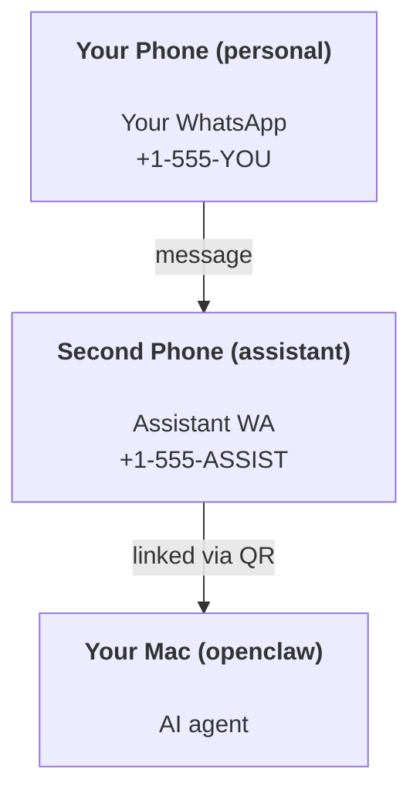

---
read_when:
    - Онбординг нового екземпляра помічника
    - Огляд наслідків для безпеки та дозволів
summary: Повний посібник із запуску OpenClaw як персонального помічника із застереженнями щодо безпеки
title: Налаштування персонального помічника
x-i18n:
    generated_at: "2026-04-27T06:28:13Z"
    model: gpt-5.4
    provider: openai
    source_hash: f8dce506be5062712c77657b75f16ae2a385af4dcdfc0adaae4a9513ad3fe95c
    source_path: start/openclaw.md
    workflow: 15
---

# Створення персонального помічника з OpenClaw

OpenClaw — це self-hosted gateway, який підключає Discord, Google Chat, iMessage, Matrix, Microsoft Teams, Signal, Slack, Telegram, WhatsApp, Zalo та інші сервіси до AI-агентів. Цей посібник описує налаштування "персонального помічника": окремий номер WhatsApp, який поводиться як ваш постійно активний AI-помічник.

## ⚠️ Спочатку безпека

Ви надаєте агенту можливість:

- запускати команди на вашій машині (залежно від вашої політики інструментів)
- читати/записувати файли у вашому робочому просторі
- надсилати повідомлення назад через WhatsApp/Telegram/Discord/Mattermost та інші вбудовані канали

Починайте обережно:

- Завжди задавайте `channels.whatsapp.allowFrom` (ніколи не запускайте на своєму особистому Mac конфігурацію, відкриту для всього світу).
- Використовуйте окремий номер WhatsApp для помічника.
- Heartbeat тепер типово запускається кожні 30 хвилин. Вимкніть його, доки не довірятимете конфігурації, задавши `agents.defaults.heartbeat.every: "0m"`.

## Передумови

- OpenClaw встановлено й пройдено онбординг — див. [Початок роботи](/uk/start/getting-started), якщо ви ще цього не зробили
- Другий номер телефону (SIM/eSIM/передплачений) для помічника

## Схема з двома телефонами (рекомендовано)

Вам потрібно ось це:



Якщо ви прив’яжете свій особистий WhatsApp до OpenClaw, кожне повідомлення вам стане “входом агента”. Зазвичай це не те, що вам потрібно.

## Швидкий старт за 5 хвилин

1. Виконайте pairing з WhatsApp Web (з’явиться QR; відскануйте його телефоном помічника):

```bash
openclaw channels login
```

2. Запустіть Gateway (залиште його працювати):

```bash
openclaw gateway --port 18789
```

3. Розмістіть мінімальну конфігурацію в `~/.openclaw/openclaw.json`:

```json5
{
  gateway: { mode: "local" },
  channels: { whatsapp: { allowFrom: ["+15555550123"] } },
}
```

Тепер напишіть на номер помічника зі свого телефона, доданого до allowlist.

Коли онбординг завершиться, OpenClaw автоматично відкриє dashboard і виведе чисте посилання (без токена). Якщо dashboard запросить автентифікацію, вставте налаштований спільний секрет у параметри Control UI. Онбординг типово використовує токен (`gateway.auth.token`), але автентифікація паролем теж працює, якщо ви переключили `gateway.auth.mode` на `password`. Щоб відкрити знову пізніше: `openclaw dashboard`.

## Надайте агенту робочий простір (AGENTS)

OpenClaw читає робочі інструкції та “пам’ять” зі свого каталогу робочого простору.

Типово OpenClaw використовує `~/.openclaw/workspace` як робочий простір агента й автоматично створює його (разом із початковими `AGENTS.md`, `SOUL.md`, `TOOLS.md`, `IDENTITY.md`, `USER.md`, `HEARTBEAT.md`) під час налаштування/першого запуску агента. `BOOTSTRAP.md` створюється лише тоді, коли робочий простір абсолютно новий (він не повинен з’являтися знову після видалення). `MEMORY.md` є необов’язковим (автоматично не створюється); якщо він існує, то завантажується для звичайних сеансів. Сеанси субагентів додають лише `AGENTS.md` і `TOOLS.md`.

<Tip>
Ставтеся до цієї теки як до пам’яті OpenClaw і зробіть її git-репозиторієм (бажано приватним), щоб ваші `AGENTS.md` і файли пам’яті мали резервну копію. Якщо git встановлено, абсолютно нові робочі простори ініціалізуються автоматично.
</Tip>

```bash
openclaw setup
```

Повна структура робочого простору й посібник із резервного копіювання: [Робочий простір агента](/uk/concepts/agent-workspace)
Робочий процес пам’яті: [Пам’ять](/uk/concepts/memory)

Необов’язково: виберіть інший робочий простір через `agents.defaults.workspace` (підтримує `~`).

```json5
{
  agents: {
    defaults: {
      workspace: "~/.openclaw/workspace",
    },
  },
}
```

Якщо ви вже постачаєте власні файли робочого простору з репозиторію, можна повністю вимкнути створення bootstrap-файлів:

```json5
{
  agents: {
    defaults: {
      skipBootstrap: true,
    },
  },
}
```

## Конфігурація, яка перетворює це на "помічника"

OpenClaw типово має хорошу конфігурацію для помічника, але зазвичай варто налаштувати:

- persona/інструкції в [`SOUL.md`](/uk/concepts/soul)
- типові налаштування thinking (за потреби)
- heartbeats (коли почнете довіряти конфігурації)

Приклад:

```json5
{
  logging: { level: "info" },
  agent: {
    model: "anthropic/claude-opus-4-6",
    workspace: "~/.openclaw/workspace",
    thinkingDefault: "high",
    timeoutSeconds: 1800,
    // Start with 0; enable later.
    heartbeat: { every: "0m" },
  },
  channels: {
    whatsapp: {
      allowFrom: ["+15555550123"],
      groups: {
        "*": { requireMention: true },
      },
    },
  },
  routing: {
    groupChat: {
      mentionPatterns: ["@openclaw", "openclaw"],
    },
  },
  session: {
    scope: "per-sender",
    resetTriggers: ["/new", "/reset"],
    reset: {
      mode: "daily",
      atHour: 4,
      idleMinutes: 10080,
    },
  },
}
```

## Сеанси й пам’ять

- Файли сеансів: `~/.openclaw/agents/<agentId>/sessions/{{SessionId}}.jsonl`
- Метадані сеансів (використання токенів, останній маршрут тощо): `~/.openclaw/agents/<agentId>/sessions/sessions.json` (застарілий шлях: `~/.openclaw/sessions/sessions.json`)
- `/new` або `/reset` запускає новий сеанс для цього чату (налаштовується через `resetTriggers`). Якщо надіслано окремо, агент відповідає коротким привітанням для підтвердження скидання.
- `/compact [instructions]` виконує compaction контексту сеансу й повідомляє залишковий бюджет контексту.

## Heartbeat (проактивний режим)

Типово OpenClaw запускає heartbeat кожні 30 хвилин із таким prompt:
`Read HEARTBEAT.md if it exists (workspace context). Follow it strictly. Do not infer or repeat old tasks from prior chats. If nothing needs attention, reply HEARTBEAT_OK.`
Щоб вимкнути, задайте `agents.defaults.heartbeat.every: "0m"`.

- Якщо `HEARTBEAT.md` існує, але фактично порожній (лише порожні рядки та заголовки markdown на кшталт `# Heading`), OpenClaw пропускає запуск heartbeat, щоб зекономити API-виклики.
- Якщо файл відсутній, heartbeat усе одно запускається, і модель сама вирішує, що робити.
- Якщо агент відповідає `HEARTBEAT_OK` (необов’язково з коротким доповненням; див. `agents.defaults.heartbeat.ackMaxChars`), OpenClaw приглушує вихідну доставку для цього heartbeat.
- Типово доставка heartbeat до цілей стилю DM `user:<id>` дозволена. Задайте `agents.defaults.heartbeat.directPolicy: "block"`, щоб приглушити доставку до прямих цілей, залишивши запуски heartbeat активними.
- Heartbeats виконують повні ходи агента — коротші інтервали спалюють більше токенів.

```json5
{
  agent: {
    heartbeat: { every: "30m" },
  },
}
```

## Медіа на вхід і вихід

Вхідні вкладення (зображення/аудіо/документи) можуть передаватися вашій команді через шаблони:

- `{{MediaPath}}` (шлях до локального тимчасового файла)
- `{{MediaUrl}}` (псевдо-URL)
- `{{Transcript}}` (якщо ввімкнено транскрибування аудіо)

Вихідні вкладення від агента: додайте `MEDIA:<path-or-url>` в окремому рядку (без пробілів). Приклад:

```
Here’s the screenshot.
MEDIA:https://example.com/screenshot.png
```

OpenClaw витягує ці значення і надсилає їх як медіа разом із текстом.

Поведінка локальних шляхів підпорядковується тій самій моделі довіри на читання файлів, що й агент:

- Якщо `tools.fs.workspaceOnly` має значення `true`, локальні шляхи `MEDIA:` на вихід залишаються обмеженими тимчасовим коренем OpenClaw, кешем медіа, шляхами робочого простору агента та файлами, створеними в sandbox.
- Якщо `tools.fs.workspaceOnly` має значення `false`, вихідні `MEDIA:` можуть використовувати локальні файли хоста, які агенту вже дозволено читати.
- Надсилання локальних файлів хоста все одно дозволяє лише медіа й безпечні типи документів (зображення, аудіо, відео, PDF і документи Office). Звичайний текст і файли, схожі на секрети, не вважаються медіа, які можна надсилати.

Це означає, що згенеровані зображення/файли поза робочим простором тепер можна надсилати, коли ваша політика fs уже дозволяє таке читання, без повторного відкриття довільної ексфільтрації текстових вкладень з хоста.

## Контрольний список операцій

```bash
openclaw status          # локальний статус (облікові дані, сеанси, події в черзі)
openclaw status --all    # повна діагностика (лише читання, можна вставляти)
openclaw status --deep   # запитує в gateway живу перевірку стану з перевірками каналів, якщо підтримується
openclaw health --json   # знімок стану gateway (WS; типово може повертати свіжий кешований знімок)
```

Журнали зберігаються в `/tmp/openclaw/` (типово: `openclaw-YYYY-MM-DD.log`).

## Наступні кроки

- WebChat: [WebChat](/uk/web/webchat)
- Операції Gateway: [Runbook Gateway](/uk/gateway)
- Cron + пробудження: [Завдання Cron](/uk/automation/cron-jobs)
- Компаньйон у рядку меню macOS: [Застосунок OpenClaw для macOS](/uk/platforms/macos)
- Застосунок вузла iOS: [Застосунок iOS](/uk/platforms/ios)
- Застосунок вузла Android: [Застосунок Android](/uk/platforms/android)
- Стан Windows: [Windows (WSL2)](/uk/platforms/windows)
- Стан Linux: [Застосунок Linux](/uk/platforms/linux)
- Безпека: [Безпека](/uk/gateway/security)

## Пов’язане

- [Початок роботи](/uk/start/getting-started)
- [Налаштування](/uk/start/setup)
- [Огляд каналів](/uk/channels)
