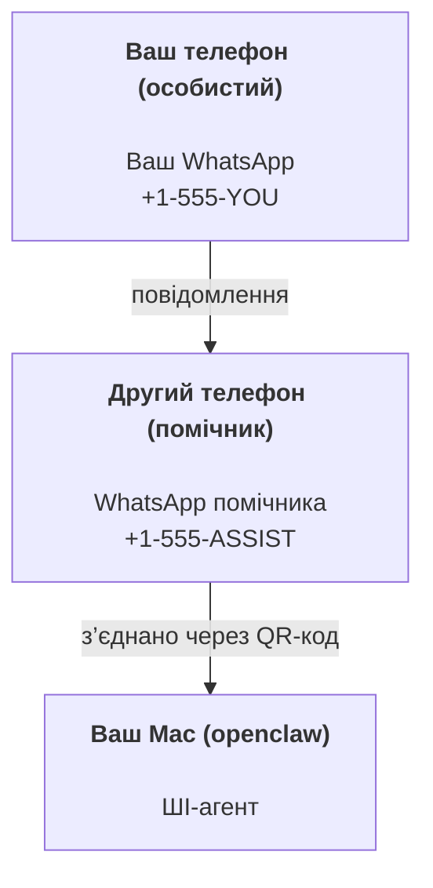

---
read_when:
    - Початкове налаштування нового екземпляра асистента
    - Перевірка наслідків для безпеки та дозволів
summary: Наскрізний посібник із використання OpenClaw як особистого помічника із застереженнями щодо безпеки
title: Налаштування персонального асистента
x-i18n:
    generated_at: "2026-07-16T18:36:06Z"
    model: gpt-5.6
    postprocess_version: locale-links-v1
    prompt_version: 32
    provider: openai
    source_hash: e8c34e31314f55647059fd600935330110add27b338a675bc0ce1529bebb207d
    source_path: start/openclaw.md
    workflow: 16
---

OpenClaw — це самостійно розміщуваний Gateway, який підключає Discord, Google Chat, iMessage, Matrix, Microsoft Teams, Signal, Slack, Telegram, WhatsApp, Zalo та інші сервіси до ШІ-агентів. У цьому посібнику описано налаштування «особистого помічника»: окремий номер WhatsApp, який працює як ваш постійно доступний ШІ-помічник.

## Передусім — безпека

Надання агенту каналу дає йому змогу виконувати команди на вашому комп’ютері (залежно від політики інструментів), читати й записувати файли в робочій області та надсилати повідомлення через будь-який підключений канал. Починайте з обмежених налаштувань:

- Завжди задавайте `channels.whatsapp.allowFrom` (ніколи не відкривайте доступ усьому світу на особистому Mac).
- Використовуйте для помічника окремий номер WhatsApp.
- За замовчуванням Heartbeat виконується кожні 30 хвилин. Вимкніть його, доки не переконаєтеся в надійності налаштування, задавши `agents.defaults.heartbeat.every: "0m"`.

## Передумови

- OpenClaw установлено й виконано початкове налаштування — див. [Початок роботи](/uk/start/getting-started), якщо ви ще цього не зробили
- Другий номер телефону (SIM/eSIM/передплачений) для помічника

## Налаштування з двома телефонами (рекомендовано)

Потрібна така схема:



Якщо підключити особистий WhatsApp до OpenClaw, кожне адресоване вам повідомлення стане «вхідними даними агента». Зазвичай це не те, що потрібно.

## Швидкий запуск за 5 хвилин

1. Підключіть WhatsApp Web (з’явиться QR-код; відскануйте його телефоном помічника):

```bash
openclaw channels login
```

2. Запустіть Gateway (залиште його запущеним):

```bash
openclaw gateway --port 18789
```

3. Додайте мінімальну конфігурацію до `~/.openclaw/openclaw.json`:

```json5
{
  gateway: { mode: "local" },
  channels: { whatsapp: { allowFrom: ["+15555550123"] } },
}
```

Тепер надішліть повідомлення на номер помічника з телефону, доданого до списку дозволених.

Після завершення початкового налаштування OpenClaw автоматично відкриває панель керування та виводить чисте посилання (без токена). Якщо панель керування запитує автентифікацію, вставте налаштований спільний секрет у параметрах Control UI. За замовчуванням для початкового налаштування використовується токен (`gateway.auth.token`), але автентифікація за паролем також працює, якщо `gateway.auth.mode` змінено на `password`. Щоб відкрити панель пізніше: `openclaw dashboard`.

## Надайте агенту робочу область (AGENTS)

OpenClaw зчитує інструкції з роботи та «пам’ять» із каталогу робочої області.

За замовчуванням OpenClaw використовує `~/.openclaw/workspace` як робочу область агента й автоматично створює її (разом із початковими файлами `AGENTS.md`, `SOUL.md`, `TOOLS.md`, `IDENTITY.md`, `USER.md`, `HEARTBEAT.md`) під час початкового налаштування або першого запуску агента. `BOOTSTRAP.md` створюється лише для абсолютно нової робочої області й не має з’являтися знову після видалення. `MEMORY.md` є необов’язковим і ніколи не створюється автоматично; якщо він наявний, то завантажується для звичайних сеансів. У сеанси субагентів додаються лише `AGENTS.md` та `TOOLS.md`.

<Tip>
Ставтеся до цієї папки як до пам’яті OpenClaw і створіть у ній репозиторій git (бажано приватний), щоб мати резервні копії файлів `AGENTS.md` і пам’яті. Якщо git установлено, абсолютно нові робочі області автоматично ініціалізуються з `git init`.
</Tip>

Щоб створити папки робочої області та конфігурації без запуску повного майстра початкового налаштування:

```bash
openclaw setup --baseline
```

(Команда `openclaw setup` без аргументів є псевдонімом для `openclaw onboard` і запускає повний інтерактивний майстер.)

Повна структура робочої області та посібник із резервного копіювання: [Робоча область агента](/uk/concepts/agent-workspace)
Робочий процес пам’яті: [Пам’ять](/uk/concepts/memory)

Необов’язково: виберіть іншу робочу область за допомогою `agents.defaults.workspace` (підтримує `~`).

```json5
{
  agents: {
    defaults: {
      workspace: "~/.openclaw/workspace",
    },
  },
}
```

Якщо власні файли робочої області вже постачаються з репозиторію, створення початкових файлів можна повністю вимкнути:

```json5
{
  agents: {
    defaults: {
      skipBootstrap: true,
    },
  },
}
```

## Конфігурація, яка перетворює його на «помічника»

OpenClaw за замовчуванням має вдале налаштування помічника, але зазвичай варто відкоригувати:

- особистість та інструкції в [`SOUL.md`](/uk/concepts/soul)
- стандартні параметри міркування (за потреби)
- Heartbeats (коли ви вже довіряєте налаштуванню)

Приклад:

```json5
{
  logging: { level: "info" },
  agents: {
    defaults: {
      model: { primary: "anthropic/claude-opus-4-8" },
      workspace: "~/.openclaw/workspace",
      thinkingDefault: "high",
      timeoutSeconds: 1800,
      // Спочатку встановіть 0; увімкніть пізніше.
      heartbeat: { every: "0m" },
    },
    list: [
      {
        id: "main",
        default: true,
        groupChat: {
          mentionPatterns: ["@openclaw", "openclaw"],
        },
      },
    ],
  },
  channels: {
    whatsapp: {
      allowFrom: ["+15555550123"],
      groups: {
        "*": { requireMention: true },
      },
    },
  },
  session: {
    scope: "per-sender",
    resetTriggers: ["/new", "/reset"],
    reset: {
      mode: "daily",
      atHour: 4,
      idleMinutes: 10080,
    },
  },
}
```

## Сеанси та пам’ять

- Рядки сеансів, рядки стенограм і метадані (використання токенів, останній маршрут тощо): `~/.openclaw/agents/<agentId>/agent/openclaw-agent.sqlite`
- Застарілі або архівні артефакти стенограм: `~/.openclaw/agents/<agentId>/sessions/`
- Джерело міграції застарілих рядків: `~/.openclaw/agents/<agentId>/sessions/sessions.json`
- `/new` або `/reset` починає новий сеанс для цього чату (налаштовується через `session.resetTriggers`). Якщо надіслати команду окремо, OpenClaw підтвердить скидання без виклику моделі.
- `/compact [instructions]` ущільнює контекст сеансу та повідомляє про залишок бюджету контексту.

## Heartbeats (проактивний режим)

За замовчуванням OpenClaw запускає Heartbeat кожні 30 хвилин із запитом:
`Read HEARTBEAT.md if it exists (workspace context). Follow it strictly. Do not infer or repeat old tasks from prior chats. If nothing needs attention, reply HEARTBEAT_OK.`
Щоб вимкнути, задайте `agents.defaults.heartbeat.every: "0m"`.

- Якщо `HEARTBEAT.md` існує, але фактично порожній (містить лише порожні рядки, коментарі Markdown/HTML, заголовки Markdown на кшталт `# Heading`, маркери блоків або порожні заготовки списків перевірки), OpenClaw пропускає запуск Heartbeat, щоб заощадити виклики API.
- Якщо файл відсутній, Heartbeat усе одно запускається, а модель вирішує, що робити.
- Якщо агент відповідає `HEARTBEAT_OK` (необов’язково з коротким доповненням; див. `agents.defaults.heartbeat.ackMaxChars`), OpenClaw не надсилає вихідне повідомлення для цього Heartbeat.
- За замовчуванням доставлення Heartbeat до цілей `user:<id>` типу особистих повідомлень дозволено. Задайте `agents.defaults.heartbeat.directPolicy: "block"`, щоб вимкнути доставлення безпосереднім адресатам, не припиняючи запуски Heartbeat.
- Heartbeats виконують повні цикли роботи агента — коротші інтервали витрачають більше токенів.

```json5
{
  agents: {
    defaults: {
      heartbeat: { every: "30m" },
    },
  },
}
```

## Вхідні та вихідні медіафайли

Вхідні вкладення (зображення, аудіо й документи) можна передавати команді через шаблони:

- `{{MediaPath}}` (шлях до локального тимчасового файла)
- `{{MediaUrl}}` (псевдо-URL)
- `{{Transcript}}` (якщо ввімкнено транскрибування аудіо)

Вихідні вкладення від агента використовують структуровані поля медіаданих інструмента повідомлень або корисного навантаження відповіді, як-от `media`, `mediaUrl`, `mediaUrls`, `path` або `filePath`. Приклад аргументів інструмента повідомлень:

```json
{
  "message": "Ось знімок екрана.",
  "mediaUrl": "https://example.com/screenshot.png"
}
```

OpenClaw надсилає структуровані медіадані разом із текстом. Застарілі фінальні відповіді помічника все ще можуть нормалізуватися задля сумісності, але вивід інструментів, вивід браузера, потокові блоки та дії з повідомленнями не розбирають текст як команди вкладень.

Поведінка локальних шляхів відповідає тій самій моделі довіри до читання файлів, що й для агента:

- Якщо `tools.fs.workspaceOnly` має значення `true`, вихідні шляхи до локальних медіафайлів залишаються обмеженими тимчасовим кореневим каталогом OpenClaw, кешем медіафайлів, шляхами робочої області агента та файлами, створеними в пісочниці.
- Якщо `tools.fs.workspaceOnly` має значення `false`, для вихідних локальних медіафайлів можна використовувати локальні файли хоста, які агенту вже дозволено читати.
- Локальні шляхи можуть бути абсолютними, відносними щодо робочої області або відносними щодо домашнього каталогу з `~/`.
- Під час надсилання локальних файлів хоста все одно дозволяються лише медіафайли та безпечні типи документів (зображення, аудіо, відео, PDF, документи Office і перевірені текстові документи, як-от Markdown/MD, TXT, JSON, YAML та YML). Це розширення наявної межі довіри до читання з хоста, а не сканер секретів: якщо агент може прочитати локальний файл хоста `secret.txt` або `config.json`, він може прикріпити цей файл, якщо розширення та перевірка вмісту відповідають вимогам.

Зберігайте конфіденційні файли поза доступною агенту файловою системою або залиште `tools.fs.workspaceOnly: true` для суворіших обмежень на надсилання локальних шляхів.

## Контрольний список експлуатації

```bash
openclaw status          # локальний стан (облікові дані, сеанси, події в черзі)
openclaw status --all    # повна діагностика (лише читання, можна вставляти)
openclaw status --deep   # перевірка каналів (WhatsApp Web + Telegram + Discord + Slack + Signal)
openclaw health --json   # знімок стану Gateway через з’єднання WS
```

Журнали зберігаються в `/tmp/openclaw/` (за замовчуванням: `openclaw-YYYY-MM-DD.log`).

## Наступні кроки

- WebChat: [WebChat](/uk/web/webchat)
- Експлуатація Gateway: [Посібник з експлуатації Gateway](/uk/gateway)
- Cron і пробудження: [Завдання Cron](/uk/automation/cron-jobs)
- Супутня програма в рядку меню macOS: [Програма OpenClaw для macOS](/uk/platforms/macos)
- Програма Node для iOS: [Програма для iOS](/uk/platforms/ios)
- Програма Node для Android: [Програма для Android](/uk/platforms/android)
- Центр Windows: [Windows](/uk/platforms/windows)
- Стан Linux: [Програма для Linux](/uk/platforms/linux)
- Безпека: [Безпека](/uk/gateway/security)

## Пов’язані матеріали

- [Початок роботи](/uk/start/getting-started)
- [Налаштування](/uk/start/setup)
- [Огляд каналів](/uk/channels)
