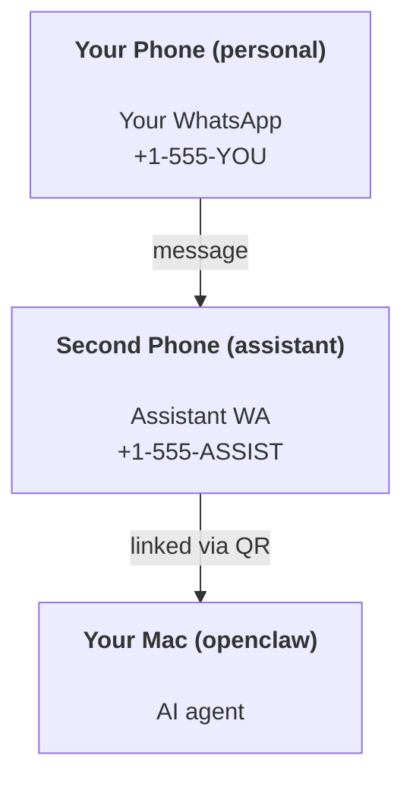

---
read_when:
    - Початкове налаштування нового екземпляра асистента
    - Оцінювання наслідків для безпеки та дозволів
summary: Повний посібник із запуску OpenClaw як персонального асистента із застереженнями щодо безпеки
title: Налаштування персонального асистента
x-i18n:
    generated_at: "2026-04-28T11:25:52Z"
    model: gpt-5.5
    provider: openai
    source_hash: b0614272f9a2b30e0900c55b39a8bd6a2b71b9f5d5fbf0fe00c534b91193e6a0
    source_path: start/openclaw.md
    workflow: 16
---

# Створення персонального помічника з OpenClaw

OpenClaw — це самостійно розгорнутий шлюз, який підключає Discord, Google Chat, iMessage, Matrix, Microsoft Teams, Signal, Slack, Telegram, WhatsApp, Zalo та інші канали до ШІ-агентів. У цьому посібнику описано налаштування «персонального помічника»: окремий номер WhatsApp, який поводиться як ваш постійно доступний ШІ-помічник.

## ⚠️ Спершу безпека

Ви надаєте агенту можливість:

- виконувати команди на вашій машині (залежно від вашої політики інструментів)
- читати й записувати файли у вашому робочому просторі
- надсилати повідомлення назовні через WhatsApp/Telegram/Discord/Mattermost та інші вбудовані канали

Починайте обережно:

- Завжди задавайте `channels.whatsapp.allowFrom` (ніколи не запускайте відкритий для всього світу режим на вашому особистому Mac).
- Використовуйте окремий номер WhatsApp для помічника.
- Heartbeat-и тепер за замовчуванням виконуються кожні 30 хвилин. Вимкніть їх, доки не довірятимете налаштуванню, задавши `agents.defaults.heartbeat.every: "0m"`.

## Передумови

- OpenClaw встановлено й виконано початкове налаштування — див. [Початок роботи](/uk/start/getting-started), якщо ви ще цього не зробили
- Другий номер телефону (SIM/eSIM/передплачений) для помічника

## Налаштування з двома телефонами (рекомендовано)

Вам потрібна така схема:



Якщо ви підключите свій особистий WhatsApp до OpenClaw, кожне повідомлення до вас стане «вхідними даними агента». Це рідко саме те, що потрібно.

## Швидкий старт за 5 хвилин

1. Під’єднайте WhatsApp Web (покаже QR; відскануйте його телефоном помічника):

```bash
openclaw channels login
```

2. Запустіть Gateway (залиште його працювати):

```bash
openclaw gateway --port 18789
```

3. Додайте мінімальну конфігурацію в `~/.openclaw/openclaw.json`:

```json5
{
  gateway: { mode: "local" },
  channels: { whatsapp: { allowFrom: ["+15555550123"] } },
}
```

Тепер напишіть на номер помічника з телефону, внесеного до списку дозволених.

Коли початкове налаштування завершиться, OpenClaw автоматично відкриє панель керування й виведе чисте посилання (без токена). Якщо панель керування запитає автентифікацію, вставте налаштований спільний секрет у налаштування Control UI. Початкове налаштування за замовчуванням використовує токен (`gateway.auth.token`), але автентифікація паролем також працює, якщо ви перемкнули `gateway.auth.mode` на `password`. Щоб відкрити її пізніше: `openclaw dashboard`.

## Надайте агенту робочий простір (AGENTS)

OpenClaw читає операційні інструкції та «пам’ять» зі свого каталогу робочого простору.

За замовчуванням OpenClaw використовує `~/.openclaw/workspace` як робочий простір агента й автоматично створить його (разом зі стартовими `AGENTS.md`, `SOUL.md`, `TOOLS.md`, `IDENTITY.md`, `USER.md`, `HEARTBEAT.md`) під час налаштування або першого запуску агента. `BOOTSTRAP.md` створюється лише тоді, коли робочий простір зовсім новий (він не має з’являтися знову після видалення). `MEMORY.md` необов’язковий (не створюється автоматично); якщо він існує, його буде завантажено для звичайних сеансів. Сеанси підагентів додають лише `AGENTS.md` і `TOOLS.md`.

<Tip>
Ставтеся до цієї папки як до пам’яті OpenClaw і зробіть її git-репозиторієм (бажано приватним), щоб ваші `AGENTS.md` і файли пам’яті мали резервні копії. Якщо git встановлено, нові робочі простори автоматично ініціалізуються.
</Tip>

```bash
openclaw setup
```

Повна структура робочого простору + посібник із резервного копіювання: [Робочий простір агента](/uk/concepts/agent-workspace)
Процес роботи з пам’яттю: [Пам’ять](/uk/concepts/memory)

Необов’язково: виберіть інший робочий простір через `agents.defaults.workspace` (підтримує `~`).

```json5
{
  agents: {
    defaults: {
      workspace: "~/.openclaw/workspace",
    },
  },
}
```

Якщо ви вже постачаєте власні файли робочого простору з репозиторію, можете повністю вимкнути створення bootstrap-файлів:

```json5
{
  agents: {
    defaults: {
      skipBootstrap: true,
    },
  },
}
```

## Конфігурація, яка перетворює це на «помічника»

OpenClaw за замовчуванням має гарне налаштування для помічника, але зазвичай варто підлаштувати:

- персону/інструкції в [`SOUL.md`](/uk/concepts/soul)
- типові параметри мислення (за потреби)
- Heartbeat-и (коли довірятимете налаштуванню)

Приклад:

```json5
{
  logging: { level: "info" },
  agent: {
    model: "anthropic/claude-opus-4-6",
    workspace: "~/.openclaw/workspace",
    thinkingDefault: "high",
    timeoutSeconds: 1800,
    // Start with 0; enable later.
    heartbeat: { every: "0m" },
  },
  channels: {
    whatsapp: {
      allowFrom: ["+15555550123"],
      groups: {
        "*": { requireMention: true },
      },
    },
  },
  routing: {
    groupChat: {
      mentionPatterns: ["@openclaw", "openclaw"],
    },
  },
  session: {
    scope: "per-sender",
    resetTriggers: ["/new", "/reset"],
    reset: {
      mode: "daily",
      atHour: 4,
      idleMinutes: 10080,
    },
  },
}
```

## Сеанси та пам’ять

- Файли сеансів: `~/.openclaw/agents/<agentId>/sessions/{{SessionId}}.jsonl`
- Метадані сеансів (використання токенів, останній маршрут тощо): `~/.openclaw/agents/<agentId>/sessions/sessions.json` (застарілий шлях: `~/.openclaw/sessions/sessions.json`)
- `/new` або `/reset` запускає новий сеанс для цього чату (налаштовується через `resetTriggers`). Якщо надіслати окремо, OpenClaw підтвердить скидання без виклику моделі.
- `/compact [instructions]` стискає контекст сеансу й повідомляє залишковий бюджет контексту.

## Heartbeat-и (проактивний режим)

За замовчуванням OpenClaw запускає Heartbeat кожні 30 хвилин із промптом:
`Read HEARTBEAT.md if it exists (workspace context). Follow it strictly. Do not infer or repeat old tasks from prior chats. If nothing needs attention, reply HEARTBEAT_OK.`
Щоб вимкнути, задайте `agents.defaults.heartbeat.every: "0m"`.

- Якщо `HEARTBEAT.md` існує, але фактично порожній (лише порожні рядки та Markdown-заголовки на кшталт `# Heading`), OpenClaw пропускає запуск Heartbeat, щоб заощадити API-виклики.
- Якщо файл відсутній, Heartbeat усе одно запускається, а модель вирішує, що робити.
- Якщо агент відповідає `HEARTBEAT_OK` (необов’язково з коротким доповненням; див. `agents.defaults.heartbeat.ackMaxChars`), OpenClaw пригнічує вихідну доставку для цього Heartbeat.
- За замовчуванням доставку Heartbeat до цілей у стилі приватних повідомлень `user:<id>` дозволено. Задайте `agents.defaults.heartbeat.directPolicy: "block"`, щоб приглушити доставку до прямих цілей, залишивши запуски Heartbeat активними.
- Heartbeat-и виконують повні ходи агента — коротші інтервали витрачають більше токенів.

```json5
{
  agent: {
    heartbeat: { every: "30m" },
  },
}
```

## Медіа на вході й виході

Вхідні вкладення (зображення/аудіо/документи) можна передавати вашій команді через шаблони:

- `{{MediaPath}}` (шлях до локального тимчасового файлу)
- `{{MediaUrl}}` (псевдо-URL)
- `{{Transcript}}` (якщо ввімкнено транскрибування аудіо)

Вихідні вкладення від агента: додайте `MEDIA:<path-or-url>` в окремому рядку (без пробілів). Приклад:

```
Here’s the screenshot.
MEDIA:https://example.com/screenshot.png
```

OpenClaw витягує їх і надсилає як медіа разом із текстом.

Поведінка локальних шляхів відповідає тій самій моделі довіри для читання файлів, що й агент:

- Якщо `tools.fs.workspaceOnly` дорівнює `true`, вихідні локальні шляхи `MEDIA:` залишаються обмеженими тимчасовим коренем OpenClaw, кешем медіа, шляхами робочого простору агента та файлами, згенерованими в sandbox.
- Якщо `tools.fs.workspaceOnly` дорівнює `false`, вихідні `MEDIA:` можуть використовувати локальні файли хоста, які агенту вже дозволено читати.
- Надсилання локальних файлів хоста все одно дозволяє лише медіа та безпечні типи документів (зображення, аудіо, відео, PDF і документи Office). Звичайний текст і файли, схожі на секрети, не вважаються медіа, які можна надсилати.

Це означає, що згенеровані зображення/файли поза робочим простором тепер можна надсилати, якщо ваша політика fs уже дозволяє ці читання, без повторного відкриття довільного витоку вкладень із текстових файлів хоста.

## Операційний контрольний список

```bash
openclaw status          # local status (creds, sessions, queued events)
openclaw status --all    # full diagnosis (read-only, pasteable)
openclaw status --deep   # asks the gateway for a live health probe with channel probes when supported
openclaw health --json   # gateway health snapshot (WS; default can return a fresh cached snapshot)
```

Журнали розміщуються в `/tmp/openclaw/` (за замовчуванням: `openclaw-YYYY-MM-DD.log`).

## Наступні кроки

- WebChat: [WebChat](/uk/web/webchat)
- Операції Gateway: [Runbook Gateway](/uk/gateway)
- Cron + пробудження: [Завдання Cron](/uk/automation/cron-jobs)
- Супутній застосунок у рядку меню macOS: [Застосунок OpenClaw для macOS](/uk/platforms/macos)
- Застосунок вузла iOS: [Застосунок iOS](/uk/platforms/ios)
- Застосунок вузла Android: [Застосунок Android](/uk/platforms/android)
- Стан Windows: [Windows (WSL2)](/uk/platforms/windows)
- Стан Linux: [Застосунок Linux](/uk/platforms/linux)
- Безпека: [Безпека](/uk/gateway/security)

## Пов’язане

- [Початок роботи](/uk/start/getting-started)
- [Налаштування](/uk/start/setup)
- [Огляд каналів](/uk/channels)
