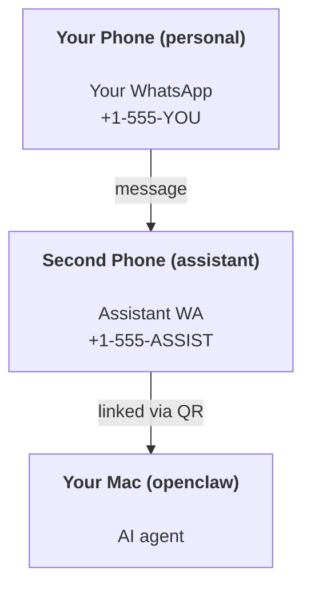

---
read_when:
    - Початкове налаштування нового екземпляра асистента
    - Перегляд наслідків для безпеки та дозволів
summary: Наскрізний посібник із запуску OpenClaw як персонального помічника із застереженнями щодо безпеки
title: Налаштування персонального асистента
x-i18n:
    generated_at: "2026-06-27T18:21:58Z"
    model: gpt-5.5
    postprocess_version: locale-links-v1
    provider: openai
    source_hash: b0cd640872a2a60fd88d2dc3df6d038ef8574163430d8683ef9b67921b0c87f4
    source_path: start/openclaw.md
    workflow: 16
---

OpenClaw — це самостійний Gateway, який під’єднує Discord, Google Chat, iMessage, Matrix, Microsoft Teams, Signal, Slack, Telegram, WhatsApp, Zalo та інші канали до AI-агентів. У цьому посібнику описано налаштування "персонального асистента": окремий номер WhatsApp, який поводиться як ваш постійно доступний AI-асистент.

## ⚠️ Спершу безпека

Ви ставите агента в позицію, де він може:

- запускати команди на вашій машині (залежно від вашої політики інструментів)
- читати/записувати файли у вашому робочому просторі
- надсилати повідомлення назад через WhatsApp/Telegram/Discord/Mattermost та інші вбудовані канали

Починайте консервативно:

- Завжди задавайте `channels.whatsapp.allowFrom` (ніколи не запускайте відкритий для всього світу доступ на своєму особистому Mac).
- Використовуйте окремий номер WhatsApp для асистента.
- Heartbeat-и тепер за замовчуванням виконуються кожні 30 хвилин. Вимкніть їх, доки не довірятимете налаштуванню, встановивши `agents.defaults.heartbeat.every: "0m"`.

## Передумови

- OpenClaw встановлено й виконано початкове налаштування — див. [Початок роботи](/uk/start/getting-started), якщо ви ще цього не зробили
- Другий номер телефону (SIM/eSIM/передплачений) для асистента

## Налаштування з двома телефонами (рекомендовано)

Вам потрібно ось це:



Якщо ви під’єднаєте свій особистий WhatsApp до OpenClaw, кожне повідомлення до вас стане "вхідними даними агента". Це рідко саме те, що вам потрібно.

## Швидкий старт за 5 хвилин

1. З’єднайте WhatsApp Web (покаже QR; відскануйте його телефоном асистента):

```bash
openclaw channels login
```

2. Запустіть Gateway (залиште його запущеним):

```bash
openclaw gateway --port 18789
```

3. Додайте мінімальну конфігурацію в `~/.openclaw/openclaw.json`:

```json5
{
  gateway: { mode: "local" },
  channels: { whatsapp: { allowFrom: ["+15555550123"] } },
}
```

Тепер напишіть на номер асистента з телефону, внесеного до списку дозволених.

Коли початкове налаштування завершиться, OpenClaw автоматично відкриє панель керування й виведе чисте посилання (без токена). Якщо панель керування попросить автентифікацію, вставте налаштований спільний секрет у налаштування Control UI. За замовчуванням початкове налаштування використовує токен (`gateway.auth.token`), але автентифікація паролем також працює, якщо ви перемкнули `gateway.auth.mode` на `password`. Щоб відкрити повторно пізніше: `openclaw dashboard`.

## Дайте агенту робочий простір (AGENTS)

OpenClaw читає робочі інструкції та "пам’ять" зі свого каталогу робочого простору.

За замовчуванням OpenClaw використовує `~/.openclaw/workspace` як робочий простір агента й автоматично створить його (разом зі стартовими `AGENTS.md`, `SOUL.md`, `TOOLS.md`, `IDENTITY.md`, `USER.md`, `HEARTBEAT.md`) під час налаштування або першого запуску агента. `BOOTSTRAP.md` створюється лише тоді, коли робочий простір зовсім новий (він не має повертатися після видалення). `MEMORY.md` необов’язковий (не створюється автоматично); якщо він присутній, його завантажують для звичайних сесій. Сесії підагентів додають лише `AGENTS.md` і `TOOLS.md`.

<Tip>
Ставтеся до цієї папки як до пам’яті OpenClaw і зробіть її git-репозиторієм (бажано приватним), щоб ваші `AGENTS.md` і файли пам’яті мали резервну копію. Якщо git встановлено, абсолютно нові робочі простори ініціалізуються автоматично.
</Tip>

```bash
openclaw setup
```

Повна структура робочого простору + посібник із резервного копіювання: [Робочий простір агента](/uk/concepts/agent-workspace)
Робочий процес пам’яті: [Пам’ять](/uk/concepts/memory)

Необов’язково: виберіть інший робочий простір за допомогою `agents.defaults.workspace` (підтримує `~`).

```json5
{
  agents: {
    defaults: {
      workspace: "~/.openclaw/workspace",
    },
  },
}
```

Якщо ви вже постачаєте власні файли робочого простору з репозиторію, можете повністю вимкнути створення bootstrap-файлів:

```json5
{
  agents: {
    defaults: {
      skipBootstrap: true,
    },
  },
}
```

## Конфігурація, яка перетворює це на "асистента"

OpenClaw за замовчуванням має хороше налаштування асистента, але зазвичай варто відкоригувати:

- персону/інструкції в [`SOUL.md`](/uk/concepts/soul)
- стандартні параметри мислення (за потреби)
- Heartbeat-и (коли почнете довіряти налаштуванню)

Приклад:

```json5
{
  logging: { level: "info" },
  agents: {
    defaults: {
      model: { primary: "anthropic/claude-opus-4-6" },
      workspace: "~/.openclaw/workspace",
      thinkingDefault: "high",
      timeoutSeconds: 1800,
      // Start with 0; enable later.
      heartbeat: { every: "0m" },
    },
    list: [
      {
        id: "main",
        default: true,
        groupChat: {
          mentionPatterns: ["@openclaw", "openclaw"],
        },
      },
    ],
  },
  channels: {
    whatsapp: {
      allowFrom: ["+15555550123"],
      groups: {
        "*": { requireMention: true },
      },
    },
  },
  session: {
    scope: "per-sender",
    resetTriggers: ["/new", "/reset"],
    reset: {
      mode: "daily",
      atHour: 4,
      idleMinutes: 10080,
    },
  },
}
```

## Сесії та пам’ять

- Файли сесій: `~/.openclaw/agents/<agentId>/sessions/{{SessionId}}.jsonl`
- Метадані сесій (використання токенів, останній маршрут тощо): `~/.openclaw/agents/<agentId>/sessions/sessions.json` (застаріле: `~/.openclaw/sessions/sessions.json`)
- `/new` або `/reset` запускає нову сесію для цього чату (налаштовується через `resetTriggers`). Якщо надіслати окремо, OpenClaw підтвердить скидання без виклику моделі.
- `/compact [instructions]` стискає контекст сесії та повідомляє залишковий бюджет контексту.

## Heartbeat-и (проактивний режим)

За замовчуванням OpenClaw запускає Heartbeat кожні 30 хвилин із промптом:
`Read HEARTBEAT.md if it exists (workspace context). Follow it strictly. Do not infer or repeat old tasks from prior chats. If nothing needs attention, reply HEARTBEAT_OK.`
Встановіть `agents.defaults.heartbeat.every: "0m"`, щоб вимкнути.

- Якщо `HEARTBEAT.md` існує, але фактично порожній (лише порожні рядки, коментарі Markdown/HTML, заголовки Markdown на кшталт `# Heading`, маркери блоків коду або порожні заготовки чеклістів), OpenClaw пропускає запуск Heartbeat, щоб заощадити API-виклики.
- Якщо файл відсутній, Heartbeat усе одно запускається, а модель вирішує, що робити.
- Якщо агент відповідає `HEARTBEAT_OK` (необов’язково з коротким доповненням; див. `agents.defaults.heartbeat.ackMaxChars`), OpenClaw пригнічує вихідну доставку для цього Heartbeat.
- За замовчуванням доставка Heartbeat до DM-подібних цілей `user:<id>` дозволена. Встановіть `agents.defaults.heartbeat.directPolicy: "block"`, щоб пригнічувати доставку до прямих цілей, залишаючи запуски Heartbeat активними.
- Heartbeat-и виконують повні ходи агента — коротші інтервали витрачають більше токенів.

```json5
{
  agents: {
    defaults: {
      heartbeat: { every: "30m" },
    },
  },
}
```

## Медіа на вході та виході

Вхідні вкладення (зображення/аудіо/документи) можна передавати вашій команді через шаблони:

- `{{MediaPath}}` (локальний шлях до тимчасового файлу)
- `{{MediaUrl}}` (псевдо-URL)
- `{{Transcript}}` (якщо ввімкнено транскрибування аудіо)

Вихідні вкладення від агента використовують структуровані медіаполя в інструменті повідомлення або payload відповіді, як-от `media`, `mediaUrl`, `mediaUrls`, `path` або `filePath`. Приклад аргументів інструмента повідомлення:

```json
{
  "message": "Here's the screenshot.",
  "mediaUrl": "https://example.com/screenshot.png"
}
```

OpenClaw надсилає структуровані медіа разом із текстом. Застарілі фінальні відповіді асистента ще можуть нормалізуватися для сумісності, але вихід інструментів, вихід браузера, потокові блоки та дії повідомлень не розбирають текст як команди вкладень.

Поведінка локальних шляхів відповідає тій самій моделі довіри для читання файлів, що й агент:

- Якщо `tools.fs.workspaceOnly` дорівнює `true`, вихідні локальні медіашляхи залишаються обмеженими тимчасовим коренем OpenClaw, медіакешем, шляхами робочого простору агента та файлами, створеними в пісочниці.
- Якщо `tools.fs.workspaceOnly` дорівнює `false`, вихідні локальні медіа можуть використовувати локальні файли хоста, які агенту вже дозволено читати.
- Локальні шляхи можуть бути абсолютними, відносними до робочого простору або відносними до домашнього каталогу з `~/`.
- Надсилання локальних файлів хоста все ще дозволяє лише медіа та безпечні типи документів (зображення, аудіо, відео, PDF, документи Office і перевірені текстові документи, як-от Markdown/MD, TXT, JSON, YAML і YML). Це розширення наявної межі довіри для читання з хоста, а не сканер секретів: якщо агент може прочитати локальний файл хоста `secret.txt` або `config.json`, він може прикріпити цей файл, коли розширення та перевірка вмісту збігаються.

Це означає, що згенеровані зображення/файли поза робочим простором тепер можна надсилати, якщо ваша політика fs уже дозволяє такі читання, тоді як довільні локальні текстові розширення хоста залишаються заблокованими. Тримайте чутливі файли поза файловою системою, доступною агенту для читання, або залиште `tools.fs.workspaceOnly=true` для суворішого надсилання локальних шляхів.

## Контрольний список операцій

```bash
openclaw status          # local status (creds, sessions, queued events)
openclaw status --all    # full diagnosis (read-only, pasteable)
openclaw status --deep   # asks the gateway for a live health probe with channel probes when supported
openclaw health --json   # gateway health snapshot (WS; default can return a fresh cached snapshot)
```

Журнали зберігаються в `/tmp/openclaw/` (за замовчуванням: `openclaw-YYYY-MM-DD.log`).

## Наступні кроки

- WebChat: [WebChat](/uk/web/webchat)
- Операції Gateway: [Ранбук Gateway](/uk/gateway)
- Cron + пробудження: [Завдання Cron](/uk/automation/cron-jobs)
- Супутник для рядка меню macOS: [Застосунок OpenClaw для macOS](/uk/platforms/macos)
- Застосунок Node для iOS: [Застосунок iOS](/uk/platforms/ios)
- Застосунок Node для Android: [Застосунок Android](/uk/platforms/android)
- Windows Hub: [Windows](/uk/platforms/windows)
- Стан Linux: [Застосунок Linux](/uk/platforms/linux)
- Безпека: [Безпека](/uk/gateway/security)

## Пов’язане

- [Початок роботи](/uk/start/getting-started)
- [Налаштування](/uk/start/setup)
- [Огляд каналів](/uk/channels)
