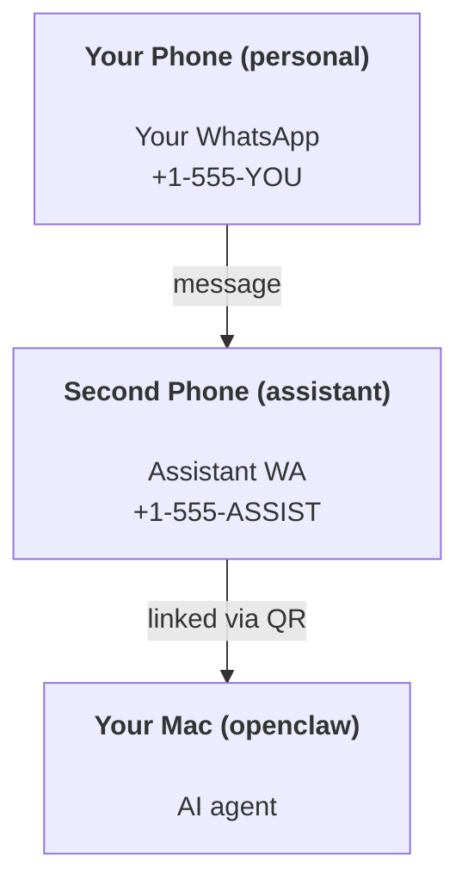

---
read_when:
    - Onboarding нового екземпляра помічника
    - Огляд наслідків для безпеки та дозволів
summary: Повний посібник із використання OpenClaw як персонального помічника з застереженнями щодо безпеки
title: Налаштування персонального помічника
x-i18n:
    generated_at: "2026-04-23T21:12:06Z"
    model: gpt-5.4
    provider: openai
    source_hash: 803740cece6c908214628256e9766530db37442693278c184e3606e44f7eb28f
    source_path: start/openclaw.md
    workflow: 15
---

# Створення персонального помічника з OpenClaw

OpenClaw — це self-hosted gateway, який підключає Discord, Google Chat, iMessage, Matrix, Microsoft Teams, Signal, Slack, Telegram, WhatsApp, Zalo та інші сервіси до AI-агентів. Цей посібник описує сценарій «персонального помічника»: окремий номер WhatsApp, який працює як ваш постійно доступний AI-помічник.

## ⚠️ Спочатку безпека

Ви надаєте агенту можливість:

- виконувати команди на вашій машині (залежно від вашої tool policy)
- читати/записувати файли у вашому workspace
- надсилати повідомлення назад через WhatsApp/Telegram/Discord/Mattermost та інші bundled channels

Починайте консервативно:

- Завжди задавайте `channels.whatsapp.allowFrom` (ніколи не запускайте все відкритим для світу на своєму персональному Mac).
- Використовуйте окремий номер WhatsApp для помічника.
- Heartbeat тепер за замовчуванням працює кожні 30 хвилин. Вимкніть його, доки не почнете довіряти налаштуванню, встановивши `agents.defaults.heartbeat.every: "0m"`.

## Передумови

- OpenClaw установлено і пройдено onboarding — див. [Getting Started](/uk/start/getting-started), якщо ви ще цього не зробили
- Другий номер телефону (SIM/eSIM/prepaid) для помічника

## Налаштування з двома телефонами (рекомендовано)

Вам потрібно ось таке:



Якщо ви прив’яжете свій особистий WhatsApp до OpenClaw, кожне повідомлення вам стане «вхідними даними агента». Рідко саме цього ви хочете.

## Швидкий старт за 5 хвилин

1. Pairing WhatsApp Web (показує QR; відскануйте його телефоном помічника):

```bash
openclaw channels login
```

2. Запустіть Gateway (і залиште його працювати):

```bash
openclaw gateway --port 18789
```

3. Додайте мінімальний config у `~/.openclaw/openclaw.json`:

```json5
{
  gateway: { mode: "local" },
  channels: { whatsapp: { allowFrom: ["+15555550123"] } },
}
```

Тепер надішліть повідомлення на номер помічника зі свого allowlisted-телефона.

Після завершення onboarding ми автоматично відкриваємо dashboard і виводимо чисте (без token-ів) посилання. Якщо він запитає auth, вставте налаштований shared secret у параметри Control UI. Onboarding за замовчуванням використовує token (`gateway.auth.token`), але password auth теж працює, якщо ви перемкнули `gateway.auth.mode` у `password`. Щоб відкрити це знову пізніше: `openclaw dashboard`.

## Дайте агенту workspace (AGENTS)

OpenClaw читає інструкції з роботи та «пам’ять» із каталогу workspace.

За замовчуванням OpenClaw використовує `~/.openclaw/workspace` як workspace агента й автоматично створює його (разом із початковими `AGENTS.md`, `SOUL.md`, `TOOLS.md`, `IDENTITY.md`, `USER.md`, `HEARTBEAT.md`) під час setup/першого запуску агента. `BOOTSTRAP.md` створюється лише тоді, коли workspace зовсім новий (після видалення він не повинен з’являтися знову). `MEMORY.md` є необов’язковим (автоматично не створюється); якщо він існує, то завантажується для звичайних сесій. Сесії subagent-ів ін’єктують лише `AGENTS.md` і `TOOLS.md`.

Порада: ставтеся до цієї теки як до «пам’яті» OpenClaw і зробіть її git-репозиторієм (бажано приватним), щоб ваші `AGENTS.md` + файли пам’яті мали резервну копію. Якщо встановлено git, brand-new workspace ініціалізується автоматично.

```bash
openclaw setup
```

Повний layout workspace + посібник із резервного копіювання: [Agent workspace](/uk/concepts/agent-workspace)
Робочий процес пам’яті: [Memory](/uk/concepts/memory)

Необов’язково: виберіть інший workspace через `agents.defaults.workspace` (підтримує `~`).

```json5
{
  agent: {
    workspace: "~/.openclaw/workspace",
  },
}
```

Якщо ви вже постачаєте власні файли workspace з репозиторію, можете повністю вимкнути створення bootstrap-файлів:

```json5
{
  agent: {
    skipBootstrap: true,
  },
}
```

## Конфігурація, яка перетворює це на «помічника»

OpenClaw за замовчуванням має хороше налаштування для помічника, але зазвичай ви захочете налаштувати:

- persona/інструкції в [`SOUL.md`](/uk/concepts/soul)
- типові значення thinking (за потреби)
- heartbeat-и (коли почнете довіряти системі)

Приклад:

```json5
{
  logging: { level: "info" },
  agent: {
    model: "anthropic/claude-opus-4-6",
    workspace: "~/.openclaw/workspace",
    thinkingDefault: "high",
    timeoutSeconds: 1800,
    // Start with 0; enable later.
    heartbeat: { every: "0m" },
  },
  channels: {
    whatsapp: {
      allowFrom: ["+15555550123"],
      groups: {
        "*": { requireMention: true },
      },
    },
  },
  routing: {
    groupChat: {
      mentionPatterns: ["@openclaw", "openclaw"],
    },
  },
  session: {
    scope: "per-sender",
    resetTriggers: ["/new", "/reset"],
    reset: {
      mode: "daily",
      atHour: 4,
      idleMinutes: 10080,
    },
  },
}
```

## Сесії та пам’ять

- Файли сесій: `~/.openclaw/agents/<agentId>/sessions/{{SessionId}}.jsonl`
- Metadata сесій (використання token-ів, останній route тощо): `~/.openclaw/agents/<agentId>/sessions/sessions.json` (legacy: `~/.openclaw/sessions/sessions.json`)
- `/new` або `/reset` запускає нову сесію для цього чату (налаштовується через `resetTriggers`). Якщо надіслати лише цю команду, агент відповість коротким hello, щоб підтвердити reset.
- `/compact [instructions]` виконує Compaction контексту сесії й повідомляє, який budget контексту залишився.

## Heartbeat-и (проактивний режим)

За замовчуванням OpenClaw запускає heartbeat кожні 30 хвилин з prompt:
`Read HEARTBEAT.md if it exists (workspace context). Follow it strictly. Do not infer or repeat old tasks from prior chats. If nothing needs attention, reply HEARTBEAT_OK.`
Установіть `agents.defaults.heartbeat.every: "0m"`, щоб вимкнути це.

- Якщо `HEARTBEAT.md` існує, але фактично порожній (лише порожні рядки та markdown-заголовки на кшталт `# Heading`), OpenClaw пропускає запуск heartbeat, щоб заощадити API-виклики.
- Якщо файл відсутній, heartbeat усе одно запускається, і модель сама вирішує, що робити.
- Якщо агент відповідає `HEARTBEAT_OK` (необов’язково з коротким padding; див. `agents.defaults.heartbeat.ackMaxChars`), OpenClaw пригнічує вихідну доставку для цього heartbeat.
- За замовчуванням доставка heartbeat у цілі в стилі DM `user:<id>` дозволена. Установіть `agents.defaults.heartbeat.directPolicy: "block"`, щоб пригнітити доставку до прямих цілей, зберігши самі запуски heartbeat активними.
- Heartbeat-и виконують повні turn-и агента — коротші інтервали спалюють більше token-ів.

```json5
{
  agent: {
    heartbeat: { every: "30m" },
  },
}
```

## Медіа на вході та на виході

Вхідні вкладення (зображення/audio/docs) можуть потрапляти у вашу команду через шаблони:

- `{{MediaPath}}` (локальний шлях до тимчасового файла)
- `{{MediaUrl}}` (псевдо-URL)
- `{{Transcript}}` (якщо ввімкнено аудіотранскрипцію)

Вихідні вкладення від агента: додайте `MEDIA:<path-or-url>` окремим рядком (без пробілів). Приклад:

```
Here’s the screenshot.
MEDIA:https://example.com/screenshot.png
```

OpenClaw витягує це й надсилає як медіа разом із текстом.

Поведінка локальних шляхів відповідає тій самій моделі довіри до читання файлів, що й агент:

- Якщо `tools.fs.workspaceOnly` має значення `true`, локальні шляхи для вихідного `MEDIA:` залишаються обмеженими temp-root OpenClaw, media cache, шляхами workspace агента та файлами, згенерованими в sandbox.
- Якщо `tools.fs.workspaceOnly` має значення `false`, вихідний `MEDIA:` може використовувати локальні файли host-а, які агент уже має право читати.
- Надсилання локальних файлів host-а все одно дозволяє лише медіа та безпечні типи документів (зображення, audio, video, PDF і Office-документи). Звичайний текст і файли, схожі на секрети, не вважаються медіа для надсилання.

Це означає, що згенеровані зображення/файли поза workspace тепер можна надсилати, якщо ваша fs policy уже дозволяє такі читання, без повторного відкриття довільної exfiltration текстових вкладень із host-а.

## Контрольний список операцій

```bash
openclaw status          # local status (creds, sessions, queued events)
openclaw status --all    # full diagnosis (read-only, pasteable)
openclaw status --deep   # asks the gateway for a live health probe with channel probes when supported
openclaw health --json   # gateway health snapshot (WS; default can return a fresh cached snapshot)
```

Журнали живуть у `/tmp/openclaw/` (за замовчуванням: `openclaw-YYYY-MM-DD.log`).

## Подальші кроки

- WebChat: [WebChat](/uk/web/webchat)
- Операції Gateway: [Runbook Gateway](/uk/gateway)
- Cron + пробудження: [Cron jobs](/uk/automation/cron-jobs)
- Супутник для меню macOS: [Застосунок OpenClaw для macOS](/uk/platforms/macos)
- Застосунок node для iOS: [Застосунок iOS](/uk/platforms/ios)
- Застосунок node для Android: [Застосунок Android](/uk/platforms/android)
- Стан Windows: [Windows (WSL2)](/uk/platforms/windows)
- Стан Linux: [Застосунок Linux](/uk/platforms/linux)
- Безпека: [Безпека](/uk/gateway/security)
