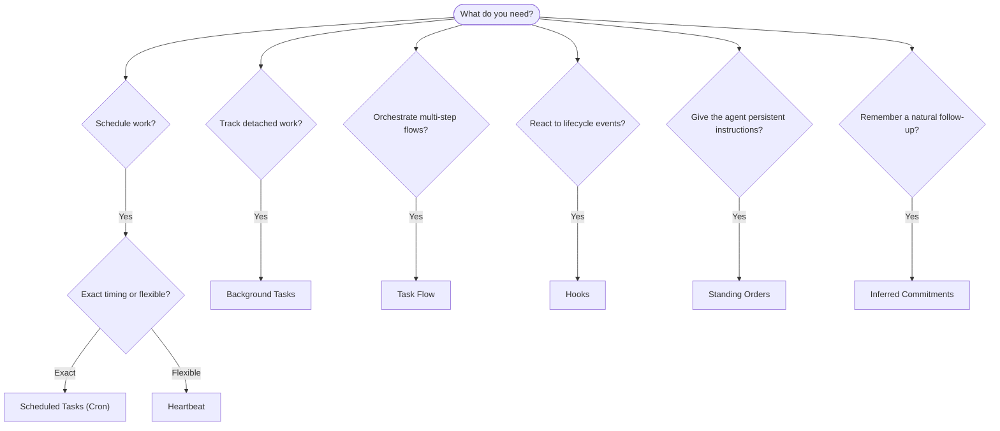

OpenClaw chạy công việc trong nền thông qua tác vụ, công việc đã lên lịch, cam kết được suy luận, hook sự kiện và chỉ dẫn thường trực. Trang này giúp bạn chọn cơ chế phù hợp và hiểu cách chúng phối hợp với nhau.

## Hướng dẫn quyết định nhanh

| Trường hợp sử dụng                         | Khuyến nghị              | Lý do                                                   |
| ------------------------------------------ | ------------------------ | ------------------------------------------------------- |
| Gửi báo cáo hằng ngày đúng 9 giờ sáng      | Tác vụ đã lên lịch (Cron) | Thời điểm chính xác, thực thi cô lập                    |
| Nhắc tôi sau 20 phút                       | Tác vụ đã lên lịch (Cron) | Một lần với thời điểm chính xác (`--at`)                |
| Chạy phân tích sâu hằng tuần               | Tác vụ đã lên lịch (Cron) | Tác vụ độc lập, có thể dùng mô hình khác                |
| Kiểm tra hộp thư đến mỗi 30 phút           | Heartbeat                | Gộp với các kiểm tra khác, nhận biết ngữ cảnh           |
| Theo dõi lịch cho sự kiện sắp tới          | Heartbeat                | Phù hợp tự nhiên với nhận biết định kỳ                  |
| Kiểm tra lại sau một cuộc phỏng vấn đã nhắc | Cam kết được suy luận     | Theo dõi giống bộ nhớ, không yêu cầu nhắc chính xác     |
| Kiểm tra quan tâm nhẹ nhàng sau ngữ cảnh người dùng | Cam kết được suy luận | Giới hạn trong cùng agent và kênh                       |
| Kiểm tra trạng thái của subagent hoặc lần chạy ACP | Tác vụ nền          | Sổ cái tác vụ theo dõi mọi công việc tách rời           |
| Kiểm toán nội dung đã chạy và thời điểm chạy | Tác vụ nền             | `openclaw tasks list` và `openclaw tasks audit`         |
| Nghiên cứu nhiều bước rồi tóm tắt          | Task Flow                | Điều phối bền vững với theo dõi phiên bản sửa đổi      |
| Chạy script khi phiên đặt lại              | Hook                     | Điều khiển bằng sự kiện, kích hoạt theo sự kiện vòng đời |
| Thực thi mã trên mọi lệnh gọi công cụ      | Hook Plugin              | Hook trong tiến trình có thể chặn lệnh gọi công cụ      |
| Luôn kiểm tra tuân thủ trước khi trả lời   | Chỉ dẫn thường trực      | Được tự động đưa vào mọi phiên                          |

### Tác vụ đã lên lịch (Cron) so với Heartbeat

| Khía cạnh        | Tác vụ đã lên lịch (Cron)           | Heartbeat                              |
| ---------------- | ----------------------------------- | -------------------------------------- |
| Thời điểm        | Chính xác (biểu thức cron, một lần) | Gần đúng (mặc định mỗi 30 phút)        |
| Ngữ cảnh phiên   | Mới (cô lập) hoặc dùng chung        | Toàn bộ ngữ cảnh phiên chính           |
| Bản ghi tác vụ   | Luôn được tạo                       | Không bao giờ được tạo                 |
| Phân phối        | Kênh, webhook hoặc im lặng          | Nội tuyến trong phiên chính            |
| Phù hợp nhất cho | Báo cáo, lời nhắc, công việc nền    | Kiểm tra hộp thư đến, lịch, thông báo  |

Dùng Tác vụ đã lên lịch (Cron) khi bạn cần thời điểm chính xác hoặc thực thi cô lập. Dùng Heartbeat khi công việc hưởng lợi từ toàn bộ ngữ cảnh phiên và thời điểm gần đúng là đủ.

## Khái niệm cốt lõi

### Tác vụ đã lên lịch (cron)

Cron là bộ lập lịch tích hợp của Gateway dành cho thời điểm chính xác. Nó lưu công việc, đánh thức agent đúng lúc và có thể gửi đầu ra đến kênh trò chuyện hoặc endpoint webhook. Hỗ trợ lời nhắc một lần, biểu thức lặp lại và trình kích hoạt webhook đến.

Xem [Tác vụ đã lên lịch](/vi/automation/cron-jobs).

### Tác vụ

Sổ cái tác vụ nền theo dõi mọi công việc tách rời: lần chạy ACP, tạo subagent, thực thi cron cô lập và thao tác CLI. Tác vụ là bản ghi, không phải bộ lập lịch. Dùng `openclaw tasks list` và `openclaw tasks audit` để kiểm tra chúng.

Xem [Tác vụ nền](/vi/automation/tasks).

### Cam kết được suy luận

Cam kết là bộ nhớ theo dõi ngắn hạn, cần bật rõ ràng. OpenClaw suy luận chúng từ các cuộc trò chuyện thông thường, giới hạn chúng trong cùng agent và kênh, rồi gửi các lượt kiểm tra đến hạn thông qua Heartbeat. Lời nhắc chính xác do người dùng yêu cầu vẫn thuộc về cron.

Xem [Cam kết được suy luận](/vi/concepts/commitments).

### Task Flow

Task Flow là nền tảng điều phối luồng nằm trên tác vụ nền. Nó quản lý các luồng nhiều bước bền vững với chế độ đồng bộ được quản lý và phản chiếu, theo dõi phiên bản sửa đổi và `openclaw tasks flow list|show|cancel` để kiểm tra.

Xem [Task Flow](/vi/automation/taskflow).

### Chỉ dẫn thường trực

Chỉ dẫn thường trực cấp cho agent thẩm quyền vận hành lâu dài cho các chương trình đã định nghĩa. Chúng nằm trong các tệp workspace (thường là `AGENTS.md`) và được đưa vào mọi phiên. Kết hợp với cron để thực thi dựa trên thời gian.

Xem [Chỉ dẫn thường trực](/vi/automation/standing-orders).

### Hook

Hook nội bộ là các script điều khiển bằng sự kiện, được kích hoạt bởi sự kiện vòng đời agent (`/new`, `/reset`, `/stop`), Compaction phiên, khởi động Gateway và luồng tin nhắn. Chúng được tự động phát hiện từ các thư mục và có thể được quản lý bằng `openclaw hooks`. Để chặn lệnh gọi công cụ trong tiến trình, dùng [hook Plugin](/vi/plugins/hooks).

Xem [Hook](/vi/automation/hooks).

### Heartbeat

Heartbeat là một lượt phiên chính định kỳ (mặc định mỗi 30 phút). Nó gộp nhiều kiểm tra (hộp thư đến, lịch, thông báo) trong một lượt agent với toàn bộ ngữ cảnh phiên. Các lượt Heartbeat không tạo bản ghi tác vụ và không gia hạn độ mới của việc đặt lại phiên hằng ngày/nhàn rỗi. Dùng `HEARTBEAT.md` cho một danh sách kiểm tra nhỏ, hoặc khối `tasks:` khi bạn muốn các kiểm tra định kỳ chỉ-đến-hạn ngay trong Heartbeat. Tệp Heartbeat rỗng được bỏ qua dưới dạng `empty-heartbeat-file`; chế độ tác vụ chỉ-đến-hạn được bỏ qua dưới dạng `no-tasks-due`. Heartbeat hoãn lại khi công việc cron đang hoạt động hoặc được xếp hàng, và `heartbeat.skipWhenBusy` cũng có thể hoãn chúng khi subagent hoặc lane lồng nhau đang bận.

Xem [Heartbeat](/vi/gateway/heartbeat).

## Cách chúng phối hợp với nhau

- **Cron** xử lý lịch chính xác (báo cáo hằng ngày, đánh giá hằng tuần) và lời nhắc một lần. Mọi lần thực thi cron đều tạo bản ghi tác vụ.
- **Heartbeat** xử lý giám sát định kỳ (hộp thư đến, lịch, thông báo) trong một lượt gộp mỗi 30 phút.
- **Hook** phản ứng với các sự kiện cụ thể (đặt lại phiên, Compaction, luồng tin nhắn) bằng script tùy chỉnh. Hook Plugin bao phủ lệnh gọi công cụ.
- **Chỉ dẫn thường trực** cung cấp cho agent ngữ cảnh bền vững và ranh giới thẩm quyền.
- **Task Flow** điều phối các luồng nhiều bước bên trên từng tác vụ riêng lẻ.
- **Tác vụ** tự động theo dõi mọi công việc tách rời để bạn có thể kiểm tra và kiểm toán.

## Liên quan

- [Tác vụ đã lên lịch](/vi/automation/cron-jobs) — lập lịch chính xác và lời nhắc một lần
- [Cam kết được suy luận](/vi/concepts/commitments) — lượt kiểm tra theo dõi giống bộ nhớ
- [Tác vụ nền](/vi/automation/tasks) — sổ cái tác vụ cho mọi công việc tách rời
- [Task Flow](/vi/automation/taskflow) — điều phối luồng nhiều bước bền vững
- [Hook](/vi/automation/hooks) — script vòng đời điều khiển bằng sự kiện
- [Hook Plugin](/vi/plugins/hooks) — hook công cụ, prompt, tin nhắn và vòng đời trong tiến trình
- [Chỉ dẫn thường trực](/vi/automation/standing-orders) — chỉ dẫn agent bền vững
- [Heartbeat](/vi/gateway/heartbeat) — lượt phiên chính định kỳ
- [Tham chiếu cấu hình](/vi/gateway/configuration-reference) — tất cả khóa cấu hình
