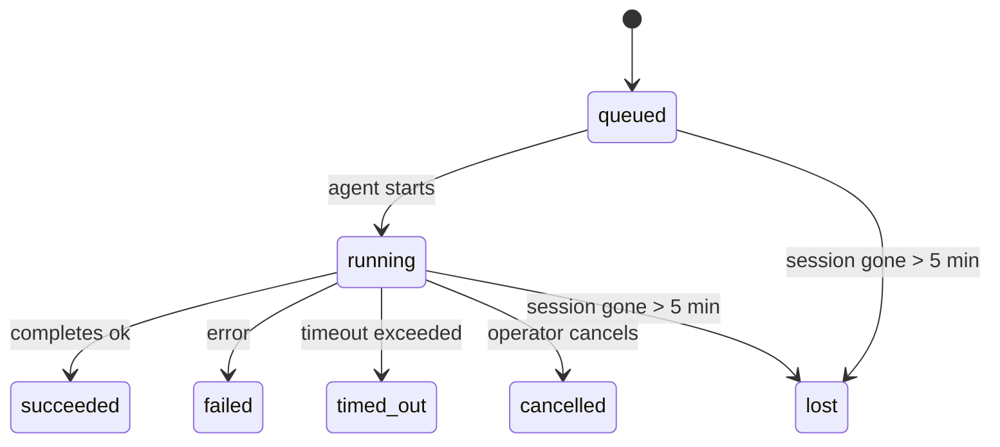

---
read_when:
    - Kiểm tra công việc nền đang diễn ra hoặc mới hoàn tất
    - Gỡ lỗi các sự cố gửi đối với các lượt chạy tác nhân tách rời
    - Hiểu cách các lượt chạy nền liên quan đến phiên, Cron và Heartbeat
sidebarTitle: Background tasks
summary: Theo dõi tác vụ nền cho các lượt chạy ACP, tác nhân phụ, công việc Cron biệt lập và thao tác CLI
title: Tác vụ nền
x-i18n:
    generated_at: "2026-04-29T22:24:09Z"
    model: gpt-5.5
    provider: openai
    source_hash: 4bbf74f3aeea532738b56b83cd2e1a0a3734bfd453da6636b8be985a28ccc027
    source_path: automation/tasks.md
    workflow: 16
---

<Note>
Bạn đang tìm tính năng lên lịch? Xem [Tự động hóa và tác vụ](/vi/automation) để chọn cơ chế phù hợp. Trang này là sổ cái hoạt động cho công việc nền, không phải bộ lập lịch.
</Note>

Tác vụ nền theo dõi công việc chạy **bên ngoài phiên hội thoại chính của bạn**: các lần chạy ACP, sinh subagent, thực thi cron job cô lập, và các thao tác khởi tạo từ CLI.

Tác vụ **không** thay thế phiên, cron job, hoặc heartbeat — chúng là **sổ cái hoạt động** ghi lại công việc tách rời nào đã xảy ra, khi nào, và có thành công hay không.

<Note>
Không phải mọi lần chạy agent đều tạo tác vụ. Các lượt heartbeat và chat tương tác thông thường thì không. Tất cả các lần thực thi cron, sinh ACP, sinh subagent, và lệnh agent từ CLI thì có.
</Note>

## TL;DR

- Tác vụ là **bản ghi**, không phải bộ lập lịch — cron và heartbeat quyết định công việc chạy _khi nào_, tác vụ theo dõi _điều gì đã xảy ra_.
- ACP, subagent, tất cả cron job, và thao tác CLI tạo tác vụ. Các lượt heartbeat thì không.
- Mỗi tác vụ đi qua `queued → running → terminal` (succeeded, failed, timed_out, cancelled, hoặc lost).
- Tác vụ cron vẫn live khi runtime cron còn sở hữu job; nếu trạng thái runtime
  trong bộ nhớ đã mất, quá trình bảo trì tác vụ trước tiên kiểm tra lịch sử lần
  chạy cron bền vững trước khi đánh dấu tác vụ là lost.
- Hoàn tất được điều khiển bằng push: công việc tách rời có thể thông báo trực tiếp hoặc đánh thức
  phiên/heartbeat của bên yêu cầu khi hoàn tất, nên các vòng lặp thăm dò trạng thái
  thường không phải mô hình phù hợp.
- Các lần chạy cron cô lập và hoàn tất subagent cố gắng tối đa dọn dẹp các tab/trình duyệt được theo dõi cho phiên con của chúng trước bước ghi sổ dọn dẹp cuối cùng.
- Chuyển phát cron cô lập chặn các phản hồi cha tạm thời đã cũ trong khi công việc subagent hậu duệ vẫn đang rút hết, và ưu tiên đầu ra cuối cùng của hậu duệ khi đầu ra đó đến trước khi chuyển phát.
- Thông báo hoàn tất được chuyển trực tiếp đến một kênh hoặc xếp hàng cho heartbeat tiếp theo.
- `openclaw tasks list` hiển thị tất cả tác vụ; `openclaw tasks audit` nêu bật vấn đề.
- Bản ghi terminal được giữ trong 7 ngày, rồi tự động cắt tỉa.

## Bắt đầu nhanh

<Tabs>
  <Tab title="Liệt kê và lọc">
    ```bash
    # Liệt kê tất cả tác vụ (mới nhất trước)
    openclaw tasks list

    # Lọc theo runtime hoặc trạng thái
    openclaw tasks list --runtime acp
    openclaw tasks list --status running
    ```

  </Tab>
  <Tab title="Kiểm tra">
    ```bash
    # Hiển thị chi tiết cho một tác vụ cụ thể (theo ID, run ID, hoặc session key)
    openclaw tasks show <lookup>
    ```
  </Tab>
  <Tab title="Hủy và thông báo">
    ```bash
    # Hủy một tác vụ đang chạy (kết thúc phiên con)
    openclaw tasks cancel <lookup>

    # Thay đổi chính sách thông báo cho một tác vụ
    openclaw tasks notify <lookup> state_changes
    ```

  </Tab>
  <Tab title="Kiểm tra và bảo trì">
    ```bash
    # Chạy kiểm tra sức khỏe
    openclaw tasks audit

    # Xem trước hoặc áp dụng bảo trì
    openclaw tasks maintenance
    openclaw tasks maintenance --apply
    ```

  </Tab>
  <Tab title="Luồng tác vụ">
    ```bash
    # Kiểm tra trạng thái TaskFlow
    openclaw tasks flow list
    openclaw tasks flow show <lookup>
    openclaw tasks flow cancel <lookup>
    ```
  </Tab>
</Tabs>

## Điều gì tạo tác vụ

| Nguồn                  | Loại runtime | Khi bản ghi tác vụ được tạo                           | Chính sách thông báo mặc định |
| ---------------------- | ------------ | ----------------------------------------------------- | ----------------------------- |
| Lần chạy nền ACP       | `acp`        | Sinh một phiên ACP con                                | `done_only`                   |
| Điều phối subagent     | `subagent`   | Sinh một subagent qua `sessions_spawn`                | `done_only`                   |
| Cron job (mọi loại)    | `cron`       | Mỗi lần thực thi cron (phiên chính và cô lập)         | `silent`                      |
| Thao tác CLI           | `cli`        | Các lệnh `openclaw agent` chạy qua gateway            | `silent`                      |
| Job media của agent    | `cli`        | Các lần chạy `video_generate` có phiên hỗ trợ         | `silent`                      |

<AccordionGroup>
  <Accordion title="Mặc định thông báo cho cron và media">
    Tác vụ cron phiên chính mặc định dùng chính sách thông báo `silent` — chúng tạo bản ghi để theo dõi nhưng không tạo thông báo. Tác vụ cron cô lập cũng mặc định là `silent` nhưng dễ thấy hơn vì chúng chạy trong phiên riêng.

    Các lần chạy `video_generate` có phiên hỗ trợ cũng dùng chính sách thông báo `silent`. Chúng vẫn tạo bản ghi tác vụ, nhưng việc hoàn tất được chuyển lại cho phiên agent gốc như một lần đánh thức nội bộ để agent có thể tự viết thông điệp tiếp theo và đính kèm video hoàn tất. Nếu bạn bật `tools.media.asyncCompletion.directSend`, các lần hoàn tất bất đồng bộ của `music_generate` và `video_generate` sẽ thử chuyển phát trực tiếp đến kênh trước, rồi mới quay về đường dẫn đánh thức phiên yêu cầu.

  </Accordion>
  <Accordion title="Lan can bảo vệ video_generate đồng thời">
    Khi một tác vụ `video_generate` có phiên hỗ trợ vẫn đang hoạt động, công cụ cũng đóng vai trò như một lan can bảo vệ: các lệnh gọi `video_generate` lặp lại trong cùng phiên đó sẽ trả về trạng thái tác vụ đang hoạt động thay vì bắt đầu lượt tạo thứ hai đồng thời. Dùng `action: "status"` khi bạn muốn tra cứu tiến độ/trạng thái rõ ràng từ phía agent.
  </Accordion>
  <Accordion title="Điều gì không tạo tác vụ">
    - Lượt heartbeat — phiên chính; xem [Heartbeat](/vi/gateway/heartbeat)
    - Lượt chat tương tác thông thường
    - Phản hồi `/command` trực tiếp

  </Accordion>
</AccordionGroup>

## Vòng đời tác vụ



| Trạng thái  | Ý nghĩa                                                                    |
| ----------- | -------------------------------------------------------------------------- |
| `queued`    | Đã tạo, đang chờ agent bắt đầu                                             |
| `running`   | Lượt agent đang thực thi chủ động                                          |
| `succeeded` | Hoàn tất thành công                                                        |
| `failed`    | Hoàn tất với lỗi                                                           |
| `timed_out` | Vượt quá thời gian chờ đã cấu hình                                         |
| `cancelled` | Bị người vận hành dừng qua `openclaw tasks cancel`                         |
| `lost`      | Runtime mất trạng thái hỗ trợ có thẩm quyền sau thời gian gia hạn 5 phút  |

Chuyển trạng thái diễn ra tự động — khi lần chạy agent liên quan kết thúc, trạng thái tác vụ được cập nhật tương ứng.

Hoàn tất lần chạy agent là nguồn có thẩm quyền cho bản ghi tác vụ đang hoạt động. Một lần chạy tách rời thành công được hoàn tất là `succeeded`, lỗi chạy thông thường hoàn tất là `failed`, và kết quả timeout hoặc abort hoàn tất là `timed_out`. Nếu người vận hành đã hủy tác vụ, hoặc runtime đã ghi một trạng thái terminal mạnh hơn như `failed`, `timed_out`, hoặc `lost`, tín hiệu thành công muộn hơn sẽ không hạ cấp trạng thái terminal đó.

`lost` nhận biết runtime:

- Tác vụ ACP: siêu dữ liệu phiên ACP con hỗ trợ đã biến mất.
- Tác vụ subagent: phiên con hỗ trợ đã biến mất khỏi kho agent đích.
- Tác vụ cron: runtime cron không còn theo dõi job là đang hoạt động và lịch sử
  lần chạy cron bền vững không hiển thị kết quả terminal cho lần chạy đó. Kiểm tra
  CLI ngoại tuyến không coi trạng thái runtime cron trong tiến trình rỗng của chính nó là có thẩm quyền.
- Tác vụ CLI: tác vụ phiên con cô lập dùng phiên con; tác vụ CLI có chat hỗ trợ
  dùng ngữ cảnh lần chạy live thay vào đó, nên các hàng phiên
  kênh/nhóm/trực tiếp còn sót lại không giữ chúng sống. Các lần chạy
  `openclaw agent` có Gateway hỗ trợ cũng hoàn tất từ kết quả chạy của chúng, nên các lần chạy đã hoàn tất
  không nằm ở trạng thái hoạt động cho tới khi sweeper đánh dấu chúng là `lost`.

## Chuyển phát và thông báo

Khi một tác vụ đạt trạng thái terminal, OpenClaw thông báo cho bạn. Có hai đường dẫn chuyển phát:

**Chuyển phát trực tiếp** — nếu tác vụ có đích kênh (`requesterOrigin`), thông điệp hoàn tất đi thẳng đến kênh đó (Telegram, Discord, Slack, v.v.). Với hoàn tất subagent, OpenClaw cũng giữ nguyên định tuyến thread/topic đã liên kết khi có sẵn và có thể điền `to` / tài khoản bị thiếu từ tuyến đã lưu của phiên yêu cầu (`lastChannel` / `lastTo` / `lastAccountId`) trước khi từ bỏ chuyển phát trực tiếp.

**Chuyển phát xếp hàng theo phiên** — nếu chuyển phát trực tiếp thất bại hoặc không đặt origin, bản cập nhật được xếp hàng như một sự kiện hệ thống trong phiên của bên yêu cầu và xuất hiện ở heartbeat tiếp theo.

<Tip>
Hoàn tất tác vụ kích hoạt đánh thức heartbeat ngay lập tức để bạn thấy kết quả nhanh chóng — bạn không phải chờ tick heartbeat đã lên lịch tiếp theo.
</Tip>

Điều đó nghĩa là quy trình thông thường dựa trên push: khởi động công việc tách rời một lần, rồi để runtime đánh thức hoặc thông báo cho bạn khi hoàn tất. Chỉ thăm dò trạng thái tác vụ khi bạn cần gỡ lỗi, can thiệp, hoặc kiểm tra rõ ràng.

### Chính sách thông báo

Kiểm soát mức độ bạn nhận tin về từng tác vụ:

| Chính sách            | Nội dung được chuyển phát                                                |
| --------------------- | ------------------------------------------------------------------------ |
| `done_only` (mặc định) | Chỉ trạng thái terminal (succeeded, failed, v.v.) — **đây là mặc định** |
| `state_changes`       | Mọi chuyển trạng thái và cập nhật tiến độ                                |
| `silent`              | Không có gì                                                              |

Thay đổi chính sách khi tác vụ đang chạy:

```bash
openclaw tasks notify <lookup> state_changes
```

## Tham chiếu CLI

<AccordionGroup>
  <Accordion title="tasks list">
    ```bash
    openclaw tasks list [--runtime <acp|subagent|cron|cli>] [--status <status>] [--json]
    ```

    Các cột đầu ra: Task ID, Kind, Status, Delivery, Run ID, Child Session, Summary.

  </Accordion>
  <Accordion title="tasks show">
    ```bash
    openclaw tasks show <lookup>
    ```

    Token tra cứu chấp nhận task ID, run ID, hoặc session key. Hiển thị bản ghi đầy đủ bao gồm thời gian, trạng thái chuyển phát, lỗi, và tóm tắt terminal.

  </Accordion>
  <Accordion title="tasks cancel">
    ```bash
    openclaw tasks cancel <lookup>
    ```

    Với tác vụ ACP và subagent, lệnh này kết thúc phiên con. Với tác vụ được CLI theo dõi, hủy được ghi nhận trong registry tác vụ (không có handle runtime con riêng). Trạng thái chuyển sang `cancelled` và thông báo chuyển phát được gửi khi áp dụng.

  </Accordion>
  <Accordion title="tasks notify">
    ```bash
    openclaw tasks notify <lookup> <done_only|state_changes|silent>
    ```
  </Accordion>
  <Accordion title="tasks audit">
    ```bash
    openclaw tasks audit [--json]
    ```

    Nêu bật các vấn đề vận hành. Phát hiện cũng xuất hiện trong `openclaw status` khi phát hiện vấn đề.

    | Kết quả phát hiện          | Mức độ     | Điều kiện kích hoạt                                                                                                      |
    | ------------------------- | ---------- | ------------------------------------------------------------------------------------------------------------------------ |
    | `stale_queued`            | warn       | Đã xếp hàng hơn 10 phút                                                                                                  |
    | `stale_running`           | error      | Đang chạy hơn 30 phút                                                                                                    |
    | `lost`                    | warn/error | Quyền sở hữu tác vụ dựa trên runtime đã biến mất; các tác vụ thất lạc được giữ lại sẽ cảnh báo cho đến `cleanupAfter`, sau đó trở thành lỗi |
    | `delivery_failed`         | warn       | Gửi thất bại và chính sách thông báo không phải là `silent`                                                              |
    | `missing_cleanup`         | warn       | Tác vụ kết thúc nhưng không có dấu thời gian dọn dẹp                                                                      |
    | `inconsistent_timestamps` | warn       | Vi phạm dòng thời gian (ví dụ kết thúc trước khi bắt đầu)                                                                 |

  </Accordion>
  <Accordion title="tasks maintenance">
    ```bash
    openclaw tasks maintenance [--json]
    openclaw tasks maintenance --apply [--json]
    ```

    Dùng lệnh này để xem trước hoặc áp dụng việc đối soát, đóng dấu dọn dẹp và cắt tỉa cho tác vụ và trạng thái Task Flow.

    Việc đối soát có nhận biết runtime:

    - Tác vụ ACP/subagent kiểm tra phiên con hỗ trợ của chúng.
    - Tác vụ Cron kiểm tra xem cron runtime còn sở hữu job hay không, rồi khôi phục trạng thái kết thúc từ nhật ký lần chạy cron/trạng thái job đã lưu trước khi chuyển về `lost`. Chỉ tiến trình Gateway mới có thẩm quyền với tập job cron đang hoạt động trong bộ nhớ; kiểm toán CLI ngoại tuyến dùng lịch sử bền vững nhưng không đánh dấu một tác vụ cron là thất lạc chỉ vì Set cục bộ đó trống.
    - Tác vụ CLI dựa trên chat kiểm tra ngữ cảnh lần chạy trực tiếp sở hữu, không chỉ hàng phiên chat.

    Dọn dẹp khi hoàn tất cũng có nhận biết runtime:

    - Khi subagent hoàn tất, hệ thống cố gắng tối đa đóng các tab trình duyệt/tiến trình được theo dõi cho phiên con trước khi tiếp tục dọn dẹp thông báo.
    - Khi cron cô lập hoàn tất, hệ thống cố gắng tối đa đóng các tab trình duyệt/tiến trình được theo dõi cho phiên cron trước khi lần chạy được tháo dỡ hoàn toàn.
    - Việc gửi của cron cô lập chờ lượt theo dõi của subagent hậu duệ khi cần và chặn văn bản xác nhận cha đã cũ thay vì thông báo nó.
    - Việc gửi khi subagent hoàn tất ưu tiên văn bản trợ lý hiển thị mới nhất; nếu trống, nó quay về văn bản tool/toolResult mới nhất đã được làm sạch, và các lần chạy gọi công cụ chỉ hết thời gian chờ có thể thu gọn thành một tóm tắt tiến độ một phần ngắn. Các lần chạy kết thúc thất bại thông báo trạng thái thất bại mà không phát lại văn bản trả lời đã ghi lại.
    - Lỗi dọn dẹp không che khuất kết quả tác vụ thực tế.

  </Accordion>
  <Accordion title="tasks flow list | show | cancel">
    ```bash
    openclaw tasks flow list [--status <status>] [--json]
    openclaw tasks flow show <lookup> [--json]
    openclaw tasks flow cancel <lookup>
    ```

    Dùng các lệnh này khi Task Flow điều phối mới là thứ bạn quan tâm thay vì một bản ghi tác vụ nền riêng lẻ.

  </Accordion>
</AccordionGroup>

## Bảng tác vụ chat (`/tasks`)

Dùng `/tasks` trong bất kỳ phiên chat nào để xem các tác vụ nền được liên kết với phiên đó. Bảng hiển thị các tác vụ đang hoạt động và mới hoàn tất gần đây cùng runtime, trạng thái, thời gian, tiến độ hoặc chi tiết lỗi.

Khi phiên hiện tại không có tác vụ liên kết hiển thị nào, `/tasks` sẽ quay về số lượng tác vụ cục bộ của agent để bạn vẫn có cái nhìn tổng quan mà không làm lộ chi tiết của phiên khác.

Để xem sổ cái đầy đủ cho người vận hành, dùng CLI: `openclaw tasks list`.

## Tích hợp trạng thái (áp lực tác vụ)

`openclaw status` bao gồm tóm tắt tác vụ nhìn nhanh:

```
Tasks: 3 queued · 2 running · 1 issues
```

Tóm tắt báo cáo:

- **active** — số lượng `queued` + `running`
- **failures** — số lượng `failed` + `timed_out` + `lost`
- **byRuntime** — phân tách theo `acp`, `subagent`, `cron`, `cli`

Cả `/status` và công cụ `session_status` đều dùng ảnh chụp tác vụ có nhận biết dọn dẹp: tác vụ đang hoạt động được ưu tiên, các hàng đã hoàn tất nhưng cũ bị ẩn, và lỗi gần đây chỉ xuất hiện khi không còn công việc đang hoạt động. Điều này giữ thẻ trạng thái tập trung vào điều quan trọng ngay lúc này.

## Lưu trữ và bảo trì

### Nơi lưu tác vụ

Bản ghi tác vụ được lưu bền vững trong SQLite tại:

```
$OPENCLAW_STATE_DIR/tasks/runs.sqlite
```

Registry được tải vào bộ nhớ khi gateway khởi động và đồng bộ các lần ghi vào SQLite để bền vững qua các lần khởi động lại.
Gateway giữ nhật ký ghi trước của SQLite trong giới hạn bằng cách dùng ngưỡng
autocheckpoint mặc định của SQLite cùng các checkpoint `TRUNCATE` định kỳ và khi tắt.

### Bảo trì tự động

Một trình quét chạy mỗi **60 giây** và xử lý bốn việc:

<Steps>
  <Step title="Reconciliation">
    Kiểm tra xem các tác vụ đang hoạt động còn có hỗ trợ runtime có thẩm quyền hay không. Tác vụ ACP/subagent dùng trạng thái phiên con, tác vụ cron dùng quyền sở hữu job đang hoạt động, và tác vụ CLI dựa trên chat dùng ngữ cảnh lần chạy sở hữu. Nếu trạng thái hỗ trợ đó biến mất hơn 5 phút, tác vụ được đánh dấu là `lost`.
  </Step>
  <Step title="ACP session repair">
    Đóng các phiên ACP một lần do cha sở hữu đã kết thúc hoặc mồ côi, và chỉ đóng các phiên ACP bền vững đã kết thúc hoặc mồ côi đã cũ khi không còn ràng buộc hội thoại đang hoạt động nào.
  </Step>
  <Step title="Cleanup stamping">
    Đặt dấu thời gian `cleanupAfter` trên các tác vụ đã kết thúc (endedAt + 7 ngày). Trong thời gian lưu giữ, các tác vụ thất lạc vẫn xuất hiện trong kiểm toán dưới dạng cảnh báo; sau khi `cleanupAfter` hết hạn hoặc khi thiếu siêu dữ liệu dọn dẹp, chúng là lỗi.
  </Step>
  <Step title="Pruning">
    Xóa các bản ghi đã quá ngày `cleanupAfter`.
  </Step>
</Steps>

<Note>
**Lưu giữ:** bản ghi tác vụ đã kết thúc được giữ trong **7 ngày**, rồi tự động bị cắt tỉa. Không cần cấu hình.
</Note>

## Cách tác vụ liên quan đến các hệ thống khác

<AccordionGroup>
  <Accordion title="Tasks and Task Flow">
    [Task Flow](/vi/automation/taskflow) là lớp điều phối luồng nằm trên các tác vụ nền. Một luồng đơn có thể điều phối nhiều tác vụ trong suốt vòng đời của nó bằng các chế độ đồng bộ được quản lý hoặc phản chiếu. Dùng `openclaw tasks` để kiểm tra từng bản ghi tác vụ và `openclaw tasks flow` để kiểm tra luồng điều phối.

    Xem [Task Flow](/vi/automation/taskflow) để biết chi tiết.

  </Accordion>
  <Accordion title="Tasks and cron">
    **Định nghĩa** job cron nằm trong `~/.openclaw/cron/jobs.json`; trạng thái thực thi runtime nằm bên cạnh nó trong `~/.openclaw/cron/jobs-state.json`. **Mỗi** lần thực thi cron đều tạo một bản ghi tác vụ — cả phiên chính và cô lập. Tác vụ cron phiên chính mặc định dùng chính sách thông báo `silent` để chúng được theo dõi mà không tạo thông báo.

    Xem [Cron Jobs](/vi/automation/cron-jobs).

  </Accordion>
  <Accordion title="Tasks and heartbeat">
    Các lần chạy Heartbeat là lượt phiên chính — chúng không tạo bản ghi tác vụ. Khi một tác vụ hoàn tất, nó có thể kích hoạt đánh thức heartbeat để bạn thấy kết quả kịp thời.

    Xem [Heartbeat](/vi/gateway/heartbeat).

  </Accordion>
  <Accordion title="Tasks and sessions">
    Một tác vụ có thể tham chiếu `childSessionKey` (nơi công việc chạy) và `requesterSessionKey` (người đã khởi động nó). Phiên là ngữ cảnh hội thoại; tác vụ là theo dõi hoạt động phía trên ngữ cảnh đó.
  </Accordion>
  <Accordion title="Tasks and agent runs">
    `runId` của tác vụ liên kết đến lần chạy agent đang thực hiện công việc. Các sự kiện vòng đời agent (bắt đầu, kết thúc, lỗi) tự động cập nhật trạng thái tác vụ — bạn không cần quản lý vòng đời thủ công.
  </Accordion>
</AccordionGroup>

## Liên quan

- [Tự động hóa & Tác vụ](/vi/automation) — toàn bộ cơ chế tự động hóa trong nháy mắt
- [CLI: Tác vụ](/vi/cli/tasks) — tham chiếu lệnh CLI
- [Heartbeat](/vi/gateway/heartbeat) — các lượt phiên chính định kỳ
- [Tác vụ đã lên lịch](/vi/automation/cron-jobs) — lập lịch công việc nền
- [Task Flow](/vi/automation/taskflow) — điều phối luồng phía trên tác vụ
