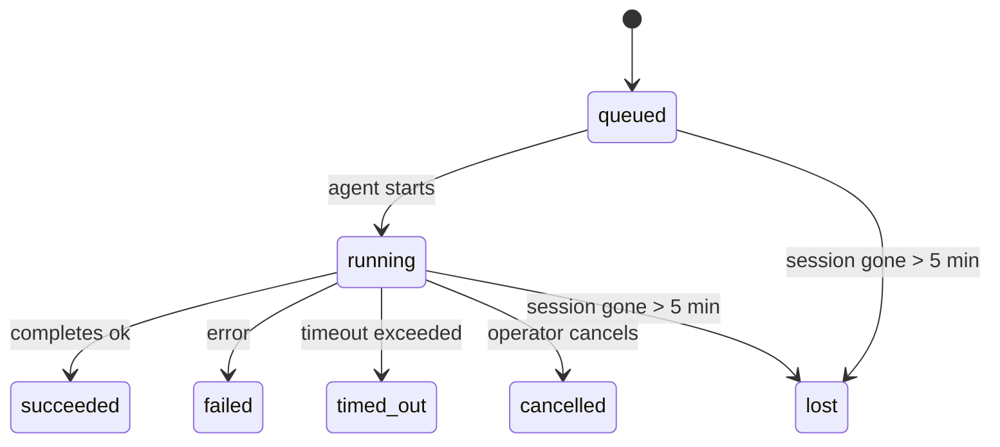

---
read_when:
    - Đang kiểm tra công việc nền đang diễn ra hoặc vừa hoàn tất
    - Gỡ lỗi lỗi gửi cho các lượt chạy tác nhân tách rời
    - Hiểu cách các lần chạy nền liên quan đến phiên, cron và heartbeat
sidebarTitle: Background tasks
summary: Theo dõi tác vụ nền cho các lượt chạy ACP, subagent, công việc cron cô lập và thao tác CLI
title: Tác vụ nền
x-i18n:
    generated_at: "2026-06-27T17:08:56Z"
    model: gpt-5.5
    postprocess_version: locale-links-v1
    provider: openai
    source_hash: 4a630a52d0d6bfd387a37415dd63fc4bfbce23f99eaa8cb780c3d6f8913675fd
    source_path: automation/tasks.md
    workflow: 16
---

<Note>
Bạn đang tìm tính năng lập lịch? Xem [Tự động hóa](/vi/automation) để chọn cơ chế phù hợp. Trang này là sổ cái hoạt động cho công việc nền, không phải bộ lập lịch.
</Note>

Tác vụ nền theo dõi công việc chạy **bên ngoài phiên hội thoại chính của bạn**: lượt chạy ACP, lần sinh subagent, lần thực thi cron job biệt lập, và thao tác do CLI khởi tạo.

Tác vụ **không** thay thế phiên, cron job, hay Heartbeat - chúng là **sổ cái hoạt động** ghi lại công việc tách rời nào đã diễn ra, khi nào, và có thành công hay không.

<Note>
Không phải mọi lượt chạy agent đều tạo tác vụ. Lượt Heartbeat và trò chuyện tương tác bình thường thì không. Tất cả lượt thực thi Cron, lần sinh ACP, lần sinh subagent, và lệnh agent từ CLI thì có.
</Note>

## Tóm tắt nhanh

- Tác vụ là **bản ghi**, không phải bộ lập lịch - Cron và Heartbeat quyết định _khi nào_ công việc chạy, tác vụ theo dõi _điều gì đã xảy ra_.
- ACP, subagent, tất cả cron job, và thao tác CLI tạo tác vụ. Lượt Heartbeat thì không.
- Mỗi tác vụ đi qua `queued → running → terminal` (succeeded, failed, timed_out, cancelled, hoặc lost).
- Tác vụ Cron vẫn hoạt động khi runtime Cron vẫn sở hữu job; nếu trạng thái runtime trong bộ nhớ đã mất, bảo trì tác vụ trước tiên kiểm tra lịch sử lượt chạy Cron bền vững trước khi đánh dấu tác vụ là lost.
- Hoàn tất được đẩy chủ động: công việc tách rời có thể thông báo trực tiếp hoặc đánh thức phiên/Heartbeat của bên yêu cầu khi hoàn tất, nên các vòng lặp thăm dò trạng thái thường là sai mô hình.
- Lượt chạy Cron biệt lập và hoàn tất subagent sẽ cố gắng tối đa dọn dẹp các tab/quy trình trình duyệt được theo dõi cho phiên con trước khi ghi sổ dọn dẹp cuối cùng.
- Gửi kết quả Cron biệt lập chặn các phản hồi cha tạm thời đã cũ trong khi công việc subagent hậu duệ vẫn đang xả, và ưu tiên đầu ra cuối cùng của hậu duệ khi đầu ra đó đến trước lúc gửi.
- Thông báo hoàn tất được gửi trực tiếp tới kênh hoặc xếp hàng cho Heartbeat tiếp theo.
- `openclaw tasks list` hiển thị tất cả tác vụ; `openclaw tasks audit` hiển thị vấn đề.
- Bản ghi terminal được giữ trong 7 ngày, sau đó tự động được cắt tỉa.

## Bắt đầu nhanh

<Tabs>
  <Tab title="Liệt kê và lọc">
    ```bash
    # List all tasks (newest first)
    openclaw tasks list

    # Filter by runtime or status
    openclaw tasks list --runtime acp
    openclaw tasks list --status running
    ```

  </Tab>
  <Tab title="Kiểm tra">
    ```bash
    # Show details for a specific task (by ID, run ID, or session key)
    openclaw tasks show <lookup>
    ```
  </Tab>
  <Tab title="Hủy và thông báo">
    ```bash
    # Cancel a running task (kills the child session)
    openclaw tasks cancel <lookup>

    # Change notification policy for a task
    openclaw tasks notify <lookup> state_changes
    ```

  </Tab>
  <Tab title="Kiểm toán và bảo trì">
    ```bash
    # Run a health audit
    openclaw tasks audit

    # Preview or apply maintenance
    openclaw tasks maintenance
    openclaw tasks maintenance --apply
    ```

  </Tab>
  <Tab title="Luồng tác vụ">
    ```bash
    # Inspect TaskFlow state
    openclaw tasks flow list
    openclaw tasks flow show <lookup>
    openclaw tasks flow cancel <lookup>
    ```
  </Tab>
</Tabs>

## Điều gì tạo tác vụ

| Nguồn                  | Loại runtime | Khi bản ghi tác vụ được tạo                                            | Chính sách thông báo mặc định |
| ---------------------- | ------------ | ---------------------------------------------------------------------- | ----------------------------- |
| Lượt chạy nền ACP      | `acp`        | Sinh một phiên ACP con                                                 | `done_only`                   |
| Điều phối subagent     | `subagent`   | Sinh một subagent qua `sessions_spawn`                                 | `done_only`                   |
| Cron job (mọi loại)    | `cron`       | Mỗi lượt thực thi Cron (phiên chính và biệt lập)                       | `silent`                      |
| Thao tác CLI           | `cli`        | Lệnh `openclaw agent` chạy qua Gateway                                 | `silent`                      |
| Job media của agent    | `cli`        | Lượt chạy `image_generate`/`music_generate`/`video_generate` có phiên hậu thuẫn | `silent`              |

<AccordionGroup>
  <Accordion title="Mặc định thông báo cho Cron và media">
    Tác vụ Cron phiên chính dùng chính sách thông báo `silent` theo mặc định - chúng tạo bản ghi để theo dõi nhưng không tạo thông báo. Tác vụ Cron biệt lập cũng mặc định là `silent` nhưng dễ thấy hơn vì chúng chạy trong phiên riêng.

    Lượt chạy `image_generate`, `music_generate`, và `video_generate` có phiên hậu thuẫn cũng dùng chính sách thông báo `silent`. Chúng vẫn tạo bản ghi tác vụ, nhưng việc hoàn tất được trao lại cho phiên agent ban đầu dưới dạng đánh thức nội bộ để agent có thể viết tin nhắn tiếp theo và tự đính kèm media đã hoàn tất. Agent yêu cầu tuân theo hợp đồng phản hồi hiển thị bình thường: phản hồi cuối tự động khi được cấu hình, hoặc `message(action="send")` cộng với `NO_REPLY` khi phiên yêu cầu phản hồi bằng công cụ tin nhắn. Nếu phiên yêu cầu không còn hoạt động hoặc lượt đánh thức hoạt động của nó thất bại, và agent hoàn tất bỏ lỡ một phần hoặc toàn bộ media đã tạo, OpenClaw gửi một dự phòng trực tiếp bất biến với chỉ media còn thiếu tới mục tiêu kênh ban đầu.

  </Accordion>
  <Accordion title="Lan can bảo vệ tạo media đồng thời">
    Khi một tác vụ tạo media có phiên hậu thuẫn vẫn đang hoạt động, các công cụ media cũng đóng vai trò lan can bảo vệ trước các lần thử lại vô tình. Các lệnh gọi `image_generate` lặp lại cho cùng prompt trả về trạng thái tác vụ hoạt động khớp, trong khi một prompt hình ảnh khác có thể bắt đầu tác vụ riêng. Lệnh gọi `music_generate` và `video_generate` vẫn trả về trạng thái tác vụ hoạt động cho phiên đó thay vì bắt đầu một lần tạo thứ hai đồng thời. Dùng `action: "status"` khi bạn muốn tra cứu tiến độ/trạng thái rõ ràng từ phía agent.
  </Accordion>
  <Accordion title="Điều gì không tạo tác vụ">
    - Lượt Heartbeat - phiên chính; xem [Heartbeat](/vi/gateway/heartbeat)
    - Lượt trò chuyện tương tác bình thường
    - Phản hồi `/command` trực tiếp

  </Accordion>
</AccordionGroup>

## Vòng đời tác vụ



| Trạng thái  | Ý nghĩa                                                                    |
| ----------- | -------------------------------------------------------------------------- |
| `queued`    | Đã tạo, đang chờ agent bắt đầu                                             |
| `running`   | Lượt agent đang thực thi chủ động                                          |
| `succeeded` | Hoàn tất thành công                                                        |
| `failed`    | Hoàn tất với lỗi                                                           |
| `timed_out` | Vượt quá thời gian chờ đã cấu hình                                         |
| `cancelled` | Bị operator dừng qua `openclaw tasks cancel`                               |
| `lost`      | Runtime mất trạng thái hậu thuẫn có thẩm quyền sau thời gian gia hạn 5 phút |

Chuyển trạng thái diễn ra tự động - khi lượt chạy agent liên kết kết thúc, trạng thái tác vụ cập nhật để khớp.

Hoàn tất lượt chạy agent là nguồn có thẩm quyền cho bản ghi tác vụ đang hoạt động. Một lượt chạy tách rời thành công kết thúc là `succeeded`, lỗi lượt chạy thông thường kết thúc là `failed`, và kết quả hết thời gian chờ hoặc hủy bỏ kết thúc là `timed_out`. Nếu operator đã hủy tác vụ, hoặc runtime đã ghi một trạng thái terminal mạnh hơn như `failed`, `timed_out`, hoặc `lost`, tín hiệu thành công đến sau sẽ không hạ cấp trạng thái terminal đó.

`lost` nhận biết runtime:

- Tác vụ ACP: metadata phiên ACP con hậu thuẫn đã biến mất.
- Tác vụ subagent: phiên con hậu thuẫn đã biến mất khỏi kho agent mục tiêu.
- Tác vụ Cron: runtime Cron không còn theo dõi job là đang hoạt động và lịch sử lượt chạy Cron bền vững không hiển thị kết quả terminal cho lượt chạy đó. Kiểm toán CLI ngoại tuyến không coi trạng thái runtime Cron trong tiến trình rỗng của chính nó là có thẩm quyền.
- Tác vụ CLI: tác vụ có run id/source id dùng ngữ cảnh lượt chạy trực tiếp, nên các hàng phiên con hoặc phiên trò chuyện còn sót lại không giữ chúng sống sau khi lượt chạy do Gateway sở hữu biến mất. Tác vụ CLI cũ không có danh tính lượt chạy vẫn dự phòng về phiên con. Lượt chạy `openclaw agent` có Gateway hậu thuẫn cũng kết thúc từ kết quả lượt chạy, nên lượt chạy đã hoàn tất không nằm ở trạng thái hoạt động cho đến khi sweeper đánh dấu chúng là `lost`.

## Gửi và thông báo

Khi một tác vụ đạt trạng thái terminal, OpenClaw thông báo cho bạn. Có hai đường gửi:

**Gửi trực tiếp** - nếu tác vụ có mục tiêu kênh (`requesterOrigin`), tin nhắn hoàn tất đi thẳng tới kênh đó (Telegram, Discord, Slack, v.v.). Hoàn tất tác vụ nhóm và kênh thay vào đó được định tuyến qua phiên yêu cầu để agent cha có thể viết phản hồi hiển thị. Với hoàn tất subagent, OpenClaw cũng giữ định tuyến luồng/chủ đề đã ràng buộc khi có sẵn và có thể điền `to` / tài khoản còn thiếu từ tuyến đã lưu của phiên yêu cầu (`lastChannel` / `lastTo` / `lastAccountId`) trước khi từ bỏ gửi trực tiếp.

**Gửi xếp hàng trong phiên** - nếu gửi trực tiếp thất bại hoặc không đặt origin, bản cập nhật được xếp hàng dưới dạng sự kiện hệ thống trong phiên của bên yêu cầu và xuất hiện ở Heartbeat tiếp theo.

<Tip>
Hoàn tất tác vụ kích hoạt một lượt đánh thức Heartbeat ngay lập tức để bạn thấy kết quả nhanh - bạn không phải chờ nhịp Heartbeat đã lập lịch tiếp theo.
</Tip>

Điều đó nghĩa là quy trình thường dùng dựa trên đẩy: bắt đầu công việc tách rời một lần, sau đó để runtime đánh thức hoặc thông báo cho bạn khi hoàn tất. Chỉ thăm dò trạng thái tác vụ khi bạn cần gỡ lỗi, can thiệp, hoặc kiểm toán rõ ràng.

### Chính sách thông báo

Kiểm soát mức độ bạn được nghe về từng tác vụ:

| Chính sách            | Nội dung được gửi                                                       |
| --------------------- | ----------------------------------------------------------------------- |
| `done_only` (mặc định) | Chỉ trạng thái terminal (succeeded, failed, v.v.) - **đây là mặc định** |
| `state_changes`       | Mọi chuyển trạng thái và cập nhật tiến độ                               |
| `silent`              | Không có gì                                                            |

Đổi chính sách khi tác vụ đang chạy:

```bash
openclaw tasks notify <lookup> state_changes
```

## Tham chiếu CLI

<AccordionGroup>
  <Accordion title="tasks list">
    ```bash
    openclaw tasks list [--runtime <acp|subagent|cron|cli>] [--status <status>] [--json]
    ```

    Cột đầu ra: ID tác vụ, Loại, Trạng thái, Gửi, Run ID, Phiên con, Tóm tắt.

  </Accordion>
  <Accordion title="tasks show">
    ```bash
    openclaw tasks show <lookup>
    ```

    Mã tra cứu chấp nhận ID tác vụ, run ID, hoặc khóa phiên. Hiển thị bản ghi đầy đủ gồm thời gian, trạng thái gửi, lỗi, và tóm tắt terminal.

  </Accordion>
  <Accordion title="tasks cancel">
    ```bash
    openclaw tasks cancel <lookup>
    ```

    Với tác vụ ACP và subagent, lệnh này giết phiên con. Với tác vụ do CLI theo dõi, việc hủy được ghi trong sổ đăng ký tác vụ (không có handle runtime con riêng). Trạng thái chuyển sang `cancelled` và thông báo gửi được gửi khi áp dụng.

  </Accordion>
  <Accordion title="tasks notify">
    ```bash
    openclaw tasks notify <lookup> <done_only|state_changes|silent>
    ```
  </Accordion>
  <Accordion title="tasks audit">
    ```bash
    openclaw tasks audit [--json]
    ```

    Hiển thị vấn đề vận hành. Phát hiện cũng xuất hiện trong `openclaw status` khi phát hiện vấn đề.

    | Phát hiện                 | Mức độ     | Kích hoạt                                                                                                      |
    | ------------------------- | ---------- | ------------------------------------------------------------------------------------------------------------ |
    | `stale_queued`            | cảnh báo   | Đã xếp hàng hơn 10 phút                                                                                       |
    | `stale_running`           | lỗi        | Đang chạy hơn 30 phút                                                                                         |
    | `lost`                    | cảnh báo/lỗi | Quyền sở hữu tác vụ dựa trên runtime đã biến mất; các tác vụ bị mất được giữ lại sẽ cảnh báo cho đến `cleanupAfter`, rồi trở thành lỗi |
    | `delivery_failed`         | cảnh báo   | Gửi không thành công và chính sách thông báo không phải là `silent`                                           |
    | `missing_cleanup`         | cảnh báo   | Tác vụ kết thúc không có dấu thời gian dọn dẹp                                                                |
    | `inconsistent_timestamps` | cảnh báo   | Vi phạm dòng thời gian (ví dụ kết thúc trước khi bắt đầu)                                                     |

  </Accordion>
  <Accordion title="bảo trì tác vụ">
    ```bash
    openclaw tasks maintenance [--json]
    openclaw tasks maintenance --apply [--json]
    ```

    Dùng lệnh này để xem trước hoặc áp dụng việc đối soát, đóng dấu dọn dẹp và cắt tỉa cho các tác vụ, trạng thái Task Flow và các hàng sổ đăng ký phiên chạy cron đã cũ.

    Việc đối soát có nhận biết runtime:

    - Các tác vụ ACP/subagent kiểm tra phiên con nền tảng của chúng.
    - Các tác vụ subagent có phiên con mang tombstone phục hồi sau khởi động lại được đánh dấu là bị mất thay vì được xem là các phiên nền tảng có thể phục hồi.
    - Các tác vụ Cron kiểm tra xem runtime cron còn sở hữu job hay không, rồi khôi phục trạng thái kết thúc từ log chạy cron/trạng thái job đã lưu trước khi chuyển sang `lost`. Chỉ tiến trình Gateway mới có thẩm quyền với tập hợp job đang hoạt động trong bộ nhớ của cron; kiểm tra CLI ngoại tuyến dùng lịch sử bền vững nhưng không đánh dấu một tác vụ cron là bị mất chỉ vì Set cục bộ đó rỗng.
    - Các tác vụ CLI có danh tính lần chạy kiểm tra ngữ cảnh lần chạy trực tiếp đang sở hữu, không chỉ các hàng phiên con hoặc phiên chat.

    Dọn dẹp khi hoàn tất cũng có nhận biết runtime:

    - Hoàn tất subagent cố gắng hết mức để đóng các tab/quy trình trình duyệt được theo dõi cho phiên con trước khi tiếp tục dọn dẹp thông báo.
    - Hoàn tất cron cô lập cố gắng hết mức để đóng các tab/quy trình trình duyệt được theo dõi cho phiên cron trước khi lần chạy tháo dỡ hoàn toàn.
    - Gửi cron cô lập chờ theo dõi tiếp nối từ subagent con khi cần và chặn văn bản xác nhận cha đã cũ thay vì thông báo nó.
    - Gửi kết quả hoàn tất subagent chỉ dùng văn bản trợ lý hiển thị mới nhất của con. Đầu ra tool/toolResult không được nâng thành văn bản kết quả con. Các lần chạy kết thúc thất bại thông báo trạng thái thất bại mà không phát lại văn bản phản hồi đã ghi lại.
    - Lỗi dọn dẹp không che khuất kết quả tác vụ thực sự.

    Khi áp dụng bảo trì, OpenClaw cũng xóa các hàng sổ đăng ký phiên `cron:<jobId>:run:<uuid>` đã cũ hơn 7 ngày, đồng thời giữ lại các hàng cho job cron hiện đang chạy và không động đến các hàng phiên không phải cron.

  </Accordion>
  <Accordion title="liệt kê | hiển thị | hủy flow tác vụ">
    ```bash
    openclaw tasks flow list [--status <status>] [--json]
    openclaw tasks flow show <lookup> [--json]
    openclaw tasks flow cancel <lookup>
    ```

    Dùng các lệnh này khi Task Flow điều phối mới là thứ bạn quan tâm, thay vì một bản ghi tác vụ nền riêng lẻ.

  </Accordion>
</AccordionGroup>

## Bảng tác vụ chat (`/tasks`)

Dùng `/tasks` trong bất kỳ phiên chat nào để xem các tác vụ nền được liên kết với phiên đó. Bảng hiển thị các tác vụ đang hoạt động và mới hoàn tất gần đây, kèm runtime, trạng thái, thời gian, tiến độ hoặc chi tiết lỗi.

Khi phiên hiện tại không có tác vụ liên kết nào hiển thị, `/tasks` sẽ dùng số lượng tác vụ cục bộ của agent để bạn vẫn có được tổng quan mà không làm lộ chi tiết của phiên khác.

Để xem sổ cái đầy đủ cho operator, dùng CLI: `openclaw tasks list`.

## Tích hợp trạng thái (áp lực tác vụ)

`openclaw status` bao gồm một tóm tắt tác vụ có thể xem nhanh:

```
Tasks: 3 queued · 2 running · 1 issues
```

Tóm tắt báo cáo:

- **active** - số lượng `queued` + `running`
- **failures** - số lượng `failed` + `timed_out` + `lost`
- **byRuntime** - phân rã theo `acp`, `subagent`, `cron`, `cli`

Cả `/status` và công cụ `session_status` đều dùng ảnh chụp nhanh tác vụ có nhận biết dọn dẹp: ưu tiên tác vụ đang hoạt động, ẩn các hàng đã hoàn tất cũ, và chỉ hiển thị lỗi gần đây khi không còn công việc đang hoạt động. Điều này giữ cho thẻ trạng thái tập trung vào những gì quan trọng ngay lúc này.

## Lưu trữ và bảo trì

### Nơi lưu tác vụ

Bản ghi tác vụ được lưu bền vững trong SQLite tại:

```
$OPENCLAW_STATE_DIR/tasks/runs.sqlite
```

Sổ đăng ký được nạp vào bộ nhớ khi Gateway khởi động và đồng bộ các lần ghi vào SQLite để bền vững qua các lần khởi động lại.
Gateway giữ cho nhật ký ghi trước của SQLite có giới hạn bằng cách dùng ngưỡng autocheckpoint mặc định của SQLite cùng với các checkpoint `PASSIVE` định kỳ. Các checkpoint khi tắt và khi bảo trì rõ ràng vẫn dùng `TRUNCATE` để các lần đóng thông thường có thể thu hồi dung lượng WAL mà không bắt sweeper nền chờ các trình đọc đang hoạt động.

### Bảo trì tự động

Một sweeper chạy mỗi **60 giây** và xử lý bốn việc:

<Steps>
  <Step title="Đối soát">
    Kiểm tra xem các tác vụ đang hoạt động còn có nền tảng runtime có thẩm quyền hay không. Các tác vụ ACP/subagent dùng trạng thái phiên con, tác vụ cron dùng quyền sở hữu job đang hoạt động, và tác vụ CLI có danh tính lần chạy dùng ngữ cảnh lần chạy đang sở hữu. Nếu trạng thái nền tảng đó biến mất hơn 5 phút, tác vụ được đánh dấu `lost`.
  </Step>
  <Step title="Sửa chữa phiên ACP">
    Đóng các phiên ACP một lượt do cha sở hữu đã kết thúc hoặc mồ côi, và chỉ đóng các phiên ACP bền bỉ đã kết thúc hoặc mồ côi đã cũ khi không còn ràng buộc hội thoại đang hoạt động.
  </Step>
  <Step title="Đóng dấu dọn dẹp">
    Đặt dấu thời gian `cleanupAfter` trên các tác vụ kết thúc (endedAt + 7 ngày). Trong thời gian giữ lại, các tác vụ bị mất vẫn xuất hiện trong kiểm toán dưới dạng cảnh báo; sau khi `cleanupAfter` hết hạn hoặc khi thiếu siêu dữ liệu dọn dẹp, chúng là lỗi.
  </Step>
  <Step title="Cắt tỉa">
    Xóa các bản ghi đã quá ngày `cleanupAfter`.
  </Step>
</Steps>

<Note>
**Thời gian giữ lại:** bản ghi tác vụ kết thúc được giữ trong **7 ngày**, rồi tự động bị cắt tỉa. Không cần cấu hình.
</Note>

## Cách tác vụ liên quan đến các hệ thống khác

<AccordionGroup>
  <Accordion title="Tác vụ và Task Flow">
    [Task Flow](/vi/automation/taskflow) là lớp điều phối flow phía trên các tác vụ nền. Một flow đơn có thể điều phối nhiều tác vụ trong suốt vòng đời của nó bằng các chế độ đồng bộ được quản lý hoặc phản chiếu. Dùng `openclaw tasks` để kiểm tra từng bản ghi tác vụ và `openclaw tasks flow` để kiểm tra flow điều phối.

    Xem [Task Flow](/vi/automation/taskflow) để biết chi tiết.

  </Accordion>
  <Accordion title="Tác vụ và cron">
    Định nghĩa job Cron, trạng thái thực thi runtime và lịch sử lần chạy nằm trong cơ sở dữ liệu trạng thái SQLite dùng chung của OpenClaw. **Mọi** lần thực thi cron đều tạo một bản ghi tác vụ - cả phiên chính và cô lập. Tác vụ cron phiên chính mặc định dùng chính sách thông báo `silent` để chúng theo dõi mà không tạo thông báo.

    Xem [Cron Jobs](/vi/automation/cron-jobs).

  </Accordion>
  <Accordion title="Tác vụ và heartbeat">
    Các lần chạy Heartbeat là lượt phiên chính - chúng không tạo bản ghi tác vụ. Khi một tác vụ hoàn tất, nó có thể kích hoạt đánh thức heartbeat để bạn thấy kết quả kịp thời.

    Xem [Heartbeat](/vi/gateway/heartbeat).

  </Accordion>
  <Accordion title="Tác vụ và phiên">
    Một tác vụ có thể tham chiếu `childSessionKey` (nơi công việc chạy) và `requesterSessionKey` (người đã bắt đầu nó). `agentId` của nó xác định agent thực thi công việc, trong khi các trường requester và owner giữ lại ngữ cảnh khởi chạy và điều khiển. Phiên là ngữ cảnh hội thoại; tác vụ là lớp theo dõi hoạt động phía trên đó.
  </Accordion>
  <Accordion title="Tác vụ và lần chạy agent">
    `runId` của tác vụ liên kết đến lần chạy agent đang thực hiện công việc. Các sự kiện vòng đời agent (bắt đầu, kết thúc, lỗi) tự động cập nhật trạng thái tác vụ - bạn không cần quản lý vòng đời theo cách thủ công.
  </Accordion>
</AccordionGroup>

## Liên quan

- [Tự động hóa](/vi/automation) - tất cả cơ chế tự động hóa trong nháy mắt
- [CLI: Tác vụ](/vi/cli/tasks) - tài liệu tham khảo lệnh CLI
- [Heartbeat](/vi/gateway/heartbeat) - các lượt phiên chính định kỳ
- [Tác vụ đã lên lịch](/vi/automation/cron-jobs) - lên lịch công việc nền
- [Task Flow](/vi/automation/taskflow) - điều phối flow phía trên tác vụ
