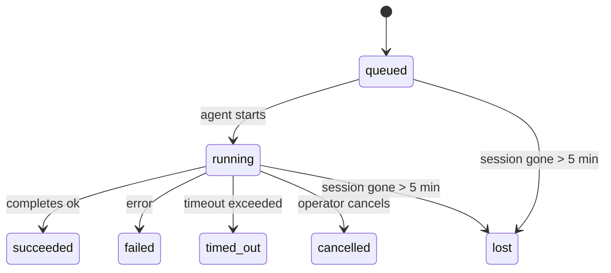

---
read_when:
    - Kiểm tra công việc nền đang diễn ra hoặc mới hoàn tất
    - Gỡ lỗi các lỗi gửi cho các phiên chạy tác nhân tách rời
    - Tìm hiểu cách các lần chạy nền liên quan đến phiên, Cron và Heartbeat
sidebarTitle: Background tasks
summary: Theo dõi tác vụ nền cho các lượt chạy ACP, subagent, các tác vụ cron cô lập và thao tác CLI
title: Tác vụ nền
x-i18n:
    generated_at: "2026-05-07T13:13:26Z"
    model: gpt-5.5
    provider: openai
    source_hash: a91a04ef6142e488d2fbc459d2c663afb93816a58fe9f52e0a51420703ea2d4d
    source_path: automation/tasks.md
    workflow: 16
---

<Note>
Bạn đang tìm tính năng lập lịch? Xem [Tự động hóa và tác vụ](/vi/automation) để chọn cơ chế phù hợp. Trang này là sổ cái hoạt động cho công việc nền, không phải bộ lập lịch.
</Note>

Tác vụ nền theo dõi công việc chạy **bên ngoài phiên trò chuyện chính của bạn**: các lần chạy ACP, sinh subagent, thực thi công việc cron cô lập và các thao tác do CLI khởi tạo.

Tác vụ **không** thay thế phiên, công việc cron hoặc Heartbeat - chúng là **sổ cái hoạt động** ghi lại công việc tách rời nào đã diễn ra, khi nào và liệu nó có thành công hay không.

<Note>
Không phải mọi lần chạy agent đều tạo tác vụ. Các lượt Heartbeat và trò chuyện tương tác bình thường thì không. Tất cả các lần thực thi cron, sinh ACP, sinh subagent và lệnh agent CLI thì có.
</Note>

## TL;DR

- Tác vụ là **bản ghi**, không phải bộ lập lịch - cron và Heartbeat quyết định công việc chạy _khi nào_, tác vụ theo dõi _điều gì đã xảy ra_.
- ACP, subagent, tất cả công việc cron và thao tác CLI tạo tác vụ. Các lượt Heartbeat thì không.
- Mỗi tác vụ đi qua `queued → running → terminal` (succeeded, failed, timed_out, cancelled hoặc lost).
- Tác vụ cron vẫn hoạt động khi runtime cron vẫn còn sở hữu công việc; nếu trạng thái runtime trong bộ nhớ đã mất, quá trình bảo trì tác vụ trước tiên kiểm tra lịch sử chạy cron bền vững trước khi đánh dấu tác vụ là lost.
- Hoàn tất được thúc đẩy bằng cơ chế đẩy: công việc tách rời có thể thông báo trực tiếp hoặc đánh thức phiên/Heartbeat của người yêu cầu khi hoàn tất, nên các vòng lặp thăm dò trạng thái thường là cách làm không phù hợp.
- Các lần chạy cron cô lập và hoàn tất subagent sẽ cố gắng hết sức để dọn dẹp các tab/quy trình trình duyệt được theo dõi cho phiên con trước khi ghi sổ dọn dẹp cuối cùng.
- Việc gửi cron cô lập chặn các phản hồi cha tạm thời đã cũ trong khi công việc subagent hậu duệ vẫn đang xả nốt, và ưu tiên đầu ra hậu duệ cuối cùng khi đầu ra đó đến trước lúc gửi.
- Thông báo hoàn tất được gửi trực tiếp đến một kênh hoặc xếp hàng cho Heartbeat kế tiếp.
- `openclaw tasks list` hiển thị tất cả tác vụ; `openclaw tasks audit` đưa các vấn đề ra bề mặt.
- Bản ghi terminal được giữ trong 7 ngày, sau đó tự động được cắt tỉa.

## Bắt đầu nhanh

<Tabs>
  <Tab title="Liệt kê và lọc">
    ```bash
    # List all tasks (newest first)
    openclaw tasks list

    # Filter by runtime or status
    openclaw tasks list --runtime acp
    openclaw tasks list --status running
    ```

  </Tab>
  <Tab title="Kiểm tra">
    ```bash
    # Show details for a specific task (by ID, run ID, or session key)
    openclaw tasks show <lookup>
    ```
  </Tab>
  <Tab title="Hủy và thông báo">
    ```bash
    # Cancel a running task (kills the child session)
    openclaw tasks cancel <lookup>

    # Change notification policy for a task
    openclaw tasks notify <lookup> state_changes
    ```

  </Tab>
  <Tab title="Kiểm tra và bảo trì">
    ```bash
    # Run a health audit
    openclaw tasks audit

    # Preview or apply maintenance
    openclaw tasks maintenance
    openclaw tasks maintenance --apply
    ```

  </Tab>
  <Tab title="Luồng tác vụ">
    ```bash
    # Inspect TaskFlow state
    openclaw tasks flow list
    openclaw tasks flow show <lookup>
    openclaw tasks flow cancel <lookup>
    ```
  </Tab>
</Tabs>

## Điều gì tạo ra tác vụ

| Nguồn                  | Loại runtime | Khi bản ghi tác vụ được tạo                           | Chính sách thông báo mặc định |
| ---------------------- | ------------ | ------------------------------------------------------ | ----------------------------- |
| Các lần chạy nền ACP   | `acp`        | Sinh một phiên ACP con                                 | `done_only`                   |
| Điều phối subagent     | `subagent`   | Sinh một subagent qua `sessions_spawn`                 | `done_only`                   |
| Công việc cron (mọi loại) | `cron`    | Mỗi lần thực thi cron (phiên chính và cô lập)          | `silent`                      |
| Thao tác CLI           | `cli`        | Các lệnh `openclaw agent` chạy qua Gateway             | `silent`                      |
| Công việc phương tiện của agent | `cli` | Các lần chạy `music_generate`/`video_generate` có phiên hậu thuẫn | `silent`              |

<AccordionGroup>
  <Accordion title="Mặc định thông báo cho cron và phương tiện">
    Tác vụ cron phiên chính dùng chính sách thông báo `silent` theo mặc định - chúng tạo bản ghi để theo dõi nhưng không tạo thông báo. Tác vụ cron cô lập cũng mặc định là `silent` nhưng dễ thấy hơn vì chúng chạy trong phiên riêng.

    Các lần chạy `music_generate` và `video_generate` có phiên hậu thuẫn cũng dùng chính sách thông báo `silent`. Chúng vẫn tạo bản ghi tác vụ, nhưng việc hoàn tất được trả lại cho phiên agent ban đầu dưới dạng đánh thức nội bộ để agent có thể viết tin nhắn tiếp theo và tự đính kèm phương tiện đã hoàn tất. Các lần hoàn tất trong nhóm/kênh tuân theo chính sách phản hồi hiển thị bình thường, nên agent dùng công cụ tin nhắn khi việc gửi từ nguồn yêu cầu điều đó. Nếu agent hoàn tất không tạo được bằng chứng gửi bằng công cụ tin nhắn trong tuyến chỉ dùng công cụ, OpenClaw gửi dự phòng hoàn tất trực tiếp đến kênh ban đầu thay vì để phương tiện ở chế độ riêng tư.

  </Accordion>
  <Accordion title="Lan can bảo vệ video_generate đồng thời">
    Khi một tác vụ `video_generate` có phiên hậu thuẫn vẫn đang hoạt động, công cụ này cũng đóng vai trò lan can bảo vệ: các lệnh gọi `video_generate` lặp lại trong cùng phiên đó trả về trạng thái tác vụ đang hoạt động thay vì bắt đầu lần tạo đồng thời thứ hai. Dùng `action: "status"` khi bạn muốn tra cứu tiến độ/trạng thái rõ ràng từ phía agent.
  </Accordion>
  <Accordion title="Điều gì không tạo tác vụ">
    - Các lượt Heartbeat - phiên chính; xem [Heartbeat](/vi/gateway/heartbeat)
    - Các lượt trò chuyện tương tác bình thường
    - Phản hồi `/command` trực tiếp

  </Accordion>
</AccordionGroup>

## Vòng đời tác vụ



| Trạng thái  | Ý nghĩa                                                                    |
| ----------- | -------------------------------------------------------------------------- |
| `queued`    | Đã tạo, đang chờ agent bắt đầu                                             |
| `running`   | Lượt agent đang thực thi chủ động                                          |
| `succeeded` | Hoàn tất thành công                                                        |
| `failed`    | Hoàn tất với lỗi                                                           |
| `timed_out` | Vượt quá thời gian chờ đã cấu hình                                         |
| `cancelled` | Bị người vận hành dừng qua `openclaw tasks cancel`                         |
| `lost`      | Runtime mất trạng thái hậu thuẫn có thẩm quyền sau thời gian gia hạn 5 phút |

Chuyển tiếp diễn ra tự động - khi lần chạy agent liên quan kết thúc, trạng thái tác vụ cập nhật để khớp.

Hoàn tất lần chạy agent là nguồn có thẩm quyền cho các bản ghi tác vụ đang hoạt động. Một lần chạy tách rời thành công được hoàn tất là `succeeded`, lỗi chạy thông thường được hoàn tất là `failed`, và kết quả hết thời gian chờ hoặc hủy bỏ được hoàn tất là `timed_out`. Nếu người vận hành đã hủy tác vụ, hoặc runtime đã ghi một trạng thái terminal mạnh hơn như `failed`, `timed_out` hoặc `lost`, tín hiệu thành công đến sau sẽ không hạ cấp trạng thái terminal đó.

`lost` nhận biết runtime:

- Tác vụ ACP: siêu dữ liệu phiên ACP con hậu thuẫn đã biến mất.
- Tác vụ subagent: phiên con hậu thuẫn đã biến mất khỏi kho agent đích.
- Tác vụ cron: runtime cron không còn theo dõi công việc là đang hoạt động và lịch sử chạy cron bền vững không hiển thị kết quả terminal cho lần chạy đó. Kiểm tra CLI ngoại tuyến không coi trạng thái runtime cron trong tiến trình rỗng của chính nó là có thẩm quyền.
- Tác vụ CLI: các tác vụ có id lần chạy/id nguồn dùng ngữ cảnh chạy trực tiếp, nên các hàng phiên con hoặc phiên trò chuyện còn sót lại không giữ chúng hoạt động sau khi lần chạy do Gateway sở hữu biến mất. Tác vụ CLI cũ không có danh tính lần chạy vẫn quay về phiên con. Các lần chạy `openclaw agent` có Gateway hậu thuẫn cũng hoàn tất từ kết quả chạy của chúng, nên các lần chạy đã hoàn tất không nằm ở trạng thái hoạt động cho đến khi bộ quét đánh dấu chúng là `lost`.

## Gửi và thông báo

Khi một tác vụ đạt trạng thái terminal, OpenClaw thông báo cho bạn. Có hai đường gửi:

**Gửi trực tiếp** - nếu tác vụ có mục tiêu kênh (`requesterOrigin`), tin nhắn hoàn tất đi thẳng đến kênh đó (Telegram, Discord, Slack, v.v.). Với các lần hoàn tất subagent, OpenClaw cũng giữ định tuyến luồng/chủ đề đã liên kết khi có sẵn và có thể điền `to` / tài khoản bị thiếu từ tuyến được lưu trong phiên của người yêu cầu (`lastChannel` / `lastTo` / `lastAccountId`) trước khi từ bỏ gửi trực tiếp.

**Gửi xếp hàng theo phiên** - nếu gửi trực tiếp thất bại hoặc không đặt origin, bản cập nhật được xếp hàng dưới dạng sự kiện hệ thống trong phiên của người yêu cầu và xuất hiện ở Heartbeat kế tiếp.

<Tip>
Hoàn tất tác vụ kích hoạt đánh thức Heartbeat ngay lập tức để bạn thấy kết quả nhanh chóng - bạn không phải chờ nhịp Heartbeat đã lên lịch kế tiếp.
</Tip>

Điều đó nghĩa là quy trình làm việc thông thường dựa trên cơ chế đẩy: bắt đầu công việc tách rời một lần, rồi để runtime đánh thức hoặc thông báo cho bạn khi hoàn tất. Chỉ thăm dò trạng thái tác vụ khi bạn cần gỡ lỗi, can thiệp hoặc kiểm tra rõ ràng.

### Chính sách thông báo

Kiểm soát mức độ bạn nghe về từng tác vụ:

| Chính sách           | Nội dung được gửi                                                       |
| -------------------- | ----------------------------------------------------------------------- |
| `done_only` (mặc định) | Chỉ trạng thái terminal (succeeded, failed, v.v.) - **đây là mặc định** |
| `state_changes`      | Mọi chuyển tiếp trạng thái và cập nhật tiến độ                          |
| `silent`             | Không gửi gì cả                                                         |

Thay đổi chính sách khi tác vụ đang chạy:

```bash
openclaw tasks notify <lookup> state_changes
```

## Tham chiếu CLI

<AccordionGroup>
  <Accordion title="tasks list">
    ```bash
    openclaw tasks list [--runtime <acp|subagent|cron|cli>] [--status <status>] [--json]
    ```

    Cột đầu ra: ID tác vụ, Loại, Trạng thái, Gửi, ID lần chạy, Phiên con, Tóm tắt.

  </Accordion>
  <Accordion title="tasks show">
    ```bash
    openclaw tasks show <lookup>
    ```

    Mã tra cứu chấp nhận ID tác vụ, ID lần chạy hoặc khóa phiên. Hiển thị toàn bộ bản ghi bao gồm thời gian, trạng thái gửi, lỗi và tóm tắt terminal.

  </Accordion>
  <Accordion title="tasks cancel">
    ```bash
    openclaw tasks cancel <lookup>
    ```

    Với tác vụ ACP và subagent, lệnh này kết thúc phiên con. Với tác vụ do CLI theo dõi, việc hủy được ghi trong sổ đăng ký tác vụ (không có handle runtime con riêng). Trạng thái chuyển thành `cancelled` và thông báo gửi được gửi khi áp dụng.

  </Accordion>
  <Accordion title="tasks notify">
    ```bash
    openclaw tasks notify <lookup> <done_only|state_changes|silent>
    ```
  </Accordion>
  <Accordion title="tasks audit">
    ```bash
    openclaw tasks audit [--json]
    ```

    Đưa các vấn đề vận hành ra bề mặt. Các phát hiện cũng xuất hiện trong `openclaw status` khi phát hiện vấn đề.

    | Phát hiện                 | Mức độ nghiêm trọng | Điều kiện kích hoạt                                                                                              |
    | ------------------------- | ---------- | ------------------------------------------------------------------------------------------------------------ |
    | `stale_queued`            | warn       | Được xếp hàng hơn 10 phút                                                                                       |
    | `stale_running`           | error      | Đang chạy hơn 30 phút                                                                                           |
    | `lost`                    | warn/error | Quyền sở hữu tác vụ dựa trên runtime đã biến mất; các tác vụ bị mất được giữ lại sẽ cảnh báo cho đến `cleanupAfter`, sau đó trở thành lỗi |
    | `delivery_failed`         | warn       | Gửi thất bại và chính sách thông báo không phải là `silent`                                                     |
    | `missing_cleanup`         | warn       | Tác vụ kết thúc không có dấu thời gian dọn dẹp                                                                  |
    | `inconsistent_timestamps` | warn       | Vi phạm dòng thời gian (ví dụ kết thúc trước khi bắt đầu)                                                       |

  </Accordion>
  <Accordion title="bảo trì tác vụ">
    ```bash
    openclaw tasks maintenance [--json]
    openclaw tasks maintenance --apply [--json]
    ```

    Dùng lệnh này để xem trước hoặc áp dụng việc đối chiếu, đóng dấu dọn dẹp và cắt tỉa cho tác vụ và trạng thái Task Flow.

    Việc đối chiếu có nhận biết runtime:

    - Tác vụ ACP/subagent kiểm tra phiên con hỗ trợ của chúng.
    - Tác vụ subagent có phiên con mang bia mộ khôi phục sau khởi động lại sẽ được đánh dấu là bị mất thay vì được xử lý như các phiên hỗ trợ có thể khôi phục.
    - Tác vụ Cron kiểm tra xem runtime cron còn sở hữu công việc hay không, sau đó khôi phục trạng thái kết thúc từ nhật ký lượt chạy cron/trạng thái công việc đã lưu trước khi rơi về `lost`. Chỉ tiến trình Gateway mới là nguồn có thẩm quyền cho tập công việc cron đang hoạt động trong bộ nhớ; kiểm tra CLI ngoại tuyến dùng lịch sử bền vững nhưng không đánh dấu một tác vụ cron là bị mất chỉ vì Set cục bộ đó rỗng.
    - Tác vụ CLI có danh tính lượt chạy sẽ kiểm tra ngữ cảnh lượt chạy trực tiếp sở hữu, không chỉ các hàng phiên con hoặc phiên chat.

    Việc dọn dẹp hoàn tất cũng có nhận biết runtime:

    - Khi subagent hoàn tất, hệ thống nỗ lực tối đa đóng các tab/quy trình trình duyệt được theo dõi cho phiên con trước khi tiếp tục dọn dẹp thông báo.
    - Khi cron cô lập hoàn tất, hệ thống nỗ lực tối đa đóng các tab/quy trình trình duyệt được theo dõi cho phiên cron trước khi lượt chạy được tháo dỡ hoàn toàn.
    - Việc gửi cron cô lập sẽ chờ phần theo dõi từ subagent hậu duệ khi cần và chặn văn bản xác nhận cha đã cũ thay vì thông báo nó.
    - Việc gửi khi subagent hoàn tất ưu tiên văn bản trợ lý hiển thị mới nhất; nếu trống, nó rơi về văn bản tool/toolResult mới nhất đã được làm sạch, và các lượt chạy chỉ có lệnh gọi công cụ bị hết thời gian có thể thu gọn thành một tóm tắt tiến độ một phần ngắn. Các lượt chạy kết thúc thất bại sẽ thông báo trạng thái thất bại mà không phát lại văn bản trả lời đã thu thập.
    - Lỗi dọn dẹp không che khuất kết quả thật của tác vụ.

  </Accordion>
  <Accordion title="danh sách | hiển thị | hủy flow tác vụ">
    ```bash
    openclaw tasks flow list [--status <status>] [--json]
    openclaw tasks flow show <lookup> [--json]
    openclaw tasks flow cancel <lookup>
    ```

    Dùng các lệnh này khi Task Flow điều phối là thứ bạn quan tâm thay vì một bản ghi tác vụ nền riêng lẻ.

  </Accordion>
</AccordionGroup>

## Bảng tác vụ chat (`/tasks`)

Dùng `/tasks` trong bất kỳ phiên chat nào để xem các tác vụ nền được liên kết với phiên đó. Bảng hiển thị các tác vụ đang hoạt động và vừa hoàn tất cùng runtime, trạng thái, thời gian, tiến độ hoặc chi tiết lỗi.

Khi phiên hiện tại không có tác vụ liên kết hiển thị nào, `/tasks` sẽ rơi về số lượng tác vụ cục bộ của agent để bạn vẫn có tổng quan mà không làm lộ chi tiết của phiên khác.

Để xem sổ cái vận hành đầy đủ, dùng CLI: `openclaw tasks list`.

## Tích hợp trạng thái (áp lực tác vụ)

`openclaw status` bao gồm tóm tắt tác vụ trong nháy mắt:

```
Tasks: 3 queued · 2 running · 1 issues
```

Tóm tắt báo cáo:

- **active** - số lượng `queued` + `running`
- **failures** - số lượng `failed` + `timed_out` + `lost`
- **byRuntime** - phân tích theo `acp`, `subagent`, `cron`, `cli`

Cả `/status` và công cụ `session_status` đều dùng ảnh chụp tác vụ có nhận biết dọn dẹp: tác vụ đang hoạt động được ưu tiên, các hàng đã hoàn tất và cũ bị ẩn, còn lỗi gần đây chỉ xuất hiện khi không còn công việc đang hoạt động. Điều này giữ thẻ trạng thái tập trung vào điều quan trọng ngay lúc này.

## Lưu trữ và bảo trì

### Nơi lưu tác vụ

Bản ghi tác vụ được lưu bền vững trong SQLite tại:

```
$OPENCLAW_STATE_DIR/tasks/runs.sqlite
```

Registry được tải vào bộ nhớ khi gateway khởi động và đồng bộ các lần ghi sang SQLite để bền vững qua các lần khởi động lại.
Gateway giữ nhật ký ghi trước của SQLite trong giới hạn bằng cách dùng ngưỡng
autocheckpoint mặc định của SQLite cùng với các checkpoint `TRUNCATE` định kỳ và khi tắt.

### Bảo trì tự động

Một sweeper chạy mỗi **60 giây** và xử lý bốn việc:

<Steps>
  <Step title="Đối chiếu">
    Kiểm tra xem các tác vụ đang hoạt động còn có phần hỗ trợ runtime có thẩm quyền hay không. Tác vụ ACP/subagent dùng trạng thái phiên con, tác vụ cron dùng quyền sở hữu công việc đang hoạt động, và tác vụ CLI có danh tính lượt chạy dùng ngữ cảnh lượt chạy sở hữu. Nếu trạng thái hỗ trợ đó biến mất quá 5 phút, tác vụ được đánh dấu là `lost`.
  </Step>
  <Step title="Sửa chữa phiên ACP">
    Đóng các phiên ACP một lượt do cha sở hữu đã kết thúc hoặc mồ côi, và chỉ đóng các phiên ACP bền vững đã kết thúc hoặc mồ côi đã cũ khi không còn ràng buộc hội thoại đang hoạt động.
  </Step>
  <Step title="Đóng dấu dọn dẹp">
    Đặt dấu thời gian `cleanupAfter` trên các tác vụ kết thúc (endedAt + 7 ngày). Trong thời gian lưu giữ, tác vụ bị mất vẫn xuất hiện trong kiểm tra như cảnh báo; sau khi `cleanupAfter` hết hạn hoặc khi thiếu siêu dữ liệu dọn dẹp, chúng là lỗi.
  </Step>
  <Step title="Cắt tỉa">
    Xóa các bản ghi đã quá ngày `cleanupAfter`.
  </Step>
</Steps>

<Note>
**Lưu giữ:** bản ghi tác vụ kết thúc được giữ trong **7 ngày**, sau đó tự động bị cắt tỉa. Không cần cấu hình.
</Note>

## Tác vụ liên hệ với các hệ thống khác như thế nào

<AccordionGroup>
  <Accordion title="Tác vụ và Task Flow">
    [Task Flow](/vi/automation/taskflow) là lớp điều phối flow nằm trên các tác vụ nền. Một flow đơn lẻ có thể điều phối nhiều tác vụ trong suốt vòng đời của nó bằng các chế độ đồng bộ được quản lý hoặc phản chiếu. Dùng `openclaw tasks` để kiểm tra từng bản ghi tác vụ và `openclaw tasks flow` để kiểm tra flow điều phối.

    Xem [Task Flow](/vi/automation/taskflow) để biết chi tiết.

  </Accordion>
  <Accordion title="Tác vụ và cron">
    Một **định nghĩa** công việc cron nằm trong `~/.openclaw/cron/jobs.json`; trạng thái thực thi runtime nằm bên cạnh nó trong `~/.openclaw/cron/jobs-state.json`. **Mỗi** lần thực thi cron đều tạo một bản ghi tác vụ - cả phiên chính và cô lập. Tác vụ cron phiên chính mặc định dùng chính sách thông báo `silent` để chúng theo dõi mà không tạo thông báo.

    Xem [Công việc Cron](/vi/automation/cron-jobs).

  </Accordion>
  <Accordion title="Tác vụ và heartbeat">
    Các lượt chạy Heartbeat là lượt phiên chính - chúng không tạo bản ghi tác vụ. Khi một tác vụ hoàn tất, nó có thể kích hoạt đánh thức heartbeat để bạn thấy kết quả kịp thời.

    Xem [Heartbeat](/vi/gateway/heartbeat).

  </Accordion>
  <Accordion title="Tác vụ và phiên">
    Một tác vụ có thể tham chiếu `childSessionKey` (nơi công việc chạy) và `requesterSessionKey` (người đã bắt đầu nó). Phiên là ngữ cảnh hội thoại; tác vụ là lớp theo dõi hoạt động bên trên.
  </Accordion>
  <Accordion title="Tác vụ và lượt chạy agent">
    `runId` của một tác vụ liên kết đến lượt chạy agent đang thực hiện công việc. Các sự kiện vòng đời agent (bắt đầu, kết thúc, lỗi) tự động cập nhật trạng thái tác vụ - bạn không cần quản lý vòng đời theo cách thủ công.
  </Accordion>
</AccordionGroup>

## Liên quan

- [Tự động hóa & Tác vụ](/vi/automation) - tất cả cơ chế tự động hóa trong nháy mắt
- [CLI: Tác vụ](/vi/cli/tasks) - tài liệu tham khảo lệnh CLI
- [Heartbeat](/vi/gateway/heartbeat) - các lượt phiên chính định kỳ
- [Tác vụ đã lên lịch](/vi/automation/cron-jobs) - lên lịch công việc nền
- [Task Flow](/vi/automation/taskflow) - điều phối flow bên trên tác vụ
