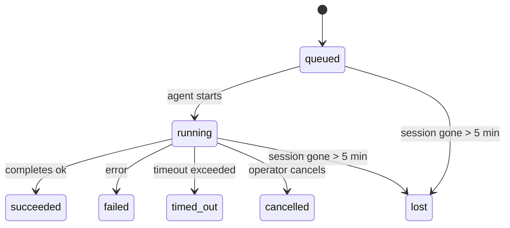

---
read_when:
    - Kiểm tra công việc nền đang diễn ra hoặc đã hoàn tất gần đây
    - Gỡ lỗi các lỗi gửi trong các phiên chạy tác tử tách rời
    - Tìm hiểu cách các lượt chạy nền liên quan đến phiên, Cron và Heartbeat
sidebarTitle: Background tasks
summary: Theo dõi tác vụ nền cho các lượt chạy ACP, tác nhân phụ, tác vụ Cron biệt lập và thao tác CLI
title: Tác vụ nền
x-i18n:
    generated_at: "2026-05-01T10:46:21Z"
    model: gpt-5.5
    provider: openai
    source_hash: 8782987a79989264ae3bd1ca4b16755bdfb7e295e4f77933bf3a38c136d837f4
    source_path: automation/tasks.md
    workflow: 16
---

<Note>
Bạn đang tìm tính năng lập lịch? Xem [Tự động hóa và tác vụ](/vi/automation) để chọn cơ chế phù hợp. Trang này là sổ cái hoạt động cho công việc nền, không phải bộ lập lịch.
</Note>

Tác vụ nền theo dõi công việc chạy **bên ngoài phiên hội thoại chính của bạn**: các lần chạy ACP, sinh subagent, thực thi cron job cô lập, và các thao tác khởi tạo từ CLI.

Tác vụ **không** thay thế phiên, cron job, hay heartbeat — chúng là **sổ cái hoạt động** ghi lại công việc tách rời nào đã diễn ra, khi nào, và có thành công hay không.

<Note>
Không phải mọi lần chạy agent đều tạo tác vụ. Các lượt Heartbeat và trò chuyện tương tác thông thường thì không. Tất cả các lần thực thi cron, sinh ACP, sinh subagent, và lệnh agent CLI thì có.
</Note>

## TL;DR

- Tác vụ là **bản ghi**, không phải bộ lập lịch — cron và heartbeat quyết định công việc chạy _khi nào_, tác vụ theo dõi _điều đã xảy ra_.
- ACP, subagent, tất cả cron job, và thao tác CLI tạo tác vụ. Các lượt Heartbeat thì không.
- Mỗi tác vụ đi qua `queued → running → terminal` (succeeded, failed, timed_out, cancelled, hoặc lost).
- Tác vụ cron vẫn hoạt động khi cron runtime vẫn sở hữu job; nếu trạng thái runtime trong bộ nhớ đã mất, bảo trì tác vụ trước tiên kiểm tra lịch sử chạy cron bền vững trước khi đánh dấu tác vụ là lost.
- Hoàn tất được điều khiển bằng đẩy: công việc tách rời có thể thông báo trực tiếp hoặc đánh thức phiên/heartbeat của người yêu cầu khi kết thúc, vì vậy các vòng lặp thăm dò trạng thái thường không phải là cách phù hợp.
- Các lần chạy cron cô lập và hoàn tất subagent cố gắng dọn dẹp các tab/trình duyệt/quy trình được theo dõi cho phiên con trước khi ghi sổ dọn dẹp cuối cùng.
- Phân phối cron cô lập chặn các phản hồi cha tạm thời đã cũ trong khi công việc subagent hậu duệ vẫn đang xả hết, và ưu tiên đầu ra hậu duệ cuối cùng nếu đầu ra đó đến trước khi phân phối.
- Thông báo hoàn tất được gửi trực tiếp đến một kênh hoặc xếp hàng cho heartbeat tiếp theo.
- `openclaw tasks list` hiển thị tất cả tác vụ; `openclaw tasks audit` nêu ra các vấn đề.
- Bản ghi terminal được giữ trong 7 ngày, rồi tự động bị cắt tỉa.

## Bắt đầu nhanh

<Tabs>
  <Tab title="Liệt kê và lọc">
    ```bash
    # List all tasks (newest first)
    openclaw tasks list

    # Filter by runtime or status
    openclaw tasks list --runtime acp
    openclaw tasks list --status running
    ```

  </Tab>
  <Tab title="Kiểm tra">
    ```bash
    # Show details for a specific task (by ID, run ID, or session key)
    openclaw tasks show <lookup>
    ```
  </Tab>
  <Tab title="Hủy và thông báo">
    ```bash
    # Cancel a running task (kills the child session)
    openclaw tasks cancel <lookup>

    # Change notification policy for a task
    openclaw tasks notify <lookup> state_changes
    ```

  </Tab>
  <Tab title="Kiểm tra và bảo trì">
    ```bash
    # Run a health audit
    openclaw tasks audit

    # Preview or apply maintenance
    openclaw tasks maintenance
    openclaw tasks maintenance --apply
    ```

  </Tab>
  <Tab title="Luồng tác vụ">
    ```bash
    # Inspect TaskFlow state
    openclaw tasks flow list
    openclaw tasks flow show <lookup>
    openclaw tasks flow cancel <lookup>
    ```
  </Tab>
</Tabs>

## Điều gì tạo tác vụ

| Nguồn                  | Loại runtime | Khi bản ghi tác vụ được tạo                            | Chính sách thông báo mặc định |
| ---------------------- | ------------ | ------------------------------------------------------ | ----------------------------- |
| Các lần chạy nền ACP   | `acp`        | Sinh một phiên ACP con                                 | `done_only`                   |
| Điều phối subagent     | `subagent`   | Sinh subagent qua `sessions_spawn`                     | `done_only`                   |
| Cron job (mọi loại)    | `cron`       | Mỗi lần thực thi cron (phiên chính và cô lập)          | `silent`                      |
| Thao tác CLI           | `cli`        | Các lệnh `openclaw agent` chạy qua gateway             | `silent`                      |
| Job phương tiện agent  | `cli`        | Các lần chạy `music_generate`/`video_generate` có phiên hỗ trợ | `silent`              |

<AccordionGroup>
  <Accordion title="Mặc định thông báo cho cron và phương tiện">
    Tác vụ cron phiên chính dùng chính sách thông báo `silent` theo mặc định — chúng tạo bản ghi để theo dõi nhưng không tạo thông báo. Tác vụ cron cô lập cũng mặc định là `silent` nhưng dễ thấy hơn vì chúng chạy trong phiên riêng.

    Các lần chạy `music_generate` và `video_generate` có phiên hỗ trợ cũng dùng chính sách thông báo `silent`. Chúng vẫn tạo bản ghi tác vụ, nhưng việc hoàn tất được chuyển lại cho phiên agent ban đầu dưới dạng đánh thức nội bộ để agent có thể tự viết tin nhắn tiếp theo và đính kèm phương tiện đã hoàn tất. Nếu bạn chọn dùng `tools.media.asyncCompletion.directSend`, các lần hoàn tất `video_generate` bất đồng bộ có thể thử phân phối trực tiếp đến kênh trước; các lần hoàn tất `music_generate` bất đồng bộ vẫn đi theo đường đánh thức phiên của người yêu cầu.

  </Accordion>
  <Accordion title="Lan can an toàn video_generate đồng thời">
    Khi tác vụ `video_generate` có phiên hỗ trợ vẫn đang hoạt động, công cụ cũng đóng vai trò lan can an toàn: các lệnh gọi `video_generate` lặp lại trong cùng phiên đó trả về trạng thái tác vụ đang hoạt động thay vì bắt đầu lần tạo đồng thời thứ hai. Dùng `action: "status"` khi bạn muốn tra cứu tiến độ/trạng thái rõ ràng từ phía agent.
  </Accordion>
  <Accordion title="Điều gì không tạo tác vụ">
    - Các lượt Heartbeat — phiên chính; xem [Heartbeat](/vi/gateway/heartbeat)
    - Các lượt trò chuyện tương tác thông thường
    - Phản hồi `/command` trực tiếp

  </Accordion>
</AccordionGroup>

## Vòng đời tác vụ



| Trạng thái  | Ý nghĩa                                                                    |
| ----------- | -------------------------------------------------------------------------- |
| `queued`    | Đã tạo, đang chờ agent bắt đầu                                             |
| `running`   | Lượt agent đang thực thi tích cực                                          |
| `succeeded` | Hoàn tất thành công                                                        |
| `failed`    | Hoàn tất với lỗi                                                           |
| `timed_out` | Vượt quá thời gian chờ đã cấu hình                                         |
| `cancelled` | Bị người vận hành dừng qua `openclaw tasks cancel`                         |
| `lost`      | Runtime mất trạng thái chống lưng có thẩm quyền sau thời gian ân hạn 5 phút |

Chuyển đổi diễn ra tự động — khi lần chạy agent liên kết kết thúc, trạng thái tác vụ cập nhật để khớp.

Hoàn tất lần chạy agent là nguồn có thẩm quyền cho các bản ghi tác vụ đang hoạt động. Một lần chạy tách rời thành công kết thúc là `succeeded`, lỗi chạy thông thường kết thúc là `failed`, và kết quả hết thời gian chờ hoặc hủy bỏ kết thúc là `timed_out`. Nếu người vận hành đã hủy tác vụ, hoặc runtime đã ghi nhận trạng thái terminal mạnh hơn như `failed`, `timed_out`, hoặc `lost`, tín hiệu thành công đến sau không hạ cấp trạng thái terminal đó.

`lost` có nhận biết runtime:

- Tác vụ ACP: siêu dữ liệu phiên ACP con chống lưng đã biến mất.
- Tác vụ subagent: phiên con chống lưng đã biến mất khỏi kho agent đích.
- Tác vụ cron: cron runtime không còn theo dõi job là đang hoạt động và lịch sử chạy cron bền vững không hiển thị kết quả terminal cho lần chạy đó. Kiểm tra CLI ngoại tuyến không xem trạng thái cron runtime trong tiến trình trống của chính nó là có thẩm quyền.
- Tác vụ CLI: tác vụ phiên con cô lập dùng phiên con; tác vụ CLI có chat hỗ trợ dùng ngữ cảnh chạy trực tiếp thay vào đó, vì vậy các hàng phiên kênh/nhóm/trực tiếp còn sót lại không giữ chúng sống. Các lần chạy `openclaw agent` có Gateway hỗ trợ cũng kết thúc từ kết quả chạy của chúng, nên các lần chạy đã hoàn tất không nằm ở trạng thái hoạt động cho đến khi sweeper đánh dấu chúng là `lost`.

## Phân phối và thông báo

Khi tác vụ đạt trạng thái terminal, OpenClaw thông báo cho bạn. Có hai đường phân phối:

**Phân phối trực tiếp** — nếu tác vụ có đích kênh (`requesterOrigin`), tin nhắn hoàn tất đi thẳng đến kênh đó (Telegram, Discord, Slack, v.v.). Với các lần hoàn tất subagent, OpenClaw cũng giữ định tuyến luồng/chủ đề đã liên kết khi có và có thể điền `to` / tài khoản bị thiếu từ tuyến đã lưu của phiên người yêu cầu (`lastChannel` / `lastTo` / `lastAccountId`) trước khi từ bỏ phân phối trực tiếp.

**Phân phối xếp hàng theo phiên** — nếu phân phối trực tiếp thất bại hoặc không đặt origin, bản cập nhật được xếp hàng làm sự kiện hệ thống trong phiên của người yêu cầu và xuất hiện ở heartbeat tiếp theo.

<Tip>
Hoàn tất tác vụ kích hoạt đánh thức heartbeat ngay lập tức để bạn thấy kết quả nhanh chóng — bạn không phải đợi nhịp heartbeat đã lập lịch tiếp theo.
</Tip>

Điều đó nghĩa là quy trình thông thường dựa trên đẩy: bắt đầu công việc tách rời một lần, rồi để runtime đánh thức hoặc thông báo cho bạn khi hoàn tất. Chỉ thăm dò trạng thái tác vụ khi bạn cần gỡ lỗi, can thiệp, hoặc kiểm tra rõ ràng.

### Chính sách thông báo

Kiểm soát mức độ bạn nghe về từng tác vụ:

| Chính sách            | Nội dung được phân phối                                                   |
| --------------------- | ------------------------------------------------------------------------- |
| `done_only` (mặc định) | Chỉ trạng thái terminal (succeeded, failed, v.v.) — **đây là mặc định** |
| `state_changes`       | Mọi chuyển đổi trạng thái và cập nhật tiến độ                             |
| `silent`              | Không có gì cả                                                            |

Thay đổi chính sách khi tác vụ đang chạy:

```bash
openclaw tasks notify <lookup> state_changes
```

## Tham chiếu CLI

<AccordionGroup>
  <Accordion title="tasks list">
    ```bash
    openclaw tasks list [--runtime <acp|subagent|cron|cli>] [--status <status>] [--json]
    ```

    Cột đầu ra: ID tác vụ, Loại, Trạng thái, Phân phối, ID lần chạy, Phiên con, Tóm tắt.

  </Accordion>
  <Accordion title="tasks show">
    ```bash
    openclaw tasks show <lookup>
    ```

    Mã tra cứu chấp nhận ID tác vụ, ID lần chạy, hoặc khóa phiên. Hiển thị bản ghi đầy đủ bao gồm thời gian, trạng thái phân phối, lỗi, và tóm tắt terminal.

  </Accordion>
  <Accordion title="tasks cancel">
    ```bash
    openclaw tasks cancel <lookup>
    ```

    Với tác vụ ACP và subagent, thao tác này giết phiên con. Với tác vụ được CLI theo dõi, việc hủy được ghi trong sổ đăng ký tác vụ (không có handle runtime con riêng). Trạng thái chuyển sang `cancelled` và thông báo phân phối được gửi khi áp dụng.

  </Accordion>
  <Accordion title="tasks notify">
    ```bash
    openclaw tasks notify <lookup> <done_only|state_changes|silent>
    ```
  </Accordion>
  <Accordion title="tasks audit">
    ```bash
    openclaw tasks audit [--json]
    ```

    Nêu ra các vấn đề vận hành. Các phát hiện cũng xuất hiện trong `openclaw status` khi phát hiện vấn đề.

    | Phát hiện                  | Mức độ     | Điều kiện kích hoạt                                                                                                      |
    | ------------------------- | ---------- | ------------------------------------------------------------------------------------------------------------------------ |
    | `stale_queued`            | warn       | Đã được xếp hàng hơn 10 phút                                                                                             |
    | `stale_running`           | error      | Đang chạy hơn 30 phút                                                                                                    |
    | `lost`                    | warn/error | Quyền sở hữu tác vụ được runtime hậu thuẫn đã biến mất; các tác vụ bị mất được giữ lại sẽ cảnh báo cho đến `cleanupAfter`, rồi trở thành lỗi |
    | `delivery_failed`         | warn       | Gửi thất bại và chính sách thông báo không phải là `silent`                                                              |
    | `missing_cleanup`         | warn       | Tác vụ kết thúc không có dấu thời gian dọn dẹp                                                                           |
    | `inconsistent_timestamps` | warn       | Vi phạm dòng thời gian (ví dụ kết thúc trước khi bắt đầu)                                                                |

  </Accordion>
  <Accordion title="tasks maintenance">
    ```bash
    openclaw tasks maintenance [--json]
    openclaw tasks maintenance --apply [--json]
    ```

    Dùng lệnh này để xem trước hoặc áp dụng việc đối chiếu, đóng dấu dọn dẹp và cắt tỉa cho tác vụ và trạng thái Task Flow.

    Việc đối chiếu có nhận biết runtime:

    - Các tác vụ ACP/subagent kiểm tra phiên con hậu thuẫn của chúng.
    - Các tác vụ subagent có phiên con chứa bia mộ khôi phục sau khởi động lại sẽ được đánh dấu là mất thay vì được xem là các phiên hậu thuẫn có thể khôi phục.
    - Các tác vụ Cron kiểm tra xem runtime cron có còn sở hữu công việc hay không, rồi khôi phục trạng thái kết thúc từ nhật ký chạy cron/trạng thái công việc đã lưu trước khi chuyển sang `lost`. Chỉ tiến trình Gateway mới là nguồn có thẩm quyền cho tập công việc cron đang hoạt động trong bộ nhớ; kiểm tra CLI ngoại tuyến dùng lịch sử bền vững nhưng không đánh dấu tác vụ cron là mất chỉ vì Set cục bộ đó trống.
    - Các tác vụ CLI được chat hậu thuẫn kiểm tra ngữ cảnh lượt chạy trực tiếp sở hữu, không chỉ hàng phiên chat.

    Dọn dẹp khi hoàn tất cũng có nhận biết runtime:

    - Hoàn tất subagent cố gắng đóng các thẻ trình duyệt/tiến trình được theo dõi cho phiên con trước khi tiếp tục dọn dẹp thông báo.
    - Hoàn tất cron cô lập cố gắng đóng các thẻ trình duyệt/tiến trình được theo dõi cho phiên cron trước khi lượt chạy được tháo dỡ hoàn toàn.
    - Gửi cron cô lập chờ phần theo dõi subagent hậu duệ khi cần và chặn văn bản xác nhận cha đã cũ thay vì thông báo văn bản đó.
    - Gửi khi hoàn tất subagent ưu tiên văn bản trợ lý hiển thị mới nhất; nếu rỗng, nó dự phòng về văn bản tool/toolResult mới nhất đã được làm sạch, và các lượt chạy gọi công cụ chỉ hết thời gian chờ có thể thu gọn thành một tóm tắt tiến độ một phần ngắn. Các lượt chạy kết thúc thất bại thông báo trạng thái thất bại mà không phát lại văn bản trả lời đã ghi lại.
    - Lỗi dọn dẹp không che khuất kết quả thật của tác vụ.

  </Accordion>
  <Accordion title="tasks flow list | show | cancel">
    ```bash
    openclaw tasks flow list [--status <status>] [--json]
    openclaw tasks flow show <lookup> [--json]
    openclaw tasks flow cancel <lookup>
    ```

    Dùng các lệnh này khi Task Flow điều phối là thứ bạn quan tâm thay vì một bản ghi tác vụ nền riêng lẻ.

  </Accordion>
</AccordionGroup>

## Bảng tác vụ chat (`/tasks`)

Dùng `/tasks` trong bất kỳ phiên chat nào để xem các tác vụ nền được liên kết với phiên đó. Bảng hiển thị các tác vụ đang hoạt động và mới hoàn tất gần đây cùng runtime, trạng thái, thời gian, tiến độ hoặc chi tiết lỗi.

Khi phiên hiện tại không có tác vụ liên kết hiển thị, `/tasks` sẽ dự phòng về số lượng tác vụ cục bộ của agent để bạn vẫn có được tổng quan mà không rò rỉ chi tiết của phiên khác.

Để xem sổ cái đầy đủ cho người vận hành, hãy dùng CLI: `openclaw tasks list`.

## Tích hợp trạng thái (áp lực tác vụ)

`openclaw status` bao gồm tóm tắt tác vụ nhìn nhanh:

```
Tasks: 3 queued · 2 running · 1 issues
```

Tóm tắt báo cáo:

- **active** — số lượng `queued` + `running`
- **failures** — số lượng `failed` + `timed_out` + `lost`
- **byRuntime** — phân rã theo `acp`, `subagent`, `cron`, `cli`

Cả `/status` và công cụ `session_status` đều dùng ảnh chụp tác vụ có nhận biết dọn dẹp: ưu tiên các tác vụ đang hoạt động, ẩn các hàng đã hoàn tất bị cũ và chỉ hiển thị các lỗi gần đây khi không còn công việc đang hoạt động. Điều này giữ thẻ trạng thái tập trung vào những gì quan trọng ngay lúc này.

## Lưu trữ và bảo trì

### Nơi lưu tác vụ

Bản ghi tác vụ được lưu bền vững trong SQLite tại:

```
$OPENCLAW_STATE_DIR/tasks/runs.sqlite
```

Registry tải vào bộ nhớ khi gateway khởi động và đồng bộ các lần ghi vào SQLite để bền vững qua các lần khởi động lại.
Gateway giữ nhật ký ghi trước của SQLite trong giới hạn bằng cách dùng ngưỡng
autocheckpoint mặc định của SQLite cùng các checkpoint `TRUNCATE` định kỳ và khi tắt.

### Bảo trì tự động

Một trình quét chạy mỗi **60 giây** và xử lý bốn việc:

<Steps>
  <Step title="Reconciliation">
    Kiểm tra xem các tác vụ đang hoạt động có còn hậu thuẫn runtime có thẩm quyền hay không. Các tác vụ ACP/subagent dùng trạng thái phiên con, tác vụ cron dùng quyền sở hữu công việc đang hoạt động, và tác vụ CLI được chat hậu thuẫn dùng ngữ cảnh lượt chạy sở hữu. Nếu trạng thái hậu thuẫn đó biến mất hơn 5 phút, tác vụ được đánh dấu là `lost`.
  </Step>
  <Step title="ACP session repair">
    Đóng các phiên ACP một lần do cha sở hữu đã kết thúc hoặc mồ côi, và chỉ đóng các phiên ACP bền vững đã kết thúc bị cũ hoặc mồ côi khi không còn liên kết hội thoại đang hoạt động.
  </Step>
  <Step title="Cleanup stamping">
    Đặt dấu thời gian `cleanupAfter` trên các tác vụ kết thúc (endedAt + 7 ngày). Trong thời gian giữ lại, tác vụ bị mất vẫn xuất hiện trong kiểm tra dưới dạng cảnh báo; sau khi `cleanupAfter` hết hạn hoặc khi thiếu siêu dữ liệu dọn dẹp, chúng là lỗi.
  </Step>
  <Step title="Pruning">
    Xóa các bản ghi đã quá ngày `cleanupAfter`.
  </Step>
</Steps>

<Note>
**Giữ lại:** bản ghi tác vụ đã kết thúc được giữ trong **7 ngày**, rồi tự động được cắt tỉa. Không cần cấu hình.
</Note>

## Cách tác vụ liên quan đến các hệ thống khác

<AccordionGroup>
  <Accordion title="Tasks and Task Flow">
    [Task Flow](/vi/automation/taskflow) là lớp điều phối luồng phía trên các tác vụ nền. Một luồng đơn có thể điều phối nhiều tác vụ trong suốt vòng đời của nó bằng các chế độ đồng bộ được quản lý hoặc phản chiếu. Dùng `openclaw tasks` để kiểm tra từng bản ghi tác vụ và `openclaw tasks flow` để kiểm tra luồng điều phối.

    Xem [Task Flow](/vi/automation/taskflow) để biết chi tiết.

  </Accordion>
  <Accordion title="Tasks and cron">
    Một **định nghĩa** công việc cron nằm trong `~/.openclaw/cron/jobs.json`; trạng thái thực thi runtime nằm cạnh nó trong `~/.openclaw/cron/jobs-state.json`. **Mọi** lần thực thi cron đều tạo một bản ghi tác vụ — cả phiên chính và phiên cô lập. Các tác vụ cron phiên chính mặc định dùng chính sách thông báo `silent` để chúng theo dõi mà không tạo thông báo.

    Xem [Cron Jobs](/vi/automation/cron-jobs).

  </Accordion>
  <Accordion title="Tasks and heartbeat">
    Các lượt chạy Heartbeat là các lượt phiên chính — chúng không tạo bản ghi tác vụ. Khi một tác vụ hoàn tất, nó có thể kích hoạt đánh thức Heartbeat để bạn thấy kết quả kịp thời.

    Xem [Heartbeat](/vi/gateway/heartbeat).

  </Accordion>
  <Accordion title="Tasks and sessions">
    Một tác vụ có thể tham chiếu `childSessionKey` (nơi công việc chạy) và `requesterSessionKey` (người đã bắt đầu nó). Phiên là ngữ cảnh hội thoại; tác vụ là lớp theo dõi hoạt động phía trên ngữ cảnh đó.
  </Accordion>
  <Accordion title="Tasks and agent runs">
    `runId` của tác vụ liên kết đến lượt chạy agent đang thực hiện công việc. Các sự kiện vòng đời agent (bắt đầu, kết thúc, lỗi) tự động cập nhật trạng thái tác vụ — bạn không cần quản lý vòng đời theo cách thủ công.
  </Accordion>
</AccordionGroup>

## Liên quan

- [Tự động hóa & Tác vụ](/vi/automation) — toàn bộ cơ chế tự động hóa trong nháy mắt
- [CLI: Tác vụ](/vi/cli/tasks) — tài liệu tham chiếu lệnh CLI
- [Heartbeat](/vi/gateway/heartbeat) — các lượt phiên chính định kỳ
- [Tác vụ đã lên lịch](/vi/automation/cron-jobs) — lên lịch công việc nền
- [Task Flow](/vi/automation/taskflow) — điều phối luồng phía trên tác vụ
