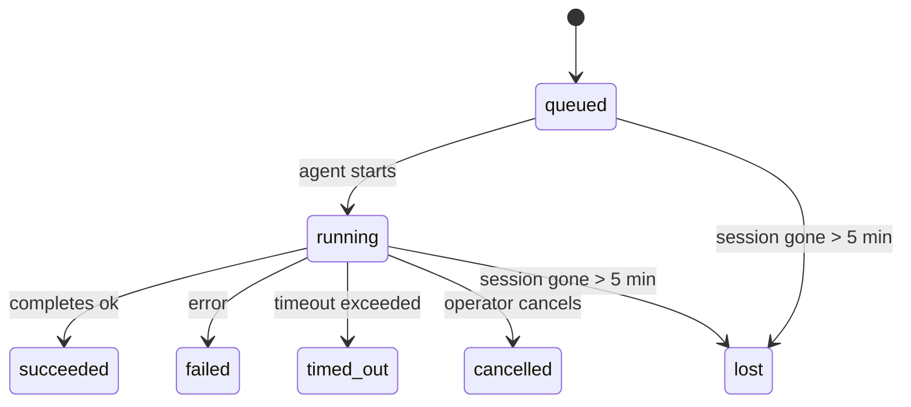

---
read_when:
    - Kiểm tra công việc nền đang diễn ra hoặc vừa hoàn tất
    - Gỡ lỗi các lỗi gửi cho các lần chạy tác tử tách rời
    - Hiểu cách các lần chạy nền liên quan đến phiên, Cron và Heartbeat
sidebarTitle: Background tasks
summary: Theo dõi tác vụ nền cho các lần chạy ACP, tác nhân phụ, công việc Cron biệt lập và thao tác CLI
title: Tác vụ nền
x-i18n:
    generated_at: "2026-05-12T00:56:29Z"
    model: gpt-5.5
    provider: openai
    source_hash: 31cbf09df48bab0686a1350f91aefffffef899c86704bb97b68320fc47e78021
    source_path: automation/tasks.md
    workflow: 16
---

<Note>
Bạn đang tìm tính năng lập lịch? Xem [Tự động hóa](/vi/automation) để chọn cơ chế phù hợp. Trang này là sổ cái hoạt động cho công việc nền, không phải bộ lập lịch.
</Note>

Tác vụ nền theo dõi công việc chạy **bên ngoài phiên hội thoại chính của bạn**: các lượt chạy ACP, tạo tác nhân phụ, các lần thực thi công việc Cron cô lập, và các thao tác khởi tạo từ CLI.

Tác vụ **không** thay thế phiên, công việc Cron, hay Heartbeat - chúng là **sổ cái hoạt động** ghi lại công việc tách rời nào đã diễn ra, khi nào, và liệu nó có thành công hay không.

<Note>
Không phải mọi lượt chạy tác nhân đều tạo tác vụ. Các lượt Heartbeat và trò chuyện tương tác thông thường thì không. Tất cả lần thực thi Cron, lượt tạo ACP, lượt tạo tác nhân phụ, và lệnh tác nhân CLI đều tạo tác vụ.
</Note>

## Tóm tắt nhanh

- Tác vụ là **bản ghi**, không phải bộ lập lịch - Cron và Heartbeat quyết định _khi nào_ công việc chạy, tác vụ theo dõi _điều đã xảy ra_.
- ACP, tác nhân phụ, tất cả công việc Cron, và thao tác CLI đều tạo tác vụ. Các lượt Heartbeat thì không.
- Mỗi tác vụ đi qua `queued → running → terminal` (succeeded, failed, timed_out, cancelled, hoặc lost).
- Tác vụ Cron vẫn hoạt động khi runtime Cron còn sở hữu công việc; nếu trạng thái runtime trong bộ nhớ không còn, quy trình bảo trì tác vụ trước tiên kiểm tra lịch sử chạy Cron bền vững trước khi đánh dấu tác vụ là lost.
- Hoàn tất được dẫn dắt bằng đẩy: công việc tách rời có thể thông báo trực tiếp hoặc đánh thức phiên/Heartbeat của bên yêu cầu khi hoàn tất, vì vậy các vòng lặp thăm dò trạng thái thường là hình dạng sai.
- Các lượt chạy Cron cô lập và hoàn tất tác nhân phụ sẽ nỗ lực tối đa dọn dẹp các tab/trình duyệt được theo dõi cho phiên con của chúng trước phần ghi sổ dọn dẹp cuối cùng.
- Phân phối Cron cô lập chặn các phản hồi tạm thời cũ của cha trong khi công việc tác nhân phụ hậu duệ vẫn đang xả, và ưu tiên đầu ra cuối cùng của hậu duệ khi đầu ra đó đến trước lúc phân phối.
- Thông báo hoàn tất được phân phối trực tiếp tới một kênh hoặc được xếp hàng cho Heartbeat tiếp theo.
- `openclaw tasks list` hiển thị tất cả tác vụ; `openclaw tasks audit` hiển thị các vấn đề.
- Bản ghi terminal được giữ trong 7 ngày, rồi tự động cắt tỉa.

## Bắt đầu nhanh

<Tabs>
  <Tab title="Liệt kê và lọc">
    ```bash
    # List all tasks (newest first)
    openclaw tasks list

    # Filter by runtime or status
    openclaw tasks list --runtime acp
    openclaw tasks list --status running
    ```

  </Tab>
  <Tab title="Kiểm tra">
    ```bash
    # Show details for a specific task (by ID, run ID, or session key)
    openclaw tasks show <lookup>
    ```
  </Tab>
  <Tab title="Hủy và thông báo">
    ```bash
    # Cancel a running task (kills the child session)
    openclaw tasks cancel <lookup>

    # Change notification policy for a task
    openclaw tasks notify <lookup> state_changes
    ```

  </Tab>
  <Tab title="Kiểm toán và bảo trì">
    ```bash
    # Run a health audit
    openclaw tasks audit

    # Preview or apply maintenance
    openclaw tasks maintenance
    openclaw tasks maintenance --apply
    ```

  </Tab>
  <Tab title="Luồng tác vụ">
    ```bash
    # Inspect TaskFlow state
    openclaw tasks flow list
    openclaw tasks flow show <lookup>
    openclaw tasks flow cancel <lookup>
    ```
  </Tab>
</Tabs>

## Điều gì tạo ra tác vụ

| Nguồn                  | Loại runtime | Khi bản ghi tác vụ được tạo                           | Chính sách thông báo mặc định |
| ---------------------- | ------------ | ----------------------------------------------------- | ----------------------------- |
| Lượt chạy nền ACP      | `acp`        | Tạo một phiên ACP con                                 | `done_only`                   |
| Điều phối tác nhân phụ | `subagent`   | Tạo tác nhân phụ qua `sessions_spawn`                 | `done_only`                   |
| Công việc Cron (mọi loại) | `cron`    | Mỗi lần thực thi Cron (phiên chính và cô lập)         | `silent`                      |
| Thao tác CLI           | `cli`        | Lệnh `openclaw agent` chạy qua Gateway                | `silent`                      |
| Công việc phương tiện của tác nhân | `cli` | Các lượt chạy `music_generate`/`video_generate` dựa trên phiên | `silent`              |

<AccordionGroup>
  <Accordion title="Mặc định thông báo cho Cron và phương tiện">
    Tác vụ Cron phiên chính dùng chính sách thông báo `silent` theo mặc định - chúng tạo bản ghi để theo dõi nhưng không tạo thông báo. Tác vụ Cron cô lập cũng mặc định là `silent` nhưng dễ thấy hơn vì chúng chạy trong phiên riêng.

    Các lượt chạy `music_generate` và `video_generate` dựa trên phiên cũng dùng chính sách thông báo `silent`. Chúng vẫn tạo bản ghi tác vụ, nhưng việc hoàn tất được trả về phiên tác nhân gốc dưới dạng một đánh thức nội bộ để tác nhân có thể viết thông điệp tiếp theo và tự đính kèm phương tiện đã hoàn tất. Các hoàn tất nhóm/kênh tuân theo chính sách phản hồi hiển thị thông thường, vì vậy tác nhân dùng công cụ thông điệp khi phân phối nguồn yêu cầu điều đó. Nếu tác nhân hoàn tất không tạo bằng chứng phân phối bằng công cụ thông điệp trong tuyến chỉ dùng công cụ, OpenClaw gửi dự phòng hoàn tất trực tiếp tới kênh gốc thay vì để phương tiện ở trạng thái riêng tư.

  </Accordion>
  <Accordion title="Lan can bảo vệ video_generate đồng thời">
    Khi một tác vụ `video_generate` dựa trên phiên vẫn đang hoạt động, công cụ này cũng đóng vai trò như một lan can bảo vệ: các lệnh gọi `video_generate` lặp lại trong cùng phiên đó trả về trạng thái tác vụ đang hoạt động thay vì bắt đầu lần tạo đồng thời thứ hai. Dùng `action: "status"` khi bạn muốn tra cứu tiến độ/trạng thái rõ ràng từ phía tác nhân.
  </Accordion>
  <Accordion title="Điều gì không tạo tác vụ">
    - Các lượt Heartbeat - phiên chính; xem [Heartbeat](/vi/gateway/heartbeat)
    - Các lượt trò chuyện tương tác thông thường
    - Phản hồi `/command` trực tiếp

  </Accordion>
</AccordionGroup>

## Vòng đời tác vụ



| Trạng thái  | Ý nghĩa                                                                    |
| ----------- | -------------------------------------------------------------------------- |
| `queued`    | Đã tạo, đang chờ tác nhân bắt đầu                                          |
| `running`   | Lượt tác nhân đang thực thi tích cực                                       |
| `succeeded` | Hoàn tất thành công                                                        |
| `failed`    | Hoàn tất với lỗi                                                           |
| `timed_out` | Vượt quá thời gian chờ đã cấu hình                                         |
| `cancelled` | Bị người vận hành dừng qua `openclaw tasks cancel`                         |
| `lost`      | Runtime mất trạng thái nền có thẩm quyền sau thời gian gia hạn 5 phút      |

Chuyển đổi diễn ra tự động - khi lượt chạy tác nhân liên quan kết thúc, trạng thái tác vụ cập nhật tương ứng.

Việc hoàn tất lượt chạy tác nhân là nguồn có thẩm quyền cho các bản ghi tác vụ đang hoạt động. Một lượt chạy tách rời thành công được hoàn tất là `succeeded`, lỗi lượt chạy thông thường được hoàn tất là `failed`, và kết quả hết thời gian chờ hoặc hủy bỏ được hoàn tất là `timed_out`. Nếu người vận hành đã hủy tác vụ, hoặc runtime đã ghi một trạng thái terminal mạnh hơn như `failed`, `timed_out`, hoặc `lost`, tín hiệu thành công đến sau sẽ không hạ cấp trạng thái terminal đó.

`lost` nhận biết runtime:

- Tác vụ ACP: siêu dữ liệu phiên ACP con nền đã biến mất.
- Tác vụ tác nhân phụ: phiên con nền đã biến mất khỏi kho tác nhân đích.
- Tác vụ Cron: runtime Cron không còn theo dõi công việc là đang hoạt động và lịch sử chạy Cron bền vững không cho thấy kết quả terminal cho lượt chạy đó. Kiểm toán CLI ngoại tuyến không xem trạng thái runtime Cron trong tiến trình trống của chính nó là có thẩm quyền.
- Tác vụ CLI: các tác vụ có run id/source id dùng ngữ cảnh lượt chạy trực tiếp, vì vậy các hàng phiên con hoặc phiên trò chuyện còn sót lại không giữ chúng sống sau khi lượt chạy do Gateway sở hữu biến mất. Tác vụ CLI kế thừa không có danh tính lượt chạy vẫn quay về phiên con. Các lượt chạy `openclaw agent` dựa trên Gateway cũng hoàn tất từ kết quả lượt chạy của chúng, vì vậy các lượt chạy đã hoàn tất không nằm ở trạng thái hoạt động cho đến khi trình quét đánh dấu chúng là `lost`.

## Phân phối và thông báo

Khi một tác vụ đạt trạng thái terminal, OpenClaw thông báo cho bạn. Có hai đường dẫn phân phối:

**Phân phối trực tiếp** - nếu tác vụ có đích kênh (`requesterOrigin`), thông điệp hoàn tất đi thẳng tới kênh đó (Telegram, Discord, Slack, v.v.). Hoàn tất tác vụ nhóm và kênh thay vào đó được định tuyến qua phiên của bên yêu cầu để tác nhân cha có thể viết phản hồi hiển thị. Với hoàn tất tác nhân phụ, OpenClaw cũng bảo toàn định tuyến luồng/chủ đề đã ràng buộc khi có sẵn và có thể điền `to` / tài khoản bị thiếu từ tuyến đã lưu của phiên yêu cầu (`lastChannel` / `lastTo` / `lastAccountId`) trước khi từ bỏ phân phối trực tiếp.

**Phân phối xếp hàng theo phiên** - nếu phân phối trực tiếp thất bại hoặc không đặt origin, bản cập nhật được xếp hàng như một sự kiện hệ thống trong phiên của bên yêu cầu và xuất hiện ở Heartbeat tiếp theo.

<Tip>
Hoàn tất tác vụ kích hoạt đánh thức Heartbeat ngay lập tức để bạn thấy kết quả nhanh chóng - bạn không phải chờ tick Heartbeat đã lập lịch tiếp theo.
</Tip>

Điều đó có nghĩa là quy trình thông thường dựa trên đẩy: bắt đầu công việc tách rời một lần, rồi để runtime đánh thức hoặc thông báo cho bạn khi hoàn tất. Chỉ thăm dò trạng thái tác vụ khi bạn cần gỡ lỗi, can thiệp, hoặc kiểm toán rõ ràng.

### Chính sách thông báo

Kiểm soát mức độ bạn nghe về từng tác vụ:

| Chính sách            | Nội dung được phân phối                                               |
| --------------------- | --------------------------------------------------------------------- |
| `done_only` (mặc định) | Chỉ trạng thái terminal (succeeded, failed, v.v.) - **đây là mặc định** |
| `state_changes`       | Mọi chuyển đổi trạng thái và cập nhật tiến độ                         |
| `silent`              | Không gì cả                                                           |

Thay đổi chính sách khi tác vụ đang chạy:

```bash
openclaw tasks notify <lookup> state_changes
```

## Tham chiếu CLI

<AccordionGroup>
  <Accordion title="tasks list">
    ```bash
    openclaw tasks list [--runtime <acp|subagent|cron|cli>] [--status <status>] [--json]
    ```

    Cột đầu ra: ID tác vụ, Loại, Trạng thái, Phân phối, ID lượt chạy, Phiên con, Tóm tắt.

  </Accordion>
  <Accordion title="tasks show">
    ```bash
    openclaw tasks show <lookup>
    ```

    Mã tra cứu chấp nhận ID tác vụ, ID lượt chạy, hoặc khóa phiên. Hiển thị bản ghi đầy đủ bao gồm thời gian, trạng thái phân phối, lỗi, và tóm tắt terminal.

  </Accordion>
  <Accordion title="tasks cancel">
    ```bash
    openclaw tasks cancel <lookup>
    ```

    Với tác vụ ACP và tác nhân phụ, lệnh này chấm dứt phiên con. Với tác vụ được CLI theo dõi, việc hủy được ghi lại trong sổ đăng ký tác vụ (không có handle runtime con riêng). Trạng thái chuyển sang `cancelled` và thông báo phân phối được gửi khi áp dụng.

  </Accordion>
  <Accordion title="tasks notify">
    ```bash
    openclaw tasks notify <lookup> <done_only|state_changes|silent>
    ```
  </Accordion>
  <Accordion title="tasks audit">
    ```bash
    openclaw tasks audit [--json]
    ```

    Hiển thị các vấn đề vận hành. Các phát hiện cũng xuất hiện trong `openclaw status` khi phát hiện vấn đề.

    | Phát hiện                 | Mức độ     | Điều kiện kích hoạt                                                                                                      |
    | ------------------------- | ---------- | ----------------------------------------------------------------------------------------------------------------------- |
    | `stale_queued`            | warn       | Đã xếp hàng hơn 10 phút                                                                                                |
    | `stale_running`           | error      | Đã chạy hơn 30 phút                                                                                                    |
    | `lost`                    | warn/error | Quyền sở hữu tác vụ có runtime hỗ trợ đã biến mất; tác vụ bị mất được giữ lại sẽ cảnh báo cho đến `cleanupAfter`, rồi trở thành lỗi |
    | `delivery_failed`         | warn       | Gửi thất bại và chính sách thông báo không phải là `silent`                                                            |
    | `missing_cleanup`         | warn       | Tác vụ kết thúc không có dấu thời gian dọn dẹp                                                                         |
    | `inconsistent_timestamps` | warn       | Vi phạm dòng thời gian (ví dụ kết thúc trước khi bắt đầu)                                                              |

  </Accordion>
  <Accordion title="bảo trì tác vụ">
    ```bash
    openclaw tasks maintenance [--json]
    openclaw tasks maintenance --apply [--json]
    ```

    Dùng lệnh này để xem trước hoặc áp dụng việc đối chiếu, đóng dấu dọn dẹp và cắt tỉa cho tác vụ, trạng thái Task Flow, và các hàng registry phiên chạy cron cũ.

    Việc đối chiếu có nhận biết runtime:

    - Tác vụ ACP/subagent kiểm tra phiên con hỗ trợ của chúng.
    - Tác vụ subagent có phiên con mang bia mộ phục hồi sau khởi động lại sẽ được đánh dấu là bị mất thay vì được coi là phiên hỗ trợ có thể khôi phục.
    - Tác vụ Cron kiểm tra xem cron runtime còn sở hữu job hay không, rồi khôi phục trạng thái kết thúc từ nhật ký chạy cron/trạng thái job đã lưu trước khi rơi về `lost`. Chỉ tiến trình Gateway mới có thẩm quyền với tập active-job cron trong bộ nhớ; kiểm toán CLI ngoại tuyến dùng lịch sử bền vững nhưng không đánh dấu một tác vụ cron là bị mất chỉ vì Set cục bộ đó rỗng.
    - Tác vụ CLI có danh tính lần chạy sẽ kiểm tra ngữ cảnh lần chạy trực tiếp sở hữu, không chỉ các hàng phiên con hoặc phiên chat.

    Việc dọn dẹp hoàn tất cũng có nhận biết runtime:

    - Hoàn tất subagent sẽ cố gắng đóng các tab trình duyệt/tiến trình được theo dõi cho phiên con trước khi tiếp tục dọn dẹp thông báo.
    - Hoàn tất cron cô lập sẽ cố gắng đóng các tab trình duyệt/tiến trình được theo dõi cho phiên cron trước khi lần chạy được tháo dỡ hoàn toàn.
    - Gửi cron cô lập sẽ chờ hoàn tất theo sau từ subagent hậu duệ khi cần và chặn văn bản xác nhận cha đã cũ thay vì thông báo nó.
    - Gửi hoàn tất subagent ưu tiên văn bản trợ lý hiển thị mới nhất; nếu văn bản đó rỗng, nó rơi về văn bản tool/toolResult mới nhất đã được làm sạch, và các lần chạy chỉ hết thời gian chờ tool-call có thể thu gọn thành một tóm tắt tiến độ một phần ngắn. Các lần chạy kết thúc thất bại thông báo trạng thái thất bại mà không phát lại văn bản phản hồi đã ghi lại.
    - Lỗi dọn dẹp không che khuất kết quả thực của tác vụ.

    Khi áp dụng bảo trì, OpenClaw cũng xóa các hàng registry phiên `cron:<jobId>:run:<uuid>` cũ hơn 7 ngày, đồng thời giữ lại các hàng cho job cron đang chạy và không chạm tới các hàng phiên không phải cron.

  </Accordion>
  <Accordion title="liệt kê | hiển thị | hủy flow tác vụ">
    ```bash
    openclaw tasks flow list [--status <status>] [--json]
    openclaw tasks flow show <lookup> [--json]
    openclaw tasks flow cancel <lookup>
    ```

    Dùng các lệnh này khi điều bạn quan tâm là Task Flow điều phối chứ không phải một bản ghi tác vụ nền riêng lẻ.

  </Accordion>
</AccordionGroup>

## Bảng tác vụ chat (`/tasks`)

Dùng `/tasks` trong bất kỳ phiên chat nào để xem các tác vụ nền được liên kết với phiên đó. Bảng hiển thị các tác vụ đang hoạt động và vừa hoàn tất, kèm runtime, trạng thái, thời gian, và chi tiết tiến độ hoặc lỗi.

Khi phiên hiện tại không có tác vụ liên kết nào hiển thị, `/tasks` rơi về số lượng tác vụ cục bộ của agent để bạn vẫn có tổng quan mà không làm lộ chi tiết của phiên khác.

Để xem sổ cái đầy đủ cho operator, hãy dùng CLI: `openclaw tasks list`.

## Tích hợp trạng thái (áp lực tác vụ)

`openclaw status` bao gồm tóm tắt tác vụ nhanh:

```
Tasks: 3 queued · 2 running · 1 issues
```

Tóm tắt báo cáo:

- **active** - số lượng `queued` + `running`
- **failures** - số lượng `failed` + `timed_out` + `lost`
- **byRuntime** - phân rã theo `acp`, `subagent`, `cron`, `cli`

Cả `/status` và tool `session_status` đều dùng ảnh chụp tác vụ có nhận biết dọn dẹp: ưu tiên tác vụ đang hoạt động, ẩn các hàng đã hoàn tất cũ, và chỉ hiển thị lỗi gần đây khi không còn công việc đang hoạt động. Điều này giữ cho thẻ trạng thái tập trung vào điều quan trọng ngay lúc này.

## Lưu trữ và bảo trì

### Nơi tác vụ tồn tại

Bản ghi tác vụ được lưu bền vững trong SQLite tại:

```
$OPENCLAW_STATE_DIR/tasks/runs.sqlite
```

Registry được tải vào bộ nhớ khi Gateway khởi động và đồng bộ các lần ghi vào SQLite để bền vững qua các lần khởi động lại.
Gateway giữ cho nhật ký ghi trước của SQLite có giới hạn bằng ngưỡng autocheckpoint mặc định của SQLite cộng với các checkpoint `TRUNCATE` định kỳ và khi tắt.

### Bảo trì tự động

Một sweeper chạy mỗi **60 giây** và xử lý bốn việc:

<Steps>
  <Step title="Đối chiếu">
    Kiểm tra xem các tác vụ đang hoạt động còn có phần hỗ trợ runtime có thẩm quyền hay không. Tác vụ ACP/subagent dùng trạng thái phiên con, tác vụ cron dùng quyền sở hữu active-job, và tác vụ CLI có danh tính lần chạy dùng ngữ cảnh lần chạy sở hữu. Nếu trạng thái hỗ trợ đó biến mất hơn 5 phút, tác vụ được đánh dấu là `lost`.
  </Step>
  <Step title="Sửa chữa phiên ACP">
    Đóng các phiên ACP one-shot do cha sở hữu đã kết thúc hoặc mồ côi, và chỉ đóng các phiên ACP persistent đã kết thúc cũ hoặc mồ côi khi không còn liên kết hội thoại đang hoạt động.
  </Step>
  <Step title="Đóng dấu dọn dẹp">
    Đặt dấu thời gian `cleanupAfter` trên các tác vụ kết thúc (endedAt + 7 ngày). Trong thời gian lưu giữ, tác vụ bị mất vẫn xuất hiện trong kiểm toán dưới dạng cảnh báo; sau khi `cleanupAfter` hết hạn hoặc khi thiếu siêu dữ liệu dọn dẹp, chúng là lỗi.
  </Step>
  <Step title="Cắt tỉa">
    Xóa các bản ghi quá ngày `cleanupAfter` của chúng.
  </Step>
</Steps>

<Note>
**Lưu giữ:** bản ghi tác vụ kết thúc được giữ trong **7 ngày**, rồi tự động bị cắt tỉa. Không cần cấu hình.
</Note>

## Cách tác vụ liên quan đến các hệ thống khác

<AccordionGroup>
  <Accordion title="Tác vụ và Task Flow">
    [Task Flow](/vi/automation/taskflow) là lớp điều phối flow phía trên tác vụ nền. Một flow có thể điều phối nhiều tác vụ trong suốt vòng đời của nó bằng các chế độ đồng bộ managed hoặc mirrored. Dùng `openclaw tasks` để kiểm tra từng bản ghi tác vụ và `openclaw tasks flow` để kiểm tra flow điều phối.

    Xem [Task Flow](/vi/automation/taskflow) để biết chi tiết.

  </Accordion>
  <Accordion title="Tác vụ và cron">
    **Định nghĩa** job cron nằm trong `~/.openclaw/cron/jobs.json`; trạng thái thực thi runtime nằm bên cạnh trong `~/.openclaw/cron/jobs-state.json`. **Mọi** lần thực thi cron đều tạo một bản ghi tác vụ - cả main-session và isolated. Tác vụ cron main-session mặc định dùng chính sách thông báo `silent` để chúng được theo dõi mà không tạo thông báo.

    Xem [Cron Jobs](/vi/automation/cron-jobs).

  </Accordion>
  <Accordion title="Tác vụ và heartbeat">
    Các lần chạy Heartbeat là lượt main-session - chúng không tạo bản ghi tác vụ. Khi một tác vụ hoàn tất, nó có thể kích hoạt một heartbeat wake để bạn thấy kết quả kịp thời.

    Xem [Heartbeat](/vi/gateway/heartbeat).

  </Accordion>
  <Accordion title="Tác vụ và phiên">
    Một tác vụ có thể tham chiếu `childSessionKey` (nơi công việc chạy) và `requesterSessionKey` (người đã bắt đầu nó). Phiên là ngữ cảnh hội thoại; tác vụ là lớp theo dõi hoạt động phía trên ngữ cảnh đó.
  </Accordion>
  <Accordion title="Tác vụ và lần chạy agent">
    `runId` của tác vụ liên kết tới lần chạy agent đang thực hiện công việc. Các sự kiện vòng đời agent (bắt đầu, kết thúc, lỗi) tự động cập nhật trạng thái tác vụ - bạn không cần quản lý vòng đời theo cách thủ công.
  </Accordion>
</AccordionGroup>

## Liên quan

- [Tự động hóa](/vi/automation) - tất cả cơ chế tự động hóa trong một lượt xem
- [CLI: Tác vụ](/vi/cli/tasks) - tham chiếu lệnh CLI
- [Heartbeat](/vi/gateway/heartbeat) - các lượt main-session định kỳ
- [Tác vụ đã lên lịch](/vi/automation/cron-jobs) - lên lịch công việc nền
- [Task Flow](/vi/automation/taskflow) - điều phối flow phía trên tác vụ
