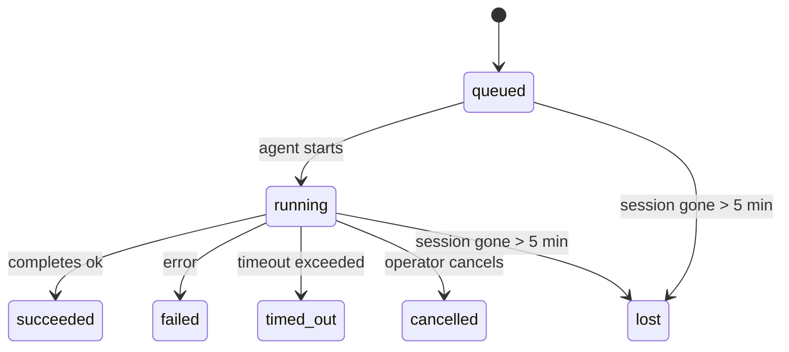

---
read_when:
    - Kiểm tra công việc chạy nền đang tiến hành hoặc vừa hoàn tất
    - Gỡ lỗi sự cố gửi trong các lần chạy tác tử tách rời
    - Hiểu cách các lần chạy nền liên quan đến phiên, Cron và Heartbeat
sidebarTitle: Background tasks
summary: Theo dõi tác vụ nền cho các lần chạy ACP, tác tử con, tác vụ Cron cô lập và thao tác CLI
title: Tác vụ nền
x-i18n:
    generated_at: "2026-05-10T19:21:00Z"
    model: gpt-5.5
    provider: openai
    source_hash: 5764a89634f90181d826ff3990ec8dac9538239074934d30fd446c1eb4564869
    source_path: automation/tasks.md
    workflow: 16
---

<Note>
Bạn đang tìm cách lập lịch? Xem [Tự động hóa và tác vụ](/vi/automation) để chọn cơ chế phù hợp. Trang này là sổ cái hoạt động cho công việc nền, không phải bộ lập lịch.
</Note>

Tác vụ nền theo dõi công việc chạy **bên ngoài phiên hội thoại chính của bạn**: lượt chạy ACP, tạo subagent, các lần thực thi cron job cô lập, và thao tác do CLI khởi tạo.

Tác vụ **không** thay thế phiên, cron job, hay heartbeat - chúng là **sổ cái hoạt động** ghi lại công việc tách rời nào đã diễn ra, khi nào, và có thành công hay không.

<Note>
Không phải mọi lượt chạy agent đều tạo tác vụ. Các lượt Heartbeat và chat tương tác bình thường thì không. Tất cả lượt thực thi cron, tạo ACP, tạo subagent, và lệnh agent qua CLI đều tạo tác vụ.
</Note>

## Tóm tắt nhanh

- Tác vụ là **bản ghi**, không phải bộ lập lịch - cron và heartbeat quyết định công việc chạy _khi nào_, tác vụ theo dõi _điều đã xảy ra_.
- ACP, subagent, tất cả cron job, và thao tác CLI tạo tác vụ. Các lượt Heartbeat thì không.
- Mỗi tác vụ đi qua `queued → running → terminal` (succeeded, failed, timed_out, cancelled, hoặc lost).
- Tác vụ cron vẫn hoạt động khi runtime cron vẫn sở hữu job; nếu trạng thái runtime trong bộ nhớ đã mất, bảo trì tác vụ trước tiên kiểm tra lịch sử lượt chạy cron bền vững trước khi đánh dấu tác vụ là lost.
- Hoàn tất được điều khiển bằng đẩy: công việc tách rời có thể thông báo trực tiếp hoặc đánh thức phiên/heartbeat của bên yêu cầu khi hoàn tất, nên các vòng lặp thăm dò trạng thái thường là sai dạng.
- Các lượt chạy cron cô lập và các lần hoàn tất subagent cố gắng hết mức dọn dẹp các tab/trình xử lý trình duyệt được theo dõi cho phiên con trước khi ghi sổ dọn dẹp cuối cùng.
- Phân phối cron cô lập chặn các phản hồi cha tạm thời đã cũ trong khi công việc subagent hậu duệ vẫn đang thoát hàng, và ưu tiên đầu ra hậu duệ cuối cùng khi đầu ra đó đến trước thời điểm phân phối.
- Thông báo hoàn tất được gửi trực tiếp tới một kênh hoặc xếp hàng cho Heartbeat kế tiếp.
- `openclaw tasks list` hiển thị tất cả tác vụ; `openclaw tasks audit` nêu ra vấn đề.
- Bản ghi terminal được giữ trong 7 ngày, rồi tự động được cắt tỉa.

## Bắt đầu nhanh

<Tabs>
  <Tab title="Liệt kê và lọc">
    ```bash
    # List all tasks (newest first)
    openclaw tasks list

    # Filter by runtime or status
    openclaw tasks list --runtime acp
    openclaw tasks list --status running
    ```

  </Tab>
  <Tab title="Kiểm tra">
    ```bash
    # Show details for a specific task (by ID, run ID, or session key)
    openclaw tasks show <lookup>
    ```
  </Tab>
  <Tab title="Hủy và thông báo">
    ```bash
    # Cancel a running task (kills the child session)
    openclaw tasks cancel <lookup>

    # Change notification policy for a task
    openclaw tasks notify <lookup> state_changes
    ```

  </Tab>
  <Tab title="Kiểm toán và bảo trì">
    ```bash
    # Run a health audit
    openclaw tasks audit

    # Preview or apply maintenance
    openclaw tasks maintenance
    openclaw tasks maintenance --apply
    ```

  </Tab>
  <Tab title="Luồng tác vụ">
    ```bash
    # Inspect TaskFlow state
    openclaw tasks flow list
    openclaw tasks flow show <lookup>
    openclaw tasks flow cancel <lookup>
    ```
  </Tab>
</Tabs>

## Điều gì tạo tác vụ

| Nguồn                  | Loại runtime | Khi bản ghi tác vụ được tạo                                  | Chính sách thông báo mặc định |
| ---------------------- | ------------ | ------------------------------------------------------------ | ----------------------------- |
| Lượt chạy nền ACP      | `acp`        | Tạo một phiên ACP con                                        | `done_only`                   |
| Điều phối subagent     | `subagent`   | Tạo một subagent qua `sessions_spawn`                        | `done_only`                   |
| Cron job (mọi loại)    | `cron`       | Mỗi lần thực thi cron (phiên chính và cô lập)                | `silent`                      |
| Thao tác CLI           | `cli`        | Lệnh `openclaw agent` chạy qua gateway                       | `silent`                      |
| Job phương tiện agent  | `cli`        | Lượt chạy `music_generate`/`video_generate` dựa trên phiên   | `silent`                      |

<AccordionGroup>
  <Accordion title="Mặc định thông báo cho cron và phương tiện">
    Tác vụ cron phiên chính dùng chính sách thông báo `silent` theo mặc định - chúng tạo bản ghi để theo dõi nhưng không tạo thông báo. Tác vụ cron cô lập cũng mặc định là `silent` nhưng dễ thấy hơn vì chúng chạy trong phiên riêng.

    Các lượt chạy `music_generate` và `video_generate` dựa trên phiên cũng dùng chính sách thông báo `silent`. Chúng vẫn tạo bản ghi tác vụ, nhưng hoàn tất được chuyển lại cho phiên agent gốc dưới dạng một lần đánh thức nội bộ để agent có thể viết tin nhắn theo dõi và tự đính kèm phương tiện đã hoàn tất. Các lần hoàn tất trong nhóm/kênh tuân theo chính sách phản hồi hiển thị bình thường, nên agent dùng công cụ tin nhắn khi phân phối nguồn yêu cầu điều đó. Nếu agent hoàn tất không tạo được bằng chứng phân phối bằng công cụ tin nhắn trong một tuyến chỉ dùng công cụ, OpenClaw gửi phương án dự phòng hoàn tất trực tiếp tới kênh gốc thay vì để phương tiện ở chế độ riêng tư.

  </Accordion>
  <Accordion title="Lan can bảo vệ video_generate đồng thời">
    Khi một tác vụ `video_generate` dựa trên phiên vẫn đang hoạt động, công cụ cũng đóng vai trò như một lan can bảo vệ: các lệnh gọi `video_generate` lặp lại trong cùng phiên đó trả về trạng thái tác vụ đang hoạt động thay vì bắt đầu một lượt tạo đồng thời thứ hai. Dùng `action: "status"` khi bạn muốn tra cứu tiến độ/trạng thái rõ ràng từ phía agent.
  </Accordion>
  <Accordion title="Điều gì không tạo tác vụ">
    - Các lượt Heartbeat - phiên chính; xem [Heartbeat](/vi/gateway/heartbeat)
    - Các lượt chat tương tác bình thường
    - Phản hồi `/command` trực tiếp

  </Accordion>
</AccordionGroup>

## Vòng đời tác vụ



| Trạng thái  | Ý nghĩa                                                                    |
| ----------- | -------------------------------------------------------------------------- |
| `queued`    | Đã tạo, đang chờ agent bắt đầu                                             |
| `running`   | Lượt agent đang thực thi tích cực                                          |
| `succeeded` | Hoàn tất thành công                                                        |
| `failed`    | Hoàn tất với lỗi                                                           |
| `timed_out` | Vượt quá thời gian chờ đã cấu hình                                         |
| `cancelled` | Bị người vận hành dừng qua `openclaw tasks cancel`                         |
| `lost`      | Runtime mất trạng thái hậu thuẫn có thẩm quyền sau thời gian ân hạn 5 phút |

Chuyển trạng thái diễn ra tự động - khi lượt chạy agent liên quan kết thúc, trạng thái tác vụ cập nhật cho khớp.

Hoàn tất lượt chạy agent là nguồn có thẩm quyền cho các bản ghi tác vụ đang hoạt động. Một lượt chạy tách rời thành công được hoàn tất là `succeeded`, lỗi chạy thông thường được hoàn tất là `failed`, và kết quả hết thời gian chờ hoặc hủy bỏ được hoàn tất là `timed_out`. Nếu người vận hành đã hủy tác vụ, hoặc runtime đã ghi một trạng thái terminal mạnh hơn như `failed`, `timed_out`, hoặc `lost`, tín hiệu thành công muộn hơn không hạ cấp trạng thái terminal đó.

`lost` có nhận biết runtime:

- Tác vụ ACP: siêu dữ liệu phiên ACP con hậu thuẫn đã biến mất.
- Tác vụ subagent: phiên con hậu thuẫn đã biến mất khỏi kho agent đích.
- Tác vụ cron: runtime cron không còn theo dõi job là đang hoạt động và lịch sử lượt chạy cron bền vững không cho thấy kết quả terminal cho lượt chạy đó. Kiểm toán CLI ngoại tuyến không coi trạng thái runtime cron trong tiến trình trống của chính nó là có thẩm quyền.
- Tác vụ CLI: các tác vụ có run id/source id dùng ngữ cảnh lượt chạy trực tiếp, nên các hàng phiên con hoặc phiên chat còn sót lại không giữ chúng sống sau khi lượt chạy do gateway sở hữu biến mất. Tác vụ CLI cũ không có danh tính lượt chạy vẫn dự phòng về phiên con. Các lượt chạy `openclaw agent` dựa trên Gateway cũng hoàn tất từ kết quả lượt chạy của chúng, nên các lượt chạy đã hoàn tất không nằm ở trạng thái hoạt động cho đến khi sweeper đánh dấu chúng là `lost`.

## Phân phối và thông báo

Khi một tác vụ đạt trạng thái terminal, OpenClaw thông báo cho bạn. Có hai đường phân phối:

**Phân phối trực tiếp** - nếu tác vụ có đích kênh (`requesterOrigin`), tin nhắn hoàn tất đi thẳng tới kênh đó (Telegram, Discord, Slack, v.v.). Các lần hoàn tất tác vụ nhóm và kênh thay vào đó được định tuyến qua phiên của bên yêu cầu để agent cha có thể viết phản hồi hiển thị. Đối với các lần hoàn tất subagent, OpenClaw cũng giữ nguyên định tuyến thread/chủ đề đã ràng buộc khi có sẵn và có thể điền `to` / tài khoản còn thiếu từ tuyến đã lưu của phiên bên yêu cầu (`lastChannel` / `lastTo` / `lastAccountId`) trước khi từ bỏ phân phối trực tiếp.

**Phân phối xếp hàng theo phiên** - nếu phân phối trực tiếp thất bại hoặc không đặt origin, bản cập nhật được xếp hàng như một sự kiện hệ thống trong phiên của bên yêu cầu và hiện ra ở Heartbeat kế tiếp.

<Tip>
Hoàn tất tác vụ kích hoạt một lần đánh thức heartbeat ngay lập tức để bạn thấy kết quả nhanh chóng - bạn không phải chờ nhịp heartbeat đã lập lịch tiếp theo.
</Tip>

Điều đó nghĩa là quy trình thông thường dựa trên đẩy: bắt đầu công việc tách rời một lần, rồi để runtime đánh thức hoặc thông báo cho bạn khi hoàn tất. Chỉ thăm dò trạng thái tác vụ khi bạn cần gỡ lỗi, can thiệp, hoặc kiểm toán rõ ràng.

### Chính sách thông báo

Kiểm soát mức độ bạn nghe về mỗi tác vụ:

| Chính sách            | Nội dung được phân phối                                                     |
| --------------------- | --------------------------------------------------------------------------- |
| `done_only` (mặc định)| Chỉ trạng thái terminal (succeeded, failed, v.v.) - **đây là mặc định**     |
| `state_changes`       | Mọi chuyển trạng thái và cập nhật tiến độ                                   |
| `silent`              | Không có gì                                                                 |

Thay đổi chính sách khi tác vụ đang chạy:

```bash
openclaw tasks notify <lookup> state_changes
```

## Tham chiếu CLI

<AccordionGroup>
  <Accordion title="tasks list">
    ```bash
    openclaw tasks list [--runtime <acp|subagent|cron|cli>] [--status <status>] [--json]
    ```

    Cột đầu ra: ID tác vụ, Loại, Trạng thái, Phân phối, Run ID, Phiên con, Tóm tắt.

  </Accordion>
  <Accordion title="tasks show">
    ```bash
    openclaw tasks show <lookup>
    ```

    Token tra cứu chấp nhận ID tác vụ, run ID, hoặc khóa phiên. Hiển thị bản ghi đầy đủ bao gồm thời điểm, trạng thái phân phối, lỗi, và tóm tắt terminal.

  </Accordion>
  <Accordion title="tasks cancel">
    ```bash
    openclaw tasks cancel <lookup>
    ```

    Đối với tác vụ ACP và subagent, lệnh này kết thúc phiên con. Đối với tác vụ được CLI theo dõi, thao tác hủy được ghi trong sổ đăng ký tác vụ (không có handle runtime con riêng). Trạng thái chuyển thành `cancelled` và thông báo phân phối được gửi khi áp dụng.

  </Accordion>
  <Accordion title="tasks notify">
    ```bash
    openclaw tasks notify <lookup> <done_only|state_changes|silent>
    ```
  </Accordion>
  <Accordion title="tasks audit">
    ```bash
    openclaw tasks audit [--json]
    ```

    Nêu ra các vấn đề vận hành. Phát hiện cũng xuất hiện trong `openclaw status` khi phát hiện vấn đề.

    | Phát hiện                 | Mức độ     | Điều kiện kích hoạt                                                                                                      |
    | ------------------------- | ---------- | ------------------------------------------------------------------------------------------------------------ |
    | `stale_queued`            | warn       | Đã ở hàng đợi hơn 10 phút                                                                              |
    | `stale_running`           | error      | Đang chạy hơn 30 phút                                                                             |
    | `lost`                    | warn/error | Quyền sở hữu tác vụ do runtime hỗ trợ đã biến mất; các tác vụ bị mất được giữ lại sẽ cảnh báo cho đến `cleanupAfter`, rồi trở thành lỗi |
    | `delivery_failed`         | warn       | Gửi không thành công và chính sách thông báo không phải là `silent`                                                            |
    | `missing_cleanup`         | warn       | Tác vụ kết thúc không có dấu thời gian dọn dẹp                                                                      |
    | `inconsistent_timestamps` | warn       | Vi phạm dòng thời gian (ví dụ kết thúc trước khi bắt đầu)                                                        |

  </Accordion>
  <Accordion title="bảo trì tasks">
    ```bash
    openclaw tasks maintenance [--json]
    openclaw tasks maintenance --apply [--json]
    ```

    Dùng lệnh này để xem trước hoặc áp dụng việc đối soát, đóng dấu dọn dẹp và cắt tỉa cho tác vụ, trạng thái Luồng tác vụ và các hàng registry phiên chạy cron đã cũ.

    Việc đối soát có nhận biết runtime:

    - Các tác vụ ACP/subagent kiểm tra phiên con hỗ trợ của chúng.
    - Các tác vụ subagent có phiên con mang tombstone khôi phục sau khởi động lại được đánh dấu là bị mất thay vì được xử lý như các phiên hỗ trợ có thể khôi phục.
    - Các tác vụ cron kiểm tra xem runtime cron còn sở hữu công việc hay không, rồi khôi phục trạng thái kết thúc từ nhật ký chạy cron/trạng thái công việc đã lưu trước khi quay về `lost`. Chỉ tiến trình Gateway mới có thẩm quyền với tập công việc cron đang hoạt động trong bộ nhớ; kiểm toán CLI ngoại tuyến dùng lịch sử bền vững nhưng không đánh dấu một tác vụ cron là mất chỉ vì Set cục bộ đó trống.
    - Các tác vụ CLI có danh tính chạy sẽ kiểm tra ngữ cảnh chạy trực tiếp sở hữu, không chỉ các hàng phiên con hoặc phiên trò chuyện.

    Việc dọn dẹp hoàn tất cũng có nhận biết runtime:

    - Khi subagent hoàn tất, hệ thống cố gắng đóng các tab trình duyệt/tiến trình được theo dõi cho phiên con trước khi việc dọn dẹp thông báo tiếp tục.
    - Khi cron cô lập hoàn tất, hệ thống cố gắng đóng các tab trình duyệt/tiến trình được theo dõi cho phiên cron trước khi lượt chạy được tháo dỡ hoàn toàn.
    - Việc gửi của cron cô lập sẽ chờ phần theo dõi của subagent hậu duệ khi cần và chặn văn bản xác nhận cha đã cũ thay vì thông báo nó.
    - Việc gửi hoàn tất của subagent ưu tiên văn bản trợ lý hiển thị mới nhất; nếu trống, nó quay về văn bản tool/toolResult mới nhất đã được làm sạch, và các lượt chạy chỉ hết thời gian chờ lời gọi công cụ có thể rút gọn thành một bản tóm tắt tiến độ một phần ngắn. Các lượt chạy kết thúc thất bại thông báo trạng thái thất bại mà không phát lại văn bản trả lời đã ghi lại.
    - Lỗi dọn dẹp không che lấp kết quả thực của tác vụ.

    Khi áp dụng bảo trì, OpenClaw cũng xóa các hàng registry phiên `cron:<jobId>:run:<uuid>` đã cũ hơn 7 ngày, trong khi vẫn giữ các hàng cho công việc cron đang chạy và không động tới các hàng phiên không phải cron.

  </Accordion>
  <Accordion title="tasks flow list | show | cancel">
    ```bash
    openclaw tasks flow list [--status <status>] [--json]
    openclaw tasks flow show <lookup> [--json]
    openclaw tasks flow cancel <lookup>
    ```

    Dùng các lệnh này khi Luồng tác vụ điều phối mới là thứ bạn quan tâm thay vì một bản ghi tác vụ nền riêng lẻ.

  </Accordion>
</AccordionGroup>

## Bảng tác vụ trò chuyện (`/tasks`)

Dùng `/tasks` trong bất kỳ phiên trò chuyện nào để xem các tác vụ nền được liên kết với phiên đó. Bảng hiển thị các tác vụ đang hoạt động và mới hoàn tất gần đây cùng runtime, trạng thái, thời gian, và chi tiết tiến độ hoặc lỗi.

Khi phiên hiện tại không có tác vụ liên kết nào hiển thị, `/tasks` sẽ quay về số lượng tác vụ cục bộ của agent để bạn vẫn có cái nhìn tổng quan mà không làm lộ chi tiết của phiên khác.

Để xem sổ cái đầy đủ cho người vận hành, dùng CLI: `openclaw tasks list`.

## Tích hợp trạng thái (áp lực tác vụ)

`openclaw status` bao gồm bản tóm tắt tác vụ nhìn lướt:

```
Tasks: 3 queued · 2 running · 1 issues
```

Bản tóm tắt báo cáo:

- **active** - số lượng `queued` + `running`
- **failures** - số lượng `failed` + `timed_out` + `lost`
- **byRuntime** - phân rã theo `acp`, `subagent`, `cron`, `cli`

Cả `/status` và công cụ `session_status` đều dùng ảnh chụp tác vụ có nhận biết dọn dẹp: tác vụ đang hoạt động được ưu tiên, các hàng đã hoàn tất cũ bị ẩn, và lỗi gần đây chỉ hiện ra khi không còn công việc đang hoạt động. Điều này giữ cho thẻ trạng thái tập trung vào những gì quan trọng ngay lúc này.

## Lưu trữ và bảo trì

### Tác vụ nằm ở đâu

Bản ghi tác vụ được lưu bền vững trong SQLite tại:

```
$OPENCLAW_STATE_DIR/tasks/runs.sqlite
```

Registry được nạp vào bộ nhớ khi gateway khởi động và đồng bộ các lần ghi vào SQLite để bền vững qua các lần khởi động lại.
Gateway giữ cho nhật ký ghi trước của SQLite có giới hạn bằng cách dùng ngưỡng autocheckpoint mặc định của SQLite cùng với các checkpoint `TRUNCATE` định kỳ và khi tắt.

### Bảo trì tự động

Một sweeper chạy mỗi **60 giây** và xử lý bốn việc:

<Steps>
  <Step title="Đối soát">
    Kiểm tra xem các tác vụ đang hoạt động còn có runtime có thẩm quyền hỗ trợ hay không. Các tác vụ ACP/subagent dùng trạng thái phiên con, tác vụ cron dùng quyền sở hữu công việc đang hoạt động, và tác vụ CLI có danh tính chạy dùng ngữ cảnh chạy sở hữu. Nếu trạng thái hỗ trợ đó biến mất hơn 5 phút, tác vụ được đánh dấu `lost`.
  </Step>
  <Step title="Sửa chữa phiên ACP">
    Đóng các phiên ACP một lần do cha sở hữu đã kết thúc hoặc mồ côi, và chỉ đóng các phiên ACP bền vững đã kết thúc cũ hoặc mồ côi khi không còn liên kết hội thoại đang hoạt động.
  </Step>
  <Step title="Đóng dấu dọn dẹp">
    Đặt dấu thời gian `cleanupAfter` trên các tác vụ kết thúc (endedAt + 7 ngày). Trong thời gian lưu giữ, các tác vụ bị mất vẫn xuất hiện trong kiểm toán dưới dạng cảnh báo; sau khi `cleanupAfter` hết hạn hoặc khi thiếu metadata dọn dẹp, chúng là lỗi.
  </Step>
  <Step title="Cắt tỉa">
    Xóa các bản ghi đã quá ngày `cleanupAfter`.
  </Step>
</Steps>

<Note>
**Lưu giữ:** bản ghi tác vụ kết thúc được giữ trong **7 ngày**, rồi tự động bị cắt tỉa. Không cần cấu hình.
</Note>

## Tác vụ liên quan thế nào tới các hệ thống khác

<AccordionGroup>
  <Accordion title="Tác vụ và Luồng tác vụ">
    [Luồng tác vụ](/vi/automation/taskflow) là lớp điều phối luồng phía trên các tác vụ nền. Một luồng có thể điều phối nhiều tác vụ trong suốt vòng đời của nó bằng các chế độ đồng bộ được quản lý hoặc phản chiếu. Dùng `openclaw tasks` để kiểm tra từng bản ghi tác vụ riêng lẻ và `openclaw tasks flow` để kiểm tra luồng điều phối.

    Xem [Luồng tác vụ](/vi/automation/taskflow) để biết chi tiết.

  </Accordion>
  <Accordion title="Tác vụ và cron">
    **Định nghĩa** công việc cron nằm trong `~/.openclaw/cron/jobs.json`; trạng thái thực thi runtime nằm cạnh nó trong `~/.openclaw/cron/jobs-state.json`. **Mỗi** lần thực thi cron đều tạo một bản ghi tác vụ - cả phiên chính và cô lập. Các tác vụ cron phiên chính mặc định dùng chính sách thông báo `silent` để chúng theo dõi mà không tạo thông báo.

    Xem [Công việc Cron](/vi/automation/cron-jobs).

  </Accordion>
  <Accordion title="Tác vụ và heartbeat">
    Các lượt chạy Heartbeat là lượt phiên chính - chúng không tạo bản ghi tác vụ. Khi một tác vụ hoàn tất, nó có thể kích hoạt một lần đánh thức heartbeat để bạn thấy kết quả kịp thời.

    Xem [Heartbeat](/vi/gateway/heartbeat).

  </Accordion>
  <Accordion title="Tác vụ và phiên">
    Một tác vụ có thể tham chiếu `childSessionKey` (nơi công việc chạy) và `requesterSessionKey` (người khởi động nó). Phiên là ngữ cảnh hội thoại; tác vụ là lớp theo dõi hoạt động bên trên đó.
  </Accordion>
  <Accordion title="Tác vụ và lượt chạy agent">
    `runId` của một tác vụ liên kết tới lượt chạy agent đang thực hiện công việc. Các sự kiện vòng đời agent (bắt đầu, kết thúc, lỗi) tự động cập nhật trạng thái tác vụ - bạn không cần quản lý vòng đời theo cách thủ công.
  </Accordion>
</AccordionGroup>

## Liên quan

- [Tự động hóa & Tác vụ](/vi/automation) - tất cả cơ chế tự động hóa trong một cái nhìn tổng quan
- [CLI: Tác vụ](/vi/cli/tasks) - tham chiếu lệnh CLI
- [Heartbeat](/vi/gateway/heartbeat) - các lượt phiên chính định kỳ
- [Tác vụ đã lên lịch](/vi/automation/cron-jobs) - lên lịch công việc nền
- [Luồng tác vụ](/vi/automation/taskflow) - điều phối luồng phía trên tác vụ
