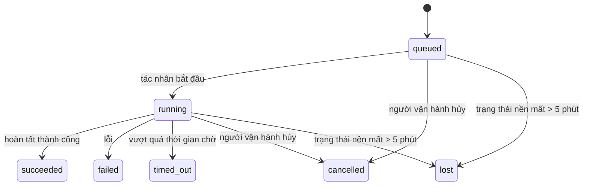

---
read_when:
    - Kiểm tra công việc nền đang diễn ra hoặc vừa hoàn tất
    - Gỡ lỗi các sự cố gửi kết quả của những lượt chạy agent tách rời
    - Tìm hiểu mối liên hệ giữa các lượt chạy nền với phiên, cron và heartbeat
sidebarTitle: Background tasks
summary: Theo dõi tác vụ nền cho các lượt chạy ACP, tác tử phụ, các lần thực thi cron và thao tác CLI
title: Tác vụ nền
x-i18n:
    generated_at: "2026-07-12T07:38:51Z"
    model: gpt-5.6
    postprocess_version: locale-links-v1
    provider: openai
    source_hash: 0a945e8103c5df5a64785f326a9d0b08784ac32a2ca6fa3d4c399d75fc54be2b
    source_path: automation/tasks.md
    workflow: 16
---

<Note>
Bạn đang tìm cách lập lịch? Xem [Tự động hóa](/vi/automation) để chọn cơ chế phù hợp. Trang này là sổ ghi hoạt động của công việc nền, không phải bộ lập lịch.
</Note>

Các tác vụ nền theo dõi công việc chạy **bên ngoài phiên hội thoại chính của bạn**: các lượt chạy ACP, việc khởi tạo subagent, các lần thực thi công việc cron và các thao tác được khởi tạo từ CLI.

Tác vụ **không** thay thế phiên, công việc cron hoặc heartbeat — chúng là **sổ ghi hoạt động** ghi lại công việc tách rời nào đã diễn ra, vào thời điểm nào và có thành công hay không.

<Note>
Không phải mọi lượt chạy của tác nhân đều tạo tác vụ. Các lượt heartbeat và trò chuyện tương tác thông thường không tạo tác vụ. Mọi lần thực thi cron, khởi tạo ACP, khởi tạo subagent và lệnh tác nhân CLI do Gateway điều phối đều tạo tác vụ.
</Note>

## Tóm tắt

- Tác vụ là **bản ghi**, không phải bộ lập lịch — cron và heartbeat quyết định công việc chạy _khi nào_, còn tác vụ theo dõi _điều gì đã xảy ra_.
- ACP, subagent, mọi công việc cron và thao tác CLI đều tạo tác vụ. Các lượt heartbeat thì không.
- Mỗi tác vụ chuyển qua `queued → running → terminal` (thành công, thất bại, hết thời gian, bị hủy hoặc bị mất).
- Tác vụ cron vẫn hoạt động khi môi trường chạy cron còn sở hữu công việc; nếu trạng thái môi trường chạy trong bộ nhớ đã mất, quá trình bảo trì tác vụ trước tiên sẽ kiểm tra lịch sử lượt chạy cron bền vững rồi mới đánh dấu tác vụ là bị mất.
- Việc hoàn tất được điều khiển bằng cơ chế đẩy: công việc tách rời có thể thông báo trực tiếp hoặc đánh thức phiên/heartbeat của bên yêu cầu khi hoàn tất, vì vậy vòng lặp thăm dò trạng thái thường không phải là cách phù hợp.
- Các lượt chạy cron cô lập và lượt hoàn tất của subagent sẽ cố gắng dọn dẹp các thẻ trình duyệt/tiến trình được theo dõi của phiên con trước khi thực hiện bước ghi sổ dọn dẹp cuối cùng.
- Quá trình phân phối cron cô lập sẽ chặn các phản hồi tạm thời đã lỗi thời từ tác nhân cha trong khi công việc của subagent hậu duệ vẫn đang kết thúc, đồng thời ưu tiên đầu ra cuối cùng của hậu duệ nếu đầu ra đó đến trước khi phân phối.
- Thông báo hoàn tất được gửi trực tiếp đến một kênh hoặc đưa vào hàng đợi cho heartbeat tiếp theo.
- `openclaw tasks list` hiển thị tất cả tác vụ; `openclaw tasks audit` nêu bật các vấn đề.
- Bản ghi trạng thái kết thúc được giữ trong 7 ngày (bản ghi `lost` trong 24 giờ), sau đó tự động bị xóa bớt.

## Bắt đầu nhanh

<Tabs>
  <Tab title="Liệt kê và lọc">
    ```bash
    # Liệt kê tất cả tác vụ (mới nhất trước)
    openclaw tasks list

    # Lọc theo môi trường chạy hoặc trạng thái
    openclaw tasks list --runtime acp
    openclaw tasks list --status running
    ```

  </Tab>
  <Tab title="Kiểm tra">
    ```bash
    # Hiển thị chi tiết của một tác vụ cụ thể (theo ID tác vụ, ID lượt chạy hoặc khóa phiên)
    openclaw tasks show <lookup>
    ```
  </Tab>
  <Tab title="Hủy và thông báo">
    ```bash
    # Hủy một tác vụ đang chạy (kết thúc phiên con)
    openclaw tasks cancel <lookup>

    # Thay đổi chính sách thông báo của một tác vụ
    openclaw tasks notify <lookup> state_changes
    ```

  </Tab>
  <Tab title="Kiểm tra và bảo trì">
    ```bash
    # Chạy kiểm tra tình trạng
    openclaw tasks audit

    # Xem trước hoặc áp dụng bảo trì
    openclaw tasks maintenance
    openclaw tasks maintenance --apply
    ```

  </Tab>
  <Tab title="Luồng tác vụ">
    ```bash
    # Kiểm tra trạng thái TaskFlow
    openclaw tasks flow list
    openclaw tasks flow show <lookup>
    openclaw tasks flow cancel <lookup>
    ```
  </Tab>
</Tabs>

## Những gì tạo ra tác vụ

| Nguồn                  | Loại môi trường chạy | Thời điểm bản ghi tác vụ được tạo                                         | Chính sách thông báo mặc định |
| ---------------------- | -------------------- | ------------------------------------------------------------------------- | ----------------------------- |
| Lượt chạy nền ACP      | `acp`                | Khởi tạo một phiên ACP con                                                 | `done_only`                   |
| Điều phối subagent     | `subagent`           | Khởi tạo một subagent qua `sessions_spawn`                                 | `done_only`                   |
| Công việc cron (mọi loại) | `cron`            | Mỗi lần thực thi cron (phiên chính và cô lập)                              | `silent`                      |
| Thao tác CLI           | `cli`                | Các lệnh `openclaw agent` chạy qua Gateway                                 | `silent`                      |
| Công việc phương tiện của tác nhân | `cli`     | Các lượt chạy `image_generate`/`music_generate`/`video_generate` dựa trên phiên | `silent`                  |

<AccordionGroup>
  <Accordion title="Mặc định thông báo cho cron và phương tiện">
    Các tác vụ cron (phiên chính và cô lập) sử dụng chính sách thông báo `silent` — chúng tạo bản ghi để theo dõi nhưng không tự tạo thông báo tác vụ; cron sở hữu đường dẫn phân phối của mình.

    Các lượt chạy `image_generate`, `music_generate` và `video_generate` dựa trên phiên cũng sử dụng chính sách thông báo `silent`. Chúng vẫn tạo bản ghi tác vụ, nhưng việc hoàn tất được trả về phiên tác nhân ban đầu dưới dạng một lần đánh thức nội bộ để tác nhân có thể tự viết thông báo tiếp theo và đính kèm phương tiện đã hoàn tất. Tác nhân yêu cầu tuân theo hợp đồng phản hồi hiển thị thông thường: tự động gửi phản hồi cuối cùng khi được cấu hình, hoặc dùng `message(action="send")` cùng với `NO_REPLY` khi phiên yêu cầu phản hồi qua công cụ nhắn tin. Nếu phiên yêu cầu không còn hoạt động hoặc lần đánh thức chủ động thất bại, đồng thời tác nhân hoàn tất bỏ sót một phần hoặc toàn bộ phương tiện đã tạo, OpenClaw sẽ gửi một phương án dự phòng trực tiếp có tính lũy đẳng chỉ chứa phương tiện còn thiếu đến đích kênh ban đầu.

  </Accordion>
  <Accordion title="Cơ chế bảo vệ khi tạo phương tiện đồng thời">
    Khi một tác vụ tạo phương tiện dựa trên phiên vẫn đang hoạt động, `image_generate`, `music_generate` và `video_generate` sẽ ngăn các lần thử lại ngoài ý muốn: lặp lại lời gọi cho cùng một lời nhắc/yêu cầu sẽ trả về trạng thái của tác vụ đang hoạt động tương ứng thay vì bắt đầu một tác vụ trùng lặp, trong khi một lời nhắc khác biệt có thể bắt đầu tác vụ riêng. Dùng `action: "status"` khi bạn muốn tra cứu rõ ràng tiến độ/trạng thái từ phía tác nhân.
  </Accordion>
  <Accordion title="Những gì không tạo tác vụ">
    - Các lượt heartbeat — phiên chính; xem [Heartbeat](/vi/gateway/heartbeat)
    - Các lượt trò chuyện tương tác thông thường
    - Phản hồi trực tiếp cho `/command`

  </Accordion>
</AccordionGroup>

## Vòng đời tác vụ



| Trạng thái  | Ý nghĩa                                                                     |
| ----------- | --------------------------------------------------------------------------- |
| `queued`    | Đã tạo, đang chờ tác nhân bắt đầu                                           |
| `running`   | Lượt tác nhân đang được thực thi                                            |
| `succeeded` | Đã hoàn tất thành công                                                      |
| `failed`    | Đã hoàn tất với lỗi                                                         |
| `timed_out` | Đã vượt quá thời gian chờ được cấu hình                                     |
| `cancelled` | Bị người vận hành dừng qua `openclaw tasks cancel`, hoặc lượt chạy bị hủy bỏ |
| `lost`      | Môi trường chạy mất trạng thái nền có thẩm quyền sau thời gian gia hạn 5 phút |

Quá trình chuyển trạng thái diễn ra tự động — các sự kiện vòng đời lượt chạy của tác nhân (bắt đầu, kết thúc, lỗi) cập nhật trạng thái tác vụ; bạn không quản lý thủ công.

Việc hoàn tất lượt chạy của tác nhân là căn cứ có thẩm quyền đối với các bản ghi tác vụ đang hoạt động. Một lượt chạy tách rời thành công được hoàn tất với trạng thái `succeeded`, lỗi lượt chạy thông thường được hoàn tất với trạng thái `failed`, hết thời gian được hoàn tất với trạng thái `timed_out`, còn kết quả hủy/dừng được hoàn tất với trạng thái `cancelled`. Khi tác vụ đã ở trạng thái kết thúc, các tín hiệu vòng đời đến sau không hạ cấp trạng thái đó — tác vụ đã bị người vận hành hủy hoặc đã ở trạng thái `failed`/`timed_out`/`lost` vẫn giữ nguyên ngay cả khi tín hiệu thành công đến sau đó.

`lost` phụ thuộc vào môi trường chạy:

- Tác vụ ACP: chỉ một lượt ACP trực tiếp trong cùng tiến trình ở Gateway mới chứng minh lượt chạy còn hoạt động; chỉ riêng siêu dữ liệu phiên được lưu bền vững là không đủ. Kiểm tra CLI ngoại tuyến giữ cách xử lý thận trọng và không bao giờ thu hồi tác vụ ACP.
- Tác vụ subagent: phiên con nền đã biến mất khỏi kho tác nhân đích (hoặc mang dấu mốc khôi phục sau khi khởi động lại).
- Tác vụ cron: môi trường chạy cron không còn theo dõi công việc là đang hoạt động và lịch sử lượt chạy cron bền vững không hiển thị kết quả kết thúc cho lượt chạy đó. Kiểm tra CLI ngoại tuyến không coi trạng thái môi trường chạy cron trống trong chính tiến trình của nó là căn cứ có thẩm quyền.
- Tác vụ CLI: tác vụ có ID lượt chạy/ID nguồn sử dụng ngữ cảnh lượt chạy trực tiếp, vì vậy các hàng phiên con hoặc phiên trò chuyện còn sót lại không giữ chúng ở trạng thái hoạt động sau khi lượt chạy do Gateway sở hữu biến mất. Tác vụ CLI cũ không có danh tính lượt chạy vẫn quay về dùng phiên con. Các lượt chạy `openclaw agent` dựa trên Gateway cũng được hoàn tất từ kết quả lượt chạy, nên lượt chạy đã hoàn tất không tiếp tục ở trạng thái hoạt động cho đến khi trình quét đánh dấu chúng là `lost`.

## Phân phối và thông báo

Khi một tác vụ đạt trạng thái kết thúc, OpenClaw sẽ thông báo cho bạn. Có hai đường dẫn phân phối:

**Phân phối trực tiếp** — nếu tác vụ có đích kênh (`requesterOrigin`), thông báo hoàn tất sẽ được gửi thẳng đến kênh đó (Discord, Slack, Telegram, v.v.). Thay vào đó, lượt hoàn tất tác vụ nhóm và kênh được định tuyến qua phiên của bên yêu cầu để tác nhân cha có thể viết phản hồi hiển thị. Đối với lượt hoàn tất của subagent, OpenClaw cũng giữ nguyên định tuyến luồng/chủ đề đã liên kết khi có thể và có thể điền `to` / tài khoản còn thiếu từ tuyến được lưu của phiên yêu cầu (`lastChannel` / `lastTo` / `lastAccountId`) trước khi từ bỏ phân phối trực tiếp.

**Phân phối qua hàng đợi phiên** — nếu phân phối trực tiếp thất bại hoặc không đặt nguồn gốc, bản cập nhật sẽ được đưa vào hàng đợi dưới dạng sự kiện hệ thống trong phiên của bên yêu cầu và xuất hiện ở heartbeat tiếp theo.

<Tip>
Các lượt hoàn tất tác vụ trong hàng đợi phiên kích hoạt đánh thức heartbeat ngay lập tức, nên bạn sẽ thấy kết quả nhanh chóng — không cần chờ đến nhịp heartbeat được lập lịch tiếp theo.
</Tip>

Điều đó có nghĩa là quy trình thông thường dựa trên cơ chế đẩy: bắt đầu công việc tách rời một lần, sau đó để môi trường chạy đánh thức hoặc thông báo cho bạn khi hoàn tất. Chỉ thăm dò trạng thái tác vụ khi bạn cần gỡ lỗi, can thiệp hoặc thực hiện một cuộc kiểm tra rõ ràng.

### Chính sách thông báo

Kiểm soát lượng thông tin bạn nhận được về mỗi tác vụ:

| Chính sách            | Nội dung được phân phối                                      |
| --------------------- | ------------------------------------------------------------ |
| `done_only` (mặc định) | Chỉ trạng thái kết thúc (thành công, thất bại, v.v.)         |
| `state_changes`       | Mọi lần chuyển trạng thái và cập nhật tiến độ                 |
| `silent`              | Không có gì (mặc định cho tác vụ cron, CLI và phương tiện)    |

Thay đổi chính sách khi tác vụ đang chạy:

```bash
openclaw tasks notify <lookup> state_changes
```

## Tham chiếu CLI

<AccordionGroup>
  <Accordion title="tasks list">
    ```bash
    openclaw tasks list [--runtime <acp|subagent|cron|cli>] [--status <status>] [--json]
    ```

    Các cột đầu ra: Tác vụ, Loại, Trạng thái, Phân phối, Lượt chạy, Phiên con, Tóm tắt. Lệnh `openclaw tasks` không có đối số hoạt động giống `openclaw tasks list`.

  </Accordion>
  <Accordion title="tasks show">
    ```bash
    openclaw tasks show <lookup> [--json]
    ```

    Mã tra cứu chấp nhận ID tác vụ, ID lượt chạy hoặc khóa phiên. Hiển thị toàn bộ bản ghi, bao gồm thời gian, trạng thái phân phối, lỗi và tóm tắt kết thúc.

  </Accordion>
  <Accordion title="tasks cancel">
    ```bash
    openclaw tasks cancel <lookup>
    ```

    Đối với tác vụ ACP và subagent, thao tác này kết thúc phiên con; việc hủy ACP và cron được định tuyến qua Gateway đang chạy (`tasks.cancel`). Đối với tác vụ được CLI theo dõi, thao tác hủy được ghi vào sổ đăng ký tác vụ (không có bộ xử lý môi trường chạy con riêng). Trạng thái chuyển thành `cancelled` và thông báo phân phối được gửi khi áp dụng.

  </Accordion>
  <Accordion title="tasks notify">
    ```bash
    openclaw tasks notify <lookup> <done_only|state_changes|silent>
    ```
  </Accordion>
  <Accordion title="tasks audit">
    ```bash
    openclaw tasks audit [--severity <warn|error>] [--code <name>] [--limit <n>] [--json]
    ```

    Nêu bật các vấn đề vận hành của cả tác vụ **và** TaskFlow trong một báo cáo. Các phát hiện cũng xuất hiện trong `openclaw status` khi phát hiện vấn đề.

    Phát hiện về tác vụ:

    | Phát hiện                  | Mức độ     | Điều kiện kích hoạt                                                                                                     |
    | ------------------------- | ---------- | ----------------------------------------------------------------------------------------------------------------------- |
    | `stale_queued`            | warn       | Đã xếp hàng hơn 10 phút                                                                                                 |
    | `stale_running`           | error      | Đã chạy hơn 30 phút                                                                                                     |
    | `lost`                    | warn/error | Quyền sở hữu tác vụ do runtime hỗ trợ đã biến mất; các tác vụ bị mất được giữ lại sẽ cảnh báo cho đến `cleanupAfter`, sau đó trở thành lỗi |
    | `delivery_failed`         | warn       | Gửi thất bại và chính sách thông báo không phải là `silent`                                                             |
    | `missing_cleanup`         | warn       | Tác vụ đã kết thúc nhưng không có dấu thời gian dọn dẹp                                                                 |
    | `inconsistent_timestamps` | warn       | Vi phạm trình tự thời gian (ví dụ: kết thúc trước khi bắt đầu)                                                          |

    Các phát hiện của TaskFlow:

    | Phát hiện             | Mức độ     | Điều kiện kích hoạt                                                               |
    | ---------------------- | ---------- | -------------------------------------------------------------------------------- |
    | `restore_failed`       | error      | Khôi phục sổ đăng ký luồng từ SQLite thất bại                                    |
    | `stale_running`        | error      | Luồng đang chạy không tiến triển trong hơn 30 phút                               |
    | `stale_waiting`        | warn       | Luồng đang chờ không tiến triển trong hơn 30 phút                                |
    | `stale_blocked`        | warn       | Luồng bị chặn không tiến triển trong hơn 30 phút                                 |
    | `cancel_stuck`         | warn       | Đã yêu cầu hủy hơn 5 phút trước, không có tác vụ con đang hoạt động nhưng vẫn chưa kết thúc |
    | `missing_linked_tasks` | warn/error | Luồng được quản lý đã cũ, không có tác vụ liên kết hoặc trạng thái chờ            |
    | `blocked_task_missing` | warn       | Luồng bị chặn trỏ đến một mã tác vụ không còn tồn tại                            |

  </Accordion>
  <Accordion title="tasks maintenance">
    ```bash
    openclaw tasks maintenance [--json]
    openclaw tasks maintenance --apply [--json]
    ```

    Dùng lệnh này để xem trước hoặc áp dụng việc đối soát, ghi dấu dọn dẹp và loại bỏ cho tác vụ, trạng thái TaskFlow và các hàng sổ đăng ký phiên chạy cron đã cũ.

    Việc đối soát nhận biết runtime:

    - Tác vụ ACP yêu cầu một lượt xử lý trực tiếp trong tiến trình tại Gateway; tác vụ tác nhân phụ kiểm tra phiên con làm nền tảng của chúng.
    - Tác vụ tác nhân phụ có phiên con chứa dấu mốc khôi phục sau khi khởi động lại sẽ được đánh dấu là bị mất thay vì được coi là phiên nền tảng có thể khôi phục.
    - Tác vụ Cron kiểm tra xem runtime cron còn sở hữu công việc hay không, sau đó khôi phục trạng thái kết thúc từ nhật ký chạy cron hoặc trạng thái công việc đã lưu trước khi chuyển sang `lost`. Chỉ tiến trình Gateway mới có thẩm quyền đối với tập hợp công việc cron đang hoạt động trong bộ nhớ; kiểm tra CLI ngoại tuyến sử dụng lịch sử bền vững nhưng không đánh dấu tác vụ cron là bị mất chỉ vì tập hợp cục bộ đó trống.
    - Tác vụ CLI có danh tính lượt chạy sẽ kiểm tra ngữ cảnh lượt chạy trực tiếp đang sở hữu, không chỉ các hàng phiên con hoặc phiên trò chuyện.

    Việc dọn dẹp khi hoàn tất cũng nhận biết runtime:

    - Khi tác nhân phụ hoàn tất, hệ thống cố gắng hết sức đóng các thẻ trình duyệt và tiến trình được theo dõi cho phiên con trước khi tiếp tục dọn dẹp phần thông báo.
    - Khi Cron cô lập hoàn tất, hệ thống cố gắng hết sức đóng các thẻ trình duyệt và tiến trình được theo dõi cho phiên cron trước khi lượt chạy được tháo dỡ hoàn toàn.
    - Việc gửi kết quả của Cron cô lập sẽ chờ tác nhân phụ hậu duệ xử lý tiếp khi cần và chặn văn bản xác nhận cũ của tác vụ cha thay vì thông báo văn bản đó.
    - Việc gửi kết quả hoàn tất của tác nhân phụ chỉ sử dụng văn bản trợ lý hiển thị mới nhất của tác nhân con. Đầu ra `tool`/`toolResult` không được đưa vào văn bản kết quả của tác nhân con. Các lượt chạy kết thúc với lỗi sẽ thông báo trạng thái thất bại mà không phát lại văn bản phản hồi đã thu thập.
    - Lỗi dọn dẹp không che khuất kết quả thực tế của tác vụ.

    Khi áp dụng bảo trì, OpenClaw cũng xóa các hàng sổ đăng ký phiên `cron:<jobId>:run:<runId>` đã cũ hơn 7 ngày, đồng thời giữ lại các hàng của công việc cron hiện đang chạy và không thay đổi các hàng phiên không thuộc cron.

  </Accordion>
  <Accordion title="tasks flow list | show | cancel">
    ```bash
    openclaw tasks flow list [--status <status>] [--json]
    openclaw tasks flow show <lookup> [--json]
    openclaw tasks flow cancel <lookup>
    ```

    Mã tra cứu luồng chấp nhận mã luồng hoặc khóa chủ sở hữu. Dùng các lệnh này khi bạn quan tâm đến [Luồng tác vụ](/vi/automation/taskflow) điều phối thay vì một bản ghi tác vụ nền riêng lẻ.

  </Accordion>
</AccordionGroup>

## Bảng tác vụ trong trò chuyện (`/tasks`)

Dùng `/tasks` trong bất kỳ phiên trò chuyện nào để xem các tác vụ nền được liên kết với phiên đó. Bảng hiển thị tối đa năm tác vụ đang hoạt động và vừa hoàn tất, kèm theo runtime, trạng thái, thời gian và thông tin chi tiết về tiến độ hoặc lỗi.

Khi phiên hiện tại không có tác vụ liên kết nào hiển thị, `/tasks` sẽ chuyển sang số lượng tác vụ cục bộ của tác nhân để bạn vẫn có thông tin tổng quan mà không làm lộ chi tiết của các phiên khác.

Để xem sổ cái đầy đủ dành cho người vận hành, hãy dùng CLI: `openclaw tasks list`.

### Giao diện điều khiển

Giao diện điều khiển web có trang **Tác vụ** trong thanh bên, hiển thị trực tiếp các tác vụ nền đang hoạt động và gần đây. Dùng trang này để kiểm tra tiến độ, mở các phiên được liên kết, làm mới sổ cái hoặc hủy tác vụ đang xếp hàng và đang chạy.

Các ngăn trò chuyện cũng có thanh **Tác vụ nền** có thể thu gọn, được giới hạn theo tác nhân của ngăn: các tác vụ và tác nhân phụ đang chạy kèm nút dừng, một phần đã hoàn tất và các liên kết Xem bản ghi đến phiên con của từng tác vụ. Mở thanh này từ nút chuyển đổi hoạt động trong tiêu đề ngăn (hoặc nút hoạt động nổi trong chế độ trò chuyện một ngăn).

## Tích hợp trạng thái (áp lực tác vụ)

`openclaw status` bao gồm một dòng tổng quan nhanh về tác vụ:

```
Tác vụ    2 đang hoạt động · 1 đang xếp hàng · 1 đang chạy · 1 sự cố · kiểm tra sạch · 6 được theo dõi
```

Bản tóm tắt đếm công việc đang hoạt động (`queued` + `running`), thất bại (`failed` + `timed_out` + `lost`), các phát hiện kiểm tra và tổng số bản ghi được theo dõi; tải JSON cũng phân chia số lượng theo runtime (`acp`, `subagent`, `cron`, `cli`).

Cả `/status` và công cụ `session_status` đều sử dụng ảnh chụp tác vụ có nhận biết việc dọn dẹp: ưu tiên các tác vụ đang hoạt động, ẩn các hàng đã hết hạn và chỉ hiển thị tác vụ đã kết thúc trong một khoảng thời gian ngắn gần đây (5 phút), đồng thời tập trung vào các thất bại khi không còn công việc đang hoạt động. Điều này giúp thẻ trạng thái tập trung vào những gì quan trọng ngay lúc này.

## Lưu trữ và bảo trì

### Vị trí lưu tác vụ

Các bản ghi tác vụ và trạng thái gửi được lưu bền vững trong cơ sở dữ liệu trạng thái SQLite dùng chung của OpenClaw:

```
~/.openclaw/state/openclaw.sqlite   (các bảng: task_runs, task_delivery_state, flow_runs)
```

Đặt `OPENCLAW_STATE_DIR` để chuyển toàn bộ thư mục gốc trạng thái (mặc định là `~/.openclaw`) sang vị trí khác; đường dẫn cơ sở dữ liệu dùng chung cũng di chuyển theo.

Sổ đăng ký được nạp vào bộ nhớ trong lần sử dụng đầu tiên và mọi thao tác ghi đều được lưu trở lại SQLite, vì vậy các bản ghi vẫn tồn tại sau khi Gateway khởi động lại. Mức tăng trưởng của WAL được giới hạn bằng ngưỡng điểm kiểm tra tự động mặc định của SQLite cùng các điểm kiểm tra `PASSIVE` định kỳ; khi tắt và khi bảo trì rõ ràng, các điểm kiểm tra sử dụng `TRUNCATE` để quá trình đóng thông thường thu hồi không gian WAL mà không khiến trình quét nền phải chờ các trình đọc đang hoạt động.

Các kho tệp phụ trợ cũ từ những bản cài đặt trước (`tasks/runs.sqlite`, `flows/registry.sqlite`) được `openclaw doctor` nhập vào cơ sở dữ liệu dùng chung.

### Bảo trì tự động

Một trình quét chạy mỗi **60 giây** (lượt đầu tiên khoảng 5 giây sau khi Gateway khởi động) và xử lý bốn việc:

<Steps>
  <Step title="Reconciliation">
    Kiểm tra xem các tác vụ đang hoạt động còn có nền tảng runtime có thẩm quyền hay không. Tác vụ ACP yêu cầu một lượt xử lý trực tiếp trong tiến trình, tác vụ tác nhân phụ sử dụng trạng thái phiên con, tác vụ cron sử dụng quyền sở hữu công việc đang hoạt động cùng lịch sử chạy bền vững và tác vụ CLI có danh tính lượt chạy sử dụng ngữ cảnh lượt chạy đang sở hữu. Nếu trạng thái nền tảng đã biến mất hơn 5 phút (30 phút đối với tác vụ tác nhân phụ nguyên bản không có tác nhân con), tác vụ được đánh dấu là `lost`.
  </Step>
  <Step title="ACP session repair">
    Đóng các phiên ACP dùng một lần do tác vụ cha sở hữu đã kết thúc hoặc bị mất liên kết, đồng thời chỉ đóng các phiên ACP bền vững đã cũ, đã kết thúc hoặc bị mất liên kết khi không còn liên kết hội thoại nào đang hoạt động.
  </Step>
  <Step title="Cleanup stamping">
    Đặt dấu thời gian `cleanupAfter` cho các tác vụ đã kết thúc (thời điểm kết thúc + khoảng thời gian lưu giữ). Trong thời gian lưu giữ, các tác vụ bị mất vẫn xuất hiện dưới dạng cảnh báo khi kiểm tra; sau khi `cleanupAfter` hết hạn hoặc khi thiếu siêu dữ liệu dọn dẹp, chúng trở thành lỗi.
  </Step>
  <Step title="Pruning">
    Xóa các bản ghi đã qua ngày `cleanupAfter`.
  </Step>
</Steps>

<Note>
**Thời gian lưu giữ:** các bản ghi tác vụ đã kết thúc được giữ trong **7 ngày** (các bản ghi `lost` trong **24 giờ**), sau đó tự động bị loại bỏ. Không cần cấu hình.
</Note>

## Mối quan hệ giữa tác vụ và các hệ thống khác

<AccordionGroup>
  <Accordion title="Tasks and Task Flow">
    [Luồng tác vụ](/vi/automation/taskflow) là lớp điều phối luồng phía trên các tác vụ nền. Một luồng có thể phối hợp nhiều tác vụ trong suốt vòng đời của nó bằng các chế độ đồng bộ được quản lý hoặc phản chiếu. Dùng `openclaw tasks` để kiểm tra từng bản ghi tác vụ và `openclaw tasks flow` để kiểm tra luồng điều phối.

  </Accordion>
  <Accordion title="Tasks and cron">
    Định nghĩa công việc Cron, trạng thái thực thi runtime và lịch sử chạy nằm trong cơ sở dữ liệu trạng thái SQLite dùng chung của OpenClaw. **Mọi** lần thực thi cron đều tạo một bản ghi tác vụ — cả trong phiên chính lẫn phiên cô lập — với chính sách thông báo `silent`, vì vậy các lượt chạy cron được theo dõi mà không tự tạo thông báo tác vụ.

    Xem [Công việc Cron](/vi/automation/cron-jobs).

  </Accordion>
  <Accordion title="Tasks and heartbeat">
    Các lượt chạy Heartbeat là các lượt xử lý của phiên chính — chúng không tạo bản ghi tác vụ. Khi một tác vụ hoàn tất, nó có thể kích hoạt đánh thức Heartbeat để bạn nhanh chóng thấy kết quả.

    Xem [Heartbeat](/vi/gateway/heartbeat).

  </Accordion>
  <Accordion title="Tasks and sessions">
    Một tác vụ có thể tham chiếu đến `childSessionKey` (nơi công việc chạy) và `requesterSessionKey` (bên đã khởi chạy tác vụ). `agentId` xác định tác nhân thực thi công việc, trong khi các trường bên yêu cầu và chủ sở hữu lưu giữ ngữ cảnh khởi chạy và điều khiển. Phiên là ngữ cảnh hội thoại; tác vụ là lớp theo dõi hoạt động nằm trên ngữ cảnh đó.
  </Accordion>
  <Accordion title="Tasks and agent runs">
    `runId` của tác vụ liên kết đến lượt chạy tác nhân đang thực hiện công việc. Các sự kiện vòng đời tác nhân (bắt đầu, kết thúc, lỗi) tự động cập nhật trạng thái tác vụ — bạn không cần quản lý vòng đời theo cách thủ công.
  </Accordion>
</AccordionGroup>

## Nội dung liên quan

- [Tự động hóa](/vi/automation) - tổng quan nhanh về tất cả cơ chế tự động hóa
- [CLI: Tác vụ](/vi/cli/tasks) - tài liệu tham khảo lệnh CLI
- [Heartbeat](/vi/gateway/heartbeat) - các lượt xử lý định kỳ của phiên chính
- [Tác vụ theo lịch](/vi/automation/cron-jobs) - lập lịch công việc nền
- [Luồng tác vụ](/vi/automation/taskflow) - điều phối luồng phía trên các tác vụ
