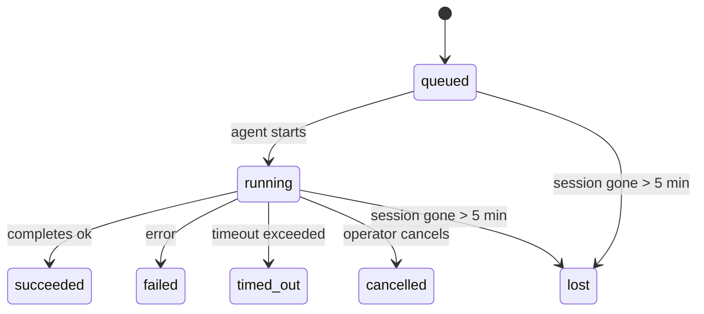

---
read_when:
    - Kiểm tra công việc nền đang diễn ra hoặc vừa hoàn tất
    - Gỡ lỗi sự cố gửi trong các lần chạy tác tử tách rời
    - Hiểu cách các lần chạy nền liên quan đến phiên, Cron và Heartbeat
sidebarTitle: Background tasks
summary: Theo dõi tác vụ nền cho các lượt chạy ACP, tác nhân con, công việc Cron tách biệt và thao tác CLI
title: Tác vụ nền
x-i18n:
    generated_at: "2026-05-05T01:44:27Z"
    model: gpt-5.5
    provider: openai
    source_hash: 60d6ea6178535b19b95d761b8e8b05a665234584ae69852fd21097988aa32991
    source_path: automation/tasks.md
    workflow: 16
---

<Note>
Bạn đang tìm phần lập lịch? Xem [Tự động hóa và tác vụ](/vi/automation) để chọn cơ chế phù hợp. Trang này là sổ cái hoạt động cho công việc nền, không phải bộ lập lịch.
</Note>

Tác vụ nền theo dõi công việc chạy **bên ngoài phiên trò chuyện chính của bạn**: các lượt chạy ACP, sinh tác nhân con, thực thi công việc Cron cô lập, và các thao tác do CLI khởi tạo.

Tác vụ **không** thay thế phiên, công việc Cron, hay Heartbeat — chúng là **sổ cái hoạt động** ghi lại công việc tách rời nào đã xảy ra, khi nào, và có thành công hay không.

<Note>
Không phải mọi lượt chạy tác nhân đều tạo tác vụ. Các lượt Heartbeat và trò chuyện tương tác thông thường thì không. Tất cả lượt thực thi Cron, lượt sinh ACP, lượt sinh tác nhân con, và lệnh tác nhân CLI đều có.
</Note>

## Tóm tắt

- Tác vụ là **bản ghi**, không phải bộ lập lịch — Cron và Heartbeat quyết định _khi nào_ công việc chạy, tác vụ theo dõi _điều đã xảy ra_.
- ACP, tác nhân con, tất cả công việc Cron, và thao tác CLI tạo tác vụ. Các lượt Heartbeat thì không.
- Mỗi tác vụ đi qua `queued → running → terminal` (succeeded, failed, timed_out, cancelled, hoặc lost).
- Tác vụ Cron vẫn hoạt động khi runtime Cron vẫn sở hữu công việc; nếu trạng thái runtime trong bộ nhớ đã mất, bảo trì tác vụ trước tiên kiểm tra lịch sử lượt chạy Cron bền vững trước khi đánh dấu một tác vụ là lost.
- Hoàn tất được thúc đẩy bằng cơ chế đẩy: công việc tách rời có thể thông báo trực tiếp hoặc đánh thức phiên/Heartbeat của bên yêu cầu khi hoàn tất, vì vậy các vòng lặp thăm dò trạng thái thường không phải hình dạng phù hợp.
- Lượt chạy Cron cô lập và các lần hoàn tất tác nhân con sẽ nỗ lực tối đa dọn dẹp các tab/quy trình trình duyệt được theo dõi cho phiên con của chúng trước bước ghi sổ dọn dẹp cuối cùng.
- Việc gửi Cron cô lập chặn các phản hồi cha tạm thời đã cũ trong khi công việc tác nhân con hậu duệ vẫn đang xả nốt, và ưu tiên đầu ra cuối cùng của hậu duệ khi đầu ra đó đến trước lúc gửi.
- Thông báo hoàn tất được gửi trực tiếp tới một kênh hoặc xếp hàng cho Heartbeat tiếp theo.
- `openclaw tasks list` hiển thị tất cả tác vụ; `openclaw tasks audit` đưa vấn đề lên bề mặt.
- Bản ghi terminal được giữ trong 7 ngày, rồi tự động được cắt tỉa.

## Bắt đầu nhanh

<Tabs>
  <Tab title="Liệt kê và lọc">
    ```bash
    # List all tasks (newest first)
    openclaw tasks list

    # Filter by runtime or status
    openclaw tasks list --runtime acp
    openclaw tasks list --status running
    ```

  </Tab>
  <Tab title="Kiểm tra">
    ```bash
    # Show details for a specific task (by ID, run ID, or session key)
    openclaw tasks show <lookup>
    ```
  </Tab>
  <Tab title="Hủy và thông báo">
    ```bash
    # Cancel a running task (kills the child session)
    openclaw tasks cancel <lookup>

    # Change notification policy for a task
    openclaw tasks notify <lookup> state_changes
    ```

  </Tab>
  <Tab title="Kiểm tra và bảo trì">
    ```bash
    # Run a health audit
    openclaw tasks audit

    # Preview or apply maintenance
    openclaw tasks maintenance
    openclaw tasks maintenance --apply
    ```

  </Tab>
  <Tab title="Luồng tác vụ">
    ```bash
    # Inspect TaskFlow state
    openclaw tasks flow list
    openclaw tasks flow show <lookup>
    openclaw tasks flow cancel <lookup>
    ```
  </Tab>
</Tabs>

## Điều gì tạo tác vụ

| Nguồn                  | Loại runtime | Khi bản ghi tác vụ được tạo                            | Chính sách thông báo mặc định |
| ---------------------- | ------------ | ------------------------------------------------------ | ----------------------------- |
| Lượt chạy nền ACP      | `acp`        | Sinh một phiên ACP con                                 | `done_only`                   |
| Điều phối tác nhân con | `subagent`   | Sinh một tác nhân con qua `sessions_spawn`             | `done_only`                   |
| Công việc Cron (mọi loại) | `cron`    | Mỗi lượt thực thi Cron (phiên chính và cô lập)         | `silent`                      |
| Thao tác CLI           | `cli`        | Lệnh `openclaw agent` chạy qua Gateway                 | `silent`                      |
| Công việc phương tiện của tác nhân | `cli` | Lượt chạy `music_generate`/`video_generate` dựa trên phiên | `silent`                 |

<AccordionGroup>
  <Accordion title="Mặc định thông báo cho Cron và phương tiện">
    Tác vụ Cron phiên chính dùng chính sách thông báo `silent` theo mặc định — chúng tạo bản ghi để theo dõi nhưng không tạo thông báo. Tác vụ Cron cô lập cũng mặc định là `silent` nhưng dễ thấy hơn vì chúng chạy trong phiên riêng.

    Lượt chạy `music_generate` và `video_generate` dựa trên phiên cũng dùng chính sách thông báo `silent`. Chúng vẫn tạo bản ghi tác vụ, nhưng việc hoàn tất được trả lại cho phiên tác nhân gốc dưới dạng đánh thức nội bộ để tác nhân có thể tự viết thông điệp tiếp theo và đính kèm phương tiện đã hoàn tất. Các lần hoàn tất nhóm/kênh tuân theo chính sách trả lời hiển thị thông thường, nên tác nhân dùng công cụ thông điệp khi việc gửi từ nguồn yêu cầu điều đó.

  </Accordion>
  <Accordion title="Lan can bảo vệ video_generate đồng thời">
    Khi một tác vụ `video_generate` dựa trên phiên vẫn đang hoạt động, công cụ cũng đóng vai trò như một lan can bảo vệ: các lệnh gọi `video_generate` lặp lại trong cùng phiên đó trả về trạng thái tác vụ đang hoạt động thay vì bắt đầu một lượt tạo đồng thời thứ hai. Dùng `action: "status"` khi bạn muốn tra cứu tiến độ/trạng thái rõ ràng từ phía tác nhân.
  </Accordion>
  <Accordion title="Điều gì không tạo tác vụ">
    - Các lượt Heartbeat — phiên chính; xem [Heartbeat](/vi/gateway/heartbeat)
    - Các lượt trò chuyện tương tác thông thường
    - Phản hồi `/command` trực tiếp

  </Accordion>
</AccordionGroup>

## Vòng đời tác vụ



| Trạng thái  | Ý nghĩa                                                                    |
| ----------- | -------------------------------------------------------------------------- |
| `queued`    | Đã tạo, đang chờ tác nhân bắt đầu                                          |
| `running`   | Lượt tác nhân đang chủ động thực thi                                       |
| `succeeded` | Đã hoàn tất thành công                                                     |
| `failed`    | Đã hoàn tất với lỗi                                                        |
| `timed_out` | Đã vượt quá thời gian chờ đã cấu hình                                      |
| `cancelled` | Bị toán tử dừng qua `openclaw tasks cancel`                                |
| `lost`      | Runtime mất trạng thái hậu thuẫn có thẩm quyền sau thời gian gia hạn 5 phút |

Chuyển tiếp diễn ra tự động — khi lượt chạy tác nhân liên quan kết thúc, trạng thái tác vụ được cập nhật để khớp.

Việc hoàn tất lượt chạy tác nhân là có thẩm quyền đối với các bản ghi tác vụ đang hoạt động. Một lượt chạy tách rời thành công kết thúc là `succeeded`, lỗi lượt chạy thông thường kết thúc là `failed`, và kết quả hết thời gian chờ hoặc hủy bỏ kết thúc là `timed_out`. Nếu toán tử đã hủy tác vụ, hoặc runtime đã ghi nhận một trạng thái terminal mạnh hơn như `failed`, `timed_out`, hoặc `lost`, tín hiệu thành công đến sau sẽ không hạ cấp trạng thái terminal đó.

`lost` nhận biết runtime:

- Tác vụ ACP: siêu dữ liệu phiên con ACP hậu thuẫn đã biến mất.
- Tác vụ tác nhân con: phiên con hậu thuẫn đã biến mất khỏi kho tác nhân đích.
- Tác vụ Cron: runtime Cron không còn theo dõi công việc là đang hoạt động và lịch sử lượt chạy Cron bền vững không hiển thị kết quả terminal cho lượt chạy đó. Kiểm tra CLI ngoại tuyến không coi trạng thái runtime Cron trong tiến trình rỗng của chính nó là có thẩm quyền.
- Tác vụ CLI: tác vụ phiên con cô lập dùng phiên con; tác vụ CLI dựa trên trò chuyện dùng ngữ cảnh lượt chạy trực tiếp thay vào đó, nên các hàng phiên kênh/nhóm/trực tiếp còn tồn đọng không giữ chúng sống. Lượt chạy `openclaw agent` dựa trên Gateway cũng kết thúc từ kết quả lượt chạy của chúng, nên các lượt chạy đã hoàn tất không nằm ở trạng thái hoạt động cho đến khi bộ quét đánh dấu chúng là `lost`.

## Gửi và thông báo

Khi một tác vụ đạt trạng thái terminal, OpenClaw thông báo cho bạn. Có hai đường gửi:

**Gửi trực tiếp** — nếu tác vụ có đích kênh (`requesterOrigin`), thông điệp hoàn tất đi thẳng tới kênh đó (Telegram, Discord, Slack, v.v.). Với các lần hoàn tất tác nhân con, OpenClaw cũng bảo toàn định tuyến luồng/chủ đề đã liên kết khi có sẵn và có thể điền `to` / tài khoản bị thiếu từ tuyến đã lưu của phiên bên yêu cầu (`lastChannel` / `lastTo` / `lastAccountId`) trước khi từ bỏ gửi trực tiếp.

**Gửi xếp hàng theo phiên** — nếu gửi trực tiếp thất bại hoặc không đặt origin, cập nhật được xếp hàng như một sự kiện hệ thống trong phiên của bên yêu cầu và xuất hiện trong Heartbeat tiếp theo.

<Tip>
Hoàn tất tác vụ kích hoạt đánh thức Heartbeat ngay lập tức để bạn thấy kết quả nhanh chóng — bạn không phải chờ nhịp Heartbeat đã lập lịch tiếp theo.
</Tip>

Điều đó có nghĩa quy trình thông thường dựa trên cơ chế đẩy: khởi động công việc tách rời một lần, rồi để runtime đánh thức hoặc thông báo cho bạn khi hoàn tất. Chỉ thăm dò trạng thái tác vụ khi bạn cần gỡ lỗi, can thiệp, hoặc kiểm tra rõ ràng.

### Chính sách thông báo

Kiểm soát mức độ bạn nghe về từng tác vụ:

| Chính sách            | Nội dung được gửi                                                       |
| --------------------- | ----------------------------------------------------------------------- |
| `done_only` (mặc định) | Chỉ trạng thái terminal (succeeded, failed, v.v.) — **đây là mặc định** |
| `state_changes`       | Mọi chuyển tiếp trạng thái và cập nhật tiến độ                          |
| `silent`              | Hoàn toàn không có gì                                                   |

Thay đổi chính sách trong khi một tác vụ đang chạy:

```bash
openclaw tasks notify <lookup> state_changes
```

## Tham chiếu CLI

<AccordionGroup>
  <Accordion title="tasks list">
    ```bash
    openclaw tasks list [--runtime <acp|subagent|cron|cli>] [--status <status>] [--json]
    ```

    Cột đầu ra: ID tác vụ, Loại, Trạng thái, Gửi, ID lượt chạy, Phiên con, Tóm tắt.

  </Accordion>
  <Accordion title="tasks show">
    ```bash
    openclaw tasks show <lookup>
    ```

    Mã tra cứu chấp nhận ID tác vụ, ID lượt chạy, hoặc khóa phiên. Hiển thị bản ghi đầy đủ bao gồm thời gian, trạng thái gửi, lỗi, và tóm tắt terminal.

  </Accordion>
  <Accordion title="tasks cancel">
    ```bash
    openclaw tasks cancel <lookup>
    ```

    Với tác vụ ACP và tác nhân con, lệnh này giết phiên con. Với tác vụ do CLI theo dõi, việc hủy được ghi trong sổ đăng ký tác vụ (không có handle runtime con riêng). Trạng thái chuyển sang `cancelled` và thông báo gửi đi được gửi khi áp dụng.

  </Accordion>
  <Accordion title="tasks notify">
    ```bash
    openclaw tasks notify <lookup> <done_only|state_changes|silent>
    ```
  </Accordion>
  <Accordion title="tasks audit">
    ```bash
    openclaw tasks audit [--json]
    ```

    Đưa các vấn đề vận hành lên bề mặt. Phát hiện cũng xuất hiện trong `openclaw status` khi phát hiện vấn đề.

    | Phát hiện                | Mức độ nghiêm trọng | Điều kiện kích hoạt                                                                                         |
    | ------------------------- | ---------- | ------------------------------------------------------------------------------------------------------------ |
    | `stale_queued`            | warn       | Đã xếp hàng hơn 10 phút                                                                                     |
    | `stale_running`           | error      | Đang chạy hơn 30 phút                                                                                       |
    | `lost`                    | warn/error | Quyền sở hữu tác vụ dựa trên môi trường chạy đã biến mất; các tác vụ bị mất được giữ lại sẽ cảnh báo cho đến `cleanupAfter`, rồi trở thành lỗi |
    | `delivery_failed`         | warn       | Gửi thất bại và chính sách thông báo không phải là `silent`                                                  |
    | `missing_cleanup`         | warn       | Tác vụ ở trạng thái kết thúc không có dấu thời gian dọn dẹp                                                 |
    | `inconsistent_timestamps` | warn       | Vi phạm dòng thời gian (ví dụ kết thúc trước khi bắt đầu)                                                   |

  </Accordion>
  <Accordion title="tasks maintenance">
    ```bash
    openclaw tasks maintenance [--json]
    openclaw tasks maintenance --apply [--json]
    ```

    Sử dụng lệnh này để xem trước hoặc áp dụng đối soát, gán mốc dọn dẹp và xóa tỉa cho tác vụ và trạng thái Luồng tác vụ.

    Quá trình đối soát có nhận thức về môi trường chạy:

    - Các tác vụ ACP/tác nhân con kiểm tra phiên con hỗ trợ chúng.
    - Các tác vụ tác nhân con có phiên con chứa bản ghi đánh dấu khôi phục sau khởi động lại sẽ được đánh dấu là bị mất thay vì được xem là phiên hỗ trợ có thể khôi phục.
    - Các tác vụ Cron kiểm tra xem môi trường chạy cron còn sở hữu công việc hay không, sau đó khôi phục trạng thái kết thúc từ nhật ký lượt chạy cron/trạng thái công việc đã lưu bền vững trước khi dùng dự phòng `lost`. Chỉ tiến trình Gateway mới có thẩm quyền đối với tập hợp công việc cron đang hoạt động trong bộ nhớ; kiểm tra CLI ngoại tuyến sử dụng lịch sử bền vững nhưng không đánh dấu một tác vụ cron là bị mất chỉ vì tập hợp cục bộ đó trống.
    - Các tác vụ CLI dựa trên trò chuyện kiểm tra ngữ cảnh lượt chạy đang hoạt động sở hữu, không chỉ hàng phiên trò chuyện.

    Dọn dẹp khi hoàn tất cũng có nhận thức về môi trường chạy:

    - Khi tác nhân con hoàn tất, hệ thống cố gắng đóng các tab trình duyệt/quy trình được theo dõi cho phiên con trước khi tiếp tục dọn dẹp phần thông báo.
    - Khi cron biệt lập hoàn tất, hệ thống cố gắng đóng các tab trình duyệt/quy trình được theo dõi cho phiên cron trước khi lượt chạy được tháo dỡ hoàn toàn.
    - Việc gửi kết quả cron biệt lập đợi phần tiếp nối từ tác nhân con hậu duệ khi cần và chặn văn bản xác nhận lỗi thời của tác vụ cha thay vì thông báo nó.
    - Việc gửi kết quả hoàn tất của tác nhân con ưu tiên văn bản trợ lý hiển thị mới nhất; nếu văn bản đó trống, nó dùng dự phòng văn bản tool/toolResult mới nhất đã được làm sạch, và các lượt chạy gọi công cụ chỉ hết thời gian chờ có thể được rút gọn thành một tóm tắt tiến độ một phần ngắn. Các lượt chạy thất bại ở trạng thái kết thúc thông báo trạng thái thất bại mà không phát lại văn bản trả lời đã thu nhận.
    - Lỗi dọn dẹp không che khuất kết quả thật của tác vụ.

  </Accordion>
  <Accordion title="tasks flow list | show | cancel">
    ```bash
    openclaw tasks flow list [--status <status>] [--json]
    openclaw tasks flow show <lookup> [--json]
    openclaw tasks flow cancel <lookup>
    ```

    Sử dụng các lệnh này khi bạn quan tâm đến Luồng tác vụ điều phối, thay vì một bản ghi tác vụ nền riêng lẻ.

  </Accordion>
</AccordionGroup>

## Bảng tác vụ trò chuyện (`/tasks`)

Sử dụng `/tasks` trong bất kỳ phiên trò chuyện nào để xem các tác vụ nền được liên kết với phiên đó. Bảng hiển thị các tác vụ đang hoạt động và mới hoàn tất gần đây cùng với môi trường chạy, trạng thái, thời gian và chi tiết tiến độ hoặc lỗi.

Khi phiên hiện tại không có tác vụ liên kết nào hiển thị, `/tasks` dùng dự phòng số lượng tác vụ cục bộ của tác nhân, để bạn vẫn có cái nhìn tổng quan mà không làm lộ chi tiết của phiên khác.

Để xem sổ ghi vận hành đầy đủ, hãy dùng CLI: `openclaw tasks list`.

## Tích hợp trạng thái (tải tác vụ)

`openclaw status` bao gồm tóm tắt nhanh về tác vụ:

```
Tasks: 3 queued · 2 running · 1 issues
```

Tóm tắt báo cáo:

- **active** — số lượng `queued` + `running`
- **failures** — số lượng `failed` + `timed_out` + `lost`
- **byRuntime** — phân tách theo `acp`, `subagent`, `cron`, `cli`

Cả `/status` và công cụ `session_status` đều sử dụng bản chụp tác vụ có nhận thức về dọn dẹp: ưu tiên các tác vụ đang hoạt động, ẩn các hàng đã hoàn tất nhưng lỗi thời, và chỉ hiển thị lỗi gần đây khi không còn công việc đang hoạt động. Điều này giữ cho thẻ trạng thái tập trung vào những gì quan trọng ngay lúc này.

## Lưu trữ và bảo trì

### Nơi lưu tác vụ

Bản ghi tác vụ được lưu bền vững trong SQLite tại:

```
$OPENCLAW_STATE_DIR/tasks/runs.sqlite
```

Sổ đăng ký được nạp vào bộ nhớ khi Gateway khởi động và đồng bộ các lần ghi vào SQLite để đảm bảo độ bền qua các lần khởi động lại.
Gateway giữ nhật ký ghi trước của SQLite trong giới hạn bằng cách dùng ngưỡng tự tạo điểm kiểm tra mặc định của SQLite cùng với các điểm kiểm tra `TRUNCATE` định kỳ và khi tắt.

### Bảo trì tự động

Một trình quét dọn chạy mỗi **60 giây** và xử lý bốn việc:

<Steps>
  <Step title="Đối soát">
    Kiểm tra xem các tác vụ đang hoạt động còn có phần hỗ trợ có thẩm quyền từ môi trường chạy hay không. Tác vụ ACP/tác nhân con dùng trạng thái phiên con, tác vụ cron dùng quyền sở hữu công việc đang hoạt động, và tác vụ CLI dựa trên trò chuyện dùng ngữ cảnh lượt chạy sở hữu. Nếu trạng thái hỗ trợ đó biến mất hơn 5 phút, tác vụ được đánh dấu `lost`.
  </Step>
  <Step title="Sửa chữa phiên ACP">
    Đóng các phiên ACP một lần do phiên cha sở hữu đã kết thúc hoặc mồ côi, và chỉ đóng các phiên ACP bền bỉ đã kết thúc nhưng lỗi thời hoặc mồ côi khi không còn liên kết hội thoại đang hoạt động.
  </Step>
  <Step title="Gán mốc dọn dẹp">
    Đặt dấu thời gian `cleanupAfter` trên các tác vụ ở trạng thái kết thúc (endedAt + 7 ngày). Trong thời gian lưu giữ, tác vụ bị mất vẫn xuất hiện trong kiểm tra dưới dạng cảnh báo; sau khi `cleanupAfter` hết hạn hoặc khi thiếu siêu dữ liệu dọn dẹp, chúng là lỗi.
  </Step>
  <Step title="Xóa tỉa">
    Xóa các bản ghi đã qua ngày `cleanupAfter`.
  </Step>
</Steps>

<Note>
**Lưu giữ:** bản ghi tác vụ ở trạng thái kết thúc được giữ trong **7 ngày**, rồi tự động bị xóa tỉa. Không cần cấu hình.
</Note>

## Tác vụ liên quan đến các hệ thống khác như thế nào

<AccordionGroup>
  <Accordion title="Tác vụ và Luồng tác vụ">
    [Luồng tác vụ](/vi/automation/taskflow) là lớp điều phối luồng nằm bên trên các tác vụ nền. Một luồng đơn lẻ có thể điều phối nhiều tác vụ trong suốt vòng đời của nó bằng các chế độ đồng bộ được quản lý hoặc phản chiếu. Dùng `openclaw tasks` để kiểm tra các bản ghi tác vụ riêng lẻ và `openclaw tasks flow` để kiểm tra luồng điều phối.

    Xem [Luồng tác vụ](/vi/automation/taskflow) để biết chi tiết.

  </Accordion>
  <Accordion title="Tác vụ và cron">
    Một **định nghĩa** công việc cron nằm trong `~/.openclaw/cron/jobs.json`; trạng thái thực thi trong môi trường chạy nằm bên cạnh nó trong `~/.openclaw/cron/jobs-state.json`. **Mỗi** lần thực thi cron đều tạo một bản ghi tác vụ — cả phiên chính và biệt lập. Các tác vụ cron trong phiên chính mặc định dùng chính sách thông báo `silent` để chúng được theo dõi mà không tạo thông báo.

    Xem [Công việc Cron](/vi/automation/cron-jobs).

  </Accordion>
  <Accordion title="Tác vụ và Heartbeat">
    Các lượt chạy Heartbeat là lượt trong phiên chính — chúng không tạo bản ghi tác vụ. Khi một tác vụ hoàn tất, nó có thể kích hoạt đánh thức Heartbeat để bạn thấy kết quả kịp thời.

    Xem [Heartbeat](/vi/gateway/heartbeat).

  </Accordion>
  <Accordion title="Tác vụ và phiên">
    Một tác vụ có thể tham chiếu `childSessionKey` (nơi công việc chạy) và `requesterSessionKey` (người đã bắt đầu nó). Phiên là ngữ cảnh hội thoại; tác vụ là lớp theo dõi hoạt động bên trên đó.
  </Accordion>
  <Accordion title="Tác vụ và lượt chạy tác nhân">
    `runId` của tác vụ liên kết đến lượt chạy tác nhân đang thực hiện công việc. Các sự kiện vòng đời tác nhân (bắt đầu, kết thúc, lỗi) tự động cập nhật trạng thái tác vụ — bạn không cần quản lý vòng đời thủ công.
  </Accordion>
</AccordionGroup>

## Liên quan

- [Tự động hóa & Tác vụ](/vi/automation) — tất cả cơ chế tự động hóa trong một cái nhìn tổng quan
- [CLI: Tác vụ](/vi/cli/tasks) — tài liệu tham khảo lệnh CLI
- [Heartbeat](/vi/gateway/heartbeat) — các lượt định kỳ trong phiên chính
- [Tác vụ theo lịch](/vi/automation/cron-jobs) — lên lịch công việc nền
- [Luồng tác vụ](/vi/automation/taskflow) — điều phối luồng bên trên tác vụ
