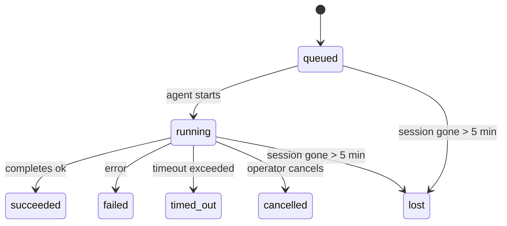

---
read_when:
    - Kiểm tra công việc chạy nền đang diễn ra hoặc vừa hoàn tất
    - Gỡ lỗi sự cố gửi cho các lần chạy tác tử tách rời
    - Tìm hiểu mối liên hệ giữa các lần chạy nền với phiên, Cron và Heartbeat
sidebarTitle: Background tasks
summary: Theo dõi tác vụ nền cho các lần chạy ACP, tác nhân con, công việc Cron cô lập và các thao tác CLI
title: Tác vụ nền
x-i18n:
    generated_at: "2026-05-06T09:02:25Z"
    model: gpt-5.5
    provider: openai
    source_hash: 055e16b4f53dbd089cc72eea7fe80bdaee5451dc56fa6e88a742f98e566bb57a
    source_path: automation/tasks.md
    workflow: 16
---

<Note>
Bạn đang tìm tính năng lập lịch? Xem [Tự động hóa và tác vụ](/vi/automation) để chọn cơ chế phù hợp. Trang này là sổ cái hoạt động cho công việc nền, không phải bộ lập lịch.
</Note>

Tác vụ nền theo dõi công việc chạy **bên ngoài phiên hội thoại chính của bạn**: các lượt chạy ACP, việc sinh tác tử con, các lần thực thi cron job cô lập, và các thao tác do CLI khởi tạo.

Tác vụ **không** thay thế phiên, cron job, hay heartbeat - chúng là **sổ cái hoạt động** ghi lại công việc tách rời nào đã diễn ra, khi nào, và có thành công hay không.

<Note>
Không phải mọi lượt chạy tác tử đều tạo tác vụ. Các lượt Heartbeat và trò chuyện tương tác thông thường thì không. Tất cả các lần thực thi cron, lần sinh ACP, lần sinh tác tử con, và lệnh tác tử CLI đều có.
</Note>

## Tóm tắt nhanh

- Tác vụ là **bản ghi**, không phải bộ lập lịch - cron và heartbeat quyết định _khi nào_ công việc chạy, tác vụ theo dõi _điều gì đã xảy ra_.
- ACP, tác tử con, tất cả cron job, và thao tác CLI tạo tác vụ. Các lượt Heartbeat thì không.
- Mỗi tác vụ đi qua `queued → running → terminal` (succeeded, failed, timed_out, cancelled, hoặc lost).
- Tác vụ Cron vẫn hoạt động khi runtime cron vẫn sở hữu công việc; nếu trạng thái runtime trong bộ nhớ không còn, bảo trì tác vụ trước tiên kiểm tra lịch sử chạy cron bền vững trước khi đánh dấu tác vụ là mất.
- Hoàn tất được điều khiển bằng đẩy: công việc tách rời có thể thông báo trực tiếp hoặc đánh thức phiên/heartbeat của bên yêu cầu khi hoàn tất, vì vậy các vòng lặp thăm dò trạng thái thường không phải là hình dạng phù hợp.
- Các lượt chạy cron cô lập và lần hoàn tất của tác tử con cố gắng tối đa để dọn dẹp các tab/quy trình trình duyệt được theo dõi cho phiên con của chúng trước khi ghi sổ dọn dẹp cuối cùng.
- Việc phân phối cron cô lập chặn các phản hồi cha tạm thời đã cũ trong khi công việc tác tử con hậu duệ vẫn đang xả, và ưu tiên đầu ra hậu duệ cuối cùng khi đầu ra đó đến trước lúc phân phối.
- Thông báo hoàn tất được gửi trực tiếp đến một kênh hoặc xếp hàng cho heartbeat tiếp theo.
- `openclaw tasks list` hiển thị tất cả tác vụ; `openclaw tasks audit` nêu ra vấn đề.
- Bản ghi cuối được giữ trong 7 ngày, rồi tự động cắt tỉa.

## Bắt đầu nhanh

<Tabs>
  <Tab title="Liệt kê và lọc">
    ```bash
    # List all tasks (newest first)
    openclaw tasks list

    # Filter by runtime or status
    openclaw tasks list --runtime acp
    openclaw tasks list --status running
    ```

  </Tab>
  <Tab title="Kiểm tra">
    ```bash
    # Show details for a specific task (by ID, run ID, or session key)
    openclaw tasks show <lookup>
    ```
  </Tab>
  <Tab title="Hủy và thông báo">
    ```bash
    # Cancel a running task (kills the child session)
    openclaw tasks cancel <lookup>

    # Change notification policy for a task
    openclaw tasks notify <lookup> state_changes
    ```

  </Tab>
  <Tab title="Kiểm tra và bảo trì">
    ```bash
    # Run a health audit
    openclaw tasks audit

    # Preview or apply maintenance
    openclaw tasks maintenance
    openclaw tasks maintenance --apply
    ```

  </Tab>
  <Tab title="Luồng tác vụ">
    ```bash
    # Inspect TaskFlow state
    openclaw tasks flow list
    openclaw tasks flow show <lookup>
    openclaw tasks flow cancel <lookup>
    ```
  </Tab>
</Tabs>

## Điều gì tạo ra tác vụ

| Nguồn                  | Kiểu runtime | Khi nào bản ghi tác vụ được tạo                         | Chính sách thông báo mặc định |
| ---------------------- | ------------ | ------------------------------------------------------- | ----------------------------- |
| Lượt chạy nền ACP      | `acp`        | Sinh một phiên ACP con                                  | `done_only`                   |
| Điều phối tác tử con   | `subagent`   | Sinh một tác tử con qua `sessions_spawn`                | `done_only`                   |
| Cron job (mọi loại)    | `cron`       | Mỗi lần thực thi cron (phiên chính và cô lập)           | `silent`                      |
| Thao tác CLI           | `cli`        | Các lệnh `openclaw agent` chạy qua gateway              | `silent`                      |
| Công việc media tác tử | `cli`        | Các lượt chạy `music_generate`/`video_generate` có phiên hậu thuẫn | `silent`              |

<AccordionGroup>
  <Accordion title="Mặc định thông báo cho cron và media">
    Tác vụ cron phiên chính dùng chính sách thông báo `silent` theo mặc định - chúng tạo bản ghi để theo dõi nhưng không tạo thông báo. Tác vụ cron cô lập cũng mặc định là `silent` nhưng dễ thấy hơn vì chúng chạy trong phiên riêng.

    Các lượt chạy `music_generate` và `video_generate` có phiên hậu thuẫn cũng dùng chính sách thông báo `silent`. Chúng vẫn tạo bản ghi tác vụ, nhưng việc hoàn tất được trả về phiên tác tử gốc dưới dạng đánh thức nội bộ để tác tử có thể tự viết tin nhắn tiếp theo và đính kèm media đã hoàn tất. Hoàn tất trong nhóm/kênh tuân theo chính sách phản hồi hiển thị thông thường, nên tác tử dùng công cụ tin nhắn khi phân phối nguồn yêu cầu. Nếu tác tử hoàn tất không tạo được bằng chứng phân phối bằng công cụ tin nhắn trong tuyến chỉ dùng công cụ, OpenClaw gửi dự phòng hoàn tất trực tiếp đến kênh gốc thay vì để media ở trạng thái riêng tư.

  </Accordion>
  <Accordion title="Rào chắn video_generate đồng thời">
    Khi một tác vụ `video_generate` có phiên hậu thuẫn vẫn đang hoạt động, công cụ cũng đóng vai trò rào chắn: các lệnh gọi `video_generate` lặp lại trong cùng phiên đó sẽ trả về trạng thái tác vụ đang hoạt động thay vì bắt đầu một lần tạo đồng thời thứ hai. Dùng `action: "status"` khi bạn muốn tra cứu tiến độ/trạng thái rõ ràng từ phía tác tử.
  </Accordion>
  <Accordion title="Những gì không tạo tác vụ">
    - Các lượt Heartbeat - phiên chính; xem [Heartbeat](/vi/gateway/heartbeat)
    - Các lượt trò chuyện tương tác thông thường
    - Phản hồi `/command` trực tiếp

  </Accordion>
</AccordionGroup>

## Vòng đời tác vụ



| Trạng thái  | Ý nghĩa                                                                    |
| ----------- | -------------------------------------------------------------------------- |
| `queued`    | Đã tạo, đang chờ tác tử bắt đầu                                            |
| `running`   | Lượt tác tử đang thực thi tích cực                                         |
| `succeeded` | Hoàn tất thành công                                                        |
| `failed`    | Hoàn tất với lỗi                                                           |
| `timed_out` | Vượt quá thời gian chờ đã cấu hình                                         |
| `cancelled` | Bị người vận hành dừng qua `openclaw tasks cancel`                         |
| `lost`      | Runtime mất trạng thái hậu thuẫn có thẩm quyền sau thời gian gia hạn 5 phút |

Chuyển trạng thái diễn ra tự động - khi lượt chạy tác tử liên quan kết thúc, trạng thái tác vụ cập nhật cho khớp.

Việc hoàn tất lượt chạy tác tử là nguồn có thẩm quyền cho các bản ghi tác vụ đang hoạt động. Một lượt chạy tách rời thành công sẽ kết thúc là `succeeded`, lỗi chạy thông thường kết thúc là `failed`, và kết quả hết thời gian chờ hoặc hủy bỏ kết thúc là `timed_out`. Nếu người vận hành đã hủy tác vụ, hoặc runtime đã ghi một trạng thái cuối mạnh hơn như `failed`, `timed_out`, hoặc `lost`, tín hiệu thành công đến sau sẽ không hạ cấp trạng thái cuối đó.

`lost` hiểu theo runtime:

- Tác vụ ACP: siêu dữ liệu phiên ACP con hậu thuẫn đã biến mất.
- Tác vụ tác tử con: phiên con hậu thuẫn đã biến mất khỏi kho tác tử đích.
- Tác vụ Cron: runtime cron không còn theo dõi công việc là đang hoạt động và lịch sử chạy cron bền vững không cho thấy kết quả cuối cho lượt chạy đó. Kiểm tra CLI ngoại tuyến không coi trạng thái runtime cron rỗng trong tiến trình của chính nó là có thẩm quyền.
- Tác vụ CLI: tác vụ phiên con cô lập dùng phiên con; tác vụ CLI có trò chuyện hậu thuẫn dùng ngữ cảnh chạy trực tiếp thay vào đó, nên các hàng phiên kênh/nhóm/trực tiếp còn sót lại không giữ chúng sống. Các lượt chạy `openclaw agent` có Gateway hậu thuẫn cũng kết thúc từ kết quả chạy của chúng, nên các lượt chạy đã hoàn tất không nằm ở trạng thái hoạt động cho đến khi trình quét đánh dấu chúng là `lost`.

## Phân phối và thông báo

Khi một tác vụ đạt trạng thái cuối, OpenClaw thông báo cho bạn. Có hai đường phân phối:

**Phân phối trực tiếp** - nếu tác vụ có đích kênh (`requesterOrigin`), tin nhắn hoàn tất đi thẳng đến kênh đó (Telegram, Discord, Slack, v.v.). Đối với hoàn tất của tác tử con, OpenClaw cũng giữ định tuyến luồng/chủ đề đã ràng buộc khi có sẵn và có thể điền `to` / tài khoản bị thiếu từ tuyến đã lưu của phiên yêu cầu (`lastChannel` / `lastTo` / `lastAccountId`) trước khi từ bỏ phân phối trực tiếp.

**Phân phối xếp hàng theo phiên** - nếu phân phối trực tiếp thất bại hoặc không đặt nguồn gốc, bản cập nhật được xếp hàng như một sự kiện hệ thống trong phiên của bên yêu cầu và xuất hiện ở heartbeat tiếp theo.

<Tip>
Việc hoàn tất tác vụ kích hoạt đánh thức heartbeat ngay lập tức để bạn thấy kết quả nhanh chóng - bạn không phải chờ nhịp heartbeat đã lập lịch tiếp theo.
</Tip>

Điều đó nghĩa là quy trình làm việc thông thường dựa trên đẩy: bắt đầu công việc tách rời một lần, rồi để runtime đánh thức hoặc thông báo cho bạn khi hoàn tất. Chỉ thăm dò trạng thái tác vụ khi bạn cần gỡ lỗi, can thiệp, hoặc kiểm tra rõ ràng.

### Chính sách thông báo

Kiểm soát mức độ bạn nghe về từng tác vụ:

| Chính sách            | Nội dung được phân phối                                                |
| --------------------- | ---------------------------------------------------------------------- |
| `done_only` (mặc định) | Chỉ trạng thái cuối (succeeded, failed, v.v.) - **đây là mặc định**    |
| `state_changes`       | Mọi chuyển đổi trạng thái và cập nhật tiến độ                          |
| `silent`              | Không có gì cả                                                         |

Thay đổi chính sách trong khi tác vụ đang chạy:

```bash
openclaw tasks notify <lookup> state_changes
```

## Tham chiếu CLI

<AccordionGroup>
  <Accordion title="tasks list">
    ```bash
    openclaw tasks list [--runtime <acp|subagent|cron|cli>] [--status <status>] [--json]
    ```

    Các cột đầu ra: ID tác vụ, Loại, Trạng thái, Phân phối, ID lượt chạy, Phiên con, Tóm tắt.

  </Accordion>
  <Accordion title="tasks show">
    ```bash
    openclaw tasks show <lookup>
    ```

    Mã tra cứu chấp nhận ID tác vụ, ID lượt chạy, hoặc khóa phiên. Hiển thị bản ghi đầy đủ bao gồm thời gian, trạng thái phân phối, lỗi, và tóm tắt cuối.

  </Accordion>
  <Accordion title="tasks cancel">
    ```bash
    openclaw tasks cancel <lookup>
    ```

    Đối với tác vụ ACP và tác tử con, thao tác này giết phiên con. Đối với tác vụ được CLI theo dõi, việc hủy được ghi vào registry tác vụ (không có handle runtime con riêng). Trạng thái chuyển sang `cancelled` và thông báo phân phối được gửi khi áp dụng.

  </Accordion>
  <Accordion title="tasks notify">
    ```bash
    openclaw tasks notify <lookup> <done_only|state_changes|silent>
    ```
  </Accordion>
  <Accordion title="tasks audit">
    ```bash
    openclaw tasks audit [--json]
    ```

    Nêu ra các vấn đề vận hành. Các phát hiện cũng xuất hiện trong `openclaw status` khi phát hiện vấn đề.

    | Phát hiện                 | Mức độ     | Kích hoạt                                                                                                                      |
    | ------------------------- | ---------- | ------------------------------------------------------------------------------------------------------------------------------ |
    | `stale_queued`            | warn       | Đã xếp hàng hơn 10 phút                                                                                                        |
    | `stale_running`           | error      | Đang chạy hơn 30 phút                                                                                                          |
    | `lost`                    | warn/error | Quyền sở hữu tác vụ được runtime hỗ trợ đã biến mất; các tác vụ bị mất được giữ lại sẽ cảnh báo cho đến `cleanupAfter`, rồi trở thành lỗi |
    | `delivery_failed`         | warn       | Gửi thất bại và chính sách thông báo không phải là `silent`                                                                     |
    | `missing_cleanup`         | warn       | Tác vụ kết thúc nhưng không có dấu thời gian dọn dẹp                                                                            |
    | `inconsistent_timestamps` | warn       | Vi phạm dòng thời gian (ví dụ kết thúc trước khi bắt đầu)                                                                       |

  </Accordion>
  <Accordion title="bảo trì tác vụ">
    ```bash
    openclaw tasks maintenance [--json]
    openclaw tasks maintenance --apply [--json]
    ```

    Dùng lệnh này để xem trước hoặc áp dụng việc hòa giải, đóng dấu dọn dẹp và cắt tỉa cho tác vụ và trạng thái Task Flow.

    Việc hòa giải có nhận biết runtime:

    - Các tác vụ ACP/subagent kiểm tra phiên con hỗ trợ của chúng.
    - Các tác vụ subagent có phiên con mang bia mộ khôi phục sau khởi động lại được đánh dấu là mất thay vì được xem là phiên hỗ trợ có thể khôi phục.
    - Các tác vụ Cron kiểm tra xem runtime cron còn sở hữu công việc hay không, rồi khôi phục trạng thái kết thúc từ nhật ký lần chạy cron/trạng thái công việc đã lưu trước khi quay lại `lost`. Chỉ tiến trình Gateway là nguồn có thẩm quyền cho tập công việc cron đang hoạt động trong bộ nhớ; kiểm tra CLI ngoại tuyến dùng lịch sử bền vững nhưng không đánh dấu tác vụ cron là mất chỉ vì Set cục bộ đó trống.
    - Các tác vụ CLI dựa trên chat kiểm tra ngữ cảnh lần chạy trực tiếp sở hữu, không chỉ hàng phiên chat.

    Việc dọn dẹp khi hoàn tất cũng có nhận biết runtime:

    - Khi subagent hoàn tất, hệ thống cố gắng hết mức đóng các tab trình duyệt/tiến trình được theo dõi cho phiên con trước khi tiếp tục dọn dẹp thông báo.
    - Khi cron cô lập hoàn tất, hệ thống cố gắng hết mức đóng các tab trình duyệt/tiến trình được theo dõi cho phiên cron trước khi lần chạy được tháo dỡ hoàn toàn.
    - Việc gửi cron cô lập chờ theo dõi tiếp nối của subagent hậu duệ khi cần và chặn văn bản xác nhận cha đã cũ thay vì thông báo nó.
    - Việc gửi hoàn tất subagent ưu tiên văn bản trợ lý hiển thị mới nhất; nếu trống, nó quay lại văn bản tool/toolResult mới nhất đã được làm sạch, và các lần chạy chỉ hết thời gian ở lệnh gọi công cụ có thể thu gọn thành một bản tóm tắt tiến độ một phần ngắn. Các lần chạy thất bại ở trạng thái kết thúc thông báo trạng thái thất bại mà không phát lại văn bản phản hồi đã ghi lại.
    - Lỗi dọn dẹp không che khuất kết quả tác vụ thực sự.

  </Accordion>
  <Accordion title="tasks flow list | show | cancel">
    ```bash
    openclaw tasks flow list [--status <status>] [--json]
    openclaw tasks flow show <lookup> [--json]
    openclaw tasks flow cancel <lookup>
    ```

    Dùng các lệnh này khi Task Flow điều phối là thứ bạn quan tâm thay vì một bản ghi tác vụ nền riêng lẻ.

  </Accordion>
</AccordionGroup>

## Bảng tác vụ chat (`/tasks`)

Dùng `/tasks` trong bất kỳ phiên chat nào để xem các tác vụ nền được liên kết với phiên đó. Bảng hiển thị các tác vụ đang hoạt động và mới hoàn tất gần đây cùng runtime, trạng thái, thời gian, và chi tiết tiến độ hoặc lỗi.

Khi phiên hiện tại không có tác vụ liên kết hiển thị nào, `/tasks` sẽ quay lại số lượng tác vụ cục bộ của agent để bạn vẫn có được tổng quan mà không rò rỉ chi tiết của phiên khác.

Để xem sổ cái đầy đủ cho người vận hành, dùng CLI: `openclaw tasks list`.

## Tích hợp trạng thái (áp lực tác vụ)

`openclaw status` bao gồm bản tóm tắt tác vụ nhanh:

```
Tasks: 3 queued · 2 running · 1 issues
```

Bản tóm tắt báo cáo:

- **active** - số lượng `queued` + `running`
- **failures** - số lượng `failed` + `timed_out` + `lost`
- **byRuntime** - phân rã theo `acp`, `subagent`, `cron`, `cli`

Cả `/status` và công cụ `session_status` đều dùng ảnh chụp tác vụ có nhận biết dọn dẹp: ưu tiên các tác vụ đang hoạt động, ẩn các hàng đã hoàn tất cũ, và chỉ hiển thị lỗi gần đây khi không còn công việc đang hoạt động. Điều này giữ thẻ trạng thái tập trung vào những gì quan trọng ngay lúc này.

## Lưu trữ và bảo trì

### Nơi lưu tác vụ

Các bản ghi tác vụ được lưu bền vững trong SQLite tại:

```
$OPENCLAW_STATE_DIR/tasks/runs.sqlite
```

Registry tải vào bộ nhớ khi gateway khởi động và đồng bộ các lần ghi vào SQLite để đảm bảo độ bền qua các lần khởi động lại.
Gateway giữ nhật ký ghi trước của SQLite ở mức giới hạn bằng cách dùng ngưỡng
autocheckpoint mặc định của SQLite cùng các checkpoint `TRUNCATE` định kỳ và khi tắt.

### Bảo trì tự động

Một sweeper chạy mỗi **60 giây** và xử lý bốn việc:

<Steps>
  <Step title="Hòa giải">
    Kiểm tra xem các tác vụ đang hoạt động còn có phần hỗ trợ runtime có thẩm quyền hay không. Các tác vụ ACP/subagent dùng trạng thái phiên con, tác vụ cron dùng quyền sở hữu công việc đang hoạt động, và tác vụ CLI dựa trên chat dùng ngữ cảnh lần chạy sở hữu. Nếu trạng thái hỗ trợ đó biến mất hơn 5 phút, tác vụ được đánh dấu là `lost`.
  </Step>
  <Step title="Sửa chữa phiên ACP">
    Đóng các phiên ACP một lần do cha sở hữu đã kết thúc hoặc mồ côi, và chỉ đóng các phiên ACP bền vững đã kết thúc cũ hoặc mồ côi khi không còn ràng buộc cuộc trò chuyện đang hoạt động.
  </Step>
  <Step title="Đóng dấu dọn dẹp">
    Đặt dấu thời gian `cleanupAfter` trên các tác vụ kết thúc (endedAt + 7 ngày). Trong thời gian giữ lại, các tác vụ bị mất vẫn xuất hiện trong kiểm tra dưới dạng cảnh báo; sau khi `cleanupAfter` hết hạn hoặc khi thiếu siêu dữ liệu dọn dẹp, chúng là lỗi.
  </Step>
  <Step title="Cắt tỉa">
    Xóa các bản ghi đã quá ngày `cleanupAfter`.
  </Step>
</Steps>

<Note>
**Giữ lại:** bản ghi tác vụ kết thúc được giữ trong **7 ngày**, rồi tự động bị cắt tỉa. Không cần cấu hình.
</Note>

## Cách tác vụ liên quan đến các hệ thống khác

<AccordionGroup>
  <Accordion title="Tác vụ và Task Flow">
    [Task Flow](/vi/automation/taskflow) là lớp điều phối luồng phía trên các tác vụ nền. Một luồng đơn có thể điều phối nhiều tác vụ trong suốt vòng đời của nó bằng chế độ đồng bộ được quản lý hoặc phản chiếu. Dùng `openclaw tasks` để kiểm tra từng bản ghi tác vụ và `openclaw tasks flow` để kiểm tra luồng điều phối.

    Xem [Task Flow](/vi/automation/taskflow) để biết chi tiết.

  </Accordion>
  <Accordion title="Tác vụ và cron">
    **Định nghĩa** công việc cron nằm trong `~/.openclaw/cron/jobs.json`; trạng thái thực thi runtime nằm cạnh nó trong `~/.openclaw/cron/jobs-state.json`. **Mọi** lần thực thi cron đều tạo một bản ghi tác vụ - cả phiên chính lẫn phiên cô lập. Các tác vụ cron phiên chính mặc định dùng chính sách thông báo `silent` để chúng theo dõi mà không tạo thông báo.

    Xem [Công việc Cron](/vi/automation/cron-jobs).

  </Accordion>
  <Accordion title="Tác vụ và heartbeat">
    Các lần chạy Heartbeat là lượt phiên chính - chúng không tạo bản ghi tác vụ. Khi một tác vụ hoàn tất, nó có thể kích hoạt đánh thức heartbeat để bạn thấy kết quả kịp thời.

    Xem [Heartbeat](/vi/gateway/heartbeat).

  </Accordion>
  <Accordion title="Tác vụ và phiên">
    Một tác vụ có thể tham chiếu `childSessionKey` (nơi công việc chạy) và `requesterSessionKey` (người đã khởi động nó). Phiên là ngữ cảnh cuộc trò chuyện; tác vụ là lớp theo dõi hoạt động bên trên đó.
  </Accordion>
  <Accordion title="Tác vụ và lần chạy agent">
    `runId` của tác vụ liên kết đến lần chạy agent thực hiện công việc. Các sự kiện vòng đời agent (bắt đầu, kết thúc, lỗi) tự động cập nhật trạng thái tác vụ - bạn không cần quản lý vòng đời theo cách thủ công.
  </Accordion>
</AccordionGroup>

## Liên quan

- [Tự động hóa & Tác vụ](/vi/automation) - toàn bộ cơ chế tự động hóa trong nháy mắt
- [CLI: Tác vụ](/vi/cli/tasks) - tham chiếu lệnh CLI
- [Heartbeat](/vi/gateway/heartbeat) - các lượt phiên chính định kỳ
- [Tác vụ đã lên lịch](/vi/automation/cron-jobs) - lên lịch công việc nền
- [Task Flow](/vi/automation/taskflow) - điều phối luồng phía trên tác vụ
