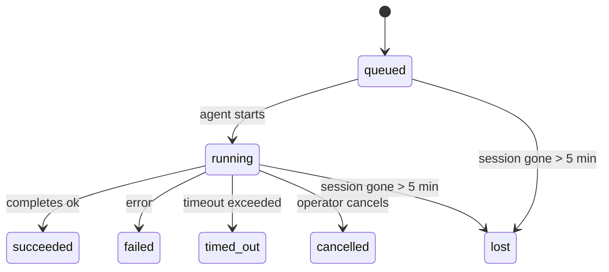

---
read_when:
    - Kiểm tra công việc chạy nền đang diễn ra hoặc vừa hoàn tất
    - Gỡ lỗi các lỗi gửi cho các lần chạy tác tử tách rời
    - Hiểu cách các lượt chạy nền liên quan đến phiên, Cron và Heartbeat
sidebarTitle: Background tasks
summary: Theo dõi tác vụ nền cho các lượt chạy ACP, tác nhân phụ, công việc Cron cô lập và thao tác CLI
title: Tác vụ nền
x-i18n:
    generated_at: "2026-04-30T16:28:01Z"
    model: gpt-5.5
    provider: openai
    source_hash: 999653c9360323d5135e33193c76458cba8c288227de46a6217f1ccbed2a6d34
    source_path: automation/tasks.md
    workflow: 16
---

<Note>
Bạn đang tìm tính năng lập lịch? Xem [Tự động hóa và tác vụ](/vi/automation) để chọn đúng cơ chế. Trang này là sổ cái hoạt động cho công việc nền, không phải bộ lập lịch.
</Note>

Tác vụ nền theo dõi công việc chạy **bên ngoài phiên hội thoại chính của bạn**: các lần chạy ACP, việc sinh subagent, các lần thực thi công việc Cron cô lập, và các thao tác do CLI khởi tạo.

Tác vụ **không** thay thế phiên, công việc Cron, hay Heartbeat — chúng là **sổ cái hoạt động** ghi lại công việc tách rời nào đã diễn ra, khi nào, và có thành công hay không.

<Note>
Không phải mọi lần chạy tác tử đều tạo tác vụ. Các lượt Heartbeat và trò chuyện tương tác thông thường thì không. Tất cả lần thực thi Cron, lần sinh ACP, lần sinh subagent, và lệnh tác tử CLI thì có.
</Note>

## Tóm tắt nhanh

- Tác vụ là **bản ghi**, không phải bộ lập lịch — Cron và Heartbeat quyết định công việc chạy _khi nào_, tác vụ theo dõi _điều gì đã xảy ra_.
- ACP, subagent, mọi công việc Cron, và thao tác CLI đều tạo tác vụ. Các lượt Heartbeat thì không.
- Mỗi tác vụ đi qua `queued → running → terminal` (succeeded, failed, timed_out, cancelled, hoặc lost).
- Tác vụ Cron vẫn hoạt động khi runtime Cron vẫn sở hữu công việc; nếu trạng thái runtime trong bộ nhớ đã mất, bảo trì tác vụ trước tiên kiểm tra lịch sử chạy Cron bền vững trước khi đánh dấu tác vụ là lost.
- Việc hoàn tất được điều khiển bằng đẩy: công việc tách rời có thể thông báo trực tiếp hoặc đánh thức phiên/Heartbeat của bên yêu cầu khi hoàn tất, nên các vòng lặp thăm dò trạng thái thường không phải là cách phù hợp.
- Các lần chạy Cron cô lập và hoàn tất subagent cố gắng hết mức để dọn dẹp các tab/quy trình trình duyệt được theo dõi cho phiên con của chúng trước khi ghi sổ dọn dẹp cuối cùng.
- Phân phối Cron cô lập chặn các phản hồi cha tạm thời đã cũ trong khi công việc subagent hậu duệ vẫn đang rút hết, và ưu tiên đầu ra hậu duệ cuối cùng khi đầu ra đó đến trước lúc phân phối.
- Thông báo hoàn tất được gửi trực tiếp đến kênh hoặc đưa vào hàng đợi cho Heartbeat tiếp theo.
- `openclaw tasks list` hiển thị tất cả tác vụ; `openclaw tasks audit` nêu bật vấn đề.
- Bản ghi cuối được giữ trong 7 ngày, rồi tự động được cắt tỉa.

## Bắt đầu nhanh

<Tabs>
  <Tab title="Liệt kê và lọc">
    ```bash
    # List all tasks (newest first)
    openclaw tasks list

    # Filter by runtime or status
    openclaw tasks list --runtime acp
    openclaw tasks list --status running
    ```

  </Tab>
  <Tab title="Kiểm tra">
    ```bash
    # Show details for a specific task (by ID, run ID, or session key)
    openclaw tasks show <lookup>
    ```
  </Tab>
  <Tab title="Hủy và thông báo">
    ```bash
    # Cancel a running task (kills the child session)
    openclaw tasks cancel <lookup>

    # Change notification policy for a task
    openclaw tasks notify <lookup> state_changes
    ```

  </Tab>
  <Tab title="Kiểm tra và bảo trì">
    ```bash
    # Run a health audit
    openclaw tasks audit

    # Preview or apply maintenance
    openclaw tasks maintenance
    openclaw tasks maintenance --apply
    ```

  </Tab>
  <Tab title="Luồng tác vụ">
    ```bash
    # Inspect TaskFlow state
    openclaw tasks flow list
    openclaw tasks flow show <lookup>
    openclaw tasks flow cancel <lookup>
    ```
  </Tab>
</Tabs>

## Điều gì tạo ra tác vụ

| Nguồn                  | Loại runtime | Khi bản ghi tác vụ được tạo                          | Chính sách thông báo mặc định |
| ---------------------- | ------------ | ------------------------------------------------------ | --------------------- |
| Lần chạy nền ACP       | `acp`        | Sinh một phiên ACP con                                | `done_only`           |
| Điều phối subagent     | `subagent`   | Sinh subagent qua `sessions_spawn`                    | `done_only`           |
| Công việc Cron (mọi loại) | `cron`       | Mỗi lần thực thi Cron (phiên chính và cô lập)         | `silent`              |
| Thao tác CLI           | `cli`        | Lệnh `openclaw agent` chạy qua Gateway                | `silent`              |
| Công việc phương tiện của tác tử | `cli`        | Lần chạy `video_generate` có phiên hỗ trợ             | `silent`              |

<AccordionGroup>
  <Accordion title="Mặc định thông báo cho Cron và phương tiện">
    Tác vụ Cron phiên chính mặc định dùng chính sách thông báo `silent` — chúng tạo bản ghi để theo dõi nhưng không tạo thông báo. Tác vụ Cron cô lập cũng mặc định là `silent` nhưng dễ thấy hơn vì chúng chạy trong phiên riêng.

    Lần chạy `video_generate` có phiên hỗ trợ cũng dùng chính sách thông báo `silent`. Chúng vẫn tạo bản ghi tác vụ, nhưng việc hoàn tất được trả lại cho phiên tác tử ban đầu dưới dạng đánh thức nội bộ để tác tử có thể tự viết tin nhắn tiếp theo và đính kèm video đã hoàn tất. Nếu bạn bật `tools.media.asyncCompletion.directSend`, các lần hoàn tất bất đồng bộ của `music_generate` và `video_generate` sẽ thử phân phối trực tiếp đến kênh trước, rồi mới quay về đường đánh thức phiên yêu cầu.

  </Accordion>
  <Accordion title="Lan can bảo vệ video_generate đồng thời">
    Khi một tác vụ `video_generate` có phiên hỗ trợ vẫn đang hoạt động, công cụ cũng đóng vai trò như lan can bảo vệ: các lệnh gọi `video_generate` lặp lại trong cùng phiên đó trả về trạng thái tác vụ đang hoạt động thay vì bắt đầu một lần tạo thứ hai chạy đồng thời. Dùng `action: "status"` khi bạn muốn tra cứu tiến độ/trạng thái rõ ràng từ phía tác tử.
  </Accordion>
  <Accordion title="Điều gì không tạo tác vụ">
    - Lượt Heartbeat — phiên chính; xem [Heartbeat](/vi/gateway/heartbeat)
    - Lượt trò chuyện tương tác thông thường
    - Phản hồi `/command` trực tiếp

  </Accordion>
</AccordionGroup>

## Vòng đời tác vụ



| Trạng thái  | Ý nghĩa                                                              |
| ----------- | -------------------------------------------------------------------------- |
| `queued`    | Đã tạo, đang chờ tác tử bắt đầu                                    |
| `running`   | Lượt tác tử đang thực thi                                           |
| `succeeded` | Hoàn tất thành công                                                     |
| `failed`    | Hoàn tất với lỗi                                                    |
| `timed_out` | Vượt quá thời gian chờ đã cấu hình                                            |
| `cancelled` | Bị người vận hành dừng qua `openclaw tasks cancel`                        |
| `lost`      | Runtime mất trạng thái nền tảng có thẩm quyền sau thời gian gia hạn 5 phút |

Chuyển tiếp diễn ra tự động — khi lần chạy tác tử liên quan kết thúc, trạng thái tác vụ cập nhật để khớp.

Việc hoàn tất lần chạy tác tử là nguồn có thẩm quyền cho các bản ghi tác vụ đang hoạt động. Một lần chạy tách rời thành công kết thúc là `succeeded`, lỗi chạy thông thường kết thúc là `failed`, và kết quả hết thời gian chờ hoặc hủy bỏ kết thúc là `timed_out`. Nếu người vận hành đã hủy tác vụ, hoặc runtime đã ghi một trạng thái cuối mạnh hơn như `failed`, `timed_out`, hoặc `lost`, tín hiệu thành công đến sau sẽ không hạ cấp trạng thái cuối đó.

`lost` nhận biết runtime:

- Tác vụ ACP: siêu dữ liệu phiên ACP con nền tảng đã biến mất.
- Tác vụ subagent: phiên con nền tảng đã biến mất khỏi kho tác tử đích.
- Tác vụ Cron: runtime Cron không còn theo dõi công việc là đang hoạt động và lịch sử chạy Cron bền vững không hiển thị kết quả cuối cho lần chạy đó. Kiểm tra CLI ngoại tuyến không xem trạng thái runtime Cron trống trong tiến trình của chính nó là có thẩm quyền.
- Tác vụ CLI: tác vụ phiên con cô lập dùng phiên con; tác vụ CLI dựa trên trò chuyện dùng ngữ cảnh chạy trực tiếp thay vào đó, nên các hàng phiên kênh/nhóm/trực tiếp còn sót không giữ chúng sống. Các lần chạy `openclaw agent` được Gateway hỗ trợ cũng kết thúc từ kết quả chạy của chúng, nên các lần chạy đã hoàn tất không nằm ở trạng thái hoạt động cho đến khi bộ quét đánh dấu chúng là `lost`.

## Phân phối và thông báo

Khi một tác vụ đạt trạng thái cuối, OpenClaw thông báo cho bạn. Có hai đường phân phối:

**Phân phối trực tiếp** — nếu tác vụ có mục tiêu kênh (`requesterOrigin`), tin nhắn hoàn tất đi thẳng đến kênh đó (Telegram, Discord, Slack, v.v.). Với hoàn tất subagent, OpenClaw cũng giữ định tuyến luồng/chủ đề đã ràng buộc khi có sẵn và có thể điền `to` / tài khoản bị thiếu từ tuyến đã lưu của phiên yêu cầu (`lastChannel` / `lastTo` / `lastAccountId`) trước khi từ bỏ phân phối trực tiếp.

**Phân phối xếp hàng theo phiên** — nếu phân phối trực tiếp thất bại hoặc không đặt origin, bản cập nhật được xếp hàng làm sự kiện hệ thống trong phiên của bên yêu cầu và xuất hiện ở Heartbeat tiếp theo.

<Tip>
Việc hoàn tất tác vụ kích hoạt đánh thức Heartbeat ngay lập tức để bạn thấy kết quả nhanh chóng — bạn không phải chờ nhịp Heartbeat đã lập lịch tiếp theo.
</Tip>

Điều đó nghĩa là quy trình làm việc thông thường dựa trên đẩy: bắt đầu công việc tách rời một lần, rồi để runtime đánh thức hoặc thông báo cho bạn khi hoàn tất. Chỉ thăm dò trạng thái tác vụ khi bạn cần gỡ lỗi, can thiệp, hoặc kiểm tra rõ ràng.

### Chính sách thông báo

Kiểm soát mức độ bạn nghe về từng tác vụ:

| Chính sách            | Nội dung được phân phối                                                       |
| --------------------- | ----------------------------------------------------------------------- |
| `done_only` (mặc định) | Chỉ trạng thái cuối (succeeded, failed, v.v.) — **đây là mặc định** |
| `state_changes`       | Mọi chuyển tiếp trạng thái và cập nhật tiến độ                              |
| `silent`              | Không có gì cả                                                          |

Thay đổi chính sách khi tác vụ đang chạy:

```bash
openclaw tasks notify <lookup> state_changes
```

## Tham chiếu CLI

<AccordionGroup>
  <Accordion title="tasks list">
    ```bash
    openclaw tasks list [--runtime <acp|subagent|cron|cli>] [--status <status>] [--json]
    ```

    Các cột đầu ra: ID tác vụ, Loại, Trạng thái, Phân phối, ID lần chạy, Phiên con, Tóm tắt.

  </Accordion>
  <Accordion title="tasks show">
    ```bash
    openclaw tasks show <lookup>
    ```

    Token tra cứu chấp nhận ID tác vụ, ID lần chạy, hoặc khóa phiên. Hiển thị bản ghi đầy đủ bao gồm thời gian, trạng thái phân phối, lỗi, và tóm tắt cuối.

  </Accordion>
  <Accordion title="tasks cancel">
    ```bash
    openclaw tasks cancel <lookup>
    ```

    Với tác vụ ACP và subagent, lệnh này kết thúc phiên con. Với tác vụ được CLI theo dõi, việc hủy được ghi trong sổ đăng ký tác vụ (không có handle runtime con riêng). Trạng thái chuyển sang `cancelled` và thông báo phân phối được gửi khi áp dụng.

  </Accordion>
  <Accordion title="tasks notify">
    ```bash
    openclaw tasks notify <lookup> <done_only|state_changes|silent>
    ```
  </Accordion>
  <Accordion title="tasks audit">
    ```bash
    openclaw tasks audit [--json]
    ```

    Nêu bật các vấn đề vận hành. Phát hiện cũng xuất hiện trong `openclaw status` khi phát hiện vấn đề.

    | Phát hiện                  | Mức độ nghiêm trọng | Kích hoạt                                                                                                      |
    | ------------------------- | ---------- | ------------------------------------------------------------------------------------------------------------ |
    | `stale_queued`            | warn       | Đã xếp hàng hơn 10 phút                                                                              |
    | `stale_running`           | error      | Đang chạy hơn 30 phút                                                                             |
    | `lost`                    | warn/error | Quyền sở hữu tác vụ do runtime hỗ trợ đã biến mất; các tác vụ bị mất được giữ lại sẽ cảnh báo cho đến `cleanupAfter`, sau đó trở thành lỗi |
    | `delivery_failed`         | warn       | Gửi thất bại và chính sách thông báo không phải là `silent`                                                            |
    | `missing_cleanup`         | warn       | Tác vụ kết thúc không có dấu thời gian dọn dẹp                                                                      |
    | `inconsistent_timestamps` | warn       | Vi phạm dòng thời gian (ví dụ kết thúc trước khi bắt đầu)                                                        |

  </Accordion>
  <Accordion title="bảo trì tác vụ">
    ```bash
    openclaw tasks maintenance [--json]
    openclaw tasks maintenance --apply [--json]
    ```

    Dùng lệnh này để xem trước hoặc áp dụng việc đối soát, đóng dấu dọn dẹp và cắt tỉa cho tác vụ và trạng thái Task Flow.

    Việc đối soát có nhận biết runtime:

    - Tác vụ ACP/subagent kiểm tra phiên con hỗ trợ của chúng.
    - Tác vụ subagent có phiên con mang dấu mộ phục hồi sau khởi động lại sẽ được đánh dấu là mất thay vì được xem là phiên hỗ trợ có thể phục hồi.
    - Tác vụ Cron kiểm tra xem cron runtime còn sở hữu job hay không, sau đó khôi phục trạng thái kết thúc từ nhật ký chạy cron/trạng thái job đã lưu trước khi quay về `lost`. Chỉ tiến trình Gateway mới có thẩm quyền với tập hợp job đang hoạt động trong bộ nhớ của cron; kiểm tra CLI ngoại tuyến dùng lịch sử bền vững nhưng không đánh dấu một tác vụ cron là mất chỉ vì Set cục bộ đó trống.
    - Tác vụ CLI do chat hỗ trợ kiểm tra ngữ cảnh chạy trực tiếp sở hữu, không chỉ hàng phiên chat.

    Việc dọn dẹp khi hoàn tất cũng có nhận biết runtime:

    - Hoàn tất subagent cố gắng hết mức đóng các tab trình duyệt/tiến trình được theo dõi cho phiên con trước khi tiếp tục dọn dẹp thông báo.
    - Hoàn tất cron cô lập cố gắng hết mức đóng các tab trình duyệt/tiến trình được theo dõi cho phiên cron trước khi lượt chạy được tháo dỡ hoàn toàn.
    - Gửi cron cô lập chờ phần theo dõi của subagent hậu duệ khi cần và chặn văn bản xác nhận cha đã cũ thay vì thông báo văn bản đó.
    - Gửi hoàn tất subagent ưu tiên văn bản trợ lý hiển thị mới nhất; nếu trống, nó quay về văn bản tool/toolResult mới nhất đã được làm sạch, và các lượt chạy chỉ hết thời gian chờ khi gọi tool có thể thu gọn thành một bản tóm tắt tiến độ một phần ngắn. Các lượt chạy kết thúc thất bại thông báo trạng thái thất bại mà không phát lại văn bản trả lời đã ghi lại.
    - Lỗi dọn dẹp không che khuất kết quả tác vụ thực sự.

  </Accordion>
  <Accordion title="liệt kê | hiển thị | hủy luồng tác vụ">
    ```bash
    openclaw tasks flow list [--status <status>] [--json]
    openclaw tasks flow show <lookup> [--json]
    openclaw tasks flow cancel <lookup>
    ```

    Dùng các lệnh này khi Task Flow điều phối là thứ bạn quan tâm thay vì một bản ghi tác vụ nền riêng lẻ.

  </Accordion>
</AccordionGroup>

## Bảng tác vụ chat (`/tasks`)

Dùng `/tasks` trong bất kỳ phiên chat nào để xem các tác vụ nền được liên kết với phiên đó. Bảng hiển thị các tác vụ đang hoạt động và vừa hoàn tất gần đây cùng runtime, trạng thái, thời gian, và chi tiết tiến độ hoặc lỗi.

Khi phiên hiện tại không có tác vụ liên kết hiển thị nào, `/tasks` quay về số lượng tác vụ cục bộ của agent để bạn vẫn có cái nhìn tổng quan mà không rò rỉ chi tiết từ phiên khác.

Để xem sổ cái vận hành đầy đủ, dùng CLI: `openclaw tasks list`.

## Tích hợp trạng thái (áp lực tác vụ)

`openclaw status` bao gồm một tóm tắt tác vụ xem nhanh:

```
Tasks: 3 queued · 2 running · 1 issues
```

Tóm tắt báo cáo:

- **đang hoạt động** — số lượng `queued` + `running`
- **thất bại** — số lượng `failed` + `timed_out` + `lost`
- **theoRuntime** — phân tách theo `acp`, `subagent`, `cron`, `cli`

Cả `/status` và tool `session_status` đều dùng ảnh chụp tác vụ có nhận biết dọn dẹp: tác vụ đang hoạt động được ưu tiên, các hàng đã hoàn tất cũ bị ẩn, và lỗi gần đây chỉ hiện lên khi không còn công việc đang hoạt động. Điều này giữ thẻ trạng thái tập trung vào những gì quan trọng ngay lúc này.

## Lưu trữ và bảo trì

### Nơi tác vụ được lưu

Bản ghi tác vụ được lưu bền vững trong SQLite tại:

```
$OPENCLAW_STATE_DIR/tasks/runs.sqlite
```

Registry được nạp vào bộ nhớ khi gateway khởi động và đồng bộ các lần ghi vào SQLite để bền vững qua các lần khởi động lại.
Gateway giữ nhật ký ghi trước của SQLite trong giới hạn bằng cách dùng ngưỡng
autocheckpoint mặc định của SQLite cùng các checkpoint `TRUNCATE` định kỳ và khi tắt.

### Bảo trì tự động

Một trình quét chạy mỗi **60 giây** và xử lý bốn việc:

<Steps>
  <Step title="Đối soát">
    Kiểm tra xem các tác vụ đang hoạt động còn có phần hỗ trợ runtime có thẩm quyền hay không. Tác vụ ACP/subagent dùng trạng thái phiên con, tác vụ cron dùng quyền sở hữu job đang hoạt động, và tác vụ CLI do chat hỗ trợ dùng ngữ cảnh chạy sở hữu. Nếu trạng thái hỗ trợ đó biến mất hơn 5 phút, tác vụ được đánh dấu là `lost`.
  </Step>
  <Step title="Sửa chữa phiên ACP">
    Đóng các phiên ACP một lần do cha sở hữu đã kết thúc hoặc mồ côi, và chỉ đóng các phiên ACP bền vững đã kết thúc cũ hoặc mồ côi khi không còn liên kết hội thoại đang hoạt động nào.
  </Step>
  <Step title="Đóng dấu dọn dẹp">
    Đặt dấu thời gian `cleanupAfter` trên các tác vụ kết thúc (endedAt + 7 ngày). Trong thời gian lưu giữ, tác vụ bị mất vẫn xuất hiện trong kiểm tra dưới dạng cảnh báo; sau khi `cleanupAfter` hết hạn hoặc khi thiếu siêu dữ liệu dọn dẹp, chúng là lỗi.
  </Step>
  <Step title="Cắt tỉa">
    Xóa các bản ghi đã quá ngày `cleanupAfter`.
  </Step>
</Steps>

<Note>
**Lưu giữ:** bản ghi tác vụ kết thúc được giữ trong **7 ngày**, sau đó tự động bị cắt tỉa. Không cần cấu hình.
</Note>

## Cách tác vụ liên quan đến các hệ thống khác

<AccordionGroup>
  <Accordion title="Tác vụ và Task Flow">
    [Task Flow](/vi/automation/taskflow) là lớp điều phối luồng phía trên các tác vụ nền. Một luồng duy nhất có thể phối hợp nhiều tác vụ trong suốt vòng đời của nó bằng các chế độ đồng bộ được quản lý hoặc phản chiếu. Dùng `openclaw tasks` để kiểm tra các bản ghi tác vụ riêng lẻ và `openclaw tasks flow` để kiểm tra luồng điều phối.

    Xem [Task Flow](/vi/automation/taskflow) để biết chi tiết.

  </Accordion>
  <Accordion title="Tác vụ và cron">
    **Định nghĩa** job cron nằm trong `~/.openclaw/cron/jobs.json`; trạng thái thực thi runtime nằm bên cạnh nó trong `~/.openclaw/cron/jobs-state.json`. **Mỗi** lần thực thi cron tạo một bản ghi tác vụ — cả phiên chính lẫn cô lập. Tác vụ cron phiên chính mặc định dùng chính sách thông báo `silent` để chúng theo dõi mà không tạo thông báo.

    Xem [Cron Jobs](/vi/automation/cron-jobs).

  </Accordion>
  <Accordion title="Tác vụ và heartbeat">
    Các lượt chạy Heartbeat là lượt phiên chính — chúng không tạo bản ghi tác vụ. Khi một tác vụ hoàn tất, nó có thể kích hoạt đánh thức heartbeat để bạn thấy kết quả kịp thời.

    Xem [Heartbeat](/vi/gateway/heartbeat).

  </Accordion>
  <Accordion title="Tác vụ và phiên">
    Một tác vụ có thể tham chiếu `childSessionKey` (nơi công việc chạy) và `requesterSessionKey` (người đã khởi động nó). Phiên là ngữ cảnh hội thoại; tác vụ là lớp theo dõi hoạt động phía trên ngữ cảnh đó.
  </Accordion>
  <Accordion title="Tác vụ và lượt chạy agent">
    `runId` của tác vụ liên kết đến lượt chạy agent đang thực hiện công việc. Các sự kiện vòng đời agent (bắt đầu, kết thúc, lỗi) tự động cập nhật trạng thái tác vụ — bạn không cần quản lý vòng đời theo cách thủ công.
  </Accordion>
</AccordionGroup>

## Liên quan

- [Tự động hóa & Tác vụ](/vi/automation) — tất cả cơ chế tự động hóa trong một cái nhìn
- [CLI: Tác vụ](/vi/cli/tasks) — tham chiếu lệnh CLI
- [Heartbeat](/vi/gateway/heartbeat) — các lượt phiên chính định kỳ
- [Tác vụ đã lên lịch](/vi/automation/cron-jobs) — lên lịch công việc nền
- [Task Flow](/vi/automation/taskflow) — điều phối luồng phía trên tác vụ
