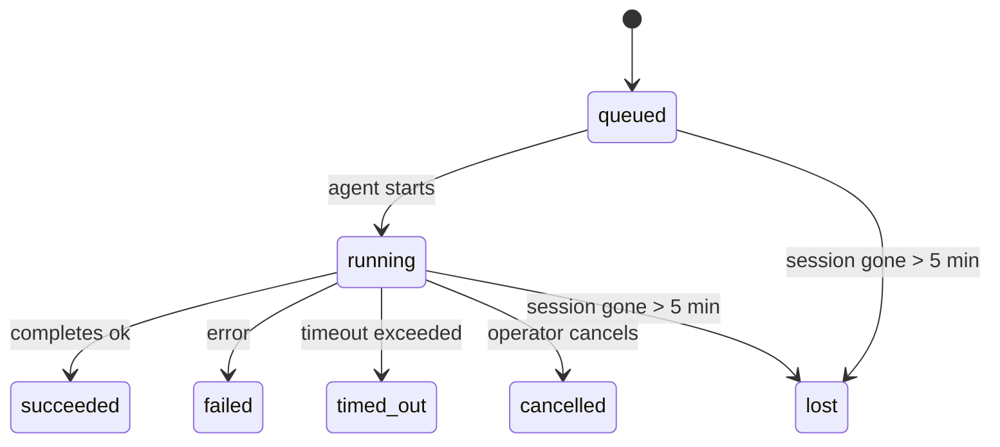

---
read_when:
    - Kiểm tra công việc chạy nền đang diễn ra hoặc vừa hoàn tất
    - Gỡ lỗi các lỗi gửi trong các lần chạy tác nhân tách rời
    - Hiểu cách các lượt chạy nền liên quan đến phiên, Cron và Heartbeat
sidebarTitle: Background tasks
summary: Theo dõi tác vụ nền cho các lần chạy ACP, tác nhân phụ, công việc Cron cô lập và thao tác CLI
title: Tác vụ nền
x-i18n:
    generated_at: "2026-05-05T06:16:17Z"
    model: gpt-5.5
    provider: openai
    source_hash: bafd959feaf2e220820ec56bf1ef144207d05757418e9971ebf427844cf30c46
    source_path: automation/tasks.md
    workflow: 16
---

<Note>
Bạn đang tìm cách lập lịch? Xem [Tự động hóa và tác vụ](/vi/automation) để chọn cơ chế phù hợp. Trang này là sổ ghi hoạt động cho công việc nền, không phải bộ lập lịch.
</Note>

Tác vụ nền theo dõi công việc chạy **bên ngoài phiên trò chuyện chính của bạn**: các lượt chạy ACP, tạo subagent, các lần thực thi công việc Cron cô lập, và các thao tác do CLI khởi tạo.

Tác vụ **không** thay thế phiên, công việc Cron, hay Heartbeat — chúng là **sổ ghi hoạt động** ghi lại công việc tách rời nào đã xảy ra, khi nào, và có thành công hay không.

<Note>
Không phải mọi lượt chạy agent đều tạo tác vụ. Các lượt Heartbeat và trò chuyện tương tác thông thường thì không. Tất cả lần thực thi Cron, tạo ACP, tạo subagent, và lệnh agent qua CLI đều có.
</Note>

## Tóm tắt nhanh

- Tác vụ là **bản ghi**, không phải bộ lập lịch — Cron và Heartbeat quyết định công việc chạy _khi nào_, tác vụ theo dõi _điều gì đã xảy ra_.
- ACP, subagent, tất cả công việc Cron, và thao tác CLI tạo tác vụ. Các lượt Heartbeat thì không.
- Mỗi tác vụ đi qua `queued → running → terminal` (succeeded, failed, timed_out, cancelled, hoặc lost).
- Tác vụ Cron vẫn còn hoạt động khi runtime Cron vẫn sở hữu công việc; nếu
  trạng thái runtime trong bộ nhớ đã mất, bảo trì tác vụ trước tiên kiểm tra lịch sử
  lượt chạy Cron bền vững trước khi đánh dấu tác vụ là lost.
- Hoàn tất được điều khiển bằng đẩy: công việc tách rời có thể thông báo trực tiếp hoặc đánh thức
  phiên/Heartbeat của bên yêu cầu khi hoàn tất, nên các vòng lặp thăm dò trạng thái
  thường không phải dạng phù hợp.
- Các lượt chạy Cron cô lập và hoàn tất subagent cố gắng hết mức để dọn dẹp các tab/trình duyệt/tiến trình đã theo dõi cho phiên con trước khi ghi sổ dọn dẹp cuối cùng.
- Phân phối Cron cô lập chặn các phản hồi tạm thời đã cũ của cha trong khi công việc subagent hậu duệ vẫn đang xả hết, và ưu tiên đầu ra cuối cùng của hậu duệ khi đầu ra đó đến trước khi phân phối.
- Thông báo hoàn tất được gửi trực tiếp tới một kênh hoặc xếp hàng cho Heartbeat tiếp theo.
- `openclaw tasks list` hiển thị tất cả tác vụ; `openclaw tasks audit` đưa vấn đề ra bề mặt.
- Bản ghi terminal được giữ trong 7 ngày, rồi tự động được cắt tỉa.

## Bắt đầu nhanh

<Tabs>
  <Tab title="Liệt kê và lọc">
    ```bash
    # Liệt kê tất cả tác vụ (mới nhất trước)
    openclaw tasks list

    # Lọc theo runtime hoặc trạng thái
    openclaw tasks list --runtime acp
    openclaw tasks list --status running
    ```

  </Tab>
  <Tab title="Kiểm tra">
    ```bash
    # Hiển thị chi tiết cho một tác vụ cụ thể (theo ID, ID lượt chạy, hoặc khóa phiên)
    openclaw tasks show <lookup>
    ```
  </Tab>
  <Tab title="Hủy và thông báo">
    ```bash
    # Hủy một tác vụ đang chạy (giết phiên con)
    openclaw tasks cancel <lookup>

    # Thay đổi chính sách thông báo cho một tác vụ
    openclaw tasks notify <lookup> state_changes
    ```

  </Tab>
  <Tab title="Kiểm tra và bảo trì">
    ```bash
    # Chạy kiểm tra sức khỏe
    openclaw tasks audit

    # Xem trước hoặc áp dụng bảo trì
    openclaw tasks maintenance
    openclaw tasks maintenance --apply
    ```

  </Tab>
  <Tab title="Luồng tác vụ">
    ```bash
    # Kiểm tra trạng thái TaskFlow
    openclaw tasks flow list
    openclaw tasks flow show <lookup>
    openclaw tasks flow cancel <lookup>
    ```
  </Tab>
</Tabs>

## Điều gì tạo ra tác vụ

| Nguồn                  | Loại runtime | Khi bản ghi tác vụ được tạo                           | Chính sách thông báo mặc định |
| ---------------------- | ------------ | ------------------------------------------------------ | --------------------- |
| Lượt chạy nền ACP      | `acp`        | Tạo một phiên ACP con                                  | `done_only`           |
| Điều phối subagent     | `subagent`   | Tạo subagent qua `sessions_spawn`                      | `done_only`           |
| Công việc Cron (mọi loại) | `cron`       | Mỗi lần thực thi Cron (phiên chính và cô lập)          | `silent`              |
| Thao tác CLI           | `cli`        | Các lệnh `openclaw agent` chạy qua Gateway             | `silent`              |
| Công việc media của agent | `cli`     | Các lượt chạy `music_generate`/`video_generate` dựa trên phiên | `silent`              |

<AccordionGroup>
  <Accordion title="Mặc định thông báo cho Cron và media">
    Theo mặc định, tác vụ Cron phiên chính dùng chính sách thông báo `silent` — chúng tạo bản ghi để theo dõi nhưng không tạo thông báo. Tác vụ Cron cô lập cũng mặc định là `silent` nhưng dễ thấy hơn vì chúng chạy trong phiên riêng.

    Các lượt chạy `music_generate` và `video_generate` dựa trên phiên cũng dùng chính sách thông báo `silent`. Chúng vẫn tạo bản ghi tác vụ, nhưng việc hoàn tất được trả lại phiên agent ban đầu dưới dạng đánh thức nội bộ để agent có thể viết tin nhắn theo sau và tự đính kèm media đã hoàn tất. Hoàn tất trong nhóm/kênh đi theo chính sách phản hồi hiển thị thông thường, nên agent dùng công cụ nhắn tin khi nguồn phân phối yêu cầu. Nếu agent hoàn tất không tạo được bằng chứng phân phối qua công cụ nhắn tin trong tuyến chỉ dùng công cụ, OpenClaw gửi dự phòng hoàn tất trực tiếp tới kênh ban đầu thay vì để media ở trạng thái riêng tư.

  </Accordion>
  <Accordion title="Rào chắn video_generate đồng thời">
    Khi một tác vụ `video_generate` dựa trên phiên vẫn đang hoạt động, công cụ cũng đóng vai trò rào chắn: các lệnh gọi `video_generate` lặp lại trong cùng phiên đó trả về trạng thái tác vụ đang hoạt động thay vì bắt đầu một lần tạo đồng thời thứ hai. Dùng `action: "status"` khi bạn muốn tra cứu tiến độ/trạng thái rõ ràng từ phía agent.
  </Accordion>
  <Accordion title="Những gì không tạo tác vụ">
    - Các lượt Heartbeat — phiên chính; xem [Heartbeat](/vi/gateway/heartbeat)
    - Các lượt trò chuyện tương tác thông thường
    - Phản hồi trực tiếp `/command`

  </Accordion>
</AccordionGroup>

## Vòng đời tác vụ



| Trạng thái  | Ý nghĩa                                                                    |
| ----------- | -------------------------------------------------------------------------- |
| `queued`    | Đã tạo, đang chờ agent bắt đầu                                             |
| `running`   | Lượt agent đang thực thi tích cực                                          |
| `succeeded` | Hoàn tất thành công                                                        |
| `failed`    | Hoàn tất với lỗi                                                           |
| `timed_out` | Vượt quá thời gian chờ đã cấu hình                                         |
| `cancelled` | Bị người vận hành dừng qua `openclaw tasks cancel`                         |
| `lost`      | Runtime mất trạng thái hậu thuẫn có thẩm quyền sau thời gian gia hạn 5 phút |

Chuyển đổi diễn ra tự động — khi lượt chạy agent liên quan kết thúc, trạng thái tác vụ cập nhật để khớp.

Hoàn tất lượt chạy agent là nguồn có thẩm quyền cho bản ghi tác vụ đang hoạt động. Một lượt chạy tách rời thành công kết thúc thành `succeeded`, lỗi lượt chạy thông thường kết thúc thành `failed`, và kết quả hết thời gian chờ hoặc hủy bỏ kết thúc thành `timed_out`. Nếu người vận hành đã hủy tác vụ, hoặc runtime đã ghi nhận một trạng thái terminal mạnh hơn như `failed`, `timed_out`, hoặc `lost`, tín hiệu thành công đến sau sẽ không hạ cấp trạng thái terminal đó.

`lost` nhận biết runtime:

- Tác vụ ACP: metadata phiên ACP con hậu thuẫn đã biến mất.
- Tác vụ subagent: phiên con hậu thuẫn đã biến mất khỏi kho agent đích.
- Tác vụ Cron: runtime Cron không còn theo dõi công việc là đang hoạt động và lịch sử
  lượt chạy Cron bền vững không hiển thị kết quả terminal cho lượt chạy đó. Kiểm tra
  CLI ngoại tuyến không xem trạng thái runtime Cron trong tiến trình trống của chính nó là có thẩm quyền.
- Tác vụ CLI: tác vụ phiên con cô lập dùng phiên con; tác vụ CLI dựa trên trò chuyện
  dùng ngữ cảnh lượt chạy trực tiếp thay vào đó, nên các hàng phiên
  kênh/nhóm/trực tiếp còn sót lại không giữ chúng hoạt động. Các lượt chạy
  `openclaw agent` dựa trên Gateway cũng kết thúc từ kết quả lượt chạy, nên các lượt chạy đã hoàn tất
  không nằm ở trạng thái hoạt động cho đến khi bộ quét đánh dấu chúng là `lost`.

## Phân phối và thông báo

Khi một tác vụ đạt trạng thái terminal, OpenClaw thông báo cho bạn. Có hai đường phân phối:

**Phân phối trực tiếp** — nếu tác vụ có đích kênh (`requesterOrigin`), tin nhắn hoàn tất đi thẳng tới kênh đó (Telegram, Discord, Slack, v.v.). Với hoàn tất subagent, OpenClaw cũng giữ định tuyến luồng/chủ đề đã ràng buộc khi có và có thể điền `to` / tài khoản còn thiếu từ tuyến đã lưu của phiên yêu cầu (`lastChannel` / `lastTo` / `lastAccountId`) trước khi từ bỏ phân phối trực tiếp.

**Phân phối xếp hàng theo phiên** — nếu phân phối trực tiếp thất bại hoặc không đặt origin, bản cập nhật được xếp hàng làm sự kiện hệ thống trong phiên của bên yêu cầu và xuất hiện ở Heartbeat tiếp theo.

<Tip>
Hoàn tất tác vụ kích hoạt đánh thức Heartbeat ngay lập tức để bạn thấy kết quả nhanh chóng — bạn không phải chờ tick Heartbeat đã lập lịch tiếp theo.
</Tip>

Điều đó có nghĩa quy trình thông thường dựa trên đẩy: bắt đầu công việc tách rời một lần, rồi để runtime đánh thức hoặc thông báo cho bạn khi hoàn tất. Chỉ thăm dò trạng thái tác vụ khi bạn cần gỡ lỗi, can thiệp, hoặc kiểm tra rõ ràng.

### Chính sách thông báo

Kiểm soát mức độ bạn nghe về từng tác vụ:

| Chính sách            | Nội dung được phân phối                                                   |
| --------------------- | ------------------------------------------------------------------------- |
| `done_only` (mặc định) | Chỉ trạng thái terminal (succeeded, failed, v.v.) — **đây là mặc định** |
| `state_changes`       | Mọi chuyển đổi trạng thái và cập nhật tiến độ                             |
| `silent`              | Không có gì cả                                                            |

Thay đổi chính sách khi tác vụ đang chạy:

```bash
openclaw tasks notify <lookup> state_changes
```

## Tham chiếu CLI

<AccordionGroup>
  <Accordion title="tasks list">
    ```bash
    openclaw tasks list [--runtime <acp|subagent|cron|cli>] [--status <status>] [--json]
    ```

    Cột đầu ra: ID tác vụ, Loại, Trạng thái, Phân phối, ID lượt chạy, Phiên con, Tóm tắt.

  </Accordion>
  <Accordion title="tasks show">
    ```bash
    openclaw tasks show <lookup>
    ```

    Token tra cứu chấp nhận ID tác vụ, ID lượt chạy, hoặc khóa phiên. Hiển thị bản ghi đầy đủ bao gồm thời gian, trạng thái phân phối, lỗi, và tóm tắt terminal.

  </Accordion>
  <Accordion title="tasks cancel">
    ```bash
    openclaw tasks cancel <lookup>
    ```

    Với tác vụ ACP và subagent, lệnh này giết phiên con. Với tác vụ được CLI theo dõi, việc hủy được ghi nhận trong sổ đăng ký tác vụ (không có handle runtime con riêng). Trạng thái chuyển sang `cancelled` và thông báo phân phối được gửi khi áp dụng.

  </Accordion>
  <Accordion title="tasks notify">
    ```bash
    openclaw tasks notify <lookup> <done_only|state_changes|silent>
    ```
  </Accordion>
  <Accordion title="tasks audit">
    ```bash
    openclaw tasks audit [--json]
    ```

    Đưa các vấn đề vận hành ra bề mặt. Phát hiện cũng xuất hiện trong `openclaw status` khi vấn đề được phát hiện.

    | Phát hiện                   | Mức độ nghiêm trọng   | Điều kiện kích hoạt                                                                                                      |
    | ------------------------- | ---------- | ------------------------------------------------------------------------------------------------------------ |
    | `stale_queued`            | cảnh báo       | Được đưa vào hàng đợi quá 10 phút                                                                              |
    | `stale_running`           | lỗi      | Chạy quá 30 phút                                                                             |
    | `lost`                    | cảnh báo/lỗi | Quyền sở hữu tác vụ được runtime hỗ trợ đã biến mất; các tác vụ bị mất được giữ lại sẽ cảnh báo cho đến `cleanupAfter`, sau đó trở thành lỗi |
    | `delivery_failed`         | cảnh báo       | Gửi thất bại và chính sách thông báo không phải là `silent`                                                            |
    | `missing_cleanup`         | cảnh báo       | Tác vụ kết thúc không có dấu thời gian dọn dẹp                                                                      |
    | `inconsistent_timestamps` | cảnh báo       | Vi phạm dòng thời gian (ví dụ kết thúc trước khi bắt đầu)                                                        |

  </Accordion>
  <Accordion title="bảo trì tasks">
    ```bash
    openclaw tasks maintenance [--json]
    openclaw tasks maintenance --apply [--json]
    ```

    Dùng lệnh này để xem trước hoặc áp dụng việc đối chiếu, đóng dấu dọn dẹp và cắt tỉa cho tác vụ và trạng thái Task Flow.

    Việc đối chiếu có nhận biết runtime:

    - Các tác vụ ACP/subagent kiểm tra phiên con hỗ trợ tương ứng.
    - Các tác vụ subagent có phiên con mang restart-recovery tombstone được đánh dấu là mất thay vì được xem là các phiên hỗ trợ có thể khôi phục.
    - Các tác vụ Cron kiểm tra xem runtime cron có còn sở hữu công việc hay không, sau đó khôi phục trạng thái kết thúc từ nhật ký lượt chạy cron/trạng thái công việc đã lưu trước khi rơi về `lost`. Chỉ tiến trình Gateway mới có thẩm quyền với tập công việc cron đang hoạt động trong bộ nhớ; kiểm tra CLI ngoại tuyến dùng lịch sử bền vững nhưng không đánh dấu một tác vụ cron là mất chỉ vì Set cục bộ đó trống.
    - Các tác vụ CLI được chat hỗ trợ kiểm tra ngữ cảnh lượt chạy trực tiếp đang sở hữu, không chỉ hàng phiên chat.

    Việc dọn dẹp sau khi hoàn tất cũng có nhận biết runtime:

    - Hoàn tất subagent sẽ cố gắng hết mức để đóng các tab trình duyệt/tiến trình được theo dõi cho phiên con trước khi tiếp tục dọn dẹp thông báo.
    - Hoàn tất cron cô lập sẽ cố gắng hết mức để đóng các tab trình duyệt/tiến trình được theo dõi cho phiên cron trước khi lượt chạy được tháo dỡ hoàn toàn.
    - Việc gửi cron cô lập chờ phần theo dõi từ subagent hậu duệ khi cần và chặn văn bản xác nhận cha đã cũ thay vì thông báo nó.
    - Gửi hoàn tất subagent ưu tiên văn bản trợ lý hiển thị mới nhất; nếu trống, nó rơi về văn bản tool/toolResult mới nhất đã được làm sạch, và các lượt chạy chỉ timeout do gọi công cụ có thể thu gọn thành một tóm tắt tiến độ một phần ngắn. Các lượt chạy kết thúc thất bại thông báo trạng thái thất bại mà không phát lại văn bản trả lời đã ghi lại.
    - Lỗi dọn dẹp không che khuất kết quả tác vụ thực sự.

  </Accordion>
  <Accordion title="tasks flow list | show | cancel">
    ```bash
    openclaw tasks flow list [--status <status>] [--json]
    openclaw tasks flow show <lookup> [--json]
    openclaw tasks flow cancel <lookup>
    ```

    Dùng các lệnh này khi Task Flow điều phối là thứ bạn quan tâm, thay vì một bản ghi tác vụ nền riêng lẻ.

  </Accordion>
</AccordionGroup>

## Bảng tác vụ chat (`/tasks`)

Dùng `/tasks` trong bất kỳ phiên chat nào để xem các tác vụ nền được liên kết với phiên đó. Bảng hiển thị các tác vụ đang hoạt động và vừa hoàn tất gần đây cùng runtime, trạng thái, thời gian, và chi tiết tiến độ hoặc lỗi.

Khi phiên hiện tại không có tác vụ liên kết hiển thị, `/tasks` sẽ rơi về số lượng tác vụ cục bộ của agent để bạn vẫn có cái nhìn tổng quan mà không làm lộ chi tiết của phiên khác.

Để xem sổ cái đầy đủ cho người vận hành, dùng CLI: `openclaw tasks list`.

## Tích hợp trạng thái (áp lực tác vụ)

`openclaw status` bao gồm tóm tắt tác vụ nhanh:

```
Tasks: 3 queued · 2 running · 1 issues
```

Tóm tắt báo cáo:

- **active** — số lượng `queued` + `running`
- **failures** — số lượng `failed` + `timed_out` + `lost`
- **byRuntime** — phân tách theo `acp`, `subagent`, `cron`, `cli`

Cả `/status` và công cụ `session_status` đều dùng ảnh chụp tác vụ có nhận biết dọn dẹp: ưu tiên các tác vụ đang hoạt động, ẩn các hàng đã hoàn tất và cũ, và chỉ hiển thị lỗi gần đây khi không còn công việc đang hoạt động. Điều này giữ cho thẻ trạng thái tập trung vào điều quan trọng ngay lúc này.

## Lưu trữ và bảo trì

### Nơi lưu tác vụ

Bản ghi tác vụ được lưu bền vững trong SQLite tại:

```
$OPENCLAW_STATE_DIR/tasks/runs.sqlite
```

Registry được nạp vào bộ nhớ khi Gateway khởi động và đồng bộ các lần ghi vào SQLite để bền vững qua các lần khởi động lại.
Gateway giữ nhật ký ghi trước của SQLite ở mức giới hạn bằng cách dùng ngưỡng autocheckpoint mặc định của SQLite cùng các checkpoint `TRUNCATE` định kỳ và khi tắt.

### Bảo trì tự động

Một sweeper chạy mỗi **60 giây** và xử lý bốn việc:

<Steps>
  <Step title="Đối chiếu">
    Kiểm tra xem các tác vụ đang hoạt động có còn phần hỗ trợ runtime có thẩm quyền hay không. Các tác vụ ACP/subagent dùng trạng thái phiên con, tác vụ cron dùng quyền sở hữu công việc đang hoạt động, và tác vụ CLI được chat hỗ trợ dùng ngữ cảnh lượt chạy đang sở hữu. Nếu trạng thái hỗ trợ đó biến mất quá 5 phút, tác vụ được đánh dấu là `lost`.
  </Step>
  <Step title="Sửa phiên ACP">
    Đóng các phiên ACP một lần thuộc sở hữu cha đã kết thúc hoặc mồ côi, và chỉ đóng các phiên ACP bền vững đã kết thúc hoặc mồ côi khi không còn liên kết cuộc trò chuyện đang hoạt động.
  </Step>
  <Step title="Đóng dấu dọn dẹp">
    Đặt dấu thời gian `cleanupAfter` trên các tác vụ đã kết thúc (endedAt + 7 ngày). Trong thời gian lưu giữ, tác vụ bị mất vẫn xuất hiện trong kiểm tra dưới dạng cảnh báo; sau khi `cleanupAfter` hết hạn hoặc khi thiếu siêu dữ liệu dọn dẹp, chúng là lỗi.
  </Step>
  <Step title="Cắt tỉa">
    Xóa các bản ghi đã qua ngày `cleanupAfter`.
  </Step>
</Steps>

<Note>
**Lưu giữ:** bản ghi tác vụ đã kết thúc được giữ trong **7 ngày**, sau đó tự động bị cắt tỉa. Không cần cấu hình.
</Note>

## Tác vụ liên quan thế nào đến các hệ thống khác

<AccordionGroup>
  <Accordion title="Tác vụ và Task Flow">
    [Task Flow](/vi/automation/taskflow) là lớp điều phối luồng phía trên các tác vụ nền. Một luồng đơn lẻ có thể điều phối nhiều tác vụ trong suốt vòng đời bằng chế độ đồng bộ được quản lý hoặc phản chiếu. Dùng `openclaw tasks` để kiểm tra từng bản ghi tác vụ và `openclaw tasks flow` để kiểm tra luồng điều phối.

    Xem [Task Flow](/vi/automation/taskflow) để biết chi tiết.

  </Accordion>
  <Accordion title="Tác vụ và cron">
    **Định nghĩa** công việc cron nằm trong `~/.openclaw/cron/jobs.json`; trạng thái thực thi runtime nằm bên cạnh trong `~/.openclaw/cron/jobs-state.json`. **Mọi** lần thực thi cron đều tạo một bản ghi tác vụ — cả phiên chính lẫn cô lập. Các tác vụ cron phiên chính mặc định dùng chính sách thông báo `silent` để chúng được theo dõi mà không tạo thông báo.

    Xem [Cron Jobs](/vi/automation/cron-jobs).

  </Accordion>
  <Accordion title="Tác vụ và heartbeat">
    Các lượt chạy Heartbeat là lượt phiên chính — chúng không tạo bản ghi tác vụ. Khi một tác vụ hoàn tất, nó có thể kích hoạt đánh thức heartbeat để bạn thấy kết quả kịp thời.

    Xem [Heartbeat](/vi/gateway/heartbeat).

  </Accordion>
  <Accordion title="Tác vụ và phiên">
    Một tác vụ có thể tham chiếu `childSessionKey` (nơi công việc chạy) và `requesterSessionKey` (người đã khởi động nó). Phiên là ngữ cảnh cuộc trò chuyện; tác vụ là lớp theo dõi hoạt động phía trên đó.
  </Accordion>
  <Accordion title="Tác vụ và lượt chạy agent">
    `runId` của tác vụ liên kết đến lượt chạy agent đang thực hiện công việc. Các sự kiện vòng đời agent (bắt đầu, kết thúc, lỗi) tự động cập nhật trạng thái tác vụ — bạn không cần quản lý vòng đời theo cách thủ công.
  </Accordion>
</AccordionGroup>

## Liên quan

- [Tự động hóa & Tác vụ](/vi/automation) — tất cả cơ chế tự động hóa trong nháy mắt
- [CLI: Tác vụ](/vi/cli/tasks) — tài liệu tham chiếu lệnh CLI
- [Heartbeat](/vi/gateway/heartbeat) — các lượt phiên chính định kỳ
- [Tác vụ đã lên lịch](/vi/automation/cron-jobs) — lên lịch công việc nền
- [Task Flow](/vi/automation/taskflow) — điều phối luồng phía trên tác vụ
