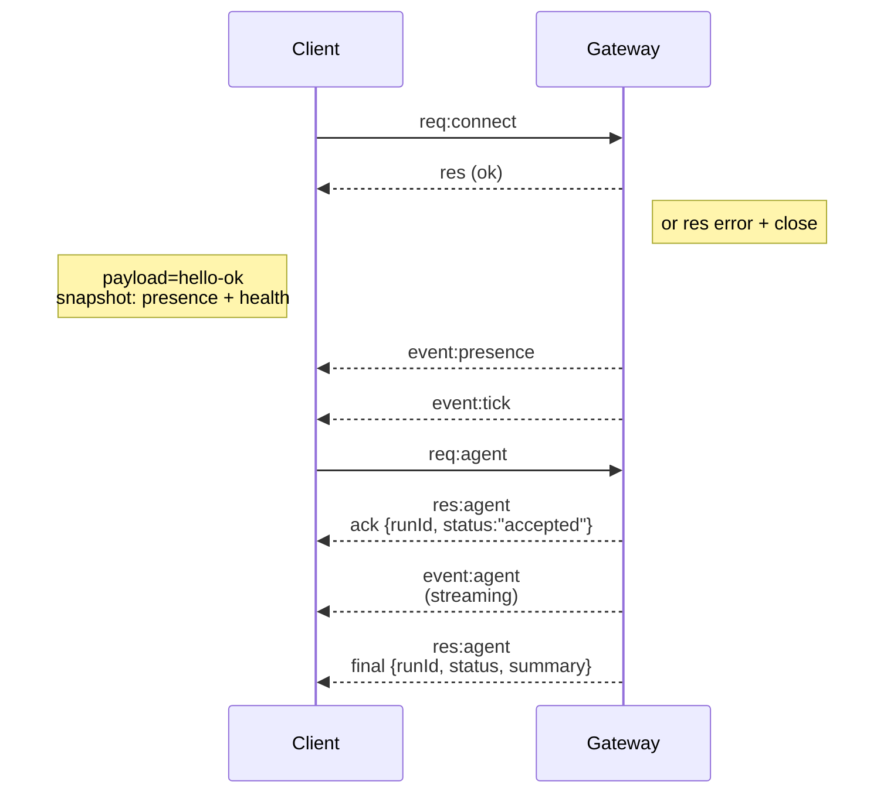

---
read_when:
    - Làm việc với giao thức Gateway, ứng dụng khách hoặc cơ chế truyền tải
summary: Kiến trúc Gateway WebSocket, các thành phần và luồng máy khách
title: Kiến trúc Gateway
x-i18n:
    generated_at: "2026-04-29T22:35:49Z"
    model: gpt-5.5
    provider: openai
    source_hash: 91c553489da18b6ad83fc860014f5bfb758334e9789cb7893d4d00f81c650f02
    source_path: concepts/architecture.md
    workflow: 16
---

## Tổng quan

- Một **Gateway** duy nhất, tồn tại lâu dài, sở hữu tất cả bề mặt nhắn tin (WhatsApp qua
  Baileys, Telegram qua grammY, Slack, Discord, Signal, iMessage, WebChat).
- Các máy khách mặt phẳng điều khiển (ứng dụng macOS, CLI, giao diện web, tự động hóa) kết nối tới
  Gateway qua **WebSocket** trên máy chủ bind đã cấu hình (mặc định
  `127.0.0.1:18789`).
- **Node** (macOS/iOS/Android/headless) cũng kết nối qua **WebSocket**, nhưng
  khai báo `role: node` cùng các khả năng/lệnh rõ ràng.
- Mỗi máy chủ có một Gateway; đây là nơi duy nhất mở phiên WhatsApp.
- **Máy chủ canvas** được phục vụ bởi máy chủ HTTP của Gateway tại:
  - `/__openclaw__/canvas/` (HTML/CSS/JS mà agent có thể chỉnh sửa)
  - `/__openclaw__/a2ui/` (máy chủ A2UI)
    Nó dùng cùng cổng với Gateway (mặc định `18789`).

## Thành phần và luồng

### Gateway (daemon)

- Duy trì kết nối nhà cung cấp.
- Cung cấp API WS có kiểu (yêu cầu, phản hồi, sự kiện do máy chủ đẩy).
- Xác thực các frame đến bằng JSON Schema.
- Phát ra các sự kiện như `agent`, `chat`, `presence`, `health`, `heartbeat`, `cron`.

### Máy khách (ứng dụng Mac / CLI / quản trị web)

- Mỗi máy khách có một kết nối WS.
- Gửi yêu cầu (`health`, `status`, `send`, `agent`, `system-presence`).
- Đăng ký nhận sự kiện (`tick`, `agent`, `presence`, `shutdown`).

### Node (macOS / iOS / Android / headless)

- Kết nối tới **cùng máy chủ WS** với `role: node`.
- Cung cấp danh tính thiết bị trong `connect`; ghép đôi dựa trên **thiết bị** (vai trò `node`) và
  phê duyệt nằm trong kho ghép đôi thiết bị.
- Cung cấp các lệnh như `canvas.*`, `camera.*`, `screen.record`, `location.get`.

Chi tiết giao thức:

- [Giao thức Gateway](/vi/gateway/protocol)

### WebChat

- Giao diện tĩnh dùng API WS của Gateway cho lịch sử trò chuyện và gửi tin.
- Trong các thiết lập từ xa, kết nối qua cùng đường hầm SSH/Tailscale như các
  máy khách khác.

## Vòng đời kết nối (một máy khách)



## Giao thức truyền tải (tóm tắt)

- Truyền tải: WebSocket, frame văn bản với payload JSON.
- Frame đầu tiên **phải** là `connect`.
- Sau bắt tay:
  - Yêu cầu: `{type:"req", id, method, params}` → `{type:"res", id, ok, payload|error}`
  - Sự kiện: `{type:"event", event, payload, seq?, stateVersion?}`
- `hello-ok.features.methods` / `events` là metadata khám phá, không phải
  bản xuất được tạo của mọi tuyến trợ giúp có thể gọi.
- Xác thực bí mật chung dùng `connect.params.auth.token` hoặc
  `connect.params.auth.password`, tùy theo chế độ xác thực gateway đã cấu hình.
- Các chế độ mang danh tính như Tailscale Serve
  (`gateway.auth.allowTailscale: true`) hoặc non-loopback
  `gateway.auth.mode: "trusted-proxy"` đáp ứng xác thực từ header yêu cầu
  thay vì `connect.params.auth.*`.
- Ingress riêng `gateway.auth.mode: "none"` tắt hoàn toàn xác thực bí mật chung;
  không bật chế độ đó trên ingress công khai/không tin cậy.
- Khóa idempotency là bắt buộc cho các phương thức gây tác dụng phụ (`send`, `agent`) để
  thử lại an toàn; máy chủ giữ một bộ nhớ đệm khử trùng lặp tồn tại ngắn.
- Node phải bao gồm `role: "node"` cùng các khả năng/lệnh/quyền trong `connect`.

## Ghép đôi + tin cậy cục bộ

- Tất cả máy khách WS (operator + Node) đều đưa **danh tính thiết bị** vào `connect`.
- ID thiết bị mới yêu cầu phê duyệt ghép đôi; Gateway cấp **token thiết bị**
  cho các lần kết nối sau.
- Kết nối local loopback trực tiếp có thể được tự động phê duyệt để giữ trải nghiệm cùng máy
  mượt mà.
- OpenClaw cũng có một đường tự kết nối hẹp trong backend/container-local cho
  các luồng trợ giúp dùng bí mật chung đáng tin cậy.
- Kết nối tailnet và LAN, bao gồm bind tailnet cùng máy, vẫn yêu cầu
  phê duyệt ghép đôi rõ ràng.
- Tất cả kết nối phải ký nonce `connect.challenge`.
- Payload chữ ký `v3` cũng ràng buộc `platform` + `deviceFamily`; gateway
  ghim metadata đã ghép đôi khi kết nối lại và yêu cầu ghép đôi sửa chữa khi metadata
  thay đổi.
- Kết nối **không cục bộ** vẫn yêu cầu phê duyệt rõ ràng.
- Xác thực Gateway (`gateway.auth.*`) vẫn áp dụng cho **tất cả** kết nối, cục bộ hoặc
  từ xa.

Chi tiết: [Giao thức Gateway](/vi/gateway/protocol), [Ghép đôi](/vi/channels/pairing),
[Bảo mật](/vi/gateway/security).

## Kiểu hóa giao thức và sinh mã

- Schema TypeBox định nghĩa giao thức.
- JSON Schema được tạo từ các schema đó.
- Model Swift được tạo từ JSON Schema.

## Truy cập từ xa

- Ưu tiên: Tailscale hoặc VPN.
- Thay thế: đường hầm SSH

  ```bash
  ssh -N -L 18789:127.0.0.1:18789 user@host
  ```

- Cùng bắt tay + token xác thực áp dụng qua đường hầm.
- TLS + pinning tùy chọn có thể được bật cho WS trong các thiết lập từ xa.

## Ảnh chụp vận hành

- Khởi động: `openclaw gateway` (foreground, ghi log ra stdout).
- Sức khỏe: `health` qua WS (cũng có trong `hello-ok`).
- Giám sát: launchd/systemd để tự động khởi động lại.

## Bất biến

- Đúng một Gateway kiểm soát một phiên Baileys duy nhất trên mỗi máy chủ.
- Bắt tay là bắt buộc; bất kỳ frame đầu tiên nào không phải JSON hoặc không phải connect đều bị đóng cứng.
- Sự kiện không được phát lại; máy khách phải làm mới khi có khoảng trống.

## Liên quan

- [Vòng lặp agent](/vi/concepts/agent-loop) — chu kỳ thực thi agent chi tiết
- [Giao thức Gateway](/vi/gateway/protocol) — hợp đồng giao thức WebSocket
- [Hàng đợi](/vi/concepts/queue) — hàng đợi lệnh và đồng thời
- [Bảo mật](/vi/gateway/security) — mô hình tin cậy và tăng cường bảo vệ
