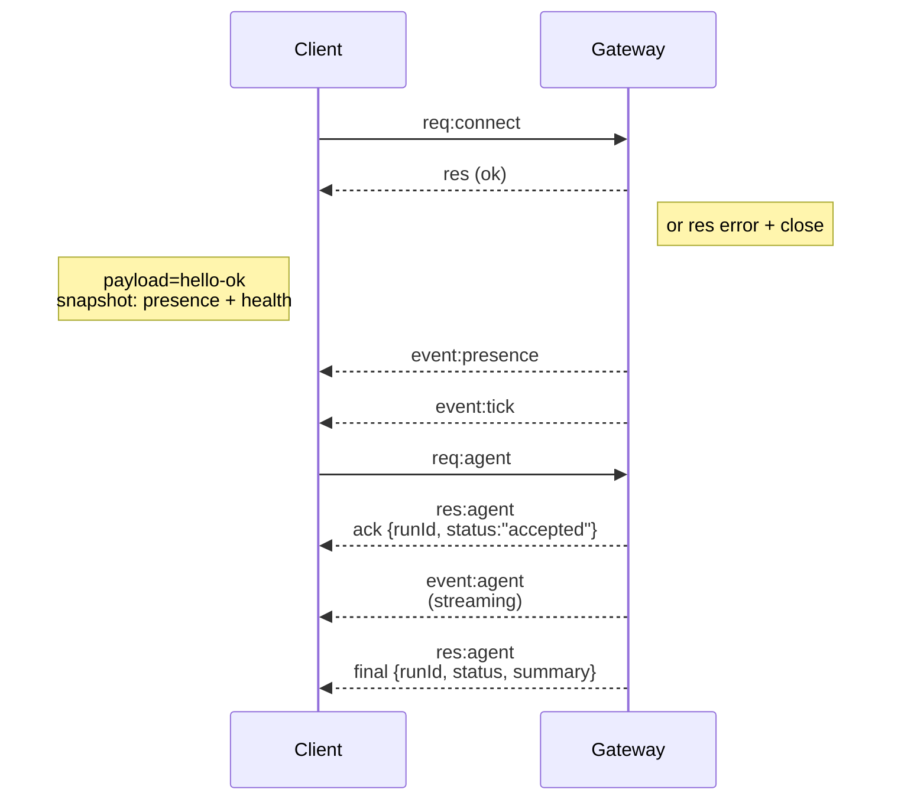

---
read_when:
    - Làm việc với giao thức Gateway, máy khách hoặc cơ chế truyền tải
summary: Kiến trúc Gateway WebSocket, các thành phần và luồng máy khách
title: Kiến trúc Gateway
x-i18n:
    generated_at: "2026-05-06T09:06:46Z"
    model: gpt-5.5
    provider: openai
    source_hash: 433489081bfe07691b211f5076ec45ce0ed3fd043eb86128f73121f2cab71cd3
    source_path: concepts/architecture.md
    workflow: 16
---

## Tổng quan

- Một **Gateway** duy nhất chạy lâu dài sở hữu mọi bề mặt nhắn tin (WhatsApp qua
  Baileys, Telegram qua grammY, Slack, Discord, Signal, iMessage, WebChat).
- Các máy khách control-plane (ứng dụng macOS, CLI, giao diện web, tự động hóa) kết nối tới
  Gateway qua **WebSocket** trên bind host đã cấu hình (mặc định
  `127.0.0.1:18789`).
- **Nodes** (macOS/iOS/Android/headless) cũng kết nối qua **WebSocket**, nhưng
  khai báo `role: node` với các caps/lệnh rõ ràng.
- Một Gateway cho mỗi host; đây là nơi duy nhất mở phiên WhatsApp.
- **canvas host** được máy chủ HTTP của Gateway phục vụ tại:
  - `/__openclaw__/canvas/` (HTML/CSS/JS mà agent có thể chỉnh sửa)
  - `/__openclaw__/a2ui/` (A2UI host)
    Nó dùng cùng cổng với Gateway (mặc định `18789`).

## Thành phần và luồng

### Gateway (daemon)

- Duy trì các kết nối provider.
- Cung cấp API WS có kiểu (yêu cầu, phản hồi, sự kiện server-push).
- Xác thực các frame đi vào theo JSON Schema.
- Phát các sự kiện như `agent`, `chat`, `presence`, `health`, `heartbeat`, `cron`.

### Máy khách (ứng dụng Mac / CLI / quản trị web)

- Một kết nối WS cho mỗi máy khách.
- Gửi yêu cầu (`health`, `status`, `send`, `agent`, `system-presence`).
- Đăng ký nhận sự kiện (`tick`, `agent`, `presence`, `shutdown`).

### Nodes (macOS / iOS / Android / headless)

- Kết nối tới **cùng máy chủ WS** với `role: node`.
- Cung cấp định danh thiết bị trong `connect`; ghép đôi là **dựa trên thiết bị** (role `node`) và
  việc phê duyệt nằm trong kho ghép đôi thiết bị.
- Cung cấp các lệnh như `canvas.*`, `camera.*`, `screen.record`, `location.get`.

Chi tiết giao thức:

- [Giao thức Gateway](/vi/gateway/protocol)

### WebChat

- Giao diện tĩnh dùng API WS của Gateway cho lịch sử trò chuyện và gửi tin.
- Trong các thiết lập từ xa, kết nối qua cùng đường hầm SSH/Tailscale như các
  máy khách khác.

## Vòng đời kết nối (một máy khách)



## Wire protocol (tóm tắt)

- Transport: WebSocket, frame văn bản với payload JSON.
- Frame đầu tiên **phải** là `connect`.
- Sau handshake:
  - Yêu cầu: `{type:"req", id, method, params}` → `{type:"res", id, ok, payload|error}`
  - Sự kiện: `{type:"event", event, payload, seq?, stateVersion?}`
- `hello-ok.features.methods` / `events` là metadata khám phá, không phải bản
  kết xuất được tạo từ mọi helper route có thể gọi.
- Xác thực shared-secret dùng `connect.params.auth.token` hoặc
  `connect.params.auth.password`, tùy theo chế độ xác thực gateway đã cấu hình.
- Các chế độ mang định danh như Tailscale Serve
  (`gateway.auth.allowTailscale: true`) hoặc non-loopback
  `gateway.auth.mode: "trusted-proxy"` thỏa mãn xác thực từ header yêu cầu
  thay vì `connect.params.auth.*`.
- Private-ingress `gateway.auth.mode: "none"` tắt hoàn toàn xác thực shared-secret;
  không bật chế độ đó trên ingress công khai/không đáng tin cậy.
- Khóa idempotency là bắt buộc với các phương thức có tác dụng phụ (`send`, `agent`) để
  thử lại an toàn; máy chủ giữ một bộ nhớ đệm khử trùng lặp tồn tại ngắn.
- Nodes phải bao gồm `role: "node"` cùng caps/lệnh/quyền trong `connect`.

## Ghép đôi + tin cậy cục bộ

- Tất cả máy khách WS (operator + node) bao gồm một **định danh thiết bị** trên `connect`.
- ID thiết bị mới cần phê duyệt ghép đôi; Gateway phát hành một **token thiết bị**
  cho các lần kết nối sau.
- Các kết nối local loopback trực tiếp có thể được tự động phê duyệt để giữ trải nghiệm cùng host
  mượt mà.
- OpenClaw cũng có một đường tự kết nối backend/container-local hẹp cho
  các luồng helper shared-secret đáng tin cậy.
- Các kết nối tailnet và LAN, bao gồm cả bind tailnet cùng host, vẫn cần
  phê duyệt ghép đôi rõ ràng.
- Mọi kết nối phải ký nonce `connect.challenge`.
- Payload chữ ký `v3` cũng ràng buộc `platform` + `deviceFamily`; gateway
  ghim metadata đã ghép đôi khi kết nối lại và yêu cầu ghép đôi sửa chữa khi metadata
  thay đổi.
- Các kết nối **không cục bộ** vẫn cần phê duyệt rõ ràng.
- Xác thực Gateway (`gateway.auth.*`) vẫn áp dụng cho **tất cả** kết nối, cục bộ hoặc
  từ xa.

Chi tiết: [Giao thức Gateway](/vi/gateway/protocol), [Ghép đôi](/vi/channels/pairing),
[Bảo mật](/vi/gateway/security).

## Kiểu giao thức và sinh mã

- Schema TypeBox định nghĩa giao thức.
- JSON Schema được tạo từ các schema đó.
- Model Swift được tạo từ JSON Schema.

## Truy cập từ xa

- Ưu tiên: Tailscale hoặc VPN.
- Phương án thay thế: đường hầm SSH

  ```bash
  ssh -N -L 18789:127.0.0.1:18789 user@host
  ```

- Cùng handshake + token xác thực được áp dụng qua đường hầm.
- TLS + ghim tùy chọn có thể được bật cho WS trong các thiết lập từ xa.

## Ảnh chụp vận hành

- Khởi động: `openclaw gateway` (foreground, ghi log ra stdout).
- Sức khỏe: `health` qua WS (cũng được bao gồm trong `hello-ok`).
- Giám sát: launchd/systemd để tự động khởi động lại.

## Bất biến

- Chính xác một Gateway điều khiển một phiên Baileys duy nhất trên mỗi host.
- Handshake là bắt buộc; bất kỳ frame đầu tiên nào không phải JSON hoặc không phải connect đều bị đóng cứng.
- Sự kiện không được phát lại; máy khách phải làm mới khi có khoảng trống.

## Liên quan

- [Vòng lặp Agent](/vi/concepts/agent-loop) — chu kỳ thực thi agent chi tiết
- [Giao thức Gateway](/vi/gateway/protocol) — hợp đồng giao thức WebSocket
- [Hàng đợi](/vi/concepts/queue) — hàng đợi lệnh và đồng thời
- [Bảo mật](/vi/gateway/security) — mô hình tin cậy và gia cố
